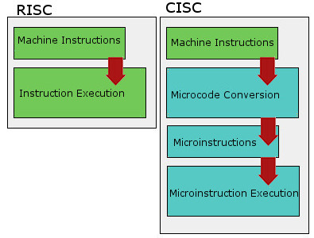
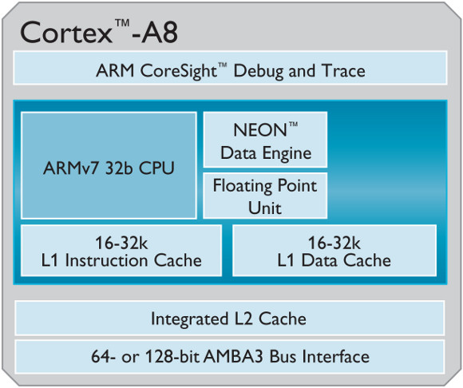

# ARM & AMD 프로세서

# ARM(Advanced RISC Machine)

ARM은 진보된 `RISC` 기기의 약자이다.

## RISC와 CISC

> RISC(Reduced Instruction Set Computer)
> 

RISC란 축소 명령어 세트 컴퓨터를 의미한다. 즉 적은 핵심적인 명령어를 기반으로 최소한의 명령어 세트를 구성한 컴퓨터이다. RISC로 파이프라이닝을 구성할 수 있어서 하드웨어의 단순화, 효율화가 이뤄졌다.

RISC의 특징

- 작은 명령어 세트
- 단순한 컴파일러
- 간단한 명령어로 빠른 실행속도
- 단순한 회로 구성
- 고정적인 명령어 길이
- 파이프라이닝을 사용

> CISC(Complex Instruction Set Computer)
> 

CISC란 복잡한 명령어들을 수 백개 이상 탐재하고 있는 프로세서이다. 명령어의 개수가 증가할 때마다 내부조가 복잡해져 고속 프로세서를 만들기 힘들어진다. 

명령어가 복잡하다는 의미는 하나의 명령어가 하는 양이 RISC에 비헤 많다는 것을 의미한다. 명령어마다 길이가 다르고, 실행에 필요한 사이클 수도 다르기 때문에 파이프라이닝 설계가 어렵다.

CISC의 특징

- 명령어의 개수가 많음
- 복잡한 컴파일러
- 명령어 길이가 다양함, 실행 사이클도 명령어 마다 다름
- 회로 구성이 복잡함

CISC는 RISC에 비해 성능이 많이 떨어지지만 아직도 쓰이고 있다. 그 이유는 다음과 같다

- 많은 프로세서가 CISC 모델로 구축되어 있기 때문(레거시)
- RISC에 비해 호환성이 좋다
- 파이프라인을 일부분 사용하여 CISC의 성능 취약점을 보완할 수 있다.

## ARM 구조

칩의 기본 설계 구조만 미리 만들고, 실제 기능 추가와 성능 최적화 부분은 개별 반도체 제조사에 따라 다르다. 결국 **ARM은 물리적 설계가 같아도 명령어 집합이 달라질 수 있어 서로 다른 칩이 되기도 한다.**

ARM CPU는 RISC 설계 기반으로 명령어 집합과 구조 자체가 단순하다. 따라서 ARM 기반의 프로세서의 크기가 작고, 효율적이며 속도가 상대적으로 느리다.

- RISC 설계 기반 → 단순한 명령 집합 → 적은 수의 트랜지스터(클 수록 전원을 많이 소비) → 간결한 설계 및 작은 크기 ⇒ `스마트폰, 태블릿 등 모바일 기기에 적합한 프로세서`

## ARM의 장점

1. ARM을 위해 개발된 프로그램은 오직 ARM CPU에서만 실행가능하다. (x86 CPU 기반의 프로그램을 ARM CPU에서 실행하기 위해서 프로그램 수정이 필요하다)
2. ARM기기에 동작하는 OS는 다른 ARM 기기에 동작한다. (수많은 버전의 안드로이드가 탄생하고, 서로 다른 기기에도 안드로이드가 탑재될 수 있는 이유이다.)
    - 애플사는 iOS 소스코드를 공개하지 않기 때문에 애플 기기에 안드로이드를 탑재하지 못한다.

# AMD(Advanced Micro Devices)

AMD란 미국 반도체 회사인 AMD가 설계, 제조하는 프로세서이다.

> AMD 특징
> 
- 인텔 CPU에서 동작하는 프로그램을 AMD CPU에서도 실행시킬 수 있다.
- 하지만 인텔 CPU 전용 메인보드(마더보드)와 AMD 전용 메인보드는 호환되지 않는다.
- AMD 프로세서는 CPU와 GPU를 단일 칩으로 결합하는 것을 목표로한다.

# 참고

[https://frontalnh.github.io/2018/04/17/컴퓨터-구조-risc-와-cisc-구조/](https://frontalnh.github.io/2018/04/17/%EC%BB%B4%ED%93%A8%ED%84%B0-%EA%B5%AC%EC%A1%B0-risc-%EC%99%80-cisc-%EA%B5%AC%EC%A1%B0/)

[https://github.com/gyoogle/tech-interview-for-developer/blob/master/Computer Science/Computer Architecture/ARM 프로세서.md](https://github.com/gyoogle/tech-interview-for-developer/blob/master/Computer%20Science/Computer%20Architecture/ARM%20%ED%94%84%EB%A1%9C%EC%84%B8%EC%84%9C.md)

[https://www.netinbag.com/ko/technology/what-is-an-amd-processor.html](https://www.netinbag.com/ko/technology/what-is-an-amd-processor.html)

[https://www.youtube.com/watch?v=iIzzSAezSoE](https://www.youtube.com/watch?v=iIzzSAezSoE)