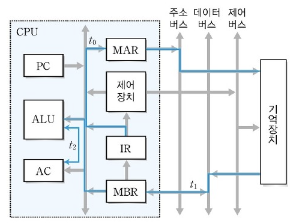

# CPU(중앙처리장치) 동작 원리
> CPU는 컴퓨터에서 가장 핵심적인 역할을 수행하는 부분. CPU는 연산장치(ALU), 제어장치(CU), 레지스터 세트 3가지로 구성된다. 이는 internal CPU Bus(ALU와 Register 간 데이터 이동을 담당하는 버스)를 통해서 데이터를 주고 받는다.

<br>

- 연산 장치(ALU)

> 산술연산과 논리연산 수행 (따라서 산술논리연산장치라고도 불림)

> 연산에 필요한 데이터를 레지스터에서 가져오고, 연산 결과를 다시 레지스터로 보냄


- 제어 장치(CU)

> 명령어를 순서대로 실행할 수 있도록 제어하는 장치

> 주기억장치에서 프로그램 명령어를 꺼내 __해독__ 하고, 그 결과에 따라 명령어 실행에 필요한 제어 신호를 기억장치, 연산장치, 입출력장치로 보냄

> 또한 이들 장치가 보낸 신호를 받아, 다음에 수행할 동작을 결정함

- 레지스터 세트

> CPU 내에서 사용되는 고속 임시 기억장치

> 명령어 주소, 코드, 연산에 필요한 데이터, 연산 결과 등을 임시로 저장

> 용도에 따라 범용 레지스터와 특수목적 레지스터로 구분됨

> 중앙처리장치 종류에 따라 사용할 수 있는 레지스터 개수와 크기가 다름

    - 범용 레지스터 : 연산에 필요한 데이터나 연산 결과를 임시로 저장
    - 특수목적 레지스터 : 특별한 용도로 사용하는 레지스터

__특수 목적 레지스터 중 중요한 것들__

- MAR(메모리 주소 레지스터) : 읽기와 쓰기 연산을 수행할 주기억장치 주소 저장
- PC(프로그램 카운터) : 다음에 수행할 명령어 주소 저장
- IR(명령어 레지스터) : 현재 실행 중인 명령어 저장
- MBR(메모리 버퍼 레지스터) : 주기억장치에서 읽어온 데이터 or 저장할 데이터 임시 저장
- AC(누산기) : 연산 결과 임시 저장

<br>

## CPU의 동작 과정

1. 주기억장치는 입력장치에서 입력받은 데이터 또는 보조기억장치에 저장된 프로그램 읽어온다.

2. CPU는 프로그램을 실행하기 위해 주기억장치에 저장된 프로그램 명령어와 데이터를 읽어와 처리하고 결과를 다시 주기억장치에 저장한다.

3. 주기억장치는 처리 결과를 보조기억장치에 저장하거나 출력장치로 보낸다.

4. 제어장치는 1~3 과정에서 명령어가 순서대로 실행되도록 각 장치를 제어한다.

<br>

명령어 세트란?
> CPU가 실행할 명령어의 집합


<br>

연산 코드(Operation Code) + 피연산자(Operand)로 이루어짐

연산 코드 : 실행할 연산
    - 실행하는 연산의 종류에 따라 네가지 기능으로 나뉜다.
        - 연산기능, 제어기능, 데이터 전달 기능, 입출력 기능

피연산자 : 필요한 데이터 or 저장 위치
    - 주소(기억장치 혹은 레지스터의 주소), 숫자/문자, 논리 데이터

<br><br>

## 명령어 사이클
> CPU가 주기억장치에서 한번에 하나의 명령어를 인출하여 실행하는데 필요한 일련의 활동

명령어 사이클은 인출/실행/간접/인터럽트 사이클로 나누어짐

주기억장치의 지정된 주소에서 하나의 명령어를 가져오고(인출 사이클), 실행 사이클에서는 명령어를 실행함. 하나의 명령어 실행이 완료되면 그 다음 명령어에 대한 인출 사이클 시작

<br>

__인출 사이클과 실행 사이클에 의한 명령어 처리 과정__


<br>

- PC에 저장된 주소를 MAR로 전달

- 저장된 내용을 토대로 주기억장치의 해당 주소에서 명령어 인출

- 인출한 명령어를 MBR에 저장

- 다음 명령어를 인출하기 위해 PC 값 증가시킴

- 메모리 버퍼 레지스터(MBR)에 저장된 내용을 명령어 레지스터(IR)에 전달

```
T0 : MAR ← PC
T1 : MBR ← M[MAR], PC ← PC+1
T2 : IR ← MBR
```

여기까지는 인출하기까지의 과정

인출한 이후, 명령어를 실행하는 과정
> ADD addr 명령어 연산



<br>

```
T0 : MAR ← IR(Addr)
T1 : MBR ← M[MAR]
T2 : AC ← AC + MBR
```

이미 인출이 진행되고 명령어만 실행하면 되기 때문에 PC를 증가할 필요x

IR에 MBR의 값이 이미 저장된 상태를 의미한다.

따라서 AC에 MBR을 더해주기만 하면 된다.

# 참고

https://github.com/gyoogle/tech-interview-for-developer/blob/master/Computer%20Science/Computer%20Architecture/%EC%A4%91%EC%95%99%EC%B2%98%EB%A6%AC%EC%9E%A5%EC%B9%98(CPU)%20%EC%9E%91%EB%8F%99%20%EC%9B%90%EB%A6%AC.md

https://velog.io/@gothae/%EC%BB%B4%ED%93%A8%ED%84%B0-%EA%B5%AC%EC%A1%B0-CPU-%EC%9E%91%EB%8F%99%EC%9B%90%EB%A6%AC

