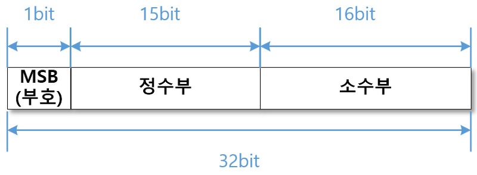

# Floating Poaint(부동 소수점)

## 부동소수점을 사용하는 이유
컴퓨터에서 소수점을 표현하는 방식에는 부동 소수점과 고정 소수점이 있습니다. __고정 소수점__ 방식은 소수점이 항상 고정된 위치에 있다는 의미로 정수를 표현할 때 사용합니다.
__ 부동 소수점__ 방식은 소수점의 위치가 바뀌기 때문에 실수를 표현할 때 주로 사용하며 고정 소수점 방식보다 넓은 범위를 표현할 수 있습니다.

## FIxed Point(고정 소수점)
소수점의 위치를 미리 정해놓고 소수를 표현하는 방식이다. 아래와 같이 `단순한 구조`이지만 `표현의 범위가 좁다.`
```python
-2.123123 
MSB : -
정수부 : 3
소수부 : 0.123123
```

> 

## Floating Pint(부동 소수점)
지수의 값에 따라 소수점이 움직이는 방식으로 실수를 표현한다. `표현할 수 있는 범위가 넓지만` 오차가 발생할 수 있다.

```python
23.67 x 10^1
MSB : +
가수부 : 23.67
(밑수 : 10)
지수부(bias) : 1
```

실수를 부동 소수점 방식으로 저장할 때는 정규화 과정을 꼭 거친다. 2진 소수로 고치고 난 뒤에서야 부동 소수점 표현이 가능한 것이다. 

#### 참고
[부동 소수점](https://snoop-study.tistory.com/84)