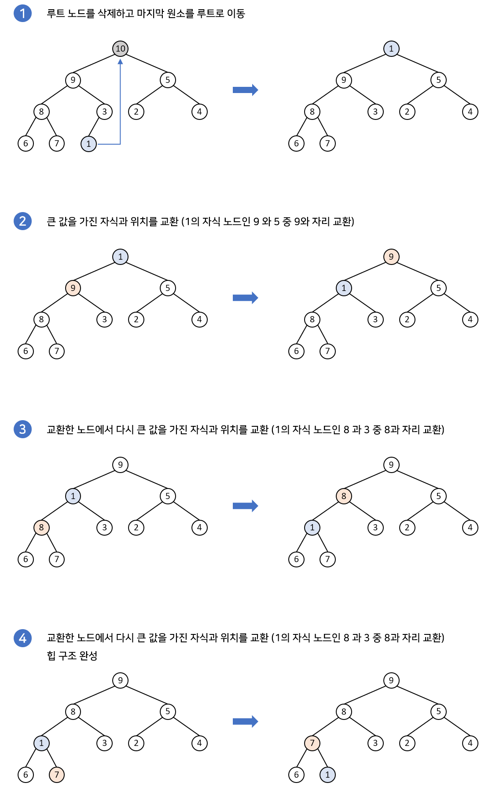

# Heap

> Priority Queue(우선순위 큐)

> Heap(힙)

 

## Priority Queue(우선순위 큐)
우선순위의 개념을 큐에 도입한 자료구조
- 데이터를 우선순위에 따라 처리하고 싶을 때 사용 
- 우선순위 큐는 배열, 연결리스트, 힙으로 구현이 가능하고 이 중 힙으로 구현하는 것이 가장 효율적

 

## Heap
여러개의 값들 중에서 가장 큰 값이나 가장 작은 값을 빠르게 찾아내도록 만들어진 자료구조

ex) 1. 운영체제에서 우선순위 기반 일들을 스케쥴링하기 위해서 사용 

2. 다익스트라 알고리즘(최단 거리 구하기 알고리즘)에서 최소 비용을 기반으로 그래프 탐색 시 사용

- 힙은 완전 이진 트리(complete binary tree) 자료구조의 일종

    \* 완전 이진 트리 : 루트 노드부터 시작하여 왼쪽 자식 노드, 오른쪽 자식 노드 순서대로 데이터가 차례대로 삽입되는 트리

- 힙에서는 항상 __루트 노드(root node)__ 를 제거한다.

- 힙 트리에서는 중복된 값을 허용한다. (이진 탐색 트리에서는 중복된 값을 허용하지 않는다.)

- 힙의 종류에는 __최소 힙(min heap)__, __최대 힙(max heap)__ 두 가지가 있다. 최대 힙은 부모 노드의 값이 자식 노드들의 값보다 항상 크거나 같고, 최소 힙은 부모 노드의 값이 자식 노드의 값보다 항상 작거나 같다.

- 대소관계는 오로지 부모자식 간에만 성립되며 형제사이에는 대소관계가 정해지지 않는다.

 

### 최소 힙(min heap)
- 부모 노드의 키 값이 자식 노드의 키 값보다 작거나 같은 완전 이진 트리
- 루트 노드가 가장 작은 값을 가진다.
- 값이 가장 작은 데이터가 우선적으로 제거된다.

### 최대 힙(max heap)
- 부모 노드의 키 값이 자식 노드의 키 값보다 크거나 같은 완전 이진 트리
- 루트 노드가 가장 큰 값을 가진다.
- 값이 가장 큰 데이터가 우선적으로 제거된다.

 

__Heapify__ : 특정 노드를 중심으로 그 밑의 트리들이 힙 성질을 만족하게끔 만드는 작업

#### 원소 삽입 과정(max heap)

#### 원소 삭제 과정(max heap)

 

### 배열로 구현하기
힙은 대체적으로 배열로 구현된다. 완전 이진 트리를 기본으로 하기 때문에 빈 공간이 없어 배열로 구현하기에 용이하다.

### 📚 참고

[Heap1](https://velog.io/@emplam27/%EC%9E%90%EB%A3%8C%EA%B5%AC%EC%A1%B0-%EA%B7%B8%EB%A6%BC%EC%9C%BC%EB%A1%9C-%EC%95%8C%EC%95%84%EB%B3%B4%EB%8A%94-%ED%9E%99Heap)

[Heap2](https://gmlwjd9405.github.io/2018/05/10/data-structure-heap.html)

[Heap3](https://www.youtube.com/watch?v=AjFlp951nz0)

[Heap4](https://lipcoder.tistory.com/100)

 

***

 

# ⁉️ QnA
.
> 1. Priority Queue의 동작 원리에 대해서 설명하시오.

> 2. Heap의 종류와 각각의 특징을 설명하시오.

> 3. Max Heap에서의 Heapify 과정을 설명하시오.

