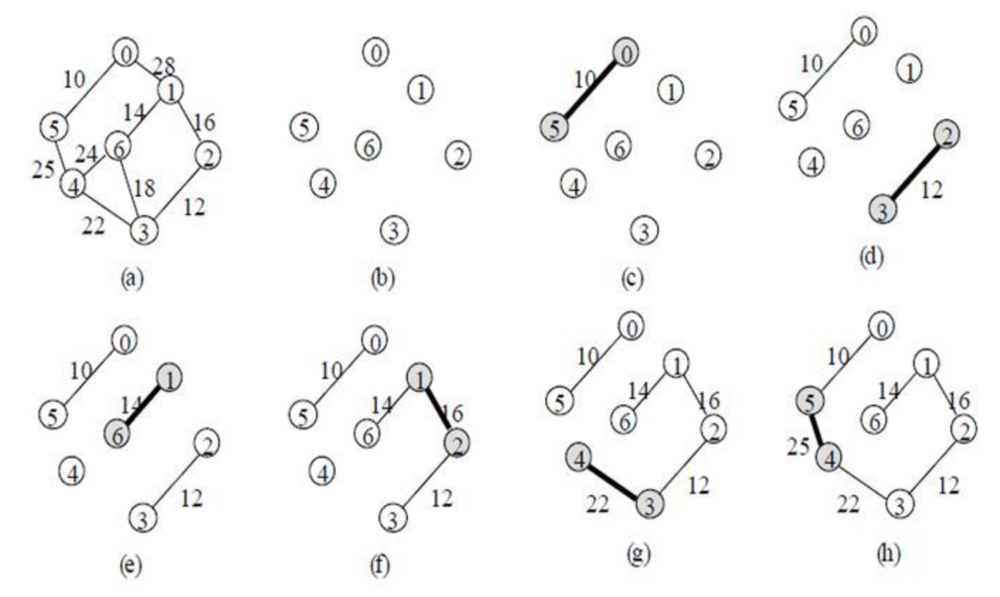
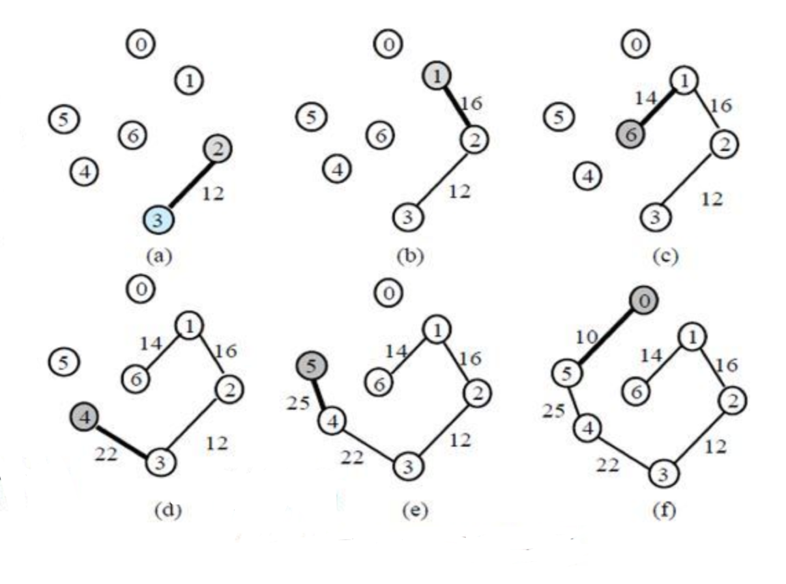

# Minimum Spanning Tree

> Minimum Spanning Tree(최소 신장 트리)

> Kruskal MST Algorithm

> Prim MST Algorithm

## Minimum Spanning Tree (최소 신장 트리)란?
그래프 G의 spanning tree 중 edge weight의 합이 최소인 `spanning tree`를 의미한다.
- 각 간선의 가중치가 동일하지 않을 때 단순히 가장 적은 간선을 사용한다고 해서 최소 비용이 얻어지는 것은 아니다.
- MST는 간선에 가중치를 고려하여 최소 비용의 spanning tree를 선택하는 것을 말한다.
- 즉 네트워크(가중치를 간선에 할당한 그래프)에 있는 모든 정점들을 **가장 적은 수의 간선과 비용으로 연결**하는 것이다.

## MST 특징 
- 간선의 가중치의 합이 최소여야 한다.
- n개의 정점을 가지는 그래프에 대해 반드시 (n-1)개의 간선만을 사용해야 한다. 
- 사이클이 포함되어서는 안된다.

> `spanning tree`: 그래프 내에 있는 모든 정점을 연결하고 사이클이 없는 그래프를 의미한다. 

## Kruskal MST Algorithm
 탐욕적인 방법(greedy method)를 이용하여 네트워크(가중치를 간선에 할당한 그래프)의 모든 정점을 최소 비용으로 연결하는 최적 해답을 구하는 것
- MST가 1)최소 비용의 간선으로 구성됨 2)사이클을 포함하지 않음 의 조건에 근거하여 **각 단계에서 사이클을 이루지 않는 최소 비용 간선을 선택**한다.
- **간선 선택을 기반**으로 하는 알고리즘이다.
- 이전 단계에서 만들어진 신장트리와는 상관없이 무조건 최소 간선만을 선택하는 방법이다. 


### 과정

1. 그래프의 간선들을 가중치의 오름차순으로 정렬한다.
2. 정렬된 간선 리스트에서 순서대로 사이클을 형성하지 않는 간선을 선택한다.
    - 즉, 가장 낮은 가중치를 먼저 선택한다.
    - 사이클을 형성하는 간선을 제외한다.
3. 해당 간선을 현재의 MST의 집합에 추가한다. 

### 주의 사항
- 다음 간선을 이미 선택된 간선들의 집합에 추가할 때 **사이클을 생성하는지** 확인해야 한다.
- 새로운 간선이 이미 다른 경로에 의해 연결되어 있는 정점들을 연결할 때 사이클이 형성된다.
- 즉 추가할 새로운 간선의 양 끝 정점이 같은 집합에 속해 있으면 사이클이 형성된다.
- 사이클 생성 여부를 확인하는 방법
    - 추가하고자 하는 간선의 양 끝 정점이 같은 집합에 속해 있는지를 먼저 검사해야 한다.
    - `union-find 알고리즘` 이용

## Kruskal 알고리즘의 시간 복잡도
- `union-find` 알고리즘을 이용하면 Kruskal 알고리즘의 시간 복잡도는 간선들을 정렬하는 시간에 좌우된다. 
- 즉 간선 e개를 퀵 정렬과 같은 효율적인 알고리즘으로 정렬한다면 시간 복잡도는 `O(ElogE)`가 된다.
- 그리고 정렬된 간선을 순회하며 `union-find` 연산을 한번씩 수행한다. `O(1)*E`
- 결과적으로 `O(ElogE + E)`

### Kruskal Algorithm's code
```python
import sys

v, e = map(int, input().split())
# 부모 테이블 초기화
parent = [0] * (v+1)
for i in range(1, v+1):
    parent[i] = i

# find 연산
def find_parent(parent, x):
    if parent[x] != x:
        parent[x] = find_parent(parent, parent[x])
    return parent[x]

# union 연산
def union_parent(parent, a, b):
    a = find_parent(parent, a)
    b = find_parent(parent, b)
    if a < b:
        parent[b] = a
    else:
        parent[a] = b

# 간선 정보 담을 리스트와 최소 신장 트리 계산 변수 정의
edges = []
total_cost = 0

# 간선 정보 주어지고 비용을 기준으로 정렬
for _ in range(e):
    a, b, cost = map(int, input().split())
    edges.append((cost, a, b))

# 간선 정보 비용 기준으로 오름차순 정렬
edges.sort()

# 간선 정보 하나씩 확인하면서 크루스칼 알고리즘 수행
for i in range(e):
    cost, a, b = edges[i]
    # find 연산 후, 부모노드 다르면 사이클 발생 X으므로 union 연산 수행 -> 최소 신장 트리에 포함!
    if find_parent(parent, a) != find_parent(parent, b):
        union_parent(parent, a, b)
        total_cost += cost

print(total_cost)
```

## Prim MST Algorithm
`시작 정점`에서부터 출발하여 신장트리 집합을 단계적으로 확장해나가는 방법이다.
- **정점 선택을 기반**으로 하는 알고리즘이다.
- 이전 단계에서 만들어진 신장 트리를 확장하는 방법이다.

### 과정

1. 시작 단계에서는 시작 정점만이 MST 집합에 포함된다.
2. 앞 단계에서 만들어진 MST 집합에 인접한 정점들 중에서 최소 간선으로 연결된 정점을 선택하여 트리를 확장한다.
    - 즉, 가장 낮은 가중치를 먼저 선택한다.
3. 위의 과정을 트리가 (N-1)개의 간선을 가질 때까지 반복한다. 

## Prim 알고리즘의 시간복잡도
- 프림 알고리즘에서 시간 복잡도에 가장 큰 영향을 미치는 것은 가중치가 가장 작은 정점을 찾아내는 것과 인접한 정점의 탐색이다. 
- 모든 노드에 대해 탐색을 진행하므로 `O(V)`이다. 그리고 `우선순위 큐`를 사용하여 매노드마다 최소 간선을 찾는 시간을 `O(logV)`이다. 따라서 탐색과정에는 `O(VlogV)`가 소요된다. 그리고 각 노드의 인접 간선을 찾는 시간은 모든 노드의 차수와 같으므로 `O(E)`다. 그리고 각 간선에 대해 힙에 넣는 과정이 `O(logV)`가 되어 우선순위 큐 구성에 `O(ElogV)`가 소요된다. 따라서 `O(VlogV+ElogV)`로 `O(ElogV)`가 된다. (∵E가 일반적으로 V보다 크기 때문)
- 만약 우선순위 큐가 아니라 `배열`로 구현한다면 각 정점에 최소 간선을 갖는 정점 탐색을 매번 정점마다 수행하므로 `O(V^2)`가되고 탐색 결과를 기반으로 각 정점의 최소 비용 연결 정점 탐색에는 `O(1)`이 소요된다. 따라서 시간복잡도는 `O(V^2)`이다. 

## Prim Algorithm's code
```python
import heapq
import collections
import sys
sys.setrecursionlimit(10**6)
input = sys.stdin.readline

n, m = map(int,input().split()) # 노드 수, 간선 수
graph = collections.defaultdict(list) # 빈 그래프 생성
visited = [0] * (n+1) # 노드의 방문 정보 초기화

# 무방향 그래프 생성
for i in range(m): # 간성 정보 입력 받기
    u, v, weight = map(int,input().split())
    graph[u].append([weight, u, v])
    graph[v].append([weight, v, u])


# 프림 알고리즘
def prim(graph, start_node):
    visited[start_node] = 1 # 방문 갱신
    candidate = graph[start_node] # 인접 간선 추출
    heapq.heapify(candidate) # 우선순위 큐 생성
    mst = [] # mst
    total_weight = 0 # 전체 가중치

    while candidate:
        weight, u, v = heapq.heappop(candidate) # 가중치가 가장 적은 간선 추출
        if visited[v] == 0: # 방문하지 않았다면
            visited[v] = 1 # 방문 갱신
            mst.append((u,v)) # mst 삽입
            total_weight += weight # 전체 가중치 갱신

            for edge in graph[v]: # 다음 인접 간선 탐색
                if visited[edge[2]] == 0: # 방문한 노드가 아니라면, (순환 방지)
                    heapq.heappush(candidate, edge) # 우선순위 큐에 edge 삽입

    return total_weight

print(prim(graph,1))
```

## Kruskal VS Prim
- 프림은 정점 위주의 알고리즘, 크루스칼은 간선 위주의 알고리즘
- 프림은 시작점을 정하고, 시작점에서 가까운 정점을 선택하면서 트리르 구성 하므로 그 과정에서 사이클을 이루지 않지만 크루스칼은 시작점을 따로 정하지 않고 최소 비용의 간선을 차례로 대입 하면서 트리를 구성하기 때문에 사이클이 이루어지는 항상 확인 해야한다.
- 프림의 경우 최소 거리의 정점을 찾는 부분에서 자료구조의 성능에 영향을 받는다.
- 크루스칼은 간선을 기준으로 정렬하는 과정이 오래 걸린다.
- 간선의 개수가 작은 경우에는 크루스칼, 간선의 개수가 많은 경우에는 프림.


## 참고
[kruskal code](https://techblog-history-younghunjo1.tistory.com/262)

[prim code](https://deep-learning-study.tistory.com/595)

[kruskal](https://8iggy.tistory.com/160)

[prim](https://8iggy.tistory.com/159)

[union-find](https://velog.io/@bbkyoo/%EB%A9%B4%EC%A0%91%EC%A4%80%EB%B9%84%EC%95%8C%EA%B3%A0%EB%A6%AC%EC%A6%9817%EC%B5%9C%EC%86%8C%EC%8B%A0%EC%9E%A5%ED%8A%B8%EB%A6%AC2)

## Q&A

---

> 1. 최소 스패닝 트리에 대해서 설명해주세요.

> 2. 크루스칼과 프림 알고리즘의 시간복잡도에 대해 설명해주세요.

> 3. 크루스칼 알고리즘과 프림 알고리즘의 차이점에 대해 설명해주세요.
