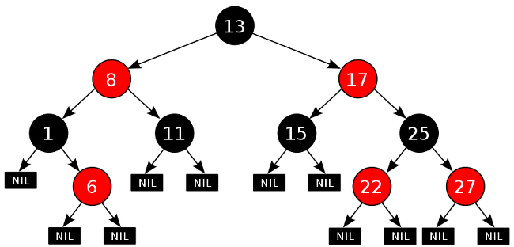
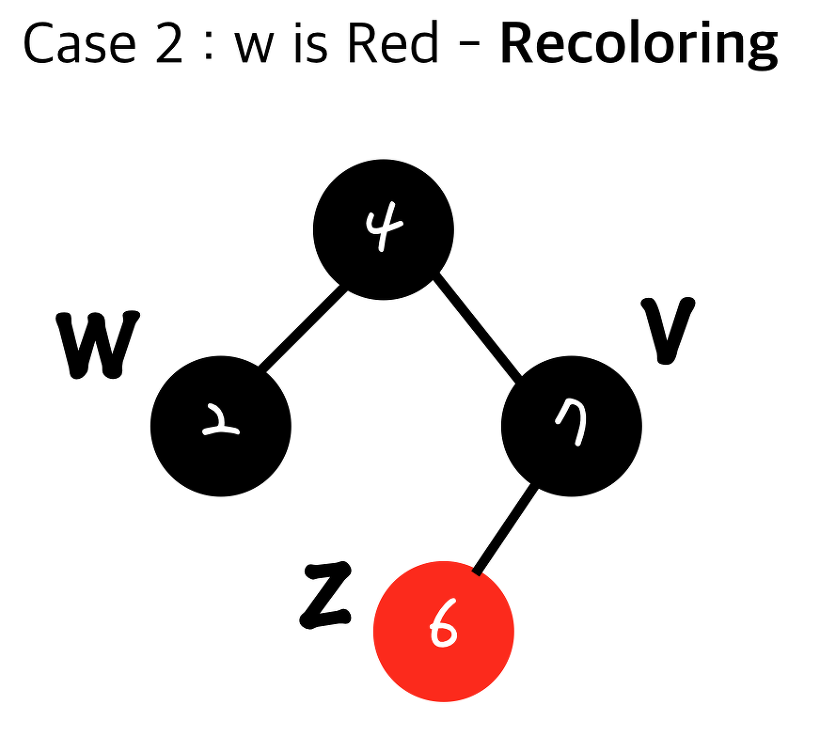
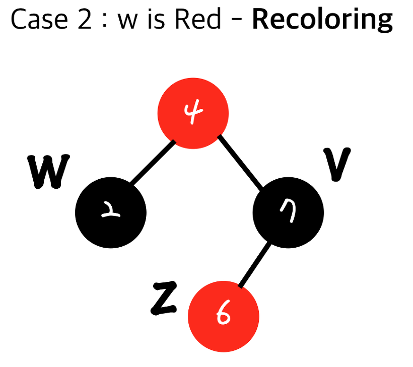

# 🔴⚫️ Red-Black Tree
## 이진 탐색 트리와 레드블랙 트리(intro)

의도치 않게 이번 파트도 제가 트리를 맞게 됐네요🙂. 지난 시간에 binary tree와 binary search tree에 대해서 준비를 했었던게 기억이 나시나요? 
이번에 알아볼 red-black tree도 BST의 일종이기 때문에 이진 탐색 트리에 대해 짧게 살펴보고 본론으로 넘어가보겠습니다.
<br><br>
BST가 가지는 가장 중요한 속성만 생각을 해봅시다. `나를 기준으로 내 왼쪽 자식은 나보다 작은 값을 오른쪽 자식은 나보다 큰 녀석들`만 모아놓습니다. 이런 property만 생각을 해서 전체 Binary Search Tree를 생각하면 루트를 기준으로 작은 값들은 전부 왼쪽에 큰 값들은 전부 오른쪽에 위치하게 됩니다. 균형이 잡히지 않은 상황을 가정해보면 검색의 최악의 경우 시간 복잡도는 O(height)가 나온다는 것도 기억이 나시나요? 왜 최악의 상황에서 높이가 나오는지는 조금만 생각해보면 알 수 있습니다. 한 쪽으로만 자라난 트리를 생각해보면 바로 이해할 수 있습니다. (+ average case에서의 검색의 시간 복잡도는 O(logn))
<br><br>
자 그러면 만약에 균형이 잡힌 트리로 구성하게 된다면? 시간 복잡도가 O(h)가 아닌 O(logn)에 바운드 시킬수 있습니다. 왜냐하면 높이가 logn으로 항상 일정하게 나오기 때문입니다. 밑이 2인 로그함수에 높이가 수렴하는 이유는 이진 트리는 노드가 2개씩 늘어나고 각 레벨의 노드 개수 = 2^(height-1)이기 때문이죠 그럼 양변에 로그를 씌워서 height를 구해주면 되겠죠?
<br><br>
정리하면 red black tree는 bst의 일종인데 균형 잡힌 이진 탐색 트리라고 생각하면 될 것 같습니다.
<br>



<br><br>

## 📚 Table of Contents
> Red-Black Tree 조건 

> Red-Black Tree 예시

> Reconstructing & Recoloring

## Red-Black Tree가 되기 위한 조건
```
1. Root property :루트 노드의 색깔은 검정이다.
2. External property :모든 external(leaf) node들은 검정이다.
3. Internal property :빨강노드의 자식은 반드시 검정이다.
-> no double red :빨간색 노드가 연속으로 나올 수 없다.
4. Depth property :모든 리프노드에서 black depth는 같다.
-> 리프노드에서 루트노드까지 가는 경로에서 만나는 블랙노드의 개수는 같다.(그냥 노드의 수는 다를 수 있다.)
```
위의 조건으로만 살펴보면 도대체 어떻게 rb tree를 구성하는 것인지 느낌이 잘 오지 않으니 예시를 통해서 한 번 알아봐요.


`1번 조건`으로 인해서 만약에 처음 루트 노드에 값을 삽입한다면 그 노드의 색은 검정입니다. 하지만 루트 노드 삽입 외에 모든 노드를 삽입할 때 노드의 색깔은 red입니다.
<br><br>


2와 8을 삽입하게 되면 일단 위 조건에 위배되는 상황은 벌어지지 않습니다. 여기에 노드를 하나 더 삽입을 하게 된다면
<br><br>


3을 삽입하면 4보다 작기 때문에 왼쪽 서브 트리로 가게되고 거기서 2번보다 크기때문에 2의 오른쪽 자식으로 붙게 됩니다. 하지만 `3번 조건`에 위배되는 상황이 벌어지는데 (빨강 노드의 자식은 검정노드여야 함) 이를 해결하기 위해서 2가지 메커니즘이 존재합니다.

1. Restructuring
2. Recoloring

## Restructuring & Recoloring

> Restructuring


> Recoloring


double red를 해결하는 방법은 `현재 insert노드의 부모의 형제 노드의 색깔`에 따라서 수행하는 메커니즘이 다릅니다.
만약에 부모의 형제 노드 컬러가 블랙이면 `restructuring` 부모의 형제 노드 컬러가 레드이면 `recoloring`을 수행합니다.

### Restructuring
restructuring에 개입하는 노드는 `현재 insert된 노드(z), 부모 노드(v), 내 부모의 부모 노드(root)`입니다. (위 case1 그림으로 살펴보세요.)

```
1. 나(z)와 내 부모(v), 내 부모의 부모를 오름차순으로 정렬
2. 무조건 가운데 있는 값을 부모로 만들고 나머지 둘을 자식으로 만든다.
3. 가운데 있는 값(부모가 된 값)을 검정으로 만들고 그 두 자식들을 빨강으로 만든다.
```


1. 나, 부모, 부모의 부모 선택


2. 일자로 두고 원소 정렬한다.


3. 정렬된 원소에서 가운데 값을 부모로 만들고 이진 탐색 트리로 구성한다.


4. 현재 루트 노드만 검정색 나머지 자식 노드를 빨강색으로 바꿔준다.


5. 원래 key가 2인 노드 z의 부모의 형제 노드를 4자식으로 붙여준다.


#### Restructuring의 시간 복잡도

restructuring은 다른 서브트리에 영향을 미치지 않기 때문에 double red를 해결하기 전과 후의 black node의 개수에 변화가 없다.`4번 조건`
그러므러 restructuring 자체 시간 복잡도는 O(1)이지만 순서 결정, 트리로 만드는 시간, 원래 노드의 구조로 바꿔주는 시간 모두 상수 시간이기 때문에 `어떤 노드를 insert한 뒤 일어나므로` 총 수행 시간은 O(logn)입니다. (현재 노드가 들어갈 위치를 먼저 찾기 위해서이다. 이진 탐색 트리 검색의 시간 복잡도를 떠올리세용)


### Recoloring
```
1. 현재 insert된 노드(z), 부모(v)와 부모의 형제(w)를 검정으로 하고 내 부모의 부모를 빨강으로 한다.
2. 부모의 부모가 root node가 아니었을 때 double red(3번 조건)가 다시 발생 할 수 있다.
```

<br>

1. recoloring을 하는 상황


2. 삽입된 노드 z의 부모 (v)와 그 것의 형제(w)의 색깔을 검정으로 만들어 준다.


3. 삽입된 노드(z)의 부모의 부모를 빨강으로 만들어준다.


4. 만약 부모의 부모가 root node라면 1번 조건에 의해서 검정이 된다.



5. 하지만 사실 알고보니 지금 우리가 보는 트리가 어떤 트리의 일부분 서브트리라면 (4번은 root가 아니었음) 이 상태로 둬야하는데 4번 부모 노드가 빨강일 것이다. 그렇게 되면 `double red`가 발생하게 되는데 이경우 recoloring이나 restructuring을 해줘야 할 수도 있는 상황입니다. 최악의 경우 root node까지 다시 두 가지 메커니즘을 이용해야 할 수도 있는 것입니다.


<br><br>

### recoloring 시간 복잡도
그러면 recoloring에서 부모 노드와 부모의 형제 노드를 검정으로 바꿔도 4개 조건에 위배가 되지 않는가?
<br>
-> 4번 depth property를 만족합니다. black depth는 1만 증가하는 것이라 관계 없습니다.
<br><br>
시간 복잡도를 알아보면 insert해줄 위치를 찾는데 O(logn) 앞에서 계속 봤으니 이것에 대한 의문점은 없으리라 생각됩니다. recoloring을 해주는데 색깔만 바꿔주기 때문에 O(1)의 시간이 걸리고 앞서 언급한 root node까지 퍼져 나가면 O(logn)시간이 걸리게 됩니다.
<br>
Red-black tree에서 삽입을 해주는 경우 두 가지 메커니즘의 시간 복잡도 모두 O(logn)입니다.
<br><br>
정리하면, restructuring, recoloring 둘 다 부모의 형제 노드의 색깔을 살파봐야합니다. 부모의 형제 노드의 색깔이 검정일 때는 `restructuring` 빨강일 때는 `recoloring`을 해줘야합니다.
- restructuring은 원큐에 끝난다. 다른 서브트리 영향 x
- recoloring은 4가지 조건에 위배되면 계속 해서 다시 수행 uncle(부모의 형제 노드) 색깔을 보고 다시 구성해야되는데, 최악의 경우에 root node까지 쭉 올라가서 계속 연산해야할 수 있다.
- 마지막으로 STL의 map함수도 red black tree로 구성됐다고 합니다.

### 📚 참고

[개념](https://ko.wikipedia.org/wiki/%EB%A0%88%EB%93%9C-%EB%B8%94%EB%9E%99_%ED%8A%B8%EB%A6%AC)
<br>

[개념 및 알고리즘](https://zeddios.tistory.com/237)

<br>
[시간 복잡도](https://lordofkangs.tistory.com/80)

***
## ⁉️ QnA
> 1. Red Black Tree의 정의, 성질 4가지를 말하시오.

> 2. Recoloring과 Restructing을 시간 복잡도와 함께 설명하시오.

> 3. hash에서 red-black트리가 사용되는 경우가 있는데, 사용하는 이유와 언제 사용하는지 설명하시오.
<!-- <details>
<summary>Red Black Tree의 Restructuring 과 recoloring의 시간 복잡도를 말하고 두 메커니즘을 간략하게 설명하시오.</summary>
<div markdown="2">
우선 시간 복잡도는 recoloring,restructuring 모두 O(logn)의 시간 복잡도를 갖게 됩니다. 왜냐하면 삽입될 위치를 찾고 그 위치로 부터 색깔을 맞추는 것 모두 O(1)인 상수 시간이 걸리기 때문입니다. 
첫 번째로 restructuring은 부모의 형제 색깔이 검정일 때 이용합니다. 사용되는 노드로는 삽입되는 노드, 부모 노드, 부모의 부모 노드입니다. 이 세 개 노드를 정렬하고 가운데 값을 부모 노드로 만들고 나머지 두 노드로 이진 탐색 노드로 구성합니다. 그 뒤 원래 있던 노드를 이어서 붙여줍니다.
두 번째로 recoloring은 부모의 형제 색깔이 빨강일 때 이용합니다. 현재 삽입된 부모와 부모의 형제의 색깔을 검정으로 만들어주고 부모의 부모 노드는 빨강으로 만들어 줍니다.만약 부모의 부모 노드가 root 노드였으면 1번 조건에 의해 root가 다시 검정색으로 바뀝니다. 만약에 root node가 아니었고 서브 트리였다면 다시 recoloring이나 restructuring을 수행합니다.

</div>
</details>

<details>
<summary>red black tree의 시간 복잡도가 O(logn)인 이유를 설명하시오.</summary>
<div markdown="2">       


</div>
</details> -->