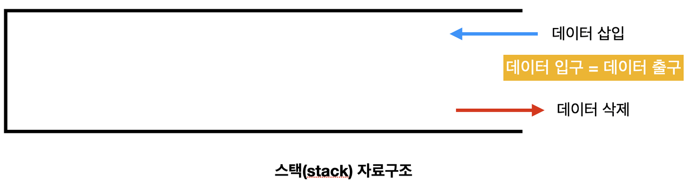

# Stack and Queue

> Stack  
> Queue  
> Deque  
> Q&A   

<br>
<br>

# Stack

## Stack이란



Stack 자료구조는 데이터를 차곡차곡 쌓아 올린 형태의 자료구조를 말한다.

## 자료구조 Stack의 특징

- `LIFO (Last In First Out; 후입선출)` : 가장 마지막에 추가된 자료가 가장 먼저 삭제 된다
- `top` 은 가장 최근에 들어온 자료를 가리키고, `top` 으로 지정한 곳을 통해서만 데이터를 삭제(pop)하거나 추가(push)할 수 있다.
- 자료구조 Stack은 Array, LinkedList 로 구현할 수 있다.

## 운영체제의 메모리 영역: Stack

운영체제의 메모리 구조는 `유저 영역`, `커널 영역` 이 있다.  
유저 영역은 크게 4가지로 나뉘는데 `코드 영역`, `데이터 영역`, `힙 영역`, `스택 영역` 으로 구성된다.  
스택 영역은 `지역변수` , `매개변수` 가 저장되는 영역이다. 함수가 시작되면 해당 함수의 지역변수가 스택 영역에 쌓이고, 함수가 종료되면 스택 영역에서 pop된다.

`stack overflow`   
하나의 함수가 너무 큰 지역변수를 선언하거나 함수를 재귀적으로 무한정 호출하게 될 경우 운영체제의 스택 영역의 공간이 가득차게 될 경우에 발생한다.   
컴파일러 옵션에서 스택 영역의 크기를 늘리거나, 함수에서 사용하는 지역변수의 크기를 줄이거나, 지역변수를 전역변수를 바꾸어 stack overflow 를 피할 수 있다.

`stack underflow`  
비어있는 스택에서 원소를 추출하려고 할 경우에 발생한다.  
간단하게 설명하면, 비어있는 스택에 pop 연산을 수행할 경우 발생하는 에러이다.

## Stack의 활용 예시

Stack은 들어온 순서의 반대로 데이터를 처리할 때 사용된다. 

- 웹 브라우저의 뒤로가기 기능
- 실행 취소 (Undo) 기능
- 후위 표기법 계산 기능
- 수식의 괄호 검사 기능

## Array로 구현한 Stack
<details>

```java
import java.util.EmptyStackException;

public class StackArray {

    int top;
    int size;
    int[] stack;

    public StackArray(int size) {
        this.size = size;
        stack = new int[size];
        top = -1;
    }

    public void push(int item) {
        if (top >= size) {
            throw new StackOverflowError();
        }

        stack[top++] = item;
    }

    public int pop() {
        if (top == 0) {
            throw new EmptyStackException();
        }
        int data = stack[top];
        stack[top--] = 0;
        return data;
    }

    public int search(int target) {
        for (int i = 0; i < top; i++) {
            if (stack[i] == target) {
                return i;
            }
        }
        return -1;
    }
}
```
</details>
<br>


## LinkedList로 구현한 Stack
<details>

```java
import java.util.EmptyStackException;

public class StackLinked {
    public static void main(String[] args) {
        StackLinked stack = new StackLinked();
        for (int i = 0; i < 10; i++) {
            stack.push(i);
        }

        stack.display(); // 9-> 8-> 7-> 6-> 5-> 4-> 3-> 2-> 1-> 0->
        System.out.println(stack.pop()); // 9
        stack.display(); // 8-> 7-> 6-> 5-> 4-> 3-> 2-> 1-> 0->
    }

    private Node top;

    public StackLinked() {
        top = null;
    }

    public boolean isEmpty() {
        return top == null;
    }

    public void push(int item) {
        Node node = new Node(item);
        node.next = top; // 연결
        top = node; // top은 Stack의 가장 최근에 들어온 데이터를 가리킨다.
    }

    public int pop() {
        if (top == null) {
            throw new EmptyStackException();
        }

        Node node = top;
        top = top.next;
        return node.item;
    }

    public int search(int target) {
        int id = 0;
        Node temp = top;

        while (temp != null) {
            if (temp.item == target) {
                return id;
            }

            temp = temp.next;
            id++;
        }

        return -1;
    }

    public void display() {
        if (top == null) {
            throw new EmptyStackException();
        }

        Node temp = top;
        while (temp != null) {
            System.out.print(temp.item + "-> ");
            temp = temp.next;
        }
        System.out.println();
    }

    public class Node {
        private int item;
        private Node next;

        public Node(int item) {
            this.item = item;
            next = null;
        }
    }
}
```
</details>
<br>
<br>

# Queue


## Queue 란


선입선출 (FIFO) 방식의 자료구조를 의미한다.

## Queue의 특징

- `FIFO (First In First Out; 선입선출)` : 먼저 추가된 데이터가 먼저 삭제된다.
- `front` 는 가장 첫번째 원소를 가리키고 삭제연산(dequeue)이 수행된다
- `rear` 는 가장 끝 원소를 가리키고 삽입연산(enqueue)이 수행된다.
- Queue는 Array, LinkedList 로 구현할 수 있다.

## Queue의 활용 예시

Queue는 데이터가 입력된 순서대로 처리해야할 상황에 사용된다.

- 프로세스 스케쥴링
- BFS(너비 우선 탐색) 구현
- LRU 캐시 구현 (오랫동안 사용하지 않는 데이터를 먼저 삭제하는 캐시)

## Array로 구현한 Queue
<details>

```java
public class QueueArray {
    int front;
    int rear;
    int[] queue;

    public QueueArray(int size) {
        queue = new int[size];
        front = rear = 0;
    }

    public boolean isEmpty() {
        return front == rear;
    }

    public boolean isFull() {
        return rear == queue.length - 1;
    }

    public void enqueue(int item) {
        if (isFull()) {
            System.out.println("queue is full");
            return;
        }

        queue[rear++] = item;
    }

    public int dequeue() {
        if (isEmpty()) {
            System.out.println("queue is empty");
            return -1;
        }
        int data = queue[front];
        // 모든 원소를 한칸 앞으로 이동시킨다.
        for (int i = 0; i < rear - 1; i++) {
            queue[i] = queue[i + 1];
        }
        if (rear < queue.length) {
            queue[rear] = 0;
        }
        rear--;

        return data;
    }

    public void display() {
        if (isFull()) {
            System.out.println("queue is empty");
            return;
        }

        for (int i = front; i < rear; i++) {
            System.out.print(queue[i] + " <- ");
        }
        System.out.println();
    }
}
```
</details>
<br>


## LinkedList로 구현한 Queue
<details>

```java
public class QueueLinked {

    public static void main(String[] args) {
        QueueLinked queue = new QueueLinked();
        for (int i = 0; i < 10; i++) {
            queue.enqueue(i);
        }
        queue.display(); // 0 - 1 - 2 - 3 - 4 - 5 - 6 - 7 - 8 - 9 -
        for (int i = 0; i < 5; i++) {
            queue.dequeue();
        }
        queue.display(); // 5 - 6 - 7 - 8 - 9 -
    }

    Node front, rear;

    public QueueLinked() {
        front = rear = null;
    }

    public boolean isEmpty() {
        return front == null && rear == null;
    }

    public void enqueue(int item) {
        Node node = new Node(item);
        if (isEmpty()) {
            front = rear = node;
        } else {
            rear.next = node;
            rear = node;
        }
    }

    public int dequeue() {
        if (isEmpty()) {
            System.out.println("queue is empty");
            return -1;
        }

        int data = front.item;
        front = front.next;

        if (front == null) {
            rear = null;
        }

        return data;
    }

    public void display() {
        if (isEmpty()) {
            System.out.println("queue is empty");
            return;
        }

        Node node = front;
        while (node != null) {
            System.out.print(node.item + " - ");
            node = node.next;
        }
        System.out.println();
    }

    public class Node {
        private int item;
        private Node next;

        public Node(int item) {
            this.item = item;
            next = null;
        }
    }
}
```
</details>
<br>

## Stack으로 구현한 Queue
<details>

```java
import java.util.Stack;

public class QueueWithStack {

    private Stack<Integer> s1 = new Stack<>();
    private Stack<Integer> s2 = new Stack<>();

    public void enqueue(int item) {
        while (!s1.empty()) {
            s2.push(s1.pop());
        }

        s1.push(item);

        while (!s2.empty()) {
            s1.push(s2.pop());
        }
    }

    public int dequeue() {
        if (s1.empty()){
            System.out.println("queue is empty");
            return -1;
        }

        return s1.pop();
    }
}
```
</details>
<br>
<br>

# Deque


## Deque란


Queue 두 개를 좌우로 뒤집에서 붙인 구조의 확장된 자료구조이다.  
양쪽 끝에서 삽입, 삭제 연산을 모두 수행할 수 있도록 확장한 자료구조이다.

## Deque의 특징

- 데이터의 삽입, 삭제가 양쪽 끝에서 이뤄진다.
- Doubly Ended Queue의 약자이다.
- Queue와 동일하게 `front` , `rear` 변수를 사용한다.
- Queue와 Stack의 장점만 따서 구성한 것이다.

`scroll`


입력이 한쪽에서만 이뤄지고, 출력은 양쪽에서 모두 이뤄지는 입력이 제한된 Deque

`shelf`


입력은 양쪽에서 모두 이뤄지고, 출력이 한쪽에서만 이뤄지는 출력이 제한된 Deque

## Array로 구현한 Deque
<details>

```java
public class DequeWithArray {

    public static void main(String[] args) {
        DequeWithArray deque = new DequeWithArray(20);
        for (int i = 1; i <= 5; i++) {
            deque.insertFront(i);
        }
        deque.display(); // 5 4 3 2 1
        for (int i = 1; i <= 5; i++) {
            deque.insertRear(-i);
        }
        deque.display(); // 5 4 3 2 1 -1 -2 -3 -4 -5
    }

    private int arr[];
    private int front;
    private int rear;
    private int size;

    public DequeWithArray(int size) {
        arr = new int[100];
        front = -1;
        rear = 0;
        this.size = size;
    }

    public boolean isFull() {
        return ((front == 0 && rear == size - 1) || front == rear + 1);
    }

    public boolean isEmpty() {
        return front == -1;
    }

    public void insertFront(int item) {
        if (isFull()) {
            System.out.println("overflow");
            return;
        }

        if (front == -1) {
            front = rear = 0;
        } else if (front == 0) {
            front = size - 1;
        } else {
            front--;
        }

        arr[front] = item;
    }

    public void insertRear(int item) {
        if (isFull()) {
            System.out.println("overflow");
            return;
        }

        if (front == -1) {
            front = rear = 0;
        } else if (rear == size - 1) {
            rear = 0;
        } else {
            rear++;
        }

        arr[rear] = item;
    }

    public int deleteFront() {
        if (isEmpty()) {
            System.out.println("queue underflow");
            return -1;
        }
        int data = arr[front];
        if (front == rear) {
            front = rear = -1;
        } else if (front == size - 1) {
            front = 0;
        } else {
            front++;
        }

        return data;
    }

    public int deleteRear() {
        if (isEmpty()) {
            System.out.println("queue underflow");
            return -1;
        }

        int data = arr[rear];
        if (front == -1) {
            front = rear = -1;
        } else if (rear == 0) {
            rear = size - 1;
        } else {
            rear--;
        }
        return data;
    }

    public void display() {
        if (isEmpty()) {
            System.out.println("queue is empty");
            return;
        }

        if (front < rear) {
            for (int i = front; i <= rear; i++) {
                System.out.print(arr[i] + " ");
            }
            System.out.println();
        } else {
            for (int i = front; i < size; i++) {
                System.out.print(arr[i] + " ");
            }
            for (int i = 0; i <= rear; i++) {
                System.out.print(arr[i] + " ");
            }
            System.out.println();
        }
    }
}
```
</details>
<br>

# 참고

[Stack and Queue](https://devuna.tistory.com/22)

[Stack Overflow](https://keepdev.tistory.com/21)

[운영체제 메모리 영역](https://webstone.tistory.com/96)

[Stack Underflow](https://www.quora.com/What-is-stack-underflow), [2](https://www.codegrepper.com/code-examples/whatever/stack+underflow)

[Queue using Stacks](https://www.geeksforgeeks.org/queue-using-stacks/)

[Deque](https://power-overwhelming.tistory.com/30)

[Deque using Array](https://www.includehelp.com/ds/implementation-of-deque-using-array.aspx)
      
<br>


# 면접 예상 질문

<details>
<summary>Stack, Queue, LinkedList의 차이점을 설명하세요</summary>
</details>
    
<details>
<summary>Stack에 대해 설명하세요</summary>
</details>    

<details>
<summary>Stack Overflow에 대해 설명해보세요</summary>
</details>  
    
<details>
<summary>Queue에 대해 설명하세요</summary>
</details>

