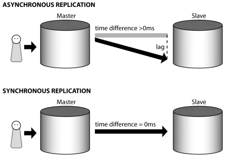

# DB 클러스터링, 리플리케이션

> Clustering, Replication  
Sharding  
Partitioning  
> 

 

# *Clustering, Replication*

기본적인 데이터베이스는 실제 데이터를 저장하는 저장소와 요청을 처리하는 서버로 이루어져 있다.

 

## ## 1. Clustering

`데이터베이스 서버가 죽으면 어떻게 대응하지?` 에 비롯된 생각으로 Clustering 방식이 나오게 되었다

- 데이터베이스 서버를 여러개로 만들자! → 클러스터링

Clustering의 장점

- `데이터 중복`
    
    클러스터링 기법에서 “데이터 중복”은 여러 데이터베이스 서버 사이의 데이터 동기화를 위해 일어난다. 동일한 데이터를 여러 서버에 중복 저장하므로써 하나의 서버가 고장나더라도 다른 서버를 통해 데이터를 제공할 수 있다.
    
- `로드 밸런싱`
    
    여러 데이터베이스 서버로 부하를 분산시켜 사용자의 요청을 더 많이 수용할 수 있다.
    
- `높은 가용성`
    
    여러 대의 데이터베이스 서버를 가지므로 높은 가용성을 보장한다.
    

 

> Clustering (Active - Active)
> 

여러 대로 나눈 서버를 Active(동작중) 상태로 두는 방식이다.

장점

- `무중단 서비스 가능`
    
    하나의 서버가 죽더라도 다른 Active 서버가 대신 요청을 받을 수 있기 때문에 중단없이 서비스를 제공할 수 있다
    
- `성능적인 측면에서 이득`
    
    서버 2대가 운영되기 때문에 리소스를 많이 사용하게 된다. 이는 리소스 소모가 크다는 단점을 갖기도 하지만 성능적인 측면에서 이득이 있다
    

단점

- `병목 현상`
    
    두 대의 서버가 하나의 저장소를 공유하기 때문에 병목현상이 발생할 수 있다
    
- `비용 문제`
    
    두 대의 서버를 동시에 운용해야하기 때문에 비용이 많이 든다
    

 

> Clustering (Active - Standby)
> 

하나의 서버만 Active 상태로 두고, 다른 서버는 Stand by 상태로 두는 방식이다. 만약 Active 서버에 문제가 생겼을 때, Standby 상태의 서버를 Active 서버로 전환한다.

- Standby 상태 : 동작하지 않는 대기 상태

장점

- `비용 절감`
    
    Standby 서버를 사용하지 않기 때문에 Active-Active 방식보다 비용을 절감할 수 있다.
    

단점

- `전환 시간이 오래걸린다`
    
    Active 서버에 문제가 생겨 Standby 서버를 Active 서버로 전환하는데 시간이 오래걸린다 (수십초 ~ 수십분)
    

 

## ## 2. Replication

`저장된 데이터가 손실되면 어떻게 대응하지?` 에 비롯된 생각으로 Replication 방식이 등장했다

- 서버가 죽었을 때 서비스 제공 문제 → **서버를 여러 대** 두는 Clustering으로 해결할 수 있고,
- 데이터 손실문제 → **저장소를 복제**하는 Replication 방식으로 해결할 수 있다.

 

> Replication (단순 백업)
> 

기본적인 Replication 방식은 `Master DB(Primary DB)`와 `Slave DB(Secondary DB)`로 구성된다.

- 사용자가 Master DB로 CRUD를 요청하면 변경된 데이터를 Slave DB에 동기화한다.
- Slave DB는 단순한 백업 및 조회 용도로 사용한다.
- `Primary DB`의 복사본을 `Replica`라고 부른다.

 

> Replication을 사용하는 이유
> 
- `데이터 유실을 막기 위해서`
    
    데이터가 여러 Replica에 복제되어 있기 때문에 한 데이터베이스에 문제가 발생하여 데이터가 삭제되더라도 다른 데이터베이스에 동일한 데이터가 저장되어 있기 떄문에 데이터 유실 문제를 해결할 수 있다.
    
- `Replica가 Primary DB의 역할을 할 수 있다.`
    
    Primary DB에 문제가 생겨 동작하지 않을 경우, Replica 중 하나가 Primary DB가 될 수 있다.
    
- `응답 지연 시간을 줄일 수 있다`
    
    여러 군데에서 동일한 데이터를 저장하고 있는 여러 데이터베이스를 운영하면, 물리적인 위치에 관계없이 빠른 응답 속도를 보장한다.
    

 

> Replication Lag & 데이터 일관성
> 

Primary DB에서 Secondary DB로 데이터를 복제하는데 걸리는 시간을 `Replication Lag` 라 한다.

- 트랜잭션 1이 수행되어 Primary DB의 데이터를 갱신하면 동기화를 위해 Secondary DB의 데이터를 갱신하기 위해 트랜잭션 2가 수행된다. → 이때, 트랜잭션 2가 수행되는 시간을 `Replication Lag` 라고 한다.

Replica가 많으면 Replication Lag 시간이 길어진다. 결국 시간차에 의해 Primary DB와 Secondary DB에서 동일 데이터를 조회할 경우 결과가 달라지게 되므로 `데이터 일관성` 을 100% 지키지 못한다.

 

> Synchronous Replication & Asynchronous Replication
> 

1. `Synchronous Replication`
    
    사용자가 Primary DB로 데이터 쓰기 요청을 보냈을 때, Primary DB가 모든 Replica에 변경된 데이터를 적용한 뒤 쓰기 요청에 대한 응답 메시지를 보내는 방식이다.
    
    - 데이터 일관성을 유지할 수 있지만
    - Replica에 모두 반영하기전까지 시간이 오래걸린다. (만약 하나의 Replica에 데이터 갱신 도중 문제가 발생하면 해당 쓰기 요청 자체가 실패한다)
    
    데이터 일관성이 중요한 시스템에서 `Synchronous Replication` 방식을 사용한다.
    
2. `Asynchronous Replication`
    
    사용자가 쓰기 요청을 보냈을 때, Primary DB에만 적용 후 바로 응답 메시지를 보내는 방식이다. 응답 메시지를 보낸 후 나머지 Replica에 변경 내용을 반영한다.
    
    - 데이터 쓰기 연산 속도가 빠르다.(응답이 빠르다)
    - Secondary DB는 Primary DB 보다 최신 데이터 반영이 느릴 수 밖에 없다. → 이와 같은 지연현상을 Lag이라고 부른다.
    
    퍼포먼스가 중요한 시스템에서 `Synchronous Replication` 방식을 사용한다.
    

 

# *Partitioning*

하나의 큰 table을 '파티션(partition)'이라는 작은 단위로 나누어 관리 기법을 `Partitioning`이라고 한다.

- Partitioning 기법을 통해 소프트웨어적으로 데이터베이스를 분산 처리하여 성능이 저하되는 것을 방지하고 관리를 보다 수월하게 할 수 있게 되었다

 

> Partitioning 기법 등장 배경
> 

데이터의 규모 또한 대용량화 되면서, 기존에 사용하는 DB 시스템의 **용량(storage)의 한계와 성능(performance)의 저하**를 일으켰다.

VLDB(Very Large DBMS)와 같이 하나의 DBMS에 너무 큰 table이 들어가면서 용량과 성능 측면에서 많은 이슈가 발생하게 되었고, 이런 이슈를 해결하기 위한 방법으로 `Partitioning` 기법이 등장했다.

 

> Partitioning의 목적
> 
- `특정 DML과 Query의 성능을 향상시킨다.`
    
    주로 대용량 Data WRITE 환경에서 효율적이고, 특히, Full Scan에서 데이터 Access의 범위를 줄여 성능 향상을 가져온다.
    
- `물리적인 파티셔닝으로 인해 전체 데이터의 훼손 가능성이 줄어들고 데이터 가용성이 향상된다`
    
    각 분할 영역(partition별로)을 독립적으로 백업하고 복구할 수 있다.
    
- `큰 table들을 제거하여 관리를 쉽게 해준다.`

 

> Partitioning 장단점
> 

장점

- 파티션(partition)'이라는 작은 단위로 나누어 관리하기 때문에 전체 데이터를 손실할 가능성이 줄어들어 데이터 가용성이 향상된다.
- partition 단위로 I/O 분산이 가능하여 UPDATE 성능을 향상시킨다
- 데이터 전체 검색 시 필요한 부분만 탐색하기 때문에 Full Scan에서 데이터 Access의 범위를 줄여 성능 향상을 가져온다.

단점

- table간 JOIN에 대한 비용이 증가한다.

 

> Vertical Partitioning
> 

하나의 테이블에서 크기가 큰 데이터를 담거나 민감한 데이터를 담는 Attribute를 독립적인 테이블로 쪼개는 방식이다. 

- 크기가 큰 데이터를 담는 Attribute : `BLOB` , `Text`
- 민감한 데이터 : 패스워드

대용량 데이터를 가진 Column을 검색할 때 시간이 오래걸리기 때문에 Vertical Partitioning을 통해 서버의 성능을 향상시킬 수 있다.

 

> Horizontal Partitioning
> 

Sharding과 동일한 개념으로 스키마(schema)가 같은 데이터를 두 개 이상의 테이블에 나누어 저장하는 것을 말한다.

- 일반적으로 분산 저장 기술에서 파티셔닝은 수평 분할을 의미한다.
- 보통 수평 분할을 한다고 했을 때는 하나의 데이터베이스 안에서 이루어지는 경우를 지칭한다.

 

> Partitioning은 언제 사용할까?
> 
- 테이블의 크기가 `2 GB` 보다 큰 경우 파티셔닝을 고려해야한다.
- 특정 기간의 내용만 Update할 수 있고, 이전 기간의 내용은 Read만 가능할 경우 파티셔닝을 고려해야한다. (Read만 가능한 데이터들을 다른 테이블로 파티셔닝한다)

 

# *Sharding*

`데이터가 너무 많아서 검색이 느린데,, 더 빠르게 할 수 있는 방법이 있을까?` 라는 생각에서 비롯되어 Sharding 방식이 등장했다.

- 빠른 검색을 위해 Table을 나누자 → Sharding

 

> Sharding
> 

테이블을 Row(행) 단위로 나누어서 여러 Shard에 저장하는 방식이다. 

- 타겟 데이터가 어떤 Shard에 존재하는지만 알면 검색을 빠르게 진행할 수 있다

> Sharding 페이퍼를 구성하기 위해 고려해야할 사항 → Shard Key
> 
1. `데이터를 분산된 데이터베이스에 어떻게 분산시켜 저장할 지`
2. `분산된 데이터베이스에서 데이터를 어떻게 읽을 지`

Shard Key란 여러 Shard를 선택할지 결정하는 키이다. Shard Key 결정 방식에 따라 Sharding 방법이 나뉜다.

 

> Hash Sharding
> 

Hash Function을 사용하여 Shard Key를 결정하는 방식이다.

- `Shard n` 에서 n은 Shard Key이다.

장점

- `구현이 간단하다`
    
    Shard의 수 만큼 해싱하여 Shard Key를 결정하기 때문에 구현이 간단하다
    

단점

- `Shard가 늘어나면 기존에 저장된 데이터들에 대한 정확성이 깨진다.`
    
    Shard의 개수가 늘어나면 Hash Function의 계산 방식도 변하기 때문에(`Id % Shard 개수`) 기존에 저장된 방식이 달라진다. → 기존에 저장된 데이터들에 대한 정확성이 깨진다.
    
    **Shard를 확장할 경우, Hash Sharding을 사용하여 Shard key를 결정하는 방식은 적절하지 않다.**
    
- `Hash Function으로 Shard Key를 결정하기 때문에 공간 효율이 좋지 않다`
    
    특정 Shard에 데이터가 몰릴 수 있다.
    

 

> Dynamic Sharding
> 

Hash Sharding 방식의 확장성 문제를 해결하기 위해 Dynamic Sharding 방식이 등장했다.

- `Locator Service` 라는 테이블 정보를 기반으로 Shard Key를 결정한다.

장점

- `Shard 확장에 유연하다`
    
    Shard를 추가할 때, Locator Service에 해당 Shard 정보만 추가하면 된다
    

단점

- `Locator Service 에 의존적인 방식이다`
    
    데이터를 재배치할 경우, Locator Service도 동기화해야한다.
    
    Locator Service에 문제가 발생할 경우(데이터를 저장할 Shard를 고르는데 문제 발생), DB에도 문제가 생긴다
    

*Hash Sharding, Dynamic Sharding의 경우 key-value 형식의 데이터를 저장하는 NoSQL에 적합한 방식이다.*

 

> Entity Group
> 

Entity Group은 **관계가 있는 Entity를 같은 Shard에 저장**하는 방식이다.

장점

- `단일 Shard 내에서 쿼리가 효율적이고 강한 응집도를 가진다`

단점

- `다른 Shard의 Entity와 연관될 경우 비효율적이다`
    
    서로 다른 Shard 속의 Entity와 연관된 쿼리를 수행할 경우 비효율적이다.
    

> Sharding은 언제할까?
> 
- 데이터베이스에 저장된 데이터가 많아서 index 사이즈가 큰 경우 샤딩을 고려한다. (index 사이즈를 줄여 접근 속도를 높힌다)
- 지역별로

샤딩은 데이터를 한곳에서 접근하지 못하게 하기 때문에 프로그래밍과 조작하는데에 복잡도를 더한다. 따라서 샤딩을 쓰기 전에 데이터베이스 퍼포먼스를 올릴 다른 방법(vertical partitioning, storage 키우기)을 알아보고 사용해야 한다.

 

# 참고

[[10분 테코톡] 👨‍💻히브리의 Sharding, Clustering, Replication](https://www.youtube.com/watch?v=y42TXZKFfqQ)

[Clustering vs Replication vs Sharding](https://jordy-torvalds.tistory.com/94)

[샤딩 시스템 개요](http://mongodb.citsoft.net/?page_id=225#comment-91922), [NHN의 안과 밖: Sharding Platform](https://d2.naver.com/helloworld/14822), [MySQL Shard 데이터 재분배](https://tech.kakao.com/2016/07/01/adt-mysql-shard-rebalancing/)

[[DB] DB 파티셔닝(Partitioning)이란](https://gmlwjd9405.github.io/2018/09/24/db-partitioning.html), [Database의 파티셔닝(Partitioning)이란?](https://nesoy.github.io/articles/2018-02/Database-Partitioning)

[ClusterReplicationPartitioning.md](https://github.com/NKLCWDT/cs/blob/main/Database/ClusterReplicationPartitioning.md)

[샤딩 & 파티셔닝](https://www.singlestore.com/blog/database-sharding-vs-partitioning-whats-the-difference/)

# 면접 예상 질문

> Clustering이 무엇인가요?
> 

> Replication이 무엇인가요?
> 

> Sharding이 무엇인가요?
> 

> Partitioning이 무엇인가요?
>