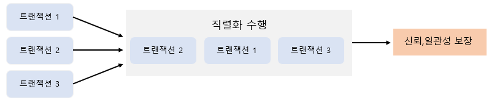
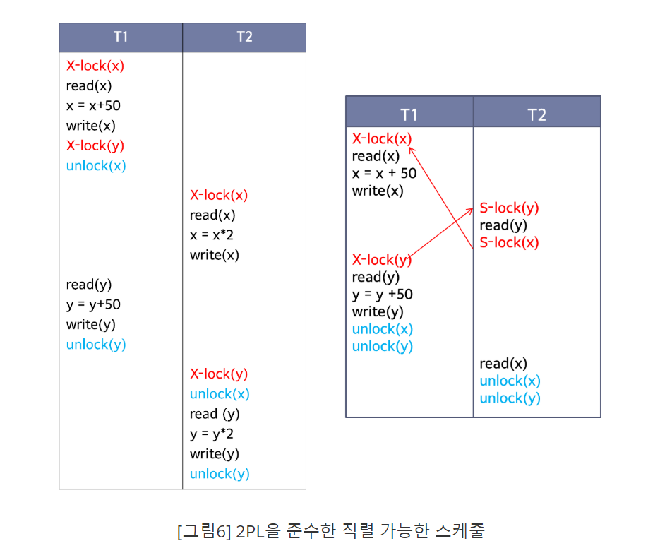

# DB Dead Lock(교착상태) & Concurrency Control(동시성 제어)

> Transaction(트랜잭션)

> Concurrency Control(동시성 제어)

> Dead Lock(교착 상태)

 

# Transaction

트랜잭션은 작업의 완전성을 보장해주는 것이다. 여러 개의 작업을 하나의 논리적 단위로 묶어 반영과 원상복귀를 조정할 수 있기 위해 사용된다.

논리적인 작업 셋을 모두 완벽하게 처리하거나 또는 처리하지 못할 경우에는 원 상태로 복구하여 작업의 일부만 적용되는 현상이 발생하지 않게 만들어주는 기능이다.

사용자의 입장에서는 작업의 논리적 단위로 이해할 수 있고, 시스템의 입장에서는 데이터들을 접근 또는 변경하는 프로그램의 단위가 된다.

 

# **Transaction의 상태**

**활동**(Active) **:** 트랜잭션이 실행 중인 상태

**실패**(Failed) **:** 트랜잭션 실행에 오류가 발생하여 중단된 상태

**철회**(Aborted) **:** 트랜잭션이 비정상적으로 종료되어 Rollback 연산을 수행한 상태

**부분 완료**(Partially Committed) **:** 트랜잭션의 마지막 연산까지 실행했지만, Commit 연산이 실행되기 직전의 상태

**완료**(Committed) **:** 트랜잭션이 성공적으로 종료되어 Commit 연산을 실행한 후의 상태

**Commit**

Commit 연산은 한 개의 논리적 단위(트랜잭션)에 대한 작업이 성공적으로 끝났고 데이터베이스가 다시 일관된 상태에 있을 때, 이 트랜잭션이 행한 갱신 연산이 완료된 것을 트랜잭션 관리자에게 알려주는 연산이다.

**Rollback**

하나의 트랜잭션 처리가 비정상적으로 종료되어 데이터베이스의 일관성을 깨뜨렸을 때, 이 트랜잭션의 일부가 정상적으로 처리되었더라도 트랜잭션의 원자성을 구현하기 위해 이 트랜잭션이 행한 모든 연산을 취소(Undo)하는 연산으로 Rollback시에는 해당 트랜잭션을 재시작하거나 폐기한다.

 

# Concurrency Control(동시성 제어)

### 동시에 실행되는 여러 개의 트랜잭션이 작업을 성공적으로 마칠 수 있도록 트랜잭션의 실행 순서를 제어하는 기법

- 다중 사용자 환경을 지원하는 데이터 베이스 시스템에서 여러 트랜잭션들이 성공적으로 동시에 실행될 수 있도록 지원하는 기능

- 다중 사용자 환경을 지원하는 DB system의 경우 필수적으로 지원해야 하는 기능으로 병행제어라고도 한다.

- 트랜잭션의 직렬화 수행 보장

 

## 동시성 제어의 목적

- 트랜잭션의 직렬성 보장

- 데이터의 무결성 및 일관성 보장

- 일관성을 유지하면서 데이터베이스 공유 최대화, 시스템 활용도 최대화, 사용자 응답시간 최소화

 

## 동시성 제어 기법의 종류

- Locking
  - 트랜잭션이 데이터에 잠금(lock)을 설정하면 다른 트랜잭션은 해당 데이터에 대해 잠금이 해제(unlock)될 때까지 접근/수정/삭제가 불가하다.
  - 로킹 단위가 크면 관리하기 용이(로킹 오버헤드 감소)하지만 병행성 수준(동시성 수준)이 낮아진다.
  - 트랜잭션이 사용하는 자원에 대하여 상호 배제(Mutual Exclusive) 기능을 제공하는 기법
  - 상호배제는 특정 트랜잭션이 데이터 항목에 대하여 잠금 (Lock)을 설정할 트랜잭션이 해제(unlock) 할 때 까지 데이터를 독점적으로 사용할 수 있는 것이다.
  - 로킹 단위가 작으면 병행성(동시성 수준)이 높아지지만 관리가 까다롭다.(로킹 오버헤드 증가)
  - 따라서 잠금 단위를 여러 단계로 정해 놓고 필요에 따라 혼용하는 방식이 많이 사용된다.

  잠금 연산은 데이터에 대한 연산의 성격에 따라서 공유잠금(Shared lock: S-lock)과 배타잠금(Exclusive lock: X-lock)으로 나눌 수 있다.

  - S-lock(공유잠금)
    - 공유잠금을 설정한 트랜잭션은 데이터 항목에 대해 읽기 연산(read)만 가능하다.
    - 하나의 데이터 항목에 대해 여러 개의 공유잠금이 가능하다.
    - 다른 트랙잭션도 읽기 연산만을 실행할 수 있다.
  
  - X-lock(배타잠금)
    - 배타잠금을 설정한 트랜잭션은 데이터 항목에 대해서 읽기 연산(read)과 쓰기 연산(write) 모두 가능하다.
    - 하나의 데이터 항목에 대해서는 하나의 배타잠금(X-lock)만 가능하다.
    - 다른 트랜잭션은 읽기 연산과 쓰기 연산 모두 불가능하다.

- Two-Phase Locking Protocol(2단게 로킹 규약)
  - Lock과 Unlock이 동시에 이루어지면 일관성이 보장되지 않으므로 Lock만 가능한 단계와 Unlock만 가능한 단계를 구분한다.
  - 확장단계: 새로운 Lock은 가능하고 Unlock은 불가능하다.
  - 축소단계: Unlock은 가능하고 새로운 Lock은 불가능하다.
  - 직렬 가능성을 보장하지만 교착상태가 발생할 수 있다.

- Timestamp(타임스탬프)
  - 시스템에서 생성하는 고유 번호인 타임스탬프를 트랜잭션에 부여함으로써 트랜잭션간의 접근 순서를 미리 정한다.

- Validation(적합성 검증)
  - 먼저 트랜잭션을 수행하고 트랜잭션을 종료할 때 적합성을 검증하여 데이터베이스에 최종 반영한다.

 

## 동시성 제어를 하지 않을 경우 발생하는 문제점

- Lost Update(갱신 손실)
  - 하나의 트랜잭션이 갱신한 내용을 다른 트랜잭션이 덮어씀으로써 갱신이 무효화가 되는 것을 의미
  - 두 개이상 트랜잭션이 한 개의 데이터를 동시에 갱신(Update)할 때 발생

- Dirty Read(현황파악오류)
  - 읽기 작업을 하는 트랜잭션 1이 쓰기 작업을 하는 트랜잭션2가 작업한 중간 데이터를 읽기 때문에 발생하는 문제
  - 작업중인 트랜잭션2가 작업을 Rollback한 경우 트랜잭션1은 무효가 된 데이터를 읽게 되고 잘못된 결과를 도출한다.

- Inconsistency(모순성)
  - 다른 트랜잭션들이 해당 항목 값을 갱신하는 동안 한 트랜잭션이 두 개의 항목 값 중 어떤 것은 갱신되기 전의 값을 읽고 다른 것은 갱신된 후의 값을 읽게 되어 데이터의 불일치가 발생하는 상황

- Cascading Rollback(연쇄복귀)
  - 두 트랜잭션이 동일한 데이터 내용을 접근할 때 발생
  - 한 트랜잭션이 데이터를 갱신한 다음 실패하여 Rollback 연산을 수행하는 과정에서 갱신과 Rollback 연산을 실행하고 있는 사이에 해당 데이터를 읽어서 사용할 때 발생할 수 있는 문제

 

# Dead Lock(교착 상태)

### 데이터베이스에서 교착 상태(Dead Lock)란 여러 개의 트랜잭션들이 실행을 하지 못하고 서로 무한정 기다리는 상태를 의미합니다.

예를 들어 TRANSACTION A는 사원 테이블의 1번 사원에 대한 UPDATE를 하고, TRANSACTION B는 2번 사원에 대한 UPDATE 작업을 하고 있다고 가정하자.
1번 사원의 row는 TRANSACTION A가, 2번 사원의 row는 TRANSACTION B가 LOCK을 하고 있는 상태이다.
두 트랜잭션 모두 끝나지 않은 상태에서 TRANSACTION A가 2번 사원을 UPDATE 시도하고 TRANSACTION B가 1번 사원을 UPDATE하려고 하면 두개의 TRANSACTION 모두 WAITING에 들어가고 Dead Lock (교착상태) 에 빠지게 된다.

## 교착상태를 해결하는 방법

- 예방 기법
  - 각 트랜잭션이 실행되기 전에 필요한 데이터를 모두 locking 해주는 것
  - 다만 예방 기법은 데이터가 많이 필요하면 사실상 모든 데이터를 전부 locking 해주어야 하므로 트랜잭션의 병행성을 보장하지 못할뿐 아니라 몇몇 트랜잭션은 계속해서 처리를 못하게 된다.

- 회피 기법
  - 자원을 할당할 때 timestamp를 사용하여 교착상태가 일어나지 않도록 회피하는 방법
  - Wait-Die 방식과 Wound-Wait 방식이 있다.
  - Wait-Die: 트랜잭션 Ti가 Tj에 의해 locking된 데이터를 요청할 때 Ti가 먼저 들어온 트랜잭션이라면 기다린다. 반면 Ti가 나중에 들어온 트랜잭션이라면 포기(Die)하고 나중에 다시 요청한다. 즉, 다른 트랜잭션이 데이터를 점유하고 있을 때 기다리거나(Wait) 포기(Die)하는 방식이다.
  - Wound-Wait: 트랜잭션 Ti가 Tj에 의해 locking된 데이터를 요청할 때 Ti가 먼저 들어온 트랜잭션이라면 데이터를 선점(Wound)한다. 반면에 Ti가 나중에 들어온 트랜잭션이라면 기다린다(Wait). 즉, 다른 트랜잭션이 데이터를 점유하고 있을 때 빼앗거나(Wound) 기다리는(Wait) 방식이다.

 

### 📚 참고

[동시성 제어](https://jokerkwu.tistory.com/125)

[transaction & deadlock](https://velog.io/@yrkim/Database-%ED%8A%B8%EB%9E%9C%EC%9E%AD%EC%85%98-deadlock#%EA%B5%90%EC%B0%A9%EC%83%81%ED%83%9C-dead-lock)

[locking](https://medium.com/pocs/%EB%8F%99%EC%8B%9C%EC%84%B1-%EC%A0%9C%EC%96%B4-%EA%B8%B0%EB%B2%95-%EC%9E%A0%EA%B8%88-locking-%EA%B8%B0%EB%B2%95-319bd0e6a68a)

[교착상태](https://blog.naver.com/PostView.nhn?blogId=ndb796&logNo=221243161017&parentCategoryNo=&categoryNo=1&viewDate=&isShowPopularPosts=false&from=postView)

 

***

## Summary

***

 

# ⁉️ 면접 예상 질문

> 1. 잠금기법(Locking)에 대해 설명하시오. -> 잠금 기법의 문제점이 뭔가요?

> 2. 교착상태(DeadLock)란 무엇인가요? -> 교착상태의 빈도를 낮추는 방법에는 무엇이 있나요?

