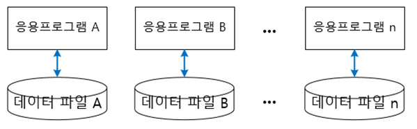
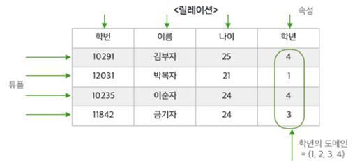
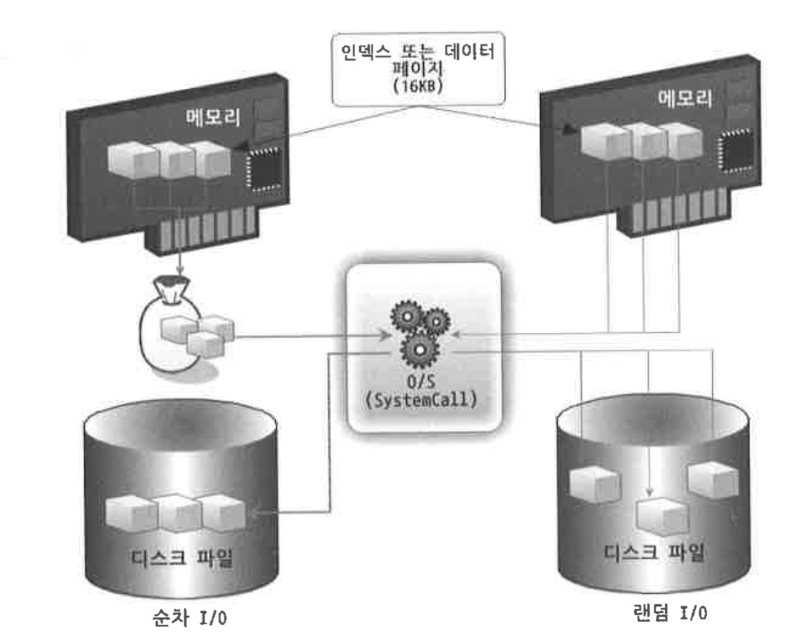

# 데이터베이스

> 데이터베이스의 사용 이유  
데이터베이스
> 

# *데이터베이스의 사용 이유*

데이터베이스 존재 이전에는 파일 시스템을 이용하여 데이터를 관리하였다. (현재도 부분적으로 사용중)

## ## 파일 시스템

`파일 시스템`이란 컴퓨터에서 **파일이나 자료를 쉽게 발견 및 접근할 수 있도록 보관 또는 조직하는 체제**를 가리키는 말이다

- 크기가 일정한 블록들의 배열에 접근할 수 있는 자료 보관 장치 위에 생성되고, 이라한 배열들을 조작하여 파일이나 디렉토리를 만든다.
    - 어느 부분이 파일이고 공백인지 구분하기 위해 배열에 표시해둔다.
- 자료를 `클러스터` , `블록` 이라고 불리는 일정한 단위에 새겨넣는다. (클러스터 또는 블록이 파일 하나가 필요로 하는 디스크의 최소 공간이다)

 

> 파일 시스템의 문제점
> 

대부분의 파일시스템의 경우 각 응용 프로그램마다 하나의 데이터 파일을 사용하여 데이터를 저장한다. 이로부터 발생할 수 있는 문제점이 2가지 있다.

1. `데이터의 종속 문제` (Data Depedency)
    
    응용 프로그램과 데이터 사이의 상호 의존 관계로 인해 데이터를 저장한 파일 구조가 변경되면 응용 프로그램도 이에 맞게 변경해야 한다.
    
2. `데이터의 중복 문제` (Data Redundancy)
    
    각 응용프로그램마다 독립된 데이터 파일을 갖기 때문에 한 시스템의 데이터가 중복 저장되는 문제가 발생한다.
    

 

> 파일 시스템의 데이터 중복으로 인한 문제점은 크게 4가지가 있다.
> 
1. `데이터의 일관성`
    
    데이터가 중복되면 모두 하나의 사실만을 나타내도록 일관성을 유지하는게 어려워 비효율적이다.
    
2. `데이터의 보안성`
    
    데이터가 중복되면 모두 똑같은 수준의 보안을 유지하기 어렵다. (여기서 보안은 인가되지 않은 변경에 대한 데이터의 무결성 유지를 말한다)
    
3. `데이터의 경제성`
    
    데이터가 중복되면 추가적인 저장공간이 필요해 비용이 늘어난다
    
4. `데이터의 효율성`
    
    하나의 데이터 파일을 여러 응용 프로그램이 사용하더라도, 하나의 응용 프로그램이 데이터 파일에 접근하는 동안에 다른 응용 프로그램은 해당 데이터 파일에 접근할 수 없다.
    

파일 시스템의 단점을 극복하여 여러 응용프로그램에서 데이터를 공유하기 위해 데이터베이스가 등장하게 되었다.

 

# *데이터베이스*

`데이터베이스`란 특정 데이터 조직을 여러 응용 프로그램이 `공유`하기 위해, 최소한의 중복으로 `통합`(intergrated), `저장`(stored)된 `운영`(operation) 데이터의 집합이다.

- `통합된 데이터`
    
    데이터 중복을 최소화하고 통제하여 의도적인 중복을 파악하기 때문에 관리가 용이하다
    
- `공유 데이터`
    
    여러 응용 프로그램이 공동으로 해당 데이터에 접근 가능하다
    

 

> 파일 시스템과 데이터베이스 비교
> 

| 파일 시스템 | 데이터베이스 |
| --- | --- |
| 데이터를 여러 프로그램이 공유하지 못한다 | 데이터를 여러 프로그램이 공유할 수 있다 |
| 데이터의 중복이 발생한다 | 데이터의 중복을 최소화한다 |
| 데이터 무결성 보장이 어렵다 | 데이터 무결성을 보장한다 |

 

## ## 특징

1. `데이터의 독립성`
    - `물리적인 독립성`
        
        데이터베이스의 구조를 변경(크기 변경, 파일 추가)하더라도 관련된 응용 프로그램을 수정할 필요없다.
        
    - `논리적인 독립성`
        
        데이터베이스는 논리적인 구조로 다양한 응용 프로그램의 논리적인 요구를 만족시킨다.
        
2. `데이터의 무결성`
    
    **데이터 유효성 검사**라는 잘못된 데이터의 발생 가능성을 방지하는 기능을 통해 데이터의 무결성을 구현한다.
    
3. `데이터의 보안성`
    
    데이터의 보안을 위해 인가된 사용자들만 데이터베이스, 데이터베이스 속 자원에 접근할 수 있도록 계정 관리 및 접근 권한을 설정한다.
    
4. `데이터의 일관성`
    
    서로 연관된 정보를 논리적인 구조로 관리한다. 이로써 일부 데이터만 변경되어 나머지 데이터와 일치하지 않는 경우를 배제할 수 있다.
    
5. `데이터 중복 최소화`
    
    데이터를 통합해서 관리하기 때문에 데이터 중복과 이와 파생된 문제를 해결할 수 있다.
    

 

## ## 용어

1. `Table`
    
    Row(행)과 Colum(열)로 이루어진 데이터 집합이다.
    
    - RDB에서는 Table에 특별한 제약조건을 추가한 Relation을 사용한다.
2. `Relation`
    
    
    
    Relation은 Table의 부분집합이다.
    
    - Tuple(가로 행)과 Attribute(속성)으로 구성되어있다.
    
    Relation의 조건
    
    1. 모든 값은 유일하다
    2. 하나의 Relation에서 중복되는 Tuple이 존재하면 안된다.
        - 중복되는 Tuple이 있으면 Table이지만 Relation이 아니다.
3. `Row (행)`
    
    테이블을 구성하는 데이터들 중 가로로 묶은 데이터 집합이다.
    
    - RDB에서 Tuple 또는 Record라고 칭한다
4. `Colum (열)`
    
    테이블을 구성하는 데이터들 중 세로로 묶은 데이터 집합이다.
    
    - RDB에서 Attribute라고 칭한다
    - 일반적인 Colum은 Attribute를 의미하고, Colum을 구성하는 값들을 Domain이라 한다
5. `Domain`
    
    데이터베이스의 Field에 채워질 수 있는 값의 집합이다.
    
6. `Schema`
    
    데이터베이스의 구조를 전반적으로 기술한 것이다.
    
    - 데이터베이스를 구성하는 데이터 레코드 크기, 키, 레코드 간의 관계 등을 정의한 것이다.
    - 사용자 관점에 따라 `외부 스키마`, `개념 스키마`, `내부 스키마`로 구분한다.
        - DBMS는 외부 스키마에 명세된 사용자 요구를 → 개념 스키마 형태로 변환하고 이를 다시 → 내부 스키마 형태로 변환한다.
    
    
    
    1. 외부 스키마
        
        사용자 입장에서 정의한 데이터베이스의 논리적 구조이다.
        
    2. 개념 스키마
        
        조직체 전체를 관장하는 입장에서 데이터베이스를 정의한 스키마이다
        
    3. 내부 스키마
        
        데이터베이스가 어떻게 저장장치에 저장될 지에 대한 명세이다.
        

 

    

## ## key

key란 검색이나 정렬시에 Tuple을 구분할 수 있는 기준이 되는 Attribute를 의미한다.

1. `슈퍼키`
    
    슈퍼키는 유일성을 만족하는 속성들의 부분집합이다.
    
    - 예를들어 학생 테이블에서 전체 속성들의 부분집합인 {학생번호, 학과이름}이 슈퍼키이다.
2. `후보키`
    
    후보키는 슈퍼키들 중에서 최소성까지 만족하는 키이다.
    
    - 후보키는 기본키가 될 수 있는 후보들이며 유일성과 최소성을 만족한다.
        - 유일성 : 모든 레코드에서 해당 속성에 중복된 값이 나타나지 않는다는 속성
        - 최소성 : 최소한의 속성들로 레코드를 유일하게 구별할 수 있어야 하는 속성
3. `기본키`
    
    테이블에서 특정 레코드를 구별하기 위해 후보키 중 선택된 고유한 식별자이다
    
    - 키본키도 유일성과 최소성을 가지며, null 값이 될 수 없다
    
    기본키가 될 속성으로 값이 자주 변하지 않는 속성을 선택해야한다.
    
    - 기본키로 선택된 필드는 레코드가 업데이트 될때마다 유일성을 검사하고, null 값이 아닌지 검사해야 한다.
    
    기본키가 될 속성으로 단순한 값을 가지는 속성을 선택해야 한다
    
    - 복잡한 값을 가지는 속성의 경우, 기본키를 비교할 때 비용이 소모된다
4. `대체키`
    
    후보 키 중에서 기본키로 선택된것들을 제외한 모든 키이다
    
    - 후보키 - 기본키 = 대체키
5. `복합키`
    
    한개 이상의 속성을 포함하는 키이다.
    
6. `외래키`
    
    한 테이블에서 다른 테이블의 레코드를 참조하기 위해 사용되는 키이다.
    

슈퍼키 = 유일성 만족하는 키

후보키 = 슈퍼키 + 최소성 만족하는 키

기본키 = 후보키 중 선택된 키 = 유일성 + 최소성 + not null = 특정 레코드 구분가능

대체키 = 후보키 - 기본키 = 나머지 키들

 

## ## 데이터베이스의 디스크 I/O

데이터베이스의 성능 이슈는 `디스크 I/O` 를 어떻게 줄이느냐에서 시작한다.

- `디스크 I/O`란
    
    읽어야할 데이터가 저장된 위치로 디스크 드라이브의 원판을 돌려 디스크 헤더를 이동시켜 해당 데이터를 읽는 것을 의미한다.
    
- `I/O`란
    
    Input & Output (입출력)의 줄임말로 `컴퓨터 및 주변 장치에 데이터를 전송하는 프로그램 혹은 장치` 를 일컫는 말이다. (프로세서, 메모리, 확장 슬롯, 마더보드 등에서 일어나는 데이터 전송도 I/O에 속한다.)
    

 

> 순차 I/O & 랜덤 I/O
> 

`순차 IO`란 시작 위치로 이동하여 물리적으로 인접한 페이지를 차례대로 읽는 방법이다.

- 큰 처리량(Throughtput)을 갖는 방식이다.
- 순차 IO로 원하는 데이터를 찾기 위해선 `Full Scan` 방식을 이용해야한다.
    - Full Table Scan에 사용되는 방법이다

`랜덤 IO`란 디스크의 여러 부분에 흩어져 있는 데이터를 읽는 방식이다.

- 인접하지 않은 데이터가 읽히므로 디스크 헤드를 무작위(Random)로 움직인다. 이는 성능 저하를 야기한다.
- Index Range Scan에 사용되는 방법이다.

 

> ***대부분의 IO 작업이 랜덤 IO로 이뤄진다***
> 

서버 기반 환경에서 모든 I/O를 순차I/O로 수행하는 것은 불가능하다. 따라서 유일한 해결책은 랜덤 엑세스가 최소화되도록 여러 디스크에 데이터를 매핑하는 것이다. (하나의 디스크에 여러 데이터가 아니라 여러 디스크에 적은 데이터를 매핑)

 

> 데이터베이스 저장소 설계방법 : 순차 I/O & 랜덤 I/O
> 

순차 I/O 및 랜덤 I/O의 주요 특성을 고려하여 최대 순차 I/O가 수행될 수 있는 방식으로 데이터베이스 Disk 저장소를 설계하는 것이 중요하다.

SQL Server에서 트랜잭션 로그는 순차 I/O의 주요한 예시이다. 많이 사용한 로그 파일을 하나의 디스크에 저장하고, 기본 로그 파일을 하나만 사용하도록 권장된다. 왜냐하면 순차 I/O를 통해 큰 처리량을 갖기 위함이다.

만약 여러 로그 파일을 하나의 디스크에 저장하면 엑세스 유형이 순차I/O에서 → 랜덤I/O로 변경된다.

 

> 예시
> 

`순차 IO`는 연속된 3개의 데이터를 디스크에 기록하기 위해 시스템 콜을 한번만 요청하지만, `랜덤 IO`는 3개의 데이터를 디스크에 기록하기 위해 3번의 시스템 콜을 요청한다.

- 디스크에 기록할 위치를 찾는 과정에서 순차 IO는 디스크 헤드를 1번 움직이고, 랜덤 IO는 3번 움직인다.

데이터를 읽는데 걸리는 시간은 디스크 헤더의 이동 시간으로 결정된다. 즉, **디스크의 성능은 디스크 헤더의 위치에 상관없이 얼마나 많은 데이터를 한 번에 기록하는지에 따라 결정된다**. 

- 이러한 이유로 `순차 I/O` 가 `랜덤 I/O` 보다 빠를 수 밖에 없다.

 

> 랜덤 I/O
> 

하지만 대부분의 I/O 작업이 `랜덤 I/O`로 이뤄진다. 

- “랜덤 I/O 를 순차 I/O 로 바꿔서 실행할 수는 없을까?” 라는 생각에서부터 시작된 `데이터베이스 쿼리 튜닝` 의 목적은 `랜덤 I/O 자체를 줄이는 것`이다
    - `랜덤 I/O 자체를 줄인다`는 의미는 `쿼리를 처리하는 데 꼭 필요한 데이터만 읽도록 쿼리를 개선하는 것`을 의미한다.

데이터베이스에서 대부분 데이터를 빈번하게 읽고 쓰기 때문에 랜덤 IO의 부하를 줄여주는 방식이 있다. (MySQL에서는 `InnoDB 버퍼 풀` 기능으로 랜덤 IO의 부하를 줄인다)

 

# 참고

[데이터베이스](https://github.com/JaeYeopHan/Interview_Question_for_Beginner/tree/master/Database#%EB%8D%B0%EC%9D%B4%ED%84%B0%EB%B2%A0%EC%9D%B4%EC%8A%A4)

[파일시스템](http://melonicedlatte.com/computerarchitecture/2020/03/02/204500.html), [파일시스템의 문제점](https://codedragon.tistory.com/3802)

[DB용어](https://github.com/WooVictory/Ready-For-Tech-Interview/blob/master/Database/%EB%8D%B0%EC%9D%B4%ED%84%B0%EB%B2%A0%EC%9D%B4%EC%8A%A4%20%EA%B8%B0%EB%B3%B8%20%EC%9A%A9%EC%96%B4.md) , [DB key](https://github.com/WooVictory/Ready-For-Tech-Interview/blob/master/Database/Key(%ED%82%A4).md), [클러스터링 인덱스, 유니크 인덱스, 외래 키.md](https://github.com/alstjgg/cs-study/blob/main/%EB%8D%B0%EC%9D%B4%ED%84%B0%EB%B2%A0%EC%9D%B4%EC%8A%A4/%ED%81%B4%EB%9F%AC%EC%8A%A4%ED%84%B0%EB%A7%81%20%EC%9D%B8%EB%8D%B1%EC%8A%A4%2C%20%EC%9C%A0%EB%8B%88%ED%81%AC%20%EC%9D%B8%EB%8D%B1%EC%8A%A4%2C%20%EC%99%B8%EB%9E%98%20%ED%82%A4.md#%EC%99%B8%EB%9E%98-%ED%82%A4)

[순차 I/O 랜덤 I/O](https://velog.io/@keywookim/MySQL-Index-%EC%BF%BC%EB%A6%AC%ED%8A%9C%EB%8B%9D%EC%9D%98-%EA%B8%B0%EB%B3%B8-1#%EB%9E%9C%EB%8D%A4io%EC%99%80-%EC%88%9C%EC%B0%A8io)

[순차 io 랜덤 io](https://blog.dbdigger.com/sequential-and-random-io-for-databases/#:~:text=Sequential%20I%2FO%20is%20operation,on%20various%20parts%20of%20disk.)

# 면접 예상 질문

> 데이터베이스를 사용하는 이유가 무엇이나요?
> 

> 데이터베이스 키의 종류와 기능에 대해 설명해주세요
> 

> 순차 I/O와 랜덤 I/O에 대해 설명해주세요
>
