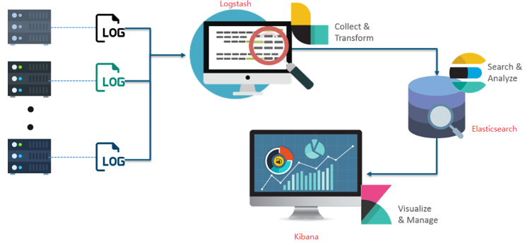
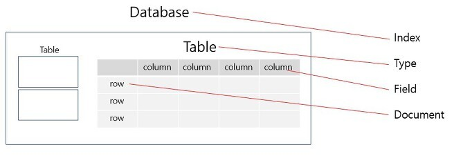
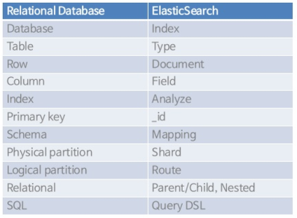
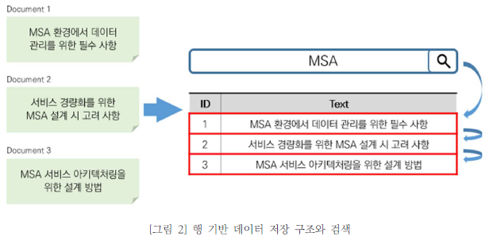
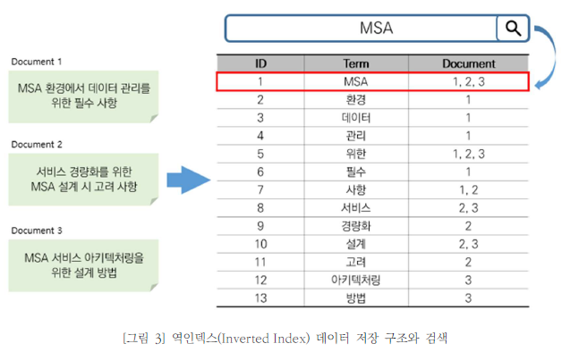
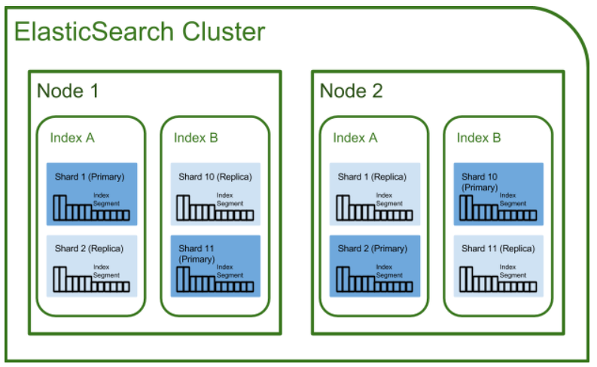
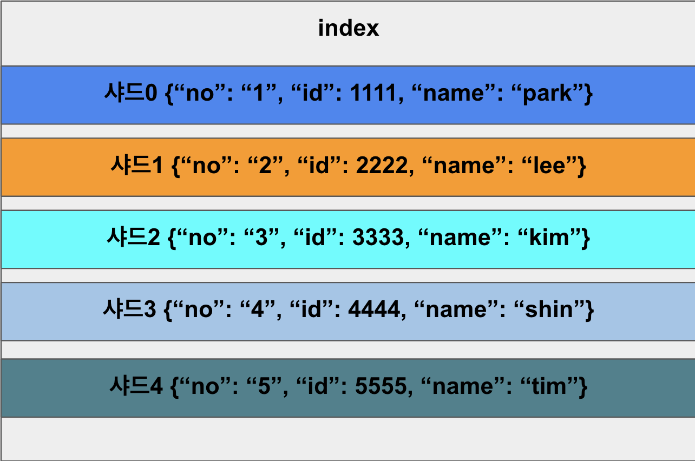
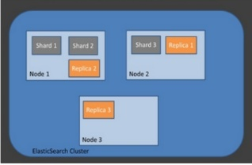
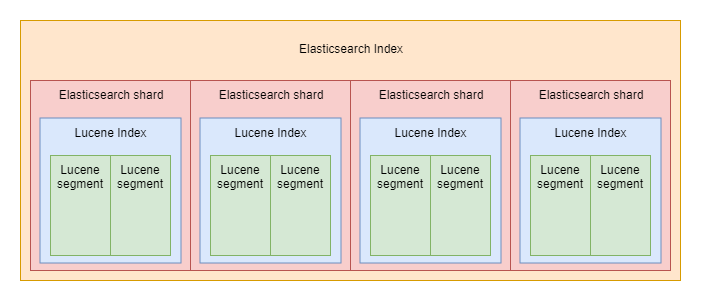

# ElasticSearch

## ElasticSearch란?
`ElasticSearch`는 Apache Lucene(아파치 루씬) 기반의 Java **오픈 소스 검색 엔진**이다. 

**방대한 양의 데이터를 신속하게(거의 실시간) 저장, 검색, 분석을 수행**할 수 있다. 

### ElasticSearch는 어디에 사용되나요?
`ElasticSearch`의 속도와 확장성, 그리고 수많은 종류의 콘텐츠를 색인할 수 있는 능력은 다음과 같은 다양한 사용 사례에 이용될 수 있다.

- 어플리케이션 검색
- 웹사이트 검색
- 엔터프라이즈 검색
- 로깅과 로그 분석
- 인프라 메트릭과 컨테이너 모니터링
- 애플리케이션 성능 모니터링
- 위치 기반 정보 데이터 분석 및 시각화
- 보안 분석
- 비즈니스 분석

**활용 예**
1. 고객이 판매 제품을 검색할 수 있는 온라인 웹 스토어를 운영한다. 이 경우에는 `ElasticSearch`를 사용하여 전체 제품 카탈로그 및 재고 정보를 저장하고 그에 대한 검색 및 자동 완성 제안 기능을 제공할 수 있다.

2. 로그 또는 트랜잭션 데이터를 수집하고 이 데이터를 분석하고 마이닝하여 추이, 통계, 요약 정보를 얻거나 이상 요인을 알아내려 한다.

3. 분석/비즈니스 인텔리전스 기능이 필요하여 방대한 데이터(수백만 또는 수십억 개의 레코드)를 대상으로 신속하게 조사, 분석, 시각화, 임시 질의를 수행하고 싶다. 이 경우에는 ElasticSearch를 사용하여 데이터를 저장한 다음 Kibana를 사용하여 데이터 중 중요한 요소를 시각화할 맞춤형 대시보드를 만들 수 있다. 또한 ElasticSearch 집계 기능을 사용하여 데이터에 대한 복잡한 비즈니스 인텔리전스 쿼리를 수행할 수 있다. 

>비즈니스 인텔리전스(BI)는 조직이 더 나은 의사 결정을 내리고 정보에 입각한 조치를 취하며 보다 효율적인 비즈니스 프로세스를 구현할 수 있도록 지원하는 기능을 말한다.

### Elastic Stack란?
사용자가 **서버로 부터 원하는 모든 유형의 데이터를 가져와서 실시간으로 해당 데이터를 검색, 분석 및 시각화** 할 수 있도록 도와주는 Elastic의 오픈소스 서비스 제품이다. 

기존 ElasticSearch + Logstash + Kibana를 같이 묶어 `ELK(ELK Stack)`라는 서비스명으로 제공했으나 5.0.0 버전부터 `Beats`가 포함되어 `Elastic Stack`이란 이름으로 서비스가 제공되고 있다. 

- **Logstash**
    - 다양한 소스(DB, csv 파일 등)의 로그 또는 트랜잭션 데이터를 수집, 집계, 파싱하여 `ElasticSearh`로 전달
- **ElasticSearch**
    - `Logstash`로부터 받은 데이터를 검색 및 집계하여 필요한 정보를 획득
- **Kibana**
    - `ElasticSearch`의 빠른 검색을 통해 데이터를 시각화 및 모니터링
- **Beats**
    - 경량 데이터 수집기
    - 단일 목적의 데이터 수집기 무료 오픈 소스 플랫폼으로 수백 수천 개의 장비와 시스템으로부터 Logstash나 ElasticSearch에 데이터를 전송한다.

주로 로드밸런싱되어 있는 WAS의 흩어져 있는 로그를 한곳으로 모으고, 원하는 데이터를 빠르게 검색한 뒤 시각화하여 모니터링하기 위해 사용한다.

## ElasticSearch는 어떻게 작동하나요?
로그, 시스템 메트릭, 웹 애플리케이션 등 다양한 소스로부터 원시 데이터가 `ElasticSearch`로 흘러 들어간다.

데이터 수집은 원시 데이터가 `ElasticSearch`에서 색인되기 전에 구문 분석, 정규화를 진행한다.

`ElasticSearch`에서 일단 색인되면, 사용자는 이 데이터에 대해 복잡한 쿼리를 실행하고 집계를 사용해 데이터의 복잡한 요약을 검색할 수 있다.

Kibana에서 사용자는 데이터를 시각화하고, 대시보드를 공유하며 관리할 수 있다.

## ElasticSearch vs RDB

RDB와 매칭되는 키워드들이다.
`인덱스`와 `타입`에 대해 주의해야한다.

**RDB와 ElasticSearch의 데이터 저장 방식이 다르다.**

일반적으로 RDB는 `행을 기반으로` 데이터를 저장한다. 그에 반해 ElasticSearch는 `단어를 기반으로(역 인덱스,Inverted Index)`데이터를 저장한다.

RDB는 데이터 수정,삭제의 편의성과 속도면에서 강점이 있지만 다양한 조건의 데이터를 검색하고 집계하는 데에는 구조적인 한계가 있다. 

아래의 사진처럼 'MSA'라는 검색할때 도큐먼트 개수만큼 'MSA'가 있는지 확인을 반복하기 때문에 많은 수의 도큐먼트가 있을 경우 비효율적이다.

반면에 단어 기반으로 데이터를 저장하는 ElasticSearch는 특정 단어가 어디에 저장되어있는지 이미 알고 있어 모든 도큐먼트를 검색하 ㄹ필요가 없다. 

아래의 사진처럼 역인덱스 구조로 저장한 상태에서 'MSA'를 검색하면 단어가 저장된 도큐먼트를 알고있기 때문에 도큐먼트 개수와 상관없이 한 번의 조회로 검색을 끝낼 수 있다. 

다만 수정과 삭제는 ElasticSearch 내부적으로 굉장히 많은 리소스가 소요되는 작업이다. 따라서 데이터 특성상 수정과 삭제가 많은 경우에는 RDB와 엘라스틱 영역을 나누어 아키텍처링하는 것이 필요하다. 

## ElasticSearch 인덱스
**ElasticSearch 인덱스**는 **서로 관련되어 있는 문서들의 모음**이다. 

ElasticSearch는 JSON 문서로 데이터를 저장한다. 각 문서는 일련의 키(필드나 속성의 이름)와 그에 해당하는 값(문자열, 숫자, 부울, 날짜, 값의 배열, 지리적 위치 또는 기타 데이터 유형)을 서로 연결한다.

ElasticSearch는 `역 인덱스`라고 하는 데이터 구조를 사용하는데, 이것은 아주 빠른 풀 텍스트 검색을 할 수 있도록 설계된 것이다. 

`역 인덱스`는 문서에 나타나는 모든 고유한 단어의 목록을 만들고, 각 단어가 발생하는 모든 문서를 식별한다.

색인 프로세스 중에, ElasticSearch는 문서를 저장하고 `역 인덱스`를 구축하여 거의 실시간으로 문서를 검색 가능한 데이터로 만든다. 인덱스 API를 사용해 색인이 시작되며, 이를 통해 사용자는 특정한 인덱스에서 JSON 문서를 추가하거나 업데이트 할 수 있다. 

### 한 인덱스 내 멀티 타입이 가능한가?
> RDB 데이터베이스 = 인덱스
> RDB 테이블 = 타입

하나의 데이터베이스에 여러 테이블을 가지듯이, ElasticSearch도 하나의 인덱스에 여러 타입을 가질 수 있다. 하지만 ElasticSearch 7.0 이상부터는 **하나의 인덱스에 하나의 타입만 가질 수 있도록** 바뀌었다.

RDB의 테이블은 완전 개별적인 관계이기 때문에 각 테이블에 이름이 같은 컬럼이 있어도 문제가 없다. 예를 들어 Twitter DB 안의 User Table, Tweet Table이 있고 각각의 테이블 안에 user_name이 있어도 상관없다.

반면, ElasticSearch에서 한 인덱스 내의 타입들은 내부적으로 같은 `Lucene` 필드를 사용한다. 즉 위에서 예로 들었던 User 타입의 user_name 필드와 Tweet 타입의 **user_name 필드는 동일한 필드에 저장되며 두 user_name 필드는 동일한 매핑(정의)를 가져야 한다.**

따라서 **타입이 다를지라도 동일한 이름을 가진 필드는 독립적이지 않으므로** 여러 가지 문제가 발생할 수 있으니 하나의 인덱스에는 하나의 타입만을 갖도록 수정되었다. 

## ElasticSearch 구조

### 클러스터
Elasticsearch에서 가장 큰 시스템 단위를 의미하며, 최소 하나 이상의 노드로 이루어진 노드의 집합이다.

서로 다른 클러스터는 데이터의 접근, 교환을 할 수 없는 독립적인 시스템으로 유지되며, 여러 대의 서버가 하나의 클러스터를 구성할 수 있고 한 서버에 여러 개의 클러스터가 존재할 수 있다.

### 노드
노드는 클러스터에 포함된 단일 서버로서 데이터를 저장하고 클러스터의 색인화 및 검색 기능에 참여한다. 

노드는 역할에 따라 `Master-eligible`, `Data, Ingest`, `Tribe` `Coordination Only Node` 노드로 구분할 수 있다.

**📌 Master-eligible Node**

클러스터를 제어하는 마스터로 선택할 수 있는 노드이다.
 마스터 노드가 하는 역할을 다음과 같다.

- 인덱스 생성, 삭제
- 클러스터 노드의 추적, 관리
- 데이터 입력 시 할당할 샤드 선택

**📌 Data Node**

데이터(Document)가 저장되는 노드이며, 데이터가 분산 저장되는 물리적 공간인 샤드가 배치되는 노드이다. 

CRUD, 색인, 검색, 통계 등의 데이터 작업을 수행하므로 많은 리소스(CPU, 메모리 등)를 필요로 한다. 따라서 모니터링 작업을 해야 하고, 마스터 노드와는 분리해야 한다.

Elasticsearch 버전이 업그레이드 되면서 Data Node에도 좀 더 다양화가 되었습니다.
현재 Data Node는 `Content Data`, `Hot Data`, `Warm Data`, `Cold Data`, `Frozen Data`로 세분화 되었다.

- **Content Data**
    - Content Data 노드는 유저가 만든 콘텐츠를 수용하는 노드이다. 
    - CRUD, 검색 및 집계와 같은 작업을 가능하게 한다.
- **Hot Data**
    - Hot Data 노드는 시계열 데이터를 저장한다. - 해당 노드는 read/write가 빠르며 더 많은 하드웨어 리소스(SSD)가 필요하기 때문에 고사양의 서버에 적합하다.
- **Warm Data**
    - Warm Data 노드는 더 이상 업데이트가 되지 않지만 쿼리를 실행하는 인덱스를 저장한다. 
    - 즉 오래된 데이터이지만 활용하고 있는 데이터를 보관한다. 
    - 일반적으로 이 노드는 성능이 낮은 하드웨어를 사용할 수 있다.
- **Cold Data**
    - Cold Data 노드는 읽기 전용 인덱스를 저장한다.(자주 사용하지 않는 인덱스)
    - 전용 데이터의 경우 클러스터 저장공간을 최대 50% 절약 가능하다. 
    - 레플리카를 스냅샷으로 저장하고 스냅샷 저장소에 오프로드 한다.
    - 검색 가능 스냅샷을 이용해서 데이터 복원성을 강화하였다.
- **Frozen Data**
    - Frozen Data 노드는 shared_cache 옵션으로만 마운트 된 검색 가능한 스냅샷을 저장한다.
    - 즉 스냅샷 데이터를 해당 노드에 저장하고 데이터를 검색 가능하도록 하는 노드이다.

**📌 Ingest Node**

데이터를 변환하는 등 사전 처리 파이프라인을 실행하는 역할을 한다.

**📌 Coordination Only Node**

사용자의 요청을 받고 라운드 로빈 방식으로 분산을 하는 노드이다. 

클러스터에 관련된 것은 `마스터 노드`로 넘기고, 데이터와 관련된 것은 `데이터 노드`로 넘긴다. 

로드밸런싱 역할을 하는 노드라고 생각하면 된다.

### 인덱스 / 샤드 / 복제

**인덱스 (Index)**
RDBMS에서 데이터베이스와 대응하는 개념이다.

**샤드 (shard)**

인덱스 내부에는 색인된 데이터들이 존재하는데, 이 데이터들은 하나로 뭉쳐서 존재하지 않고 물리적 공간에 여러 부분으로 나뉘어 존재한다. 

이러한 부분을 샤드라고 한다. 즉, `스케일 아웃`을 위해 하나의 인덱스를 여러 샤드로 쪼갰다고 생각하면 된다.

샤드는 `프라이머리 샤드`와 `레플리카 샤드`로 나뉜다.

레플리카는 원본 shard가 장애가 발생하더라도 복제본 shard를 통해 데이터를 제공할 수 있어 장애 대응에 효과적이다.

- **프라이머리 샤드**
    - 데이터의 원본이다. Elasticsearch에서 데이터 업데이트 요청을 날리면 반드시 프라이머리 샤드에 요청하게 되고, 해당 내용은 레플리카 샤드에 복제된다. 검색 성능 향상을 위해 클러스터의 샤드 개수를 조정하기도 한다.
- **레플리카 샤드 (복제)**
    - 프라이머리 샤드의 복제본이다. 기존 원본 데이터가 무너졌을 때 그 대신 사용하면서 장애를 극복하는 역할을 수행한다. 기본적으로 원본인 프라이머리 샤드와 동일한 노드에 배정되지 않는다.

### 세그먼트 
**세그먼트**란 Elasticsearch에서 `문서의 빠른 검색을 위해 설계된 자료 구조`이며, `샤드의 데이터를 가지고 있는 물리적인 파일`이다. 각 샤드는 **다수의 세그먼트**로 구성되어 있으므로 검색 요청을 분산 처리하여 훨씬 **효율적인 검색**이 가능하다.

샤드에서 검색 시, 먼저 각 세그먼트를 검색하여 결과를 조합한 후 최종 결과를 해당 샤드의 결과로 반환하게 된다. 이때 세그먼트는 내부에 색인된 데이터가 `역색인 구조`로 저장되어 있으므로 검색 속도가 매우 빠르다.

그런데, 매 요청마다 새로운 세그먼트를 만들어 주면 엄청나게 많은 세그먼트가 생성될 것이고, 이로 인해 다른 요청에 지장이 생길 수 있다. 이를 방지하기 위해 `인메모리 버퍼`를 사용한다. 인메모리 버퍼에 쌓인 내용을 일정 시간이 지나거나 버퍼가 가득차면 flush를 취하고, flush 작업이 수행되면 시스템 캐시에 세그먼트가 생성된다. 이 시점부터 데이터가 비로소 검색이 가능해진다. 하지만 이 상태는 세그먼트가 시스템 캐시에 저장된 상태이지, 디스크에 저장된 상태는 아니다.

디스크에 쓰여지는 작업 역시 일정 시간이 지나면 commit을 통해서 물리적인 디스크에 세그먼트를 저장해 주고, 저장된 세그먼트는 시간이 지날수록 하나로 `병합하는 과정`을 수행한다. 병합을 통해 세그먼트를 하나로 줄여 주면, 검색할 세그먼트의 개수가 줄어들기 때문에 검색 성능이 향상된다.

`세그먼트 병합` 시에는 새로운 세그먼트를 만들 공간이 있어야 하기 때문에 디스크가 꽉 찬 상태에서는 수행할 수 없으며 세그먼트 병합은 시스템 자원을 많이 쓰는 부담스러운 작업이므로 시스템 자원이 여유로울 때 진행한다.

## ElasticSearch의 장단점
### 장점
- **Scale out**
    - 샤드를 통해 규모가 수평적으로 늘어날 수 있다.
- **고가용성**
    - Replica를 통해 데이터의 안전성을 보장한다.
- **Schema Free**
    - Json 문서를 통해 데이터 검색을 수행하므로 스키마 개념이 없다.
- **Restful**
    - 데이터 CRUD 작업은 HTTP Restful API를 통해 수행한다.
    - SELECT = GET
    - INSERT = PUT
    - UPDATE = POST
    - DELETE = DELETE
    - Restful API를 사용한다는 것은 다양한 플랫폼에서 응용이 가능하다는 장점이 있다.
- **Inverted Index**

### 단점
- **실시간 처리가 불가능하다.**
    - elasticsearch는 인메모리 버퍼를 사용하므로 쓰기와 동시에 읽기 작업을 할 경우, 세그먼트가 생성되기 전까지는 해당 데이터를 검색할 수 없다.
- **트랜잭션을 지원하지 않는다.**
    - 분산 시스템 구성의 특징 때문에 시스템적으로 비용 소모가 큰 트랜잭션 및 롤백을 지원하지 않는다.
- **진정한 의미의 업데이트를 지원하지 않는다.**
    - 세그먼트에서 데이터가 삭제될 경우 Soft-Delete를 한다. (삭제 flag = true)
    - 세그먼트에서 데이터가 수정될 경우 Soft-Delete를 하고, 수정된 데이터를 새로운 세그먼트로 생성한다.
    - RDBMS의 Index와 유사한 동작
- **Document간의 `join`을 수행할 수 없다.**
    - 두 번의 쿼리로 해결은 가능

## 출처
[elasticsearch 간단개념+장단](https://sudarlife.tistory.com/entry/Elasticsearch-%EA%B0%84%EB%8B%A8-%EA%B0%9C%EB%85%90-%EC%9E%A5%EB%8B%A8)
[elasticsearch는 무엇인가요](https://www.elastic.co/kr/what-is/elasticsearch)
[elasticSearch](https://github.com/alstjgg/cs-study/blob/main/%EB%8D%B0%EC%9D%B4%ED%84%B0%EB%B2%A0%EC%9D%B4%EC%8A%A4/Elasticsearch%EB%9E%80.md)
[elasticSearch vs RDB](https://s-core.co.kr/insight/view/%EC%97%98%EB%9D%BC%EC%8A%A4%ED%8B%B1%EC%84%9C%EC%B9%98elasticsearch%EC%97%90%EC%84%9C-%EA%B4%80%EA%B3%84%ED%98%95-%EB%8D%B0%EC%9D%B4%ED%84%B0-%EB%AA%A8%EB%8D%B8%EB%A7%81-%ED%95%98%EA%B8%B0/)
[elasticSearch 구조](https://velog.io/@dhjung/2.-Elasticsearch-%EA%B5%AC%EC%A1%B0)

### 면접 질문

> 1. ElasticSearch 란 무엇인가요?

> 2. ElasticSearch는 언제/왜 사용되나요?

> 3. ElasticSearch의 구조는 어떻게 되어있나요?

> 4. ElasticSearch는 왜 검색 속도가 빠른가요?

> 5. ElasticSearch의 장단점은 무엇인가요?