# Index 

> 순차 I/O, 랜덤 I/O

> 인덱스 레인지 스캔, 인덱스 풀 스캔

> 클러스터링 인덱스, 논 클러스터링 인덱스

> B-Tree Index, Hash Index

> Hint


## 디스크 읽기 방식
## 하드 디스크 드라이브(HDD)와 솔리드 스테이트 드라이브(SSD)
컴퓨터 대부분의 주요 장치(CPU, RAM 등)은 대부분 디지털 방식이지만, HDD는 아날로그 방식의 장치이다. 디지털 방식으로 동작하는 주요 장치 간의 데이터 소통은 굉장히 빠른데, HDD만 그 페이스에 맞추지 못하는 상황이 발생하게 된다. 그래서 DB에서 디스크 장치는 항상 병목이 되어 느려지는 현상이 빈번하다. 이러한 기계식 디스크 드라이브를 대체하기 위해 나온 것이 SSD(SolidStateDrive)이다.


순차 I/O의 경우 SSD와 HDD가 비슷한 성능을 보일 수 있지만, 랜덤 I/O의 경우 SSD가 훨씬 성능이 좋다. 데이터베이스 서버에서 순차 I/O 작업은 그다지 비중이 크지 않고 랜덤 I/O를 통해 작은 데이터를 읽고 쓰는 작업이 많아서 SSD가 일반적으로 DBMS에 적합하다고 볼 수 있다. (특히 웹 서비스 환경)

## 랜덤 I/O와 순차 I/O
기본적으로 디스크 드라이브는 데이터를 읽을 때 원판 플래터를 회전하며 데이터를 찾는다. 

- **순차 I/O**는 논리적/물리적 순서를 따라 차례대로 데이터를 읽어 나가는 방식
- **랜덤 I/O**는 논리적/물리적 순서를 따르지 않고 한 건의 데이터를 읽기 위해 한 블록씩 접근하는 방식


위의 예제에서 `5번`만 **순차I/O**이고 나머지는 **랜덤 I/O**에 해당한다. 5번은 논리적/물리적으로 한 방향으로 연속하게 데이터를 읽어 들이지만, 나머지는 연속하지 않은 방향으로 한 블록씩 데이터를 읽어 들이고 있다. 

**구체적인 동작 과정**


- **순차I/O**는 3개의 페이지를 디스크에 기록하기 위해 한번의 시스템 콜을 요청
 - **랜던I/O**는 세 번을 요청

 즉 디스크에 기록할 위치를 찾기 위해 **순차 I/O**는 **디스크 헤더**를 1번 움직였고, **랜덤 I/O**는 3번 움직였다. 

 디스크에 데이터를 쓰고 읽는 데 걸리는 시간은 디스크 헤더를 움직여서 읽고 쓸 위치로 옮기는 단계에서 결정된다. 따라서 위 경우 `순차 I/O` 가 `랜덤 I/O` 보다 세 배가량 빠르다고 볼 수 있다.

일반적으로 **쿼리 튜닝**은 쿼리를 처리하는 데 꼭 필요한 데이터만 읽도록 **쿼리를 개선**하여 **랜덤 I/O 작업을 줄이는 것이 목적**이다. 
순차 I/O로 바꿔서 실행할 방법이 적기 때문이다.

참고로 **인덱스 레인지 스캔**은 `랜덤 I/O`를 사용하며, **풀 테이블 스캔**은` 순차 I/O`를 사용한다. 그래서 매우 큰 테이블의 레코드를 읽을 때는 풀 테이블 스캔을 사용한다. (ex. 데이터 웨어 하우스, 통계 작업)

데이터베이스에서는 대부분 데이터를 빈번하게 읽고 쓰기 때문에, **랜덤 I/O** 의 부하를 줄여주고자 MySQL 에서는 `InnoDB 버퍼 풀` 등의 기능이 내장된 것이다.

> Buffer Pool

버퍼 풀은 InnoDB가 액세스 할 때 테이블 및 인덱스 데이터를 캐시하는 메인 메모리 영역이다. 버퍼풀은 자주 사용하는 데이터를 메모리에서 직접 처리할 수 있게하여 처리 속도를 높인다 전용 서버에서 실제 메모리의 최대 80% 정도가 버퍼풀에 할당된다.

대량 읽기 조작의 효율성을 위해 버퍼 풀은 여러 행을 보유할 수 있는 페이지로 분할된다. 캐시 관리 효율성을 위해 버퍼풀은 링크된 페이지 목록으로 구현된다. 거의 사용되지 않는 데이터는 다양한 LRU 알고리즘을 사용하여 캐시에서 종료(혹은 만료:aged out)된다.

버퍼 풀을 활용하여 자주 액세스하는 데이터를 메모리에 유지하는 노하우(기술)은 MySQL튜닝의 중요한 측면이다.


- head:  최근에 접근된 (young) 페이지들의 리스트를 가리킨다.
- tail: 접근 시기가 가장 오래된 (old) 페이지를 가리킨다.
- 사용자 쿼리에서 가장 자주 접근 되는 데이터 페이지들을 new sublist에 보관한다. old sublist에는 잘 접근 되지 않은 데이터를 저장하며, 이후에 eviction 대상으로 선정된다.
- 버퍼 풀의 3/8 은 old sublist로 사용된다.
- 버퍼 풀 전체의 midpoint는 new sublist의 tail과 old sublist의 head가 만나는 지점이다.

## 인덱스란?
`인덱스`는 DBMS의 **저장 성능**을 희생하고 **검색 성능**을 높이기 위해 만들어진 자료 구조이다. 

> 인덱스의 목적
RDBMS의 검색 속도를 높이는데 있다.

### Index의 원리
Index를 해당 컬러에 주게 되면 초기 Table 생성시, `FRM`,`MYD`,`MYI` 3개의 파일이 만들어진다.

- FRKM: 테이블 구조가 저장되어 있는 파일
- MYD: 실제 데이터가 있는 파일
- MYI: Index 정보가 들어있는 파일

index를 사용하지 않는 경우, `MYI` 파일은 비어져 있다.
그러나 index를 해당 컬럼에 만들게 되면 해당 컬럼을 따로 인덱싱하여 `MYI` 파일에 입력한다. 

이후에 사용자가 `SELECT` 쿼리로 index를 사용하는 쿼리를 사용 시 해당 Table을 검색하는 것이 아니라 `MYI` 파일의 내용을 검색한다.

만약, index를 사용하지 않은 `SELECT` 쿼리라면 해당 Table Full Scan하여 모두 검색한다.

이는 책 뒷 부분에 <찾아보기>와 같은 의미로 정리해둔 단어 중에서 원하는 단어를 찾아서 페이지 수를 보고 쉽게 찾을 수 있는 개념과 같다. 만약 이 <찾아보기>가 없다면 처음부터 끝까지 모든 페이지를 보고 찾아와야할 것이다. 

**예시**
```
SELECT *
FROM EMP
WHERE empno = 7902
```
데이터 파일의 블록이 10만개 일때, 위 SQL문을 수행 시에
1. 서버 프로세스가 파싱 과정을 마친 후 `DB buffer cache`에 empno가 7902인 정보가 있는지 확인한다.
2. 정보가 없으면 `하드 디스크 파일`에서 7902정보를 가진 블록을 복사해서 `DB buffer cache`로 가져온 후 7900 정보만 골라내서 사용자에게 보여줌

이때 index 여부에 따라 달라지는데
- index 없는 경우: 7902 정보가 어떤 블록에 들어있는지 모르므로 10만개 전부 `DB buffer cahce`로 복사한 후 하나하나 찾는다.
- index 있는 경우: **WHERE 절의 컬럼의 index가 만들어져 있는지 확**인 후, 인덱스에 가서 7902 정보가 어떤 `ROWID`를 가지고 있는지 확인한 후 해당 `ROWID`에 있는 블록만 찾아가서 `DB buffer cache`에 복사한다.  

## Index의 장점
- 키 값을 기초로 하여 테이블에서 검색과 정렬 속도를 향상시킨다.
- 인덱스를 사용하면 테이블 행의 고유성을 강화시킬 수 있다.
- 전반적인 시스템의 부하를 줄일 수 있다.

## Index의 단점
- 인덱스를 만들면 .mdb 파일 크기가 늘어난다.
- 사용자가 한 페이지를 동시에 수정할 수 있는 병행성이 줄어든다.
- 인덱스된 필드에서 데이터를 업데이트(`UPDATE`)하거나 레코드를 추가(`INSERT`) 또는 삭제(`DELETE`) 할 때 성능이 떨어진다. 
    - 만약 INSER, DELETE, UPDATE가 빈번한 속성에 인덱스를 걸게 되면 인덱스의 크기가 비대해져서 성능이 떨어진다.
    - 만약 어떤 테이블에 UPDATE와 DELETE가 빈번하게 발생한다면 실제 데이터는 10만 건이지만, 인덱스는 100만 건이 넘어가게 되어 SQL문 처리 시 비대해진 인덱스에 의해 오히려 성능이 떨어지게 되는 것이다.
- 인덱스가 데이터베이스 공간을 차지해 추가적인 공간이 필요해진다. (데이터베이스의 10% 내외의 공간이 추가로 필요)
- 인덱스를 생성하는데 시간이 많이 소요될 수 있다.
- 데이터 변경 작업이 자주 일어날 경우에 인덱스를 재작성해야 할 필요가 있기에 성능에 영향을 끼칠 수 있다. 

따라서 어느 필드를 인덱스해야 하는지 미리 시험해보고 결정하는 것이 좋다. 인덱스를 추가하면 쿼리 속도가 1초 정도 빨라지지만, 데이터 행을 추가하는 속도는 2초 정도 느려지게 되어 여러 사용자가 사용하는 경우, 레코드 잠금 문제가 발생할 수 있다.

또, 다른 필드에 대한 인덱스를 만들게 되면 성능이 별로 향상되지 않을 수도 있다. 예를 들어, 테이블에 회사 이름 필드와 성 필드가 이미 인덱스된 경우에 우편 번호를 필드로 추가해 인덱스에 포함해도 성능이 거의 향상되지 않는다. 만드는 쿼리의 종류와 관계 없이 가장 고유한 값을 갖는 필드만 인덱스해야 한다.

### 사용하면 좋은 경우
- 규모가 작지 않은 테이블
- `INSERT`, `UPDATE`, `DELETE`가 자주 발생하지 않은 Column
- `WHERE` 절에서 자주 사용되는 Column
- `외래키`가 사용되는 Column
- `Join`에 자주 사용되는 Column
- 데이터의 중복도가 낮은 컬럼 (카디널리티가 높은 컬럼)
    - 예를 들어 성별이라는 컬럼이 있다고 하자. (성별은 남자와 여자만 있다고 가정)
    - 이때 성별에 인덱스를 걸어 봤자 탐색할 수 있는 값이 2개 밖에 없으므로 하나의 성별이 붙은 데이터를 검색하는 데 재수 없으면 Full Scan을 할 수도 있다.
    - 또한, 인덱스는 내부적으로 Key, Value의 트리 형태로 데이터를 저장하는데, Key가 중복되어 여러 개 존재하면 검색할 대상이 증가한다.
    - 이러한 이유로 데이터의 중복도가 낮아서 분포도가 높은 컬럼에 대해 인덱스를 사용해야 한다.
### 사용을 피해야 하는 경우
- Data 중복도가 높은 Column
- `DML`이 자주 일어나는 Column

## DML에 취약
> INSERT: 새로운 데이터에 대한 인덱스를 추가함
> DELETE: 삭제하는 데이터의 인덱스를 사용하지 않는다는 작업을 진행함
> UPDATE: 기존의 인덱스를 사용하지 않음 처리하고, 갱신된 데이터에 대해 인덱스를 추가함

1. `INSERT`
- **indext split** : 인덱스의 Block들이 하나에서 두개로 나누어지는 현상.
- 인덱스는 데이터가 순서대로 정렬되어야 한다. 기존 블록에 여유 공간이 없는 상황에서 그 블록에 새로운 데이터가 입력되어야 할 경우, 오라클이 기존 블록의 내용 중 일부를 새 블록에다가 기록한 후, 기존 블록에 빈 공간을 만들어서 새로운 데이터를 추가하게 된다.
- 성능면에서 매우 불리하다.
    - Index split은 새로운 블록을 할당받고 Key를 옮기는 복잡한 작업을 수행한다. 모든 수행 과정이 Redo에 기록되고 많은 양의 Redo를 유발한다.
    - Index split이 이루어지는 동안 해당 블록에 대해 키 값이 변경되면 안되므로 DML이 블로킹된다.

2. `DELETE`
- 테이블에서 데이터가 Delete될 경우, 지워지고 다른 데이터가 그 공간을 사용할 수 있다.
- index에서 데이터가 delete될 경우, 데이터가 지워지지 않고 사용 안됨 표시만 해둔다.
- 즉, 테이블에 데이터가 1만건 있는 경우, 인덱스에는 2만건이 있을 수 있다는 뜻이다.
- 인덱스를 사용해도 수행 속도를 기대하기 힘들다.

3. `UPDATE`
- 인덱스에는 Update 개념이 없다.
- 테이블에 update가 발생할 경우, 인덱스에서는 delete가 먼저 발생한 후 새로운 작업의 insert 작업이 발생한다.
- delete와 insert 두 개의 작업이 인덱스에서 동시에 일어나 다른 DML보다 더 큰 부하를 주게 된다


## 인덱스 레인지 스캔 vs 인덱스 풀 스캔
### 인덱스 레인지 스캔
> 테이블의 일부 레코드에만 엑세스해서 읽어들임

`EXPLAIN SELECT * FROM item WHERE id BETWEEN 1 AND 10`

정의: 인덱스 루트 블록에서 리프 블록까지 수직적으로 탐색한 후에 리프 블록을 필요한 범위만 스캔하는 방식
- B Tree 인덱스의 가장 일반적인 엑세스 방식
    - 루트노드부터 비교를 시작해 리프노드에 도달하여 시작지점을 찾는다. 그 후 리프노드의 레코드만 순서대로 쭉 읽는다. 만약 스캔하다가 리프노드의 끝까지읽으면 리프노드간의 링크를 이용해 다음 리프노드를 찾아서 다시 스캔한다.

    - 이 때 중요한 것은 리프 노드에 저장된 레코드 주소로 데이터파일의 레코드를 읽어오는데 레코드 한건 한건 단위로 랜덤 I/O가 발생한다는 것이다. 인덱스를 통해 해당 데이터의 주소를 찾는 것은 비용이 많이 들지는 않지만, 랜덤 I/O에는 비용이 많이 발생한다..
- 인덱스를 스캔하는 범위를 얼마만큼 줄일 수 있느냐와 테이블로 엑세스하는 횟수를 얼마만큼 줄일수 있느냐


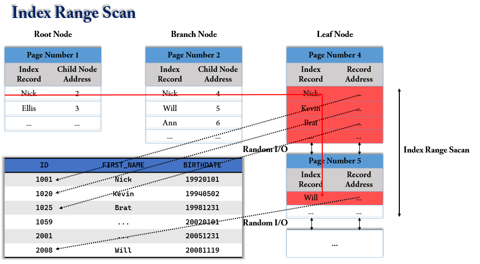

- 루트 노드 -> 브랜치 노드 -> 리프 노드 순으로 탐색
- 리프 노드에서 시작할 지점을 찾으면, 그 다음부터는 리프 노드의 레코드만 순서대로 읽으면 된다.
- 리프 노드의 끝까지 읽으면 리프 노드간의 링크를 통해 다음 리프 노드를 찾아서 스캔한다. 
- 최종적으로 스캔 종료 지점을 찾으면 지금까지 읽은 레코드를 사용자에게 반환하고 쿼리를 종료한다.
    - 데이터 파일에서 레코드를 읽어올 때 레코드 한건마다 `랜덤I/O`가 발생한다.
    - 그래서 인덱스를 통해 데이터를 읽는 작업은 비용이 많이 든다고 하는 것이다.
    - 인덱스를 통해 읽어야 할 데이터가 전체의 20%~25%를 넘으면 인덱스를 사용하지 않고 `테이블 스캔 방식`이 더 효율적인 처리 방식이 된다. 
- 인덱스 레인지 스캔은 MYSQL에서 실행계획을 볼때 `range`로 나와있다. 
- 주로, `<, >, IS NULL, BETWEEN, IN, LIKE` 등의 연산을 이용하여 인덱스를 검색할 때 사용된다.
- 보통, DBA 랑 얘기할 때 `const, ref, range `접근 방법을 구분해서 얘기하는 경우는 거의 없고 이 세가지를 통틀어서 인덱스 레인지 스캔 또는 레인지 스캔이라고 말하는 경우가 많다고 한다.
- Index Range Scan 을 사용하려면 선두 컬럼을 가공하지 않은 상태로 조건절에 사용해야 한다.

### 인덱스 풀 스캔
>테이블에 포함된 레코드를 처음부터 끝까지 읽어들인다. 

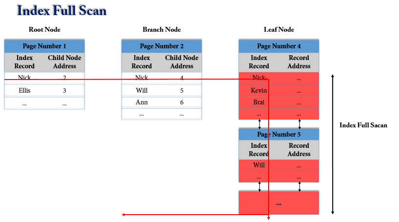

- 인덱스 풀 스캔은 **인덱스의 처음부터 끝까지 모두 읽는 방식**을 말한다. 
    - 대표적으로 쿼리의 조건절에 사용된 컬럼이 인덱스의 첫번째 컬럼이 아닌 경우 인덱스 풀 스캔 방식을 사용한다.
- 수직적 탐색 없이 **인덱스 리프 블록을 처음부터 끝까지 수평적으로 탐색하는 방식**
- 인덱스의 크기는 테이블의 크기보다 훨씬 작기 때문에 테이블 풀 스캔보다 빠른 방식이다.
- 최적의 인덱스가 없을 때 차선으로 선택
- 인덱스 선두 컬럼이 조건절에 없으면 Table Full Scan을 고려하나, Table Full Scan보다 I/O를 줄일 수 있거나 정렬된 결과를 쉽게 얻을 수 있을 경우 Index Full Scan 선택
- 인덱스를 이용한 sort 연산 대체 : `first_rows`
    - 전체 집합 중 처음 일부만을 빠르게 리턴해야하므로 **옵티마이저는 전략적으로 Index Full Scan 수행**
- 만약 결과 집합이 많을 경우 데이터 읽기를 멈추지 않고 끝까지 fetch한다면 인덱스 스캔이 테이블 스캔보다 불리 : 많은 I/O를 일으키면서 서버 자원을 낭비 초래


### Full Table Scan

테이블에 존재하는 모든 데이터를 읽어가면서 조건에 맞으면 결과로 추출하고 조건에 맞지 않으면 버리는 방식이다. 

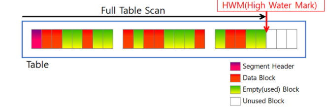
위 그림과 같이 일반적으로 블록들은 서로 인접되어 있기 때문에, Full Table Scan은 한번은 I/O에 여러 블록을 옮겨온다. 
즉 한번의 I/O에 데이터를 다중 블록 단위로 메모리에 가져오기 때문에, row 당 소요되는 입출력 비용이 인덱스 스캔에 비해 적다. 메모리에 옮겨진 블록들은 순차적으로 읽힌다. 


## Index의 분류
**역할별**
- 클러스터 인덱스
    - 테이블의 기본 키(PK)에 대해 적용되는 인덱스
- 비클러스터 인덱스
    - 테이블의 기본 키 외에 다른 컬럼에 적용된 인덱스
- 유니크 인덱스
    - 테이블의 기본 키는 아니지만, 중복을 허용하지 않는 Unique 속성이 들어간 컬럼에 적용된 인덱스
    - 참고로 `클러스터 인덱스`는 `유니크 인덱스 + Not Null` 속성을 띄고있다. 
    - 유니크 인덱스도 한꺼번에 비클러스터 인덱스로 보기도 한다.(기본 키는 아니므로)

**데이터 저장 방식 별**
- B-Tree 인덱스
- R-Tree 인덱스
- Hash 인덱스
- Fractal-Tree 인덱스
- Merge 인덱스

주로 B-Tree, R-Tree, Hash 인덱스를 사용한다. 

**데이터 중복 허용 여부 별**
- 유니크(Unique) 인덱스
- 논 유니크(Non-Unique) 인덱스

**기능 별**
- 전문 검색용 인덱스 
- 공간 검색용 인덱스

하나씩 살펴보자 🤗

## 📌 Clustered Index vs Non- Clustered Index Index 

### (Primary Index vs Secondary Index)
PK 는 우리가 흔히 알고 있는 식별자를 의미한다. 테이블에서 PK 를 생성하면 Index 에 PK 에 관한 인덱스가 생긴것을 볼 수 있다. 즉, PK 는 레코드를 대표하는 컬럼의 값으로 만들어진 인덱스를 의미한다.

PK 를 제외한 나머지의 인덱스들을 Secondary Index 라고 한다

> clustered: 군집화
> clustered index: 군집화 된 인덱스

**클러스터드 인덱스**는 데이터가 테이블에 물리적으로 저장 되는 순서를 정의(설정)한다. 

**클러스터드 인덱스**는 테이블의 **프라이머리 키에 대해서만 적용**되는 내용이다.

데이터가 테이블에 삽입되는 순서에 상관없이 **`Index`로 생성되어 있는 컬럼을 기준으로 정렬**되어 삽입된다. 

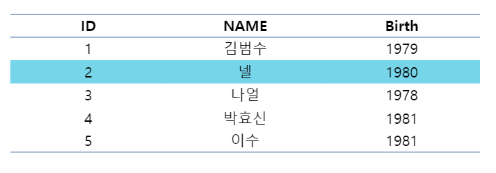

> 순서는 오직 하나의 컬럼으로 결정되기 때문에 중간에 새로운 데이터가 삽입된다면 이후의 모든 컬럼을 한 칸씩 이동시켜줘야한다. index가 군집화 되어있기 때문이다.

클러스터드 인덱스에서는 **프라이머리 키 값**에 의해 **레코드의 저장 위치가 결정**되며 프라이머리 키 값이 변경되면 그 레코드의 물리적인 저장 위치 또한 변경되어야 한다. 그렇기 때문에 프라이머리 키를 신중하게 결정하고 클러스터드 인덱스를 사용해야 한다.

**클러스터드 인덱스는 테이블 당 한 개만 생성**할 수 있다. 
    - 프라이머리 키에 대해서만 적용되기 때문이다, 이에 반해 non 클러스터드 인덱스는 테이블 당 여러 개를 생성할 수 있다.

### Clustered Index 구조


Clustered 인덱스의 구조이다. Data Page 의 데이터들이 순차적으로 정렬되어있다. 그리고 Leaf level 과 DataPage가 동일한 구조를 갖는다.

- Clustered Index는 물리적으로 정렬되어 있어 검색 속도가 Non-Clustered Index보다 더 빠르다. 

- 데이터의 입력/수정/삭제 시에도 정렬을 수행하여 입력/수정/삭제 속도는 더 느리다.

### InnoDB 테이블은 어떻게 클러스터 테이블로 구성될까?
1. 프라이머리 키가 있으면 PK 를 클러스터 키로 선택
2. NOT NULL 옵션의 유니크 인덱스 중에서 첫 번째 인덱스를 클러스터 키로 선택
3. 자동으로 유니크한 값을 가지도록 증가되는 컬럼을 내부적으로 추가한 후, 클러스터 키로 선택

따라서, PK 나 Unique Index 가 없으면 내부적으로 생성한 키를 사용하여 클러스터링 되기 때문에 해당 키가 사용자에 노출되지 않으므로, 클러스터링 인덱스의 혜택을 볼 수 없다.

### MySQL 에서 PK 를 인조키로 사용하고 Auto_Increment 를 사용하는 이유

예를들어, PK 가 주민등록번호로 잡혀있다고 해보자.

```sql
@Id
private Long jumin;
```
PK 가 주민등록 번호로 잡게되면 DB 성능 이슈가 생길 수 있다. 

- 클러스터링 인덱스의 특징을 떠올리면 되는데, 클러스터링 인덱스는 PK 의 등록, 변경에 있어 느리다고 하였다. 
- 즉, AUTO_INCREMENT 로 되어있지 않으면 회원의 주민등록번호에 따라서 PK 위치 조정이 빈번하게 일어날 것이기 때문에 성능 이슈가 발생할 수 있다.

따라서, jumin 을 유니크 키로 잡고, PK 를 인조키로 생성하는 것이 좋다.

> 인조키: 인위적으로 부여한 번호로 고유 식별자
> Oracle sequence, Mysql auto Increment라고 보면 된다. 

## Non Clustered Index
**논 클러스터드 인덱스**는 테이블에 저장 된 물리적인 순서에 따라 데이터를 정렬하지 않는다. 
즉, 순서대로 정렬되어 있지 않다.

논 클러스터 형 인덱스는 테이블 데이터와 함께 테이블에 저장되는 것이 아니라 별도의 장소에 저장된다. 

논 클러스터 형의 예시는 아래와 같다. NonClustered 인덱스는 데이터의 행에 독립적이며, 인덱스 키 값과 데이터 행을 가리키는 포인터가 존재한다.


테이블의 ID 키 값과 포인터인 Address를 통해 실제 데이터에 접근한다. 

> id:4에 해당하는 가수 이름을 알고 싶다면 120번지로 이동하고, name을 확인하면 된다. 
> clustered와의 차이는 순차적으로 index가 정렬되었지 않다는 점이다.
> 논 클러스터링 인덱스는 클러스터링 인덱스에 비해서 검색 속도는 느린 반면에, CUD 속도는 빠르다.


### Non-Clustered Index 구조


- B-Tree 의 리프 노드 처럼 노드 자체가 데이터가 아니고, 리프 노드에서는 데이터가 위치하는 주소를 가지고 있는 형태.

- Clustured 구조와는 다르게 Leaf Level과 Data Page가 구분된다. 그리고 Data Page의 데이터는 정렬 되어있지 않다.

### 정리
- Clustered 인덱스는 테이블당 오직 한개만 존재한다. 반면에 Non-Clustered 형은 테이블 당 여러개의 인덱스를 생성할 수 있다.
- Clustered 인덱스는 오직 테이블을 정렬한다. 그러므로 별도의 공간을 필요로하지 않는다. Non-Clustered 인덱스는 저장되는 별도의 공간(약 10%)이 필요하다.
- Clustered 인덱스는 통상적으로 데이터를 찾는데 추가적인 스텝을 거치지 않기 때문에 Non-Clustered 인덱스보다 속도가 빠르다.
- Clustered 인덱스는 데이터를 삽입할 때, 모든 테이블에 존재하는 데이터들의 순서를 유지해야하므로 많은 비용이 발생한다. Non-Clustered는 별도의 공간에 인덱스를 생성해야하기 때문에 추가작업이 필요하다.

----

## 📌저장 방식별 인덱스

## ☘ B-+Tree 인덱스
B-+Tree Index 는 가장 오래전에 도입된 알고리즘이며, 가장 많이 사용되고 있는 인덱스 알고리즘이다.

> 트리의 가장 큰 강점은 데이터 접근 퍼포먼스가 데이터 증가량에 따라서 결코 선형적으로 증가하지 않는다는 점이다.

### B-Tree 구조란?
> B-Tree 의 B 는 Binary 가 아닌 Balanced 를 의미한다.

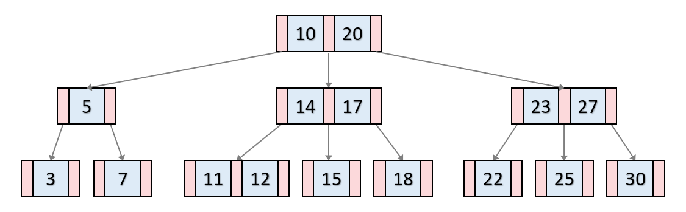

B-Tree는 이진트리와 다르게 하나의 노드에 많은 수의 정보를 가지고 있을 수 있다.
최대 M개의 자식을 가질 수 있는 B Tree를 M차 B-Tree라고 한다. 

`이진 검색 트리`처럼 각 key들의 왼쪽 자식들은 항상 `key`보다 작은 값을, 오른쪽 값은 큰 값을 가진다. 

***key 삽입과정**
📍 **1. 분할이 일어나지 않는 경우**
- 리프 노드가 가득차지 않았다면 오름차순으로 k를 삽입한다.


📍 **2.. 분할이 일어나는 경우**
- 만일 리프노드에 key 노드가 가득 찬 경우, 노드를 분할해야 한다. 

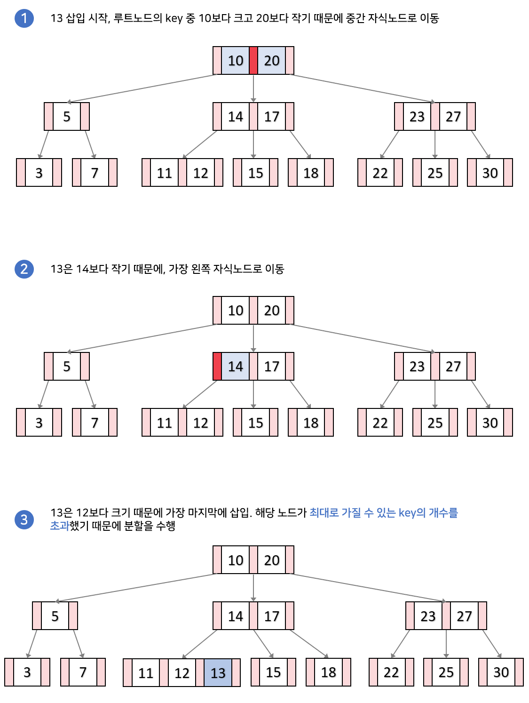

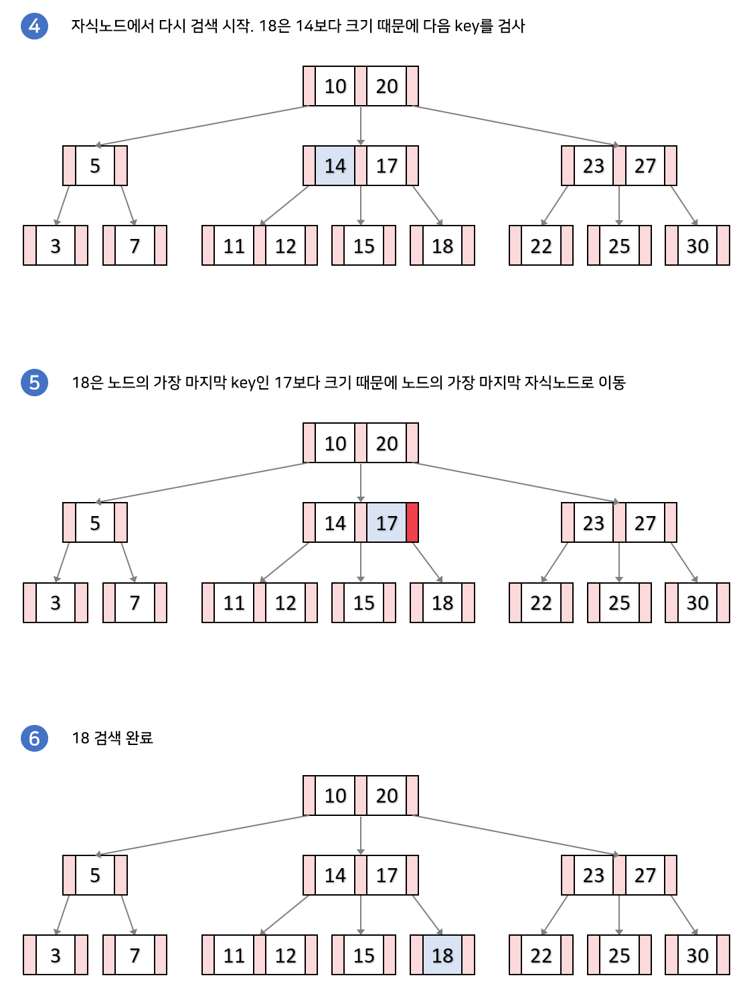

### B+Tree 구조란?
B-Tree 구조와 유사하지만 다른점은 **리프 노드가 연결리스트의 형태**를 띄어 선형 검색이 가능하다는 점이다.

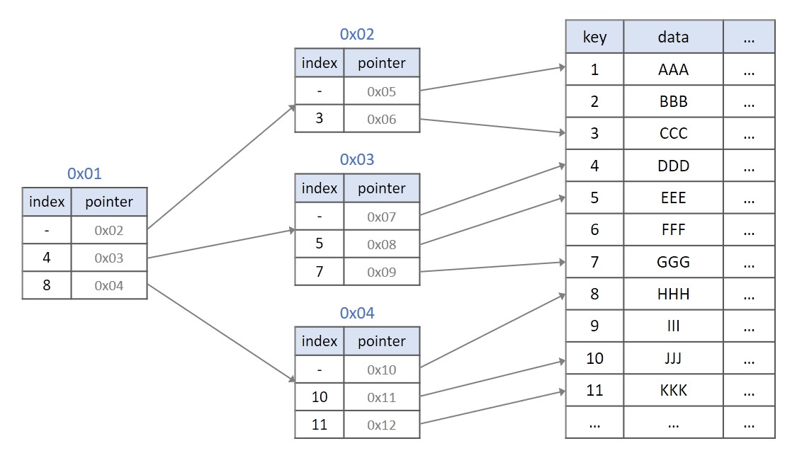
다음과 같은 인덱싱을 `B+Tree`로 나타내면 아래와 같다.

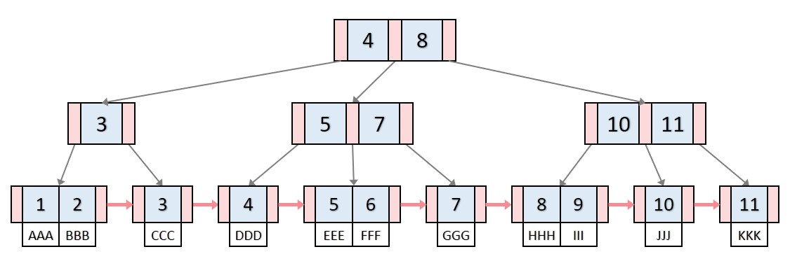

- **모든 key, data가 리프노드에 모여**있습니다. B트리는 리프노드가 아닌 각자 key마다 data를 가진다면, B+트리는 리프 노드에 모든 data를 가집니다.

- **모든 리프노드가 연결리스트의 형태**를 띄고 있습니다. B트리는 옆에있는 리프노드를 검사할 때, 다시 루트노드부터 검사해야 한다면, B+트리는 리프노드에서 선형검사를 수행할 수 있어 시간복잡도가 굉장히 줄어듭니다.

***key 삽입과정**
📍 **1. 분할이 일어나지 않는 경우**
- B-Tree와 동일


📍 **2.. 분할이 일어나는 경우**

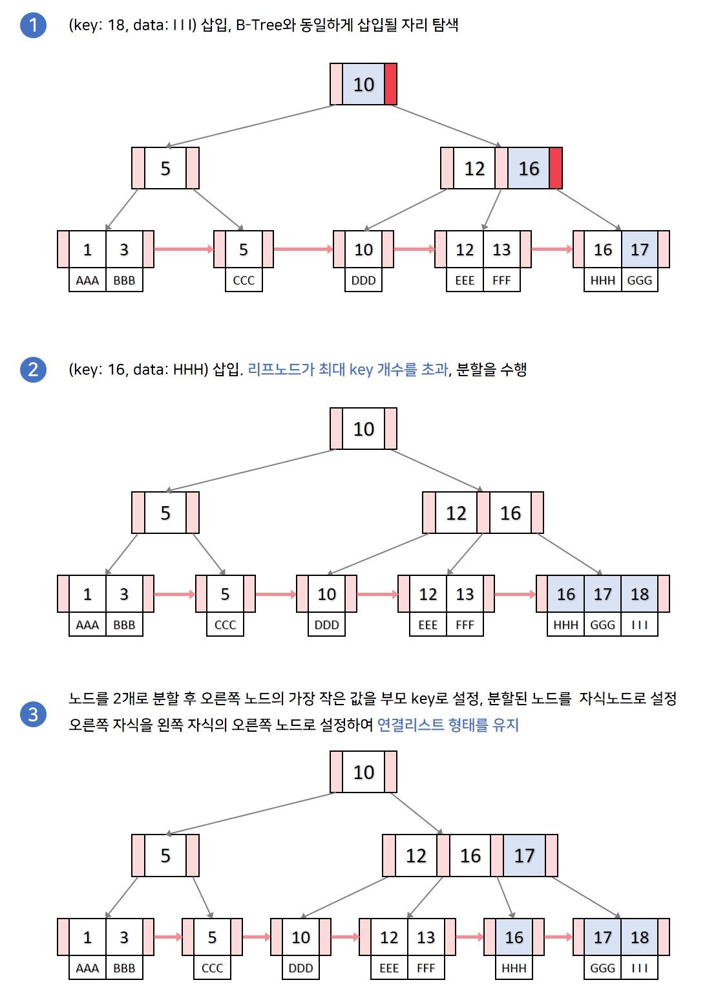

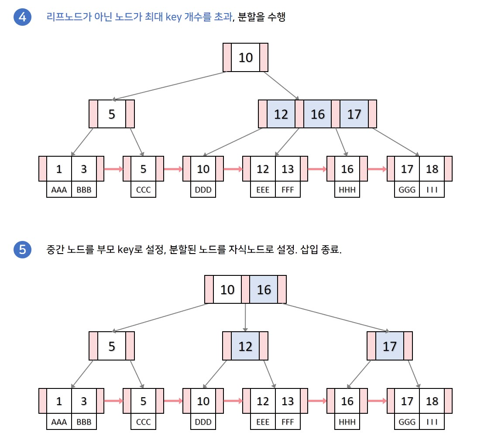

### B+tree의 장점
1. 리프 노드를 제외하고 데이터를 담아두지 않기 때문에 **메모리를 더 확보함**으로써 더 많은 key들을 수용할 수 있다. 하나의 노드에 더 많은 key들을 담을 수 있기에 트리의 높이는 더 낮아진다.(cache hit를 높일 수 있음)

 
2. 풀 스캔 시, B+tree는 **리프 노드에 데이터가 모두 있기 때문에 한 번의 선형탐색만 하면 되기 때문에 B-tree에 비해 빠르다.** B-tree의 경우에는 모든 노드를 확인해야 한다. 
----


- 컬럼의 값을 변경하지 않고, 원래의 값을 이용해 인덱싱하는 알고리즘
- Root Node, Branch Node(중간 노드), Leaf Node로 구성
- 각 노드는 `페이지`를 의미한다.
    - InnoDB에서 페이지란 디스크에 데이터를 저장하는 기본 단위를 의미한다.
    - 페이지 또는 블록이라고 부른다.
    - 디스크의 모든 읽기 및 쓰기 작업의 최소 단위가 된다.
    - InnoDB Buffer Pool에서 데이터를 버퍼링하는 기본 단위이기도 하다.
    - 인덱스도 페이지 단위로 관리된다.
    - 모든 페이지의 크기는 `16KB`로 고정되어 있다.
- Root Node와 Branch Node는 `인덱스 레코드`와 `자식 노드 주소`를 가지고 있으며 Leaf Node는 `인덱스 레코드`와 `레코드 주소`를 가지고 있다.
    - 인덱스 레코드란 First Name이라는 컬럼에 index가 걸려있을 때 해당 인덱스에 대한 레코드 값을 의미한다.


Leaf Node 의 레코드 주소는 실제 테이블에 저장되어 있는 레코드를 가리키게 된다. 
> 레코드 주소는 DBMS 의 종류나 MySQL 의 스토리지 엔진에 따라 달라진다. 
> Oracle 은 물리적인 레코드 주소가 저장되고, MyISAM 은 내부적인 레코드 아이디가 저장되고, InnoDB 는 PK 가 레코드 주소로 사용된다.

```
ID   | FISRT_NAME | LAST NAME | BIRTHDATE ...
1001 | Nick       | Clo       | 19901231  ...
```

그림 처럼 **인덱스의 키값은 정렬**이 되어있는 반면에 **데이터 파일들은 랜덤하게 저장**되어있다. 
- 데이터가 삭제가 되지 않는다면 데이터 파일들에 순차적으로 저장되겠지만, 데이터 삭제가 일어나면 DBMS 는 빈 공간에 다음 INSERT 를 통한 데이터를 저장하게 끔 재활용하도록 설계되기 때문에 항상 INSERT 된 순서로 저장되는 것은 아니다.


### 정리
구분|B-Tree|B+Tree
----|----|----
데이터포인터|모든 내부적인 노드들은 데이터 포인터를 지님|리프 노드에만 데이터 포인터가 존재
시퀀셜 엑세스 탐색 방식|모든 key가 리프노드에 존재하지 않기 때문에 모든 노드를 탐색해야 함|모든 key가 리프노드에 존재하기 때문에 리프 노드 레벨에서 탐색하면 됨
키 중복여부|모든 노드는 서로 다른 key를 지님|부모 노드와 자식 노드가 같은 key를 가질 수 있음
링크드 리스트|존재하지 않음|리프 노드는 링크드 리스트로 연결되어 있음

### 트리 탐색(Tree Traversal)
B-Tree Index 를 이용한 인덱스 탐색 작업은 루트 노트부터 시작하여 브랜치 노드를 거쳐 리프 노드까지 이동하면서 비교 작업을 수행한다. 이러한 과정을 `트리 탐색(Tree traversal)`이라고 한다.

**B-Tree 는 컬럼의 값을 변경하지 않고 원래 값을 이용하므로, 함수나 연산에 의한 결괏값을 이용하여 정렬하거나 검색하는 경우에는 B-Tree 를 사용할 수 없다.**

**예시**

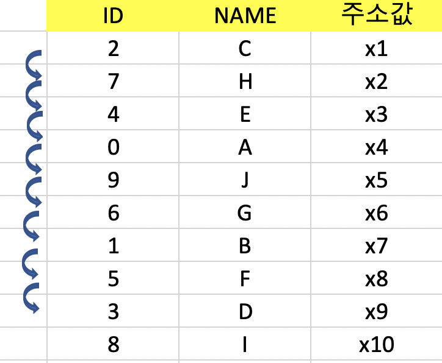

이 테이블에서 인덱스 없이 `ID = 3`을  Search한다면,
가장 윗줄 2번 부터 순차적으로 총 8번의 동작을 가진 후 값을 찾을 수 있을 것이다. 

ID 칼럼을 기준으로 하여 `B-Tree` 인덱스를 만들어 보면

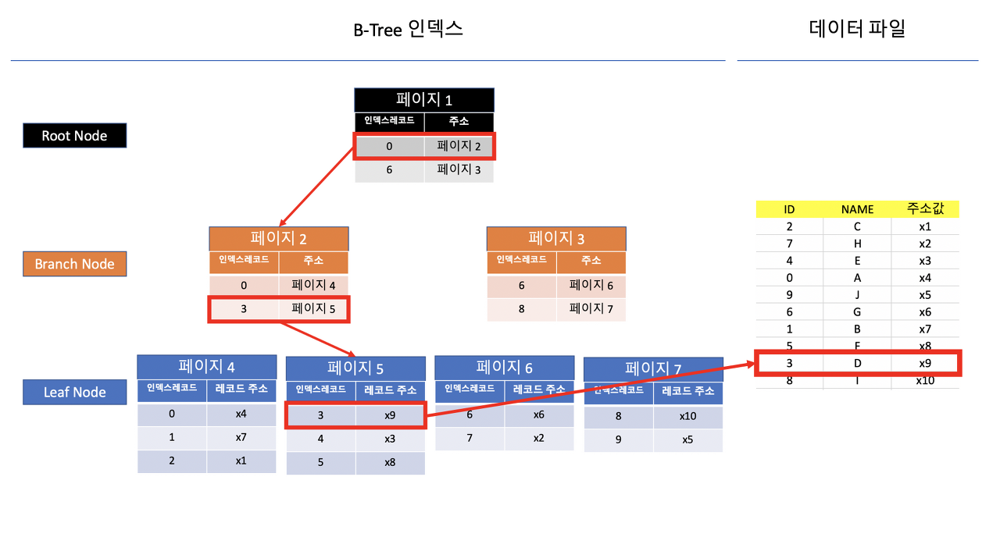

"ID=3"에 대한 정보를 찾는다면, 총 3번의 동작으로 데이터를 찾을 수 있다.
- 데이터베이스에는 인덱스와 실제데이터가 따로 분류되어 저장된다.

- 3을 찾는다고 가정할때, Root Node로 접근하여 인덱스 레코드를 확인한다.
- 인덱스 레코드를 확인하였을 때 0부터 5까지는 페이지 2에 저장되어있다.
- 이제 Branch Node로 내려가서, 페이지 2로 접근한다.
- 페이지 2에서 3부터 5까지는 페이지 5에 저장되어 있는것을 확인한다.
- 이제 Leaf Node로 내려가서 페이지 5로 접근한다.
- Leaf Node에는 다음 페이지로 향하는 길이 없으며, 디스크에 저장되어 있는 주소를 찾아갈 수 있는 주소가 있다.
- Leaf Node에서 '3'을 찾고 레코드 주소 x9을 활용하여 디스크에 있는 데이터 (ID 3, Name D)를 찾아낸다.


> MySQL InnoDB 에서는 데이터 파일에 레코드들이 클러스터되어(Clustered) 디스크에 저장되므로 기본적으로 PK 순서대로 정렬되어 저장된다. DBMS 에서는 클러스터링 기능이 선택사항이지만 InnoDB 에서는 디폴트로 클러스터링 테이블이 생성된다.

### MySQL 에서 B-tree 를 사용하는 이유
MySQL 에서 B-tree 를 사용하는 이유는 B-tree 자체가 데이터가 디스크에 저장될때 사용하도록 설계 되어진 트리이다. 
디스크에 삽입, 삭제, 읽는 시간은 RAM 보다 훨씬 느리다. 데이터베이스의 I/O 는 디스크를 통해 물리적인 작업을 거치기 때문에 대용량의 데이터를 조회할 때에도 성능이 너무 낮아지지 않도록 하는 것이 중요하다.

이진 트리는 최악의 경우 O(N) 을 가진다. 레드 블랙 트리 자체는 효율적이지만 대용량 데이터의 경우 트리의 높이를 제어할 수 없다. 데이터를 조회하기 위해서는 트리 노드 루트 -> 리프 -> 데이터 조회 방식으로 조회되기 때문에 트리의 높이가 높다면 그 만큼 데이터를 조회하는데 시간이 많이 소모된다는 의미가 될 수 있다.

따라서, 데이터베이스 I/O 를 효과적으로 하기 위해서 B-tree 를 사용한다고 볼 수 있다.

### 체인지 버퍼링(Change Buffering)
아래의 그림은 Insert Buffer 의 처리 방식을 나타낸다. 
`B-Tree 인덱스`에 **인덱스 키 추가시 발생하는 동작 과정**을 볼 수 있다.

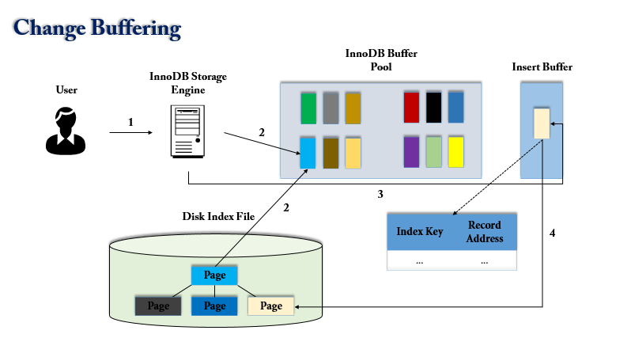

1. 사용자의 쿼리 실행
2. `InnoDB Buffer Pool`에 새로운 키 값을 추가해야할 페이지(B-Tree Leaf Node)가 존재한다면, 즉시 키 추가 작업 처리
3. `InnoDB Buffer Pool`에 페이지가 없다면 `Insert Buffer`에 추가할 키 값과 레코드의 주소를 임시로 기록해두고 작업 완료(사용자의 쿼리는 실행 완료됨)
4. 백그라운드 작업으로 인덱스 페이지를 읽을 때마다 `Insert Buffer`에 **머지해야할 인덱스 키값이 있는지 확인한 후 있으면 머지** (B-Tree에 인덱스 키와 주소를 지정)
5. 데이터베이스 서버 자원의 여유가 생기면 `MySQL 서버의 Insert Buffer Merge Thread`가 조금씩 `Insert Buffer`에 임시 저장된 인덱스 키와 주소 값을 머지시킨다.

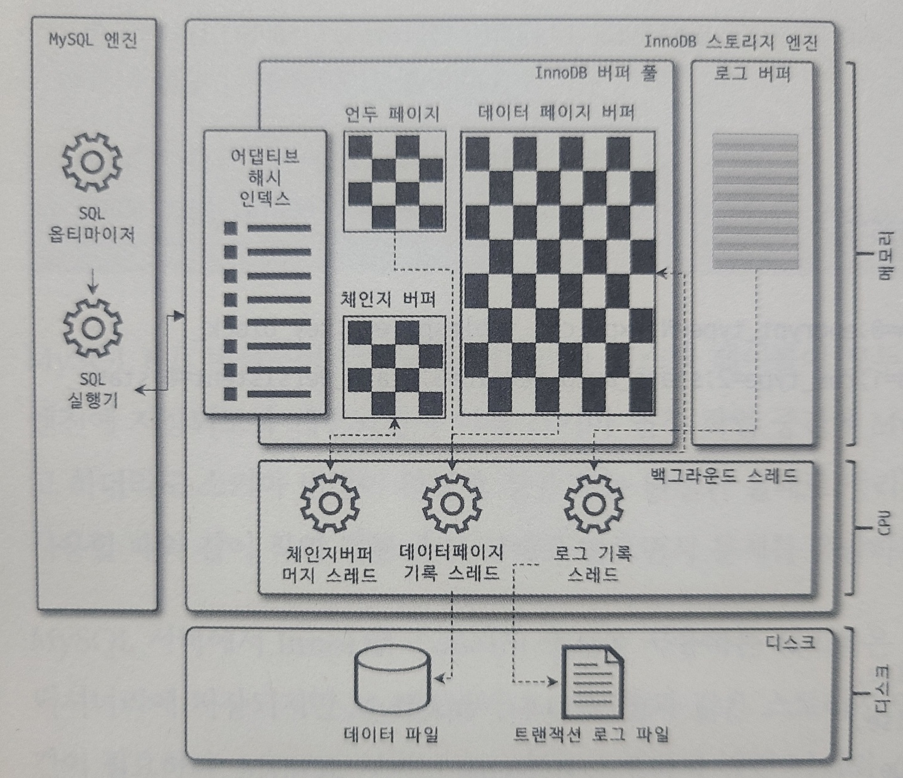

> MySQL 5.1 이하 버전에서는 INSERT 에 의한 인덱스 키 추가 작업 및 버퍼링 지연 처리를 할 수 있었는데 MySQL 5.5 이상 버전 부터 INSERT, DELETE 등 에 의한 작업까지 지원하게 되었다. 따라서 이름도 인서트 버퍼링에서 체인지 버퍼링으로 바뀌었다. MySQL 5.5 이상 버전 부터는 DBA 가 innodb_change_buffering 설정 값을 이용해서 키 추가 작업과 삭제 작업 중 어느것을 먼저 지연 처리할지 설정해야 한다.

## ☘ Hash Index
해시 인덱스는 InnoDB 에서 `어댑티브 해시 인덱스(Adaptive Hash Index)`로 사용되기도 하고, 오라클에서는 조인에 사용된다.

해시 인덱스는 B-Tree 인덱스와 달리 **버켓**으로 구성된다.

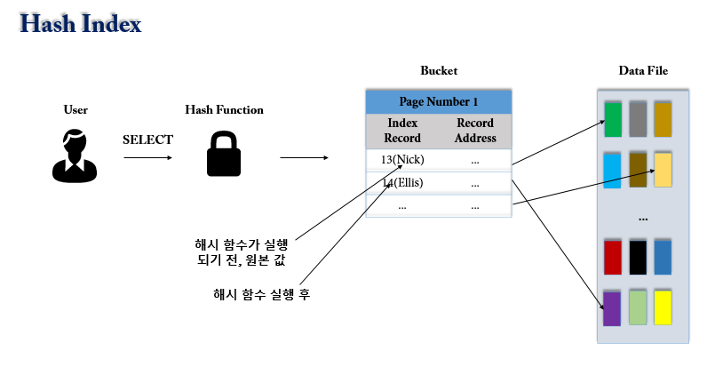

- 사용자가 검색하고자 하는 값을 주면 해시 함수를 거쳐서 찾고자 하는 키값이 포함된 버켓(Bucket)을 알아낼 수 있다. 그리고 그 **버켓 하나만 읽어서 실제 레코드가 저장된 위치를 바로 찾을 수 있다.**
    - 트리 내에서 여러 노드를 읽어야 하지만 레코드의 주소를 알아 낼 수 있는 B-Tree 보다 빠른 결과를 도출할 수 있다.

- Hash index 는 원래의 값을 저장하는 것이 아닌 해시 함수의 결과만을 저장하게 됨에 따라 키 컬럼 값은 4~8바이트 정도로 작은 길이로 줄어 들게 되고 B-Tree 인덱스에 비해 상당히 작은 크기 이다.

- 입력한 값이 다르지만 해시된 값이 같을 경우 **해시 충돌**이 발생할 수 있다.해시 함수의 결과 값의 범위가 좁으면 필요한 버켓의 개수가 적어지게 되면서 충돌할수 있는 확율이 높게 된다. Hash index 에서 충돌이 많이 발생 될 수록 검색 효율이 떨어지게 된다.

### 왜 index 생성 시 b-tree를 사용하는지? hash table이 더 효율적이지 않은지?

- Hash index 는 **동등(equal =) 비교 검색시 사용 및 최적화** 되어 있으며 **범위나 FullText Search 나 정렬된 결과를 가져오는 목적으로는 사용할 수는 없습니다.**
- SELECT 질의 조건에는 부등호 연산(<>)도 포함되기 때문에 부등호 연산 사용 시 문제 발생할 수 있다.


### 레코드 단위 잠금
개별 인덱스 레코드에 S-Lock 혹은 X-Lock을 설정하는 것이다.

테이블에 인덱스가 생성되어 있지 않더라도 테이블 생성시에 함께 생성되는 default Clustered Index의 레코드에 Lock을 걸어, 항상 인덱스 레코드에 Lock을 설정한다.

```SQL
SELECT * FROM a_table WHERE pk=10 LOCK IN SHARE MODE
# pk=10 하나의 레코드에 S-Lock이 걸림
UPDATE a_table SET name="김지원" WHERE id="ji"
# id="ji" 하나의 헤코드에 X-Lock이 걸림
```

- InnoDB Storage Engine 은 레코드 잠금을 수행하여 인덱스를 잠근 후 해당 테이블 레코드들을 잠그는 방식인 레코드 단위 잠금 방식으로 구현되어 있다.
- 따라서, UPDATE 나 DELETE 를 실행할 때 테이블에 적절히 사용할 인덱스가 없다면 많은 레코드들이 잠기게 된다.
    - 경우에 따라서 테이블 풀 스캔을 통해 모든 PK 인덱스가 잠길 수 있다.
- `Mutex Lock` 이 과도하게 잡히면 적은 데이터 셋에도 불구하고 DB 자원 사용 효율이 떨어지게된다.
    - 이러한 현상을 해결하기 위해서 InnoDB 에서는   **Adaptive Hash Index**  라는 기능이 있다.

**예시**
```
User 테이블의 총 레코드 개수는 5000개
성씨 컬럼이 '홍'인 레코드는 300개
성씨 컬럼이 '홍'이고, 이름 컬럼이 '길동'인 레코드는 1개
성씨 컬럼에는 idx_성씨 인덱스가 걸려있음
```

`UPDATE USER SET 취미="축구" WHERE 성씨 = "홍" AND 이름 = "길동"`

`idx_성씨` 인덱스를 사용하고, 레코드 자체를 잠그는 것이 아니라 사용된 인덱스 레코드를 잠그는 것이기 때문에 성이 '홍'인 레코드들이 잠기게 된다. 
    - 이것을 `인덱스 레인지 스캔`이라고 한다.
만약에 `idx_성씨` 인덱스가 없었다고 하면, 자동으로 생성된 PK를 사용하는데 이때 `테이블 풀 스캔`을 하게 되어 검색에 사용된 모든 PK 인덱스가 잠기게 된다. 
만약 성씨와 이름에 대한 복합 인덱스를 생성했더라면 성과 이름이 일치하는 1개의 레코드만 잠기게 되었을 것이다. 

이렇게 인덱스를 어떻게 설정하는지에 따라 레코드의 잠금 범위가 달라지게 되니 innoDB에서는 인덱스를 신중히 설정하는 것이 중요하다. 

### InnoDB Adaptive Hash Index
InnoDB 는 `B-Tree` 를 사용하는데, 락으로 인한 자원 사용 효율이 떨어지는 현상을 해결하기 위해서 `InnoDB Adative Hash Index` 기능을 도입한다.

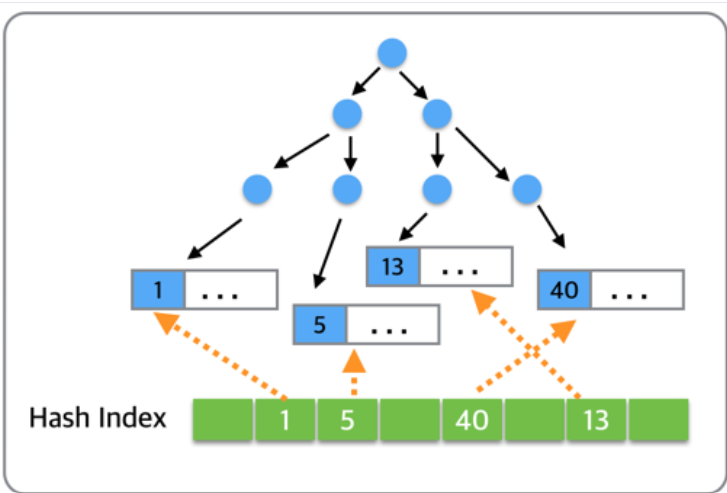

- `InnoDB Adaptive Hash Index`는 Hash Index 로 구현되어있으며, Adaptive 라는 단어에서 예상할 수 있듯이, 모든 값들이 해시로 생성되는 것이 아니라, **자주 사용되는 데이터 값만 내부적으로 판단하여 상황에 맞게 해시 값을 생성**한다.

- `Adative Hash Index`에 할당되는 메모리는 전체 `Innodb_Buffer_Pool_Size `의 `1/64` 만큼으로 초기화된다.

- 자주 사용되는 자원을 해시를 통해서 직접 접근하기 때문에, 내부적인 락(이를테면 Mutex)으로 인한 지연이 줄어든다. 
- 게다가 B-Tree의 데이터 접근 비용(O(LogN))에 비해, 해시 데이터 접근 비용인 O(1)으로 굉장히 빠른 속도로 데이터 처리가 가능하다. 
- 단 자주 사용되는 자원 만을 해시로 생성하기 때문에, SELECT로 인하여 반드시 해당 자원을 향한 직접적인 해시 값이 만들어지지 않는다.

이 기능은 껏다 켰다 할 수 있다.
`켜기`
- set global innodb_adaptive_hash_index = 1;
`끄기`
- set global innodb_adaptive_hash_index = 0;
`통계 정보 확인하기`
- show global status like 'Innodb_adaptive_hash%';


> Adaptive Hash Index를 사용하지 않는 경우 CPU가 100% 였으나, Adaptive Hash Index를 사용한 이후에는 60% 정도로 사용률이 내려갔다.

### 주의 사항
빈번한 데이터 접근이 많은 환경에서는 대단히 효율이 좋은 결과를 나타내었다. 그러나, 주의를 해야할 점은 오래된 테이블인 경우에도 해시가 여전히 메모리에 남아있을 수 있으며, 이에 대한 제어는 불가하다.

### 결론
InnoDB Adaptive Hash Index는 B-Tree의 한계를 보완할 수 있는 좋은 기능이다.

특히 단일 랜덤 키 접근이 빈도있게 발생하는 경우라면, B-Tree 를 통하지 않고 데이터에 접근/처리가 가능하기에 좋은 퍼포먼스를 보인다.

그러나, 자주 사용되는 데이터를 옵티마이저가 판단하여 해시 키로 만들기 때문에 제어가 어려우며, 수 개월 동안 사용되지 않던 테이블일지라도 기존 해시 자료 구조에 데이터가 남아 있게 되면, 테이블 Drop 시 영향을 줄 수 있다. 해시 인덱스에 의존하여 트래픽이 주로 처리되는 서비스인 경우 이런 점을 염두해 두고 사용을 한다.

----
## 📌 Multi Column Index
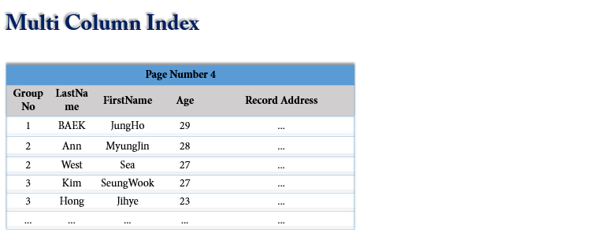

다중 컬럼 인덱스를 사용할 경우 리프 노드에서 인덱스 레코드가 어떻게 정렬될까?

```sql
-- 인덱스 생성
create index member_info_idx on member(groupno, lastname, firstname, age);
```

- 두번째 컬럼은 첫번째 컬럼 정렬에 의존하고, 세번째 컬럼은 두번째 컬럼에 의존한다.
- JiHye의 Age가 더 빠르더라도(숫자 값이 낮다는 의미) 첫 번째 컬럼의 정렬 순서가 운선순위가 되기 때문에 맨 마지막에 위치하게 된다. 

따라서, `다중 컬럼 인덱스`를 생성할때 컬럼의 위치(순서)가 상당히 중요하기 때문에 신중하게 결정해야 한다.

**인덱스 정렬 및 스캔 방향**
인덱스 키값은 항상 오름차순으로 정렬된다. 그리고 인덱스를 아래 부터 읽을지 위에서 부터 읽을지 정하는 것은, 쿼리에 따라서 옵티마이저가 실행 계획을 만들어 그 계획에 따라 결정된다.

## 📌Unique vs Non-Unique
데이터의 중복 허용 여부로 구분하면 유니크 인덱스와 유니크 하지 않은 인덱스로 나눌 수 있다.

인덱스가 유니크한지 아닌지는 DBMS 의 쿼리를 실행해야 하는 옵티마이저한테 중요하다. 

**값이 유니크 하면** **유니크 인덱스에 대해 동등 조건(Equal, =)으로 검색한다는 것**을 **옵티마이저**에게 알려줄 수 있다.

> 동등 조건(Equal, =)으로 검색한다는 것 : 항상 1건의 레코드만 찾으면 더 이상 찾지 않아도 된다는 의미

### 유니크 인덱스 vs 세컨더리 인덱스
- 유니크한 세컨더리 인덱스는 결국 유니크 인덱스가 된다.
- 유니크 인덱스와 유니크하지 않은 세컨더리 인덱스는 구조 상 차이가 없다.

**인덱스 쓰기**

- 유니크 인덱스의 키 값을 쓸 때는 중복된 값이 있는지 없는지 체크하는 과정이 필요하다.
    - MySQL에서는 중복된 값을 체크할 때는 읽기 잠금을 사용하고, 값 쓰기를 할 때는 쓰기 잠금을 사용하여 데드락이 빈번히 발생한다.
- 따라서 세컨더리 인덱스보다 유니크 인덱스가 쓰기 작업에서는 성능 상 느리다.

> **유니크 인덱스 사용 시 주의 사항**
> 유일성이 꼭 보장되어야 하는 작업에 대해서는 유니크 인덱스를 생성하되, 꼭 필요하지 않다면 유니크 인덱스보다는 세컨더리 인덱스를 사용하는 것을 권장한다.


## Hint
Hint 란, SQL 문장에 특별한 키워드를 지정하여 옵티마이저에게 어떻게 데이터를 읽는 것이 효과적인지 알려주는 키워드를 의미한다.

MySQL 에서는 실제로 쿼리의 성능 개선을 위해 자주 사용되는 것이 4 ~ 5개 정도라고 한다. Hint 는 옵티마이저에게 영향을 미친다. 따라서 Hint 를 잘못 사용하면 옵티마이저가 SQL 을 알아서 최적화 해주는 것을 본인이 망치는 셈이 될 수도 있다.

**사용 방법**
- SQL 문장의 일부로 사용하는 방식
    - SELECT * FROM member USE INDEX (PRIMARY) WHERE id = 1001;
- 주석 표기 방식
    - SELECT * FROM member /*! USE INDEX (PRIMARY) */ WHERE id = 1001;

Oracle 과 같은 다른 DBMS 들은 Hint 를 주석으로 해석하는데, MySQL 은 SQL 의 일부로 해석하기 때문에 잘 못 사용하면 에러가 발생한다.

# 출처
[buffer pool](https://myinfrabox.tistory.com/46)

[clusteredIndex](https://gwang920.github.io/database/clusterednonclustered/)

[10분 테코톡-올라프의 Clustered vs Non-clustered Index](https://www.youtube.com/watch?v=js4y5VDknfA)

[10분 데코톡-안돌의 Index](https://www.youtube.com/watch?v=NkZ6r6z2pBg)

[btree](https://github.com/NKLCWDT/cs/blob/main/Database/Index%2C%20Hint.md)

[b+tree](https://zorba91.tistory.com/293)

[btree](https://velog.io/@emplam27/%EC%9E%90%EB%A3%8C%EA%B5%AC%EC%A1%B0-%EA%B7%B8%EB%A6%BC%EC%9C%BC%EB%A1%9C-%EC%95%8C%EC%95%84%EB%B3%B4%EB%8A%94-B-Tree)

[adaptive hash index](https://tech.kakao.com/2016/04/07/innodb-adaptive-hash-index/)

# 면접 예상 질문

> 인덱스란 무엇인가요?

> 인덱스의 장점과 단점에는 무엇이 있나요?

> 인덱스의 자료구조는 어떤 것을 사용하나요?

> 인덱스를 사용하면 좋을 경우와 나쁠 경우에 대해 설명해 주세요

> 클러스터드 인덱스/넌클러스터드 인덱스란 무엇이고 장점은 무엇인가?

> 인덱스를 쓰면 좋을 경우와 안좋을 경우에는 무엇이 있을까요?