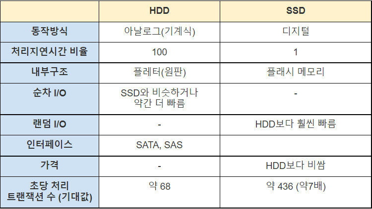
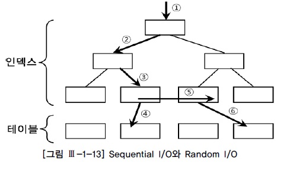
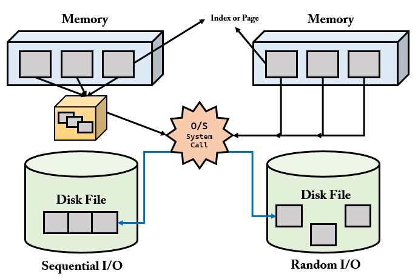
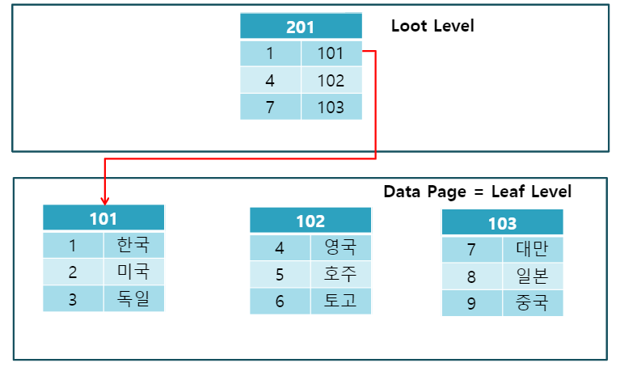
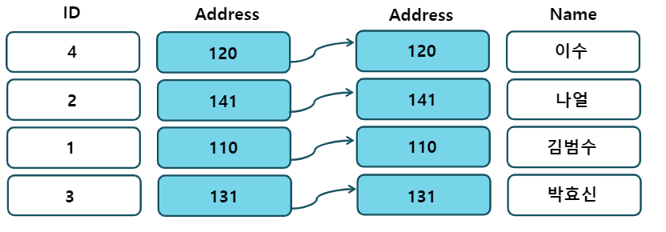
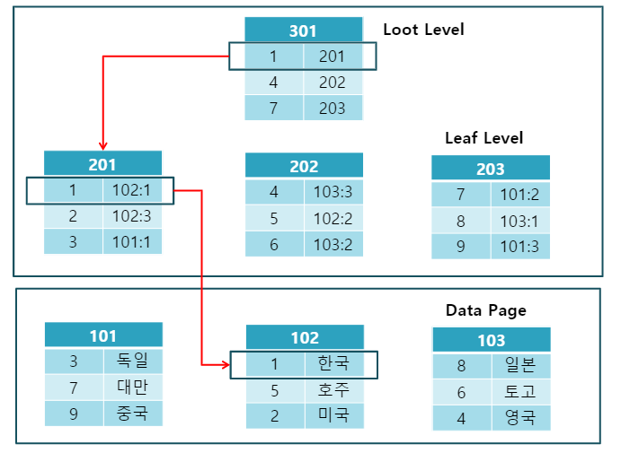
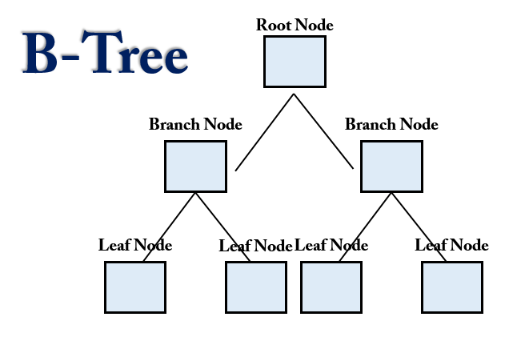
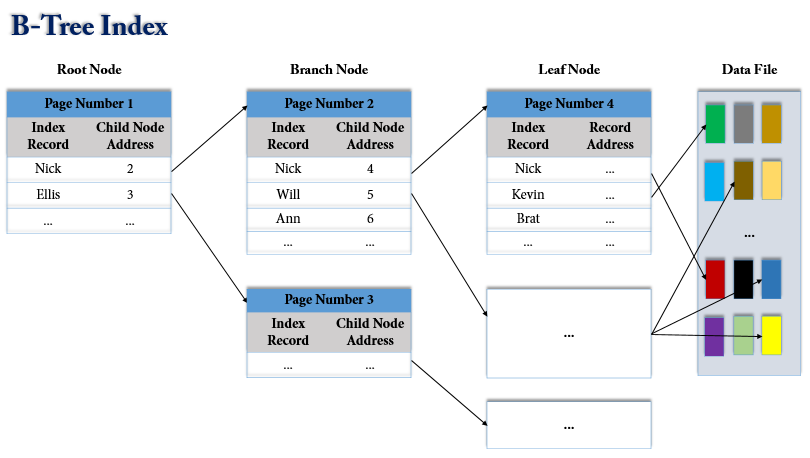

# Index 

> 순차 I/O, 랜덤 I/O

> 클러스터링 인덱스, 논 클러스터링 인덱스

> B-Tree Index, Hash Index, InnoDB Adaptive Hash Index


## 디스크 읽기 방식
## 하드 디스크 드라이브(HDD)와 솔리드 스테이트 드라이브(SSD)
컴퓨터 대부분의 주요 장치(CPU, RAM 등)은 대부분 디지털 방식이지만, HDD는 아날로그 방식의 장치이다. 디지털 방식으로 동작하는 주요 장치 간의 데이터 소통은 굉장히 빠른데, HDD만 그 페이스에 맞추지 못하는 상황이 발생하게 된다. 그래서 DB에서 디스크 장치는 항상 병목이 되어 느려지는 현상이 빈번하다. 이러한 기계식 디스크 드라이브를 대체하기 위해 나온 것이 SSD(SolidStateDrive)이다.



순차 I/O의 경우 SSD와 HDD가 비슷한 성능을 보일 수 있지만, 랜덤 I/O의 경우 SSD가 훨씬 성능이 좋다. 데이터베이스 서버에서 순차 I/O 작업은 그다지 비중이 크지 않고 랜덤 I/O를 통해 작은 데이터를 읽고 쓰는 작업이 많아서 SSD가 일반적으로 DBMS에 적합하다고 볼 수 있다. (특히 웹 서비스 환경)

## 랜덤 I/O와 순차 I/O
기본적으로 디스크 드라이브는 데이터를 읽을 때 원판 플래터를 회전하며 데이터를 찾는다. 

- **순차 I/O**는 논리적/물리적 순서를 따라 차례대로 데이터를 읽어 나가는 방식
- **랜덤 I/O**는 논리적/물리적 순서를 따르지 않고 한 건의 데이터를 읽기 위해 한 블록씩 접근하는 방식



위의 예제에서 `5번`만 **순차I/O**이고 나머지는 **랜덤 I/O**에 해당한다. 5번은 논리적/물리적으로 한 방향으로 연속하게 데이터를 읽어 들이지만, 나머지는 연속하지 않은 방향으로 한 블록씩 데이터를 읽어 들이고 있다. 

** 구체적인 동작 과정**


- **순차I/O**는 3개의 페이지를 디스크에 기록하기 위해 한번의 시스템 콜을 요청
 - **랜던I/O**는 세 번을 요청

 즉 디스크에 기록할 위치를 찾기 위해 **순차 I/O**는 **디스크 헤더**를 1번 움직였고, **랜덤 I/O**는 3번 움직였다. 

 디스크에 데이터를 쓰고 읽는 데 걸리는 시간은 디스크 헤더를 움직여서 읽고 쓸 위치로 옮기는 단계에서 결정된다. 따라서 위 경우 `순차 I/O` 가 `랜덤 I/O` 보다 세 배가량 빠르다고 볼 수 있다.

일반적으로 **쿼리 튜닝**은 쿼리를 처리하는 데 꼭 필요한 데이터만 읽도록 **쿼리를 개선**하여 **랜덤 I/O 작업을 줄이는 것이 목적**이다. 순차 I/O로 바꿔서 실행할 방법이 적기 때문이다.

참고로 **인덱스 레인지 스캔**은 `랜덤 I/O`를 사용하며, **풀 테이블 스캔**은` 순차 I/O`를 사용한다. 그래서 매우 큰 테이블의 레코드를 읽을 때는 풀 테이블 스캔을 사용한다. (ex. 데이터 웨어 하우스, 통계 작업)

데이터베이스에서는 대부분 데이터를 빈번하게 읽고 쓰기 때문에, **랜덤 I/O** 의 부하를 줄여주고자 MySQL 에서는 `InnoDB 버퍼 풀` 등의 기능이 내장된 것이다.

> Buffer Pool

버퍼 풀은 InnoDB가 액세스 할 때 테이블 및 인덱스 데이터를 캐시하는 메인 메모리 영역이다. 버퍼풀은 자주 사용하는 데이터를 메모리에서 직접 처리할 수 있게하여 처리 속도를 높인다 전용 서버에서 실제 메모리의 최대 80% 정도가 버퍼풀에 할당된다.

대량 읽기 조작의 효율성을 위해 버퍼 풀은 여러 행을 보유할 수 있는 페이지로 분할된다. 캐시 관리 효율성을 위해 버퍼풀은 링크된 페이지 목록으로 구현된다. 거의 사용되지 않는 데이터는 다양한 LRU 알고리즘을 사용하여 캐시에서 종료(혹은 만료:aged out)된다.

버퍼 풀을 활용하여 자주 액세스하는 데이터를 메모리에 유지하는 노하우(기술)은 MySQL튜닝의 중요한 측면이다.


- head:  최근에 접근된 (young) 페이지들의 리스트를 가리킨다.
- tail: 접근 시기가 가장 오래된 (old) 페이지를 가리킨다.
- 사용자 쿼리에서 가장 자주 접근 되는 데이터 페이지들을 new sublist에 보관한다. old sublist에는 잘 접근 되지 않은 데이터를 저장하며, 이후에 eviction 대상으로 선정된다.
- 버퍼 풀의 3/8 은 old sublist로 사용된다.
- 버퍼 풀 전체의 midpoint는 new sublist의 tail과 old sublist의 head가 만나는 지점이다.

## 인덱스란?
`인덱스`는 DBMS의 **저장 성능**을 희생하고 **검색 성능**을 높이기 위해 만들어진 자료 구조이다. 

> 인덱스의 목적
RDBMS의 검색 속도를 높이는데 있다.
- DELETE, INSERT, UPDATE 쿼리에는 해당 사항이 없으며 index 사용 시 오히려 좀 느려진다. 

### Index의 원리
Index를 해당 컬러에 주게 되면 초기 Table 생성시, `FRM`,`MYD`,`MYI` 3개의 파일이 만들어진다.

- FRKM: 테이블 구조가 저장되어 있는 파일
- MYD: 실제 데이터가 있는 파일
- MYI: Index 정보가 들어있는 파일

index를 사용하지 않는 경우, `MYI` 파일은 비어져 있다.
그러나 index를 해당 컬럼에 만들게 되면 해당 컬럼을 따로 인덱싱하여 `MYI` 파일에 입력한다. 

이후에 사용자가 `SELECT` 쿼리로 index를 사용하는 쿼리를 사용 시 해당 Table을 검색하는 것이 아니라 `MYI` 파일의 내용을 검색한다.

만약, index를 사용하지 않은 `SELECT` 쿼리라면 해당 Table Full Scan하여 모두 검색한다.

이는 책 뒷 부분에 <찾아보기>와 같은 의미로 정리해둔 단어 중에서 원하는 단어를 찾아서 페이지 수를 보고 쉽게 찾을 수 있는 개념과 같다. 만약 이 <찾아보기>가 없다면 처음부터 끝까지 모든 페이지를 보고 찾아와야할 것이다. 

## Index의 장점
- 키 값을 기초로 하여 테이블에서 검색과 정렬 속도를 향상시킨다.
- 인덱스를 사용하면 테이블 행의 고유성을 강화시킬 수 있다.
- 전반적인 시스템의 부하를 줄일 수 있다.

## Index의 단점
- 인덱스를 만들면 .mdb 파일 크기가 늘어난다.
- 사용자가 한 페이지를 동시에 수정할 수 있는 병행성이 줄어든다.
- 인덱스된 필드에서 데이터를 업데이트(`UPDATE`)하거나 레코드를 추가(`INSERT`) 또는 삭제(`DELETE`) 할 때 성능이 떨어진다. 
    - 만약 INSER, DELETE, UPDATE가 빈번한 속성에 인덱스를 걸게 되면 인덱스의 크기가 비대해져서 성능이 떨어진다.
    - 만약 어떤 테이블에 UPDATE와 DELETE가 빈번하게 발생한다면 실제 데이터는 10만 건이지만, 인덱스는 100만 건이 넘어가게 되어 SQL문 처리 시 비대해진 인덱스에 의해 오히려 성능이 떨어지게 되는 것이다.
- 인덱스가 데이터베이스 공간을 차지해 추가적인 공간이 필요해진다. (데이터베이스의 10% 내외의 공간이 추가로 필요)
- 인덱스를 생성하는데 시간이 많이 소요될 수 있다.
- 데이터 변경 작업이 자주 일어날 경우에 인덱스를 재작성해야 할 필요가 있기에 성능에 영향을 끼칠 수 있다. 

따라서 어느 필드를 인덱스해야 하는지 미리 시험해보고 결정하는 것이 좋다. 인덱스를 추가하면 쿼리 속도가 1초 정도 빨라지지만, 데이터 행을 추가하는 속도는 2초 정도 느려지게 되어 여러 사용자가 사용하는 경우, 레코드 잠금 문제가 발생할 수 있다.

또, 다른 필드에 대한 인덱스를 만들게 되면 성능이 별로 향상되지 않을 수도 있다. 예를 들어, 테이블에 회사 이름 필드와 성 필드가 이미 인덱스된 경우에 우편 번호를 필드로 추가해 인덱스에 포함해도 성능이 거의 향상되지 않는다. 만드는 쿼리의 종류와 관계 없이 가장 고유한 값을 갖는 필드만 인덱스해야 한다.

### 사용하면 좋은 경우
- 규모가 작지 않은 테이블
- `INSERT`, `UPDATE`, `DELETE`가 자주 발생하지 않은 Column
- `WHERE` 절에서 자주 사용되는 Column
- `외래키`가 사용되는 Column
- `Join`에 자주 사용되는 Column
- 데이터의 중복도가 낮은 컬럼 (카디널리티가 높은 컬럼)
    - 예를 들어 성별이라는 컬럼이 있다고 하자. (성별은 남자와 여자만 있다고 가정)
    - 이때 성별에 인덱스를 걸어 봤자 탐색할 수 있는 값이 2개 밖에 없으므로 하나의 성별이 붙은 데이터를 검색하는 데 재수 없으면 Full Scan을 할 수도 있다.
    - 또한, 인덱스는 내부적으로 Key, Value의 트리 형태로 데이터를 저장하는데, Key가 중복되어 여러 개 존재하면 검색할 대상이 증가한다.
    - 이러한 이유로 데이터의 중복도가 낮아서 분포도가 높은 컬럼에 대해 인덱스를 사용해야 한다.
### 사용을 피해야 하는 경우
- Data 중복도가 높은 Column
- `DML`이 자주 일어나는 Column

## DML에 취약
> INSERT: 새로운 데이터에 대한 인덱스를 추가함
> DELETE: 삭제하는 데이터의 인덱스를 사용하지 않는다는 작업을 진행함
> UPDATE: 기존의 인덱스를 사용하지 않음 처리하고, 갱신된 데이터에 대해 인덱스를 추가함

1. `INSERT`
- **indext split** : 인덱스의 Block들이 하나에서 두개로 나누어지는 현상.
- 인덱스는 데이터가 순서대로 정렬되어야 한다. 기존 블록에 여유 공간이 없는 상황에서 그 블록에 새로운 데이터가 입력되어야 할 경우, 오라클이 기존 블록의 내용 중 일부를 새 블록에다가 기록한 후, 기존 블록에 빈 공간을 만들어서 새로운 데이터를 추가하게 된다.
- 성능면에서 매우 불리하다.
    - Index split은 새로운 블록을 할당받고 Key를 옮기는 복잡한 작업을 수행한다. 모든 수행 과정이 Redo에 기록되고 많은 양의 Redo를 유발한다.
    - Index split이 이루어지는 동안 해당 블록에 대해 키 값이 변경되면 안되므로 DML이 블로킹된다.

2. `DELETE`
- 테이블에서 데이터가 Delete될 경우, 지워지고 다른 데이터가 그 공간을 사용할 수 있다.
- index에서 데이터가 delete될 경우, 데이터가 지워지지 않고 사용 안됨 표시만 해둔다.
- 즉, 테이블에 데이터가 1만건 있는 경우, 인덱스에는 2만건이 있을 수 있다는 뜻이다.
- 인덱스를 사용해도 수행 속도를 기대하기 힘들다.

3. `UPDATE`
- 인덱스에는 Update 개념이 없다.
- 테이블에 update가 발생할 경우, 인덱스에서는 delete가 먼저 발생한 후 새로운 작업의 insert 작업이 발생한다.
- delete와 insert 두 개의 작업이 인덱스에서 동시에 일어나 다른 DML보다 더 큰 부하를 주게 된다

## Index의 분류
**역할별**
- 클러스터 인덱스
    - 테이블의 기본 키(PK)에 대해 적용되는 인덱스
- 비클러스터 인덱스
    - 테이블의 기본 키 외에 다른 컬럼에 적용된 인덱스
- 유니크 인덱스
    - 테이블의 기본 키는 아니지만, 중복을 허용하지 않는 Unique 속성이 들어간 컬럼에 적용된 인덱스
    - 참고로 `클러스터 인덱스`는 `유니크 인덱스 + Not Null` 속성을 띄고있다. 
    - 유니크 인덱스도 한꺼번에 비클러스터 인덱스로 보기도 한다.(기본 키는 아니므로)

**데이터 저장 방식 별**
- B-Tree 인덱스
- R-Tree 인덱스
- Hash 인덱스
- Fractal-Tree 인덱스
- Merge 인덱스

주로 B-Tree, R-Tree, Hash 인덱스를 사용한다. 

**데이터 중복 허용 여부 별**
- 유니크(Unique) 인덱스
- 논 유니크(Non-Unique) 인덱스

**기능 별**
- 전문 검색용 인덱스 
- 공간 검색용 인덱스

하나씩 살펴보자 🤗

## 📌 Clustered Index vs Non- Clustered Index Index (Primary Index vs Secondary Index)

> clustered: 군집화
> clustered index: 군집화 된 인덱스

**클러스터드 인덱스**는 데이터가 테이블에 물리적으로 저장 되는 순서를 정의(설정)한다. 

데이터가 테이블에 삽입되는 순서에 상관없이 **`Index`로 생성되어 있는 컬럼을 기준으로 정렬**되어 삽입된다.

**클러스터드 인덱스**는 테이블의 **프라이머리 키에 대해서만 적용**되는 내용이다. 


순서는 오직 하나의 컬럼으로 결정되기 때문에 중간에 새로운 데이터가 삽입된다면 이후의 모든 컬럼을 한 칸씩 이동시켜줘야한다. index가 군집화 되어있기 때문이다.

클러스터드 인덱스에서는 **프라이머리 키 값**에 의해 **레코드의 저장 위치가 결정**되며 프라이머리 키 값이 변경되면 그 레코드의 물리적인 저장 위치 또한 변경되어야 한다. 그렇기 때문에 프라이머리 키를 신중하게 결정하고 클러스터드 인덱스를 사용해야 한다.

**클러스터드 인덱스는 테이블 당 한 개만 생성**할 수 있다. 프라이머리 키에 대해서만 적용되기 때문이다, 이에 반해 non 클러스터드 인덱스는 테이블 당 여러 개를 생성할 수 있다.

### Clustered Index 구조


Clustered 인덱스의 구조이다. Data Page 의 데이터들이 순차적으로 정렬되어있다. 그리고 Leaf level 과 DataPage가 동일한 구조를 갖는다.

- Clustered Index는 물리적으로 정렬되어 있어 검색 속도가 Non-Clustered Index보다 더 빠르다. 

- 데이터의 입력/수정/삭제 시에도 정렬을 수행하여 입력/수정/삭제 속도는 더 느리다.

## Non Clustered Index
**논 클러스터드 인덱스**는 테이블에 저장 된 물리적인 순서에 따라 데이터를 정렬하지 않는다. 
즉, 순서대로 정렬되어 있지 않다.

논 클러스터 형 인덱스는 테이블 데이터와 함께 테이블에 저장되는 것이 아니라 별도의 장소에 저장된다. 

논 클러스터 형의 예시는 아래와 같다. NonClustered 인덱스는 데이터의 행에 독립적이며, 인덱스 키 값과 데이터 행을 가리키는 포인터가 존재한다.



테이블의 ID 키 값과 포인터인 Address를 통해 실제 데이터에 접근한다. 

> id:4에 해당하는 가수 이름을 알고 싶다면 120번지로 이동하고, name을 확인하면 된다. 
> clustered와의 차이는 순차적으로 index가 정렬되었지 않다는 점이다.

### Non-Clustered Index 구조


Non-Clustered 인덱스의 구조이다. Clustured 구조와는 다르게 Leaf Level과 Data Page가 구분된다. 그리고 Data Page의 데이터는 정렬 되어있지 않다.

### 정리
- Clustered 인덱스는 테이블당 오직 한개만 존재한다. 반면에 Non-Clustered 형은 테이블 당 여러개의 인덱스를 생성할 수 있다.
- Clustered 인덱스는 오직 테이블을 정렬한다. 그러므로 별도의 공간을 필요로하지 않는다. Non-Clustered 인덱스는 저장되는 별도의 공간(약 10%)이 필요하다.
- Clustered 인덱스는 통상적으로 데이터를 찾는데 추가적인 스텝을 거치지 않기 때문에 Non-Clustered 인덱스보다 속도가 빠르다.
- Clustered 인덱스는 데이터를 삽입할 때, 모든 테이블에 존재하는 데이터들의 순서를 유지해야하므로 많은 비용이 발생한다. Non-Clustered는 별도의 공간에 인덱스를 생성해야하기 때문에 추가작업이 필요하다.

## 📌저장 방식별 인덱스
### B-Tree 인덱스
B-Tree Index 는 가장 오래전에 도입된 알고리즘이며, 가장 많이 사용되고 있는 인덱스 알고리즘이다. 
> B-Tree 의 B 는 Binary 가 아닌 Balanced 를 의미한다.

> 트리의 가장 큰 강점은 데이터 접근 퍼포먼스가 데이터 증가량에 따라서 결코 선형적으로 증가하지 않는다는 점이다.


- 컬럼의 값을 변경하지 않고, 원래의 값을 이용해 인덱싱하는 알고리즘
- Root Node, Branch Node(중간 노드), Leaf Node로 구성
- 각 노드는 `페이지`를 의미한다.
    - InnoDB에서 페이지란 디스크에 데이터를 저장하는 기본 단위를 의미한다.
    - 페이지 또는 블록이라고 부른다.
    - 디스크의 모든 읽기 및 쓰기 작업의 최소 단위가 된다.
    - InnoDB Buffer Pool에서 데이터를 버퍼링하는 기본 단위이기도 하다.
    - 인덱스도 페이지 단위로 관리된다.
    - 모든 페이지의 크기는 `16KB`로 고정되어 있다.
- Root Node와 Branch Node는 `인덱스 레코드`와 `자식 노드 주소`를 가지고 있으며 Leaf Node는 `인덱스 레코드`와 `레코드 주소`를 가지고 있다.
    - 인덱스 레코드란 First Name이라는 컬럼에 index가 걸려있을 때 해당 인덱스에 대한 레코드 값을 의미한다.



Leaf Node 의 레코드 주소는 실제 테이블에 저장되어 있는 레코드를 가리키게 된다. 
> 레코드 주소는 DBMS 의 종류나 MySQL 의 스토리지 엔진에 따라 달라진다. 
> Oracle 은 물리적인 레코드 주소가 저장되고, MyISAM 은 내부적인 레코드 아이디가 저장되고, InnoDB 는 PK 가 레코드 주소로 사용된다.

```
ID   | FISRT_NAME | LAST NAME | BIRTHDATE ...
1001 | Nick       | Clo       | 19901231  ...
```

그림 처럼 인덱스의 키값은 정렬이 되어있는 반면에 데이터 파일들은 랜덤하게 저장되어있다. 데이터가 삭제가 되지 않는다면 데이터 파일들에 순차적으로 저장되겠지만, 데이터 삭제가 일어나면 DBMS 는 빈 공간에 다음 INSERT 를 통한 데이터를 저장하게 끔 재활용하도록 설계되기 때문에 항상 INSERT 된 순서로 저장되는 것은 아니다.

MySQL InnoDB 에서는 데이터 파일에 레코드들이 클러스터되어(Clustered) 디스크에 저장되므로 기본적으로 PK 순서대로 정렬되어 저장된다. DBMS 에서는 클러스터링 기능이 선택사항이지만 InnoDB 에서는 디폴트로 클러스터링 테이블이 생성된다.

> 클러스터링 : 비슷한 값들 끼리 최대한 모아서 저장하는 방식

### MySQL 에서 B-tree 를 사용하는 이유
MySQL 에서 B-tree 를 사용하는 이유는 B-tree 자체가 데이터가 디스크에 저장될때 사용하도록 설계 되어진 트리이다. 디스크에 삽입, 삭제, 읽는 시간은 RAM 보다 훨씬 느리다. 데이터베이스의 I/O 는 디스크를 통해 물리적인 작업을 거치기 때문에 대용량의 데이터를 조회할 때에도 성능이 너무 낮아지지 않도록 하는 것이 중요하다.

이진 트리는 최악의 경우 O(N) 을 가진다. 레드 블랙 트리 자체는 효율적이지만 대용량 데이터의 경우 트리의 높이를 제어할 수 없다. 데이터를 조회하기 위해서는 트리 노드 루트 -> 리프 -> 데이터 조회 방식으로 조회되기 때문에 트리의 높이가 높다면 그 만큼 데이터를 조회하는데 시간이 많이 소모된다는 의미가 될 수 있다.

따라서, 데이터베이스 I/O 를 효과적으로 하기 위해서 B-tree 를 사용한다고 볼 수 있다.

## 📌Unique vs Non-Unique
데이터의 중복 허용 여부로 구분하면 유니크 인덱스와 유니크 하지 않은 인덱스로 나눌 수 있다.

인덱스가 유니크한지 아닌지는 DBMS 의 쿼리를 실행해야 하는 옵티마이저한테 중요하다. 값이 유니크 하면 유니크 인덱스에 대해 동등 조건(Equal, =)으로 검색한다는 것을 옵티마이저에게 알려줄 수 있다.

> 동등 조건(Equal, =)으로 검색한다는 것 : 항상 1건의 레코드만 찾으면 더 이상 찾지 않아도 된다는 의미

# 출처
[buffer pool](https://myinfrabox.tistory.com/46)
[clusteredIndex](https://gwang920.github.io/database/clusterednonclustered/)
[10분 테코톡-올라프의 Clustered vs Non-clustered Index](https://www.youtube.com/watch?v=js4y5VDknfA)
[10분 데코톡-안돌의 Index](https://www.youtube.com/watch?v=NkZ6r6z2pBg)
[btree](https://github.com/NKLCWDT/cs/blob/main/Database/Index%2C%20Hint.md)

# 면접 예상 질문

> 인덱스란 무엇인가요?

> 인덱스의 장점과 단점에는 무엇이 있나요?

> 인덱스의 자료구조는 어떤 것을 사용하나요?

> 인덱스를 사용하면 좋을 경우와 나쁠 경우에 대해 설명해 주세요