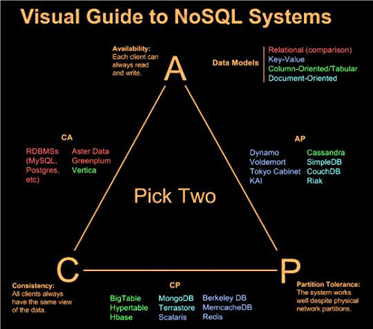
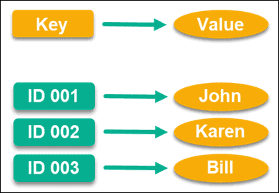
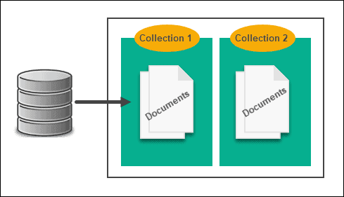
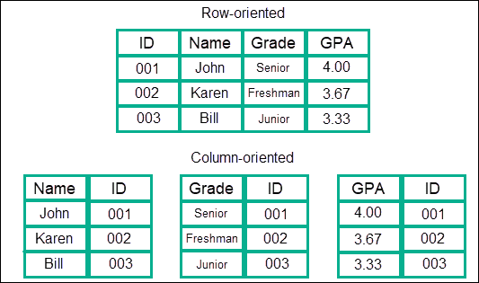

# RDBMS vs NO SQL

> RDBMS

> NOSQL

### 용어 

> Database: 여러 사람에 의해 공유되어 사용될 목적으로 통합하여 관리하는 데이터 집합

> DBMS(DataBase Management System): 사용자와 데이터베이스 사이에서, 사용자의 요청을 해석하여 데이터베이스에 저장된 정보를 관리할 수 있도록 해주는 

> SQL(Structured Query Language): 관계형 데이터 베이스 관리 시스템에 저장된 데이터를 관리하기 위해 설계된 프로그래밍 언어

> 스키마: 데이터 베이스를 구성하는 개체(Entity), 속성(Attribute), 관계(Relationship) 및 제약조건 등에 관해 전반적으로 정의한 메타 데이터의 집합

## RDBMS
`R`은 `Relational`의 약자이다. 
즉 **관계형 데이터베이스 관리 시스템`이라는 뜻 이다.

- `RDBMS`에서는 엑셀의 형식과 유사한 2차원 테이블 형식으로 구성되며 `속성(Attribute)과 값(Value)`을 이용하여 데이터를 정의하고 저장, 관리한다.
- 각 열은 하나의 속성에 대한 정보를 저장한다.
- 데이터 관리를 위해 테이블 간의 관계를 구조화하는 것이 중요하다.
    - 이러한 관계를 나타내기 위해 `외래 키(foreign key)`라는 것을 사용한다. 테이블 간의 관계에서 `외래 키`를 이용한 테이블 간 `join`이 가능하다.
- 데이터의 일관성을 보장한다.
- 이러한 데이터들을 활용하기 위해서는 사용자는 `SQL`이라는 언어를 활용한다.

**테이블 예시**

|학번(PrimaryKey)|이름|번호|
|-----|------|------|
|11111|김지원|010-1111-1111|
|22222|김지투|010-2222-2222|

### 장점
- 데이터의 분류, 정렬, 탐색 속도가 비교적 빠르다.
- SQL이라는 구조화된 질의를 통해 데이터를 다룰 수 있다.
- 작업의 완전성을 보장한다.
- 데이터의 UPDATE가 빠르다.

### 단점
- 반드시 스키마 규격에 맟추어 데이터를 다뤄야 한다.
- 데이터 처리에 대한 부하 발생 시 처리가 어렵다.
- 테이블과 테이블 간 관계가 복잡해질수록(많아질수록) `join` 연산이 많은 복잡한 쿼리가 만들어진다.
- 데이터베이스 확장 시 `scale-up`을 주로 이용한다.
- 데이터베이스를 `scale-out`할 때 `NOSQL`에 비해서 번거롭다.
    - 이유
    ```json
    id: 1
    title: 'My post'
    content: 'The content'
    comments: {
        comment: :
            id: 1
    }
        comment: {
            id: 2
        }
    ...

    views: {
        view: {
            user: 1
        }
        view: {
            user: 2
        }
    ...
    }
    ```
        - 위와 같은 객체가 있고, DB를 수평적 확장(sharding)하면, RDBMS에서는 
            - 데이터가 join을 통해 관계(post와 comment)가 형성된다.
            - comment id 1과 comment id 2는 서로 다른 DB server에 저장될 수 있다.
        - 반면 NOSQL에서는
            - 위의 객체는 일종의 독립형 객체로 저장되어 있으므로 다른 테이블의 데이터와 join이 필요 없다.
            - 따라서 단일 서버에 그대로 상주할 수 있다. 
        - 따라서 NOSQL에 비해 `sharding` 시 번거롭다는 단점이 있다. 

> sharding: 하나의 데이터 세트를 다수의 DB에 분산시키는 방법. 주로 데이터 세트가 단일 DB에 저장하기에는 너무 클 때 사용한다. 

## NO SQL
RDBMS로는 관리할 수 없는 복잡하고 용량이 큰 데이터들을 관리 할 수 있도록 하기 위한 목적으로 등장한 개념이다. 

NOSQL은 데이터와 트래픽이 기하급수적으로 증가함에 따라 RDBMS의 단점인 성능을 향상시키기 위해서는 장비가 좋아야 하는 Scale-up의 특징이 비용을 기하급수적으로 증가시키기 때문에 **데이터 일관성은 포기하되 비용을 고려하여 여러 대의 데이터에 분산하여 저장하는 Scale-out을 목표로 등장**하였다. 

- `Not Only SQL`의 약자로써, 관계형 데이터베이스와 반대되는 방식을 사용하며, 데이터, 테이블 간의 관계를 정의하지 않는다. 
    - 따라서 정해진 스키마가 없어 보다 자유롭게 데이터를 저장할 수 있다. 
- 분산형 구조이다.
    - 분산형 구조를 통해 데이터를 여러 대의 서버에 분산해 저장하고, 분산 시에 데이터를 상호 복제해 특정 서버에 장애가 발생했을 때도 데이터 유실이나 서비스 중지가 없는 형태의 구조

### CAP 이론

**1. 일관성(Consistency)**
> 모든 노드가 같은 시간에 같은 데이터

다중의 클라이언트에서 `같은 시간에 조회하는 데이터는 항상 동일한 데이터임을 보증`하는 것을 의미한다. 

이것은 관계형 데이터베이스가 지원하는 가장 기본적인 기능이지만 일관성을 지원하지 않는 **NOSQL을 사용한다면 데이터의 일관성이 느슨하게 처리되어 동일한 데이터가 나타나지 않을 수 있다.**

느슨하게 처리된다는 것은 데이터의 변경을 시간의 흐름에 따라 여러 노드에 전파하는 것을 말한다. 이러한 방법을 최종적으로 일관성이 유지된다고 하여 `최종 일관성` 또는 `궁극적 일관성`을 지원한다고 한다.

각 NOSQL들은 **분산 노드 간의 데이터 동기화**를 위해서 두 가지 방법을 사용한다. 

1. 데이터의 저장 결과를 클라이언트로 응답하기 전에 모든 노드에 데이터를 저장하는 **동기식 방법**. 
    - 느린 응답시간을 보이지만 데이터의 정합성을 보장한다.
2. 메모리나 임시 파일에 기록하고 클라이언트에 먼저 응답한 다음, 특정 이벤트 또는 프로세스를 사용하여 노드로 데이터를 동기화하는 **비동기식 방법**. 
    - 빠른 응답시간을 보인다는 장점이 있지만 쓰기 노드에 장애가 발생하였을 경우 데이터가 손실 될 수 있다. 

**2. 가용성(Availability)**
> 노드가 다운되어도 다른 노드에 문제 x

가용성: `모든 클라이언트의 읽기와 쓰기 요청에 대하여 항상 응답이 가능해야 함을 보증하는 것` (= 내고장성)

내고장성을 가진 NOSQL은 클러스터 내에서 몇 개의 노드가 망가지더라도 정상적인 서비스가 가능하다.

몇몇 NOSQL은 가용성을 보장하기 위해 **데이터 복제(Replication)**을 사용한다. 동일한 데이터를 다중 노드에 중복 저장하여 그 중 몇 대의 노드가 고장나도 데이터가 유실되지 않도록 하는 방법이다. 

데이터 중복 저장 방법에는
- 동일한 데이터를 가진 저장소를 하나 더 생성하는 `Master-Slave` 복제 방법과
- 데이터 단위로 중복 저장하는 `Peer-to-Peer` 복제 방법이 있다.


**3. 네트워크 분할 허용성(Partition tolerance)**
> 일부 메세지 손실해도 시스템 정상 동작

분할 허용성이란 지역적으로 분할된 네트워크 환경에서 동작하는 시스템에서 `두 지역 간의 네트워크가 단절되거나 네트워크 데이터의 유실이 일어더라도 각 지역 내의 시스템은 정상적으로 동작해야 함`을 의미한다. 

CAP 이론에 따라 데이터를 관리할 때, 어떠한 특성에 중심을 두고 관리하느냐에 따라 선택하는 데이터 모델과 DBMS가 달라질 것이다.

### CAP 이론과 DBMS

**CA**
Consistency + Availabilty, 일관성과 가용성을 만족하는 DBMS
- 시스템 다운에도 메세지 손실을 방지
- 트랜잭션 사용
- 대표적으로 RDBMS가 있다

**CP**
Consistency + Partition tolerance, 일관성과 분할 내성을 만족하는 DBMS
- 데이터보다는 성능이 중요한 퍼포먼스형에 적합
-  대표적으로 MongoDB, Hbase가 있다

**AP**
Availability + Partition tolerance, 가용성과 분할 내성을 만족하는 DBMS
- 비동기화된 서비스 스토어에 적합 (일관성을 요하지 않는 서비스)
- 대표적으로 Cassandra가 있다

### CAP와 NOSQL
NoSQL은 C + P 또는 A + P의 특성을 선택하여 가져가는 DBMS이다.


## 비 관계형 모델을 이용한 데이터 저장 방식
NOSQL의 또 다른 특징이자 장점은 다양한 데이터 모델을 제공한다는 것이다.

데이터 자체보다는 그 데이터로 무엇을 하고싶은가에 초점을 맞춘다.

 ### **Key-Value**방식
 
- 가장 기본적인 형태의 NOSQL
- 키를 고유한 식별자로 사용하는 키-값 쌍으로 데이터를 저장한다.
- 키-값 데이터베이스는 파티셔닝이 가능하고, 수평 확장이 가능하다.
- Riak, Redis, Voldmort

### **Document** 방식

- XML이나 JSON, YAML 같은 데이터 타입(document)을 이용해서 레코드를 저장한다.
- 키-값 모델을 개념적으로 확장한 구조로 하나의 키에 하나의 구조화된 문서를 저장하고 조회한다.
- 저장된 문서를 컬렉션으로 관리하며 문서 저장과 동시에 문서 ID에 대한 인덱스를 생성한다. 문서 ID에 대한 인덱스를 사용하여 `O(1)` 시간 안에 문서를 조회할 수 있다. 
- 대부분의 문서 모델은 `B트리 인덱스`를 사용하여 2차 인덱스를 생성한다. B트리는 크기가 커지면 커질 수록 새로운 데이터를 입력하거나 삭제할 때 성능이 떨어지게 된다. (따라서 읽기와 쓰기 비율이 7:3 정도일때 좋은 성능을 보인다)
- MongoDB, CouchDB

### **Column Model** 방식

- 하나의 키에 여러 개의 칼럼 이름과 칼럼 값의 쌍으로 이루어진 데이터를 저장하고 조회한다.
- 모든 칼럼은 항상 타임 스탬프 값과 함께 저장된다.
- 구글의 `Big Table`이 대표적인 예이다. 차후 컬럼형 NOSQL은 빅테이블의 영향을 받았다. 
- Row key, Column Key, Column Family 같은 빅테이블 개념이 공통적으로 사용된다. 
- 저장의 기본 단위는 컬럼으로 컬럼은 `컬럼 이름, 컬럼 값, 타임스탬프`로 구성된다.
- 데이터를 먼저 커밋로그와 메모리에 저장한 후 응답하기 때문에 빠른 응답속도를 제공한다. 
- 읽기 연산 대비 쓰기 연산이 많은 서비스나 빠른 시간 안에 대량의 데이터를 입력하고 조회하는 서비스를 구현할 때 가장 좋은 성능을 보인다.
- key-value와 데이터 저장 방식은 동일
- 보통의 NOSQL은 order by 같은 정렬 기능을 제공하지 않지만, 이 모델은 내부적으로 key를 정렬
- 날짜나 선착순으로 보여줄 때 유용
- Hbase, Casandra

### **Graph** 방식

- 데이터를 노드로 표현하고, 노드 사이의 관계를 화살표로 표현한다.
- Sones, Allegro Graph

> 파티셔닝: 논리적인 데이터 element들을 다수의 entity로 쪼개는 행위를 뜻하는 일반적인 용어. 즉 큰 table이나 index를 관리하기 쉬운 partiton이라는 작은 단위로 물리적으로 나누는 것을 의미한다.

### 장점
- 분산처리와 병렬처리가 가능하다.(**확장성**)
- 데이터 간의 관계를 정의하지 않는다.(테이블간의 관계(join) 불필요 = 쿼리 로직의 복잡도가 낮다)
- RDBMS보다 복잡도가 떨어져, 훨씬 대용량의 데이터를 저장, 관리 할 수 있다.
- 테이블에 스키마가 정해져있지 않아 데이터 저장이 비교적 자유롭다. (**유연성**)


### 단점
- 복잡한 조인 사용이 어렵다.
    - 기본적으로 조인을 제공하지 않는다.
    - 조인해서 데이터를 가지고 오는 로직을 구현하려면 애플리케이션에서 각 테이블로부터 데이터를 가져와서 합쳐야 한다.
- 데이터의 일관성이 항상 보장되지 않는다. (중복 데이터 존재 가능)
    - 따라서 중복으로 저장된 데이터를 똑같이 업데이트 해주는데 시간을 소모
- 인덱스 구조를 메모리에 저장하기 때문에 많은 인덱스를 사용하려면 충분한 메모리가 필요하다.

## RDBMS vs NOSQL
### 둘 중 어떤 것을 선택해야 할까?
**RDMBS**
- 앱의 여러 부분에서 관련된 데이터(ex. join)가 자주 변경되는 경우 
    - NOSQL이라면 항상 여러 컬렉션을 수정해야 한다.
- 명확한 스키마가 중요하며, 데이터 구조가 극적으로 변경되지 않을 때
    - 대부분 서비스는 스키마가 유동적인 경우가 거의 없다.

**NOSQL**
- 정확한 데이터 요구사항을 알 수 없을 때
- 읽기(read) 처리를 자주 하지만, 데이터를 자주 변경하지 않는 경우
    - 즉 한번의 변경으로 수십 개의 문서를 수정할 필요가 없는 경우
- 데이터베이스를 수평적으로 확장해야 하는 경우
    - 즉 막대한 양의 데이터를 다뤄야 하는 경우, 읽기/쓰기 처리량이 큰 경우


# 참고
[CAP](https://github.com/NKLCWDT/cs/blob/main/Database/RDBMSAndNoSQL.md)
[CAP](https://github.com/alstjgg/cs-study/blob/main/%EB%8D%B0%EC%9D%B4%ED%84%B0%EB%B2%A0%EC%9D%B4%EC%8A%A4/NoSQL%20-%202.%20What%20is%20NoSQL.md)
[RDBMSvsNOSQL](https://universitytomorrow.com/26)
[NOSQL](https://khj93.tistory.com/entry/Database-RDBMS%EC%99%80-NOSQL-%EC%B0%A8%EC%9D%B4%EC%A0%90)

# 면접 예상 질문

> 1. NOSQL은 무엇이고 어떤 특징이 있나요?

> 2. RDBMS와 NOSQL의 차이점은 무엇인가요?

> 3. NOSQL의 데이터 저장 방식에는 무엇이 있나요?
