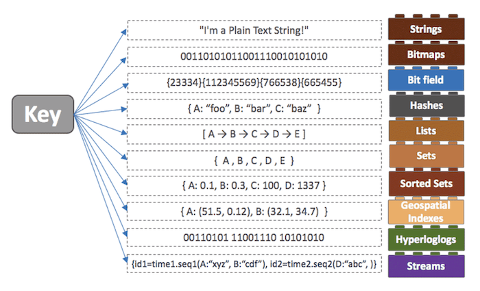

# Redis(REmote DIctionary Server)
파레토의 법칙 : 우리 사회에서 일어나는 현상의 80%는 20%의 원인으로 인해 발생됨을 뜻하는 법칙

웹 사이트에 대한 접근도 파레토의 법칙이 딱 들어맞아, **인터넷 통신의 80%가 불과 20%의 사이트에 대한 액세스로 추정되며, 이 20%의 웹사이트 데이터를 캐시해두면 효율을 극적으로 향상**할 수 있다

따라서 **공통으로 사용되는 데이터는 레디스를 이용하여 캐시로 저장해 두는 것이 리소스를 효율적으로 이용할 수 있는 방법이 될 수 있을 것**

 

# 레디스는 어디에 사용할까?

- 운영 중인 웹 서버에서 키-값 형태의 데이터 타입을 처리하고, I/O가 빈번히 발생해 다른 저장 방식을 사용하면 효율이 떨어지는 경우에 사용합니다.
    - 조회수나 카운트 형태의 데이터
- 사용자의 세션 관리
    - 사용자의 세션을 유지하고 불러오고, 여러 활동들을 추적하는게 매우 효과적 입니다.
- API 캐싱
    - 라우트로 들어온 요청에 대해 요청 값을 캐싱하면 동일 요청에 대해 캐싱된 데이터를 리턴하는 방식

**레디스는 In-Memory 데이터베이스입니다.** 

즉, **모든 데이터를 메모리에 저장하고 조회합니다.** 기존 관계형 데이터베이스(Oracle, MySQL) 보다 훨씬 빠른데 **그 이유는 메모리 접근이 디스크 접근보다 빠르기 때문**입니다. 

하지만 빠르다는 것은 레디스의 여러 특징 중 일부분입니다. 

**다른 In-Memory 데이터베이스(ex. Memcached) 와의 가장 큰 차이점은 다양한 자료구조 를 지원한다는 것**입니다.

레디스는 아래처럼 다양한 자료구조를 **Key-Value 형태로 저장**합니다.

 

 

**레디스는 관계형 데이터베이스가 아닙니다.** 
레디스는 기본적으로 String, Bitmap, Hash, List, Set, Sorted Set 를 제공했고, 버전이 올라가면서 현재는 Geospatial Index, Hyperloglog, Stream 등의 자료형도 지원하고 있습니다.

그렇다면 이렇게 다양한 자료구조를 제공하는게 왜 중요할까요?

바로 **개발의 편의성과 난이도** 때문입니다.

예를 들어 실시간 랭킹 서버를 구현할 때 관계형 DBMS를 이용한다면 DB에 데이터를 저장하고, 저장된 SCORE 값으로 정렬하여 다시 읽어오는 과정이 필요할 것입니다. 개수가 많아지면 속도가 느려질 텐데요, 이 과정에서 디스크를 사용하기 때문입니다.  In-memory 기반으로 서버에서 데이터를 처리하도록 직접 코드를 짤 수도 있겠지만.. 레디스의 Sorted-Set(Replicatoin)을 이용하는게 더 빠르고 간단한 방법일 것입니다

 

 

**레디스는 트랜잭션의 문제도 해결해 줄 수 있습니다.** 

**Redis 자료구조는 Atomic 하다는 특징 때문에  race condition 을 피할 수 있습니다.** 

**즉, Redis Transaction 은 한번의 딱 하나의 명령만 수행할 수 있습니다.**

이에 더하여 **single-threaded 특성** 을 유지하고 있기 때문에 다른 스토리지 플랫폼보다는 이슈가 덜하다고 합니다

즉, 외부의 Collections을 잘 이용하는 것만으로 개발 시간 단축이 가능하고, 생각하지 못한 여러가지 문제를 줄여줄 수 있으므로 개발자는 비즈니스 로직에 집중할 수 있다는 큰 장점이 존재합니다

 

# 레디스에서 제공하는 자료구조

### string

가장 일반적인 형태로, **key - value 로 저장하는 형태**이다.

string 타입에는 모든 종류의 문자열(이진 데이터 포함) 을 저장할 수 있습니다. 따라서 JPEG 이미지를 저장하거나, HTML fragment 를 캐시하는 용도로 자주 사용합니다

### list

레디스의 list는 일반적인 **linked list 의 특징**을 갖고 있습니다. 따라서 list 내에 수백만 개의 아이템이 있더라도 head와 tail에 값을 추가할 때 동일한 시간이 소요됩니다. 특정 값이나 인덱스로 데이터를 찾거나 삭제할 수 있습니다.

### HASH

hash는 **field-value 쌍을 사용한 일반적인 해시**입니다. key에 대한 filed의 갯수에는 제한이 없으므로 여러 방법으로 사용이 가능합니다.

field와 value로 구성된다는 면에서 hash는 **RDB의 table과 비슷**합니다.

### set

**set은 정렬되지 않은 문자열의 모음**입니다. 일반적인 set이 그렇듯이, 아이템은 중복될 수 없습니다. 교집합, 합집합, 차집합 연산을 레디스에서 수행할 수 있기 때문에 set은 객체 간의 관계를 표현할 때 좋습니다.

### sorted set

sorted set은 set과 마찬가지로 key 하나에 중복되지 않는 여러 멤버를 저장하지만, 각각의 멤버는 **스코어에 연결**됩니다. **모든 데이터는 이 값으로 정렬**되며, 스코어가 같다면 멤버값의 **사전순서로 정렬됩니다**. sorted set은 주로 sort가 필요한 곳에 사용됩니다.

sorted set은 정렬된 형태로 저장되기 때문에 때문에 인덱스를 이용하여 빠르게 조회할 수 있습니다.

## Collection 주의 사항

- 하나의 컬렉션에 너무 많은 아이템을 담으면 좋지 않다.
  - 10000개 이하 몇천개 수준으로 유지하는게 좋다.
- Expire는 Collection의 item 개별로 걸리지 않고 전체 Collection에 대해서만 걸린다.
  - 해당 10000개의 아이템을 가진 Collection에 expire가 걸려있다면 그 시간 후에 10000개의 아이템이 모두 삭제.

# Redis Key

레디스의 키는 문자열이기 때문에 'abc'부터 JPEG 파일까지 모든 이진 시퀀스를 키로 사용할 수 있습니다. 빈 문자열도 키가 될 수 있습니다. string 타입과 마찬가지로 허용되는 최대 키 크기는 512MB입니다.

키를 조회할 때의 비용을 생각하면, 키를 너무 길게 사용하는 것은 권장하지 않습니다.

# Expire 기능

키와 관련된 중요한 기능인 Expire에 대해서도 알아보겠습니다. 레디스는 in-memory DB인 만큼, 메모리에 저장될 수 있는 데이터는 한정적입니다. 

더이상 메모리에 데이터를 저장할 수 없는 경우 레디스에서는 가장 먼저 들어온 데이터를 삭제하거나, 가장 최근에 사용되지 않은 데이터를 삭제하거나, 혹은 더이상 데이터를 입력받지 못하게 됩니다.

가장 좋은 방법은 삭제되는 데이터를 레디스에게 맡기지 않고, 직접 설정하는 것일 겁니다. 

해당 데이터를 입력할 때 이 데이터의 사용 기한이 언제까지인지를 직접 설정해 줌으로서, 어플리케이션이 직접 데이터의 사용 만료 시간을 정할 수 있습니다. 

간단히 키에 대한 timeout을 설정하는 것입니다. 설정된 timeout 시간이 경과하면 키에 대해 DEL 명령어를 호출한 것처럼 키가 자동으로 삭제됩니다. 

몇초 뒤에 삭제되어야 한다고 남은 시간값을 이용하거나, 혹은 유닉스의 timestamp를 사용해서 삭제되어야 하는 시각을 설정할 수도 있습니다.

 

# Redis 운영

## - 메모리 관리를 잘하자.
  - Redis는 In-Memory Data Store
    -In-Memory Cache 다 보니, 메모리 보다 더 많은 데이터를 써서 swap이 발생하면 해당 메모리 page를 접근할 때 마다 swap out 이 발생해서, 속도에 엄청난 영향을 주게 됩니다.
  - Maxmemory, Maxmemory-policy
    - Maxmemory: 메모리 사용량 제한, Maxmemory-policy: Maxmemory 수치까지 메모리가 다 차는 경우 Maxmemory policy에 따라 추가 메모리를 확보
    
  - RSS 값을 모니터링 해야함
    - RSS 값은 데이터를 포함해서 실제로 Redis가 사용하고 있는 메모리인데, 이 값은 실제로 사용하고 있는 used-memory 값보다 클 수 있습니다. 이러한 현상이 발생하는 이유는 OS가 메모리를 할당할 때 page 사이즈의 배수만큼 할당하기 때문입니다. 예를 들어 page size = 4096 인데, 요청 메모리 사이즈가 10이라고 하면 OS는 4096만큼을 할당합니다. 이를 파편화 현상이라고 하는데 이것이 실제 사용한 메모리랑 할당된 메모리가 다른 원인이 됩니다.

## - O(N) 관련 명령어는 주의하자.
Redis 는 Single Threaded 이다. 따라서 레디스가 동시에 처리할 수 있는 명령 갯수는 한번에 1개이다. 하지만 생각만큼 그렇게 느린건 아닌게, 단순한 get / set 의 경우, Redis 는 초당 10만개를 처리할 수 있다고 한다.

하지만 주의할 점도 있는게, single-threaded 이기 때문에 처리 시간이 긴 명령어가 들어오면 그 뒤 명령어들은 전부 대기가 필요하다. 즉, 만약 1개에 1초가 걸리는 작업을 하게 되버리면? 최악의 경우 99999 개의 명령은 1초동안 그냥 대기해야 하는 것이다. 이런건 99999개의 타임아웃이 발생할 수 있는 상황이다.

 

 

TCP 에서는 패킷이 끊어져서 올 수 있다. 이럴때 패킷이 들어와서 명령 하나를 실행시키는 과정이 어떻게 수행되는지 정리하였다.

패킷 하나가 들어오면 processInputBuffer 에서 패킷을 하나의 command 로 만든다.
command 가 완성됐는지 확인하고
command 가 완성되었으면 processCommandAndReset 이라는 걸 해서 다시 타고 들어온 후
그 시점에 완성된 command 하나를 그냥 실행시켜버린다.
따라서 이런 상황에서 해당 패킷 하나가 처리되는 동안 뒤의 패킷은 아무것도 못하고 그냥 쌓이는 것이다. 이후 패킷 처리가 완료되어 루프를 탈출해야만 다시 그 다음 명령 (packet -> command) 들을 처리할 수 있다.

이러한 동작 과정에서 알 수 있듯 Redis 는 한번에 하나의 명령만 실행할 수 있기 때문에 긴 처리시간을 요하는 명령어를 쓰면 불리하다. 그럼 보통 '긴' 명령이 될 수 있는, 대표적인 O(N) 명령들은 무엇이 있을까.

KEYS : 모든 아이템을 순회하는 명령이다. 하지만 아이템이 많아지면 서버에서 exception 을 트리거하니 주의해야한다.
예를 들어, Key 가 백만개 이상인데 확인을 위해 KEYS 명령을 사용하는 경우는 결국 모니터링 스크립트가 일초에 한번씩 이걸 호출하게 되는 것이다. 😭

FLUSHALL, FLUSHDB : 데이터를 다 날린다.

Delete Collections : Collection 내 아이템을 전부 삭제하는 명령이다. 예를 들어 100만개 아이템 삭제를 의도했다면, 이 명령을 처리하는 데에만 1~2초 정도 걸리므로 이 시간동안 아무것도 못하게 된다.

Get All Collections : 10만개를 매번 다 가져온다면? 당연히 느려진다.

그럼 KEYS 는 어떻게 대체하는게 좋을까?

KEYS 대신 scan 명령을 사용하는 것으로 하나의 긴 명령을 짧은 여러번의 명령으로 바꿀 수 있다. 이 짧은 명령들 텀 사이에 다른 get / set 같은 명령들을 또 실행시킬 수 있다. 이 사이에 굉장히 처리를 잘 시켜준다.

같은 맥락으로, Collection 의 모든 아이템을 다 가져와야할때는 Collection 의 일부만 가져오거나 (Sorted Set), 큰 컬렉션을 다른 여러개의 컬렉션으로 나누어서 저장한다. 1개당 몇 천개 수준으로 저장해야 좋다.

### 📚 참고

[우아한테크세미나(우아한레디스 by 강대명님)](https://www.youtube.com/watch?v=mPB2CZiAkKM)

[Redis 1](https://www.notion.so/coding-study-page/8e86779c6261485fa777e21b1a1cd220?v=bb0b468144444314871d355f43e0dce1&p=3879429a955c43758a4a27e81732e5b0)

[Redis 2](https://meetup.toast.com/posts/224)

[Redis 3](https://velog.io/@hyeondev/Redis-%EB%9E%80-%EB%AC%B4%EC%97%87%EC%9D%BC%EA%B9%8C)

 

***

## Summary

***

 

# ⁉️ 면접 예상 질문

> 1. Redis는 어떤 경우에 사용할까요?

> 2. Redis의 장점은 무엇이 있을까요?

