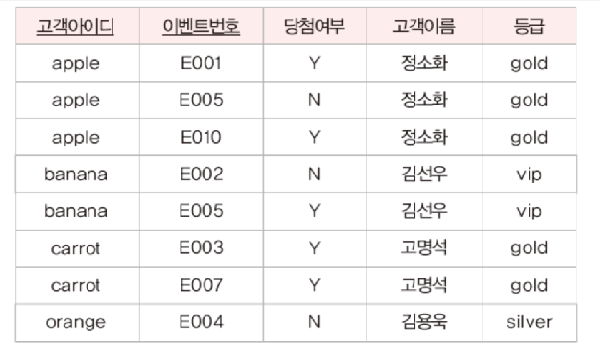
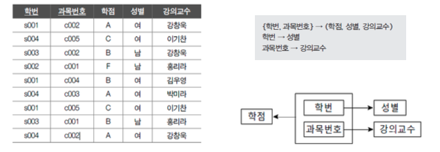

# 정규화

> 정규화  
함수 종속성  
정규화 단계  
반정규화  


<br/>

# *정규화*

데이터베이스 `정규화` 는 함수 종속성을 이용해 릴레이션을 연관성이 있는 속성들로만 구성되도록 분해해서, 이상 현상이 발생하지 않는 올바른 릴레이션으로 만들어 가는 과정이다.

- 기본 목표 : 관련이 없는 함수 종속성은 별개의 릴레이션으로 표현하는 것

<br/>

> 정규화를 왜 할까?
> 

불필요한 데이터 중복문제를 없앨 수 있고 삽입, 삭제, 갱신 시 발생할 수 있는 *이상 현상(Anomaly)*를 방지할 수 있다. (큰 이유)

그리고 데이터 구조의 안정성과 무결성을 유지할 수 있고, 효과적인 검색 알고리즘을 생성할 수 있다.

<br/>

> 이상 현상이란 무엇일까?
> 

정규화를 거치지 않아 데이터베이스 내의 데이터들이 불필요하게 중복되어 릴레이션 조작(삽입, 삭제, 갱신) 시 예상하지 못하게 발생하는 현상이다.

<br/>

> 갱신 이상 현상에는 무엇이 있을까?
> 
1. `삽입 이상 (Insertion Anomaly)`
    
    의도하지 않은 데이터가 삽입되는 현상 또는 삽입이 되지 않아(삽입 조건이 맞지 않아) 발생하는 현상
    
2. `삭제 이상 (Deletion Anomaly)`
    
    하나의 자료만 삭제하고 싶지만, 그 자료가 포함된 튜플 전체가 삭제되는 현상 (원치 않은 정보 손실 발생)
    
3. `갱신 이상 (Modification Anomaly)`
    
    일부의 튜플만 갱신되어 데이터 일관성이 깨지는 현상 (정확한 정보 파악이 되지 않음)
    

<br/>

> 갱신 이상 현상 예시
> 



1. `삽입 이상 (Insertion Anomaly)`
    
    
    
    아이디가 "melon", 이름이 "성원용", 등급이 "gold"인 신규 고객의 데이터를 삽입할 수 없다. (이벤트번호가 NULL이 되기 떄문이다)
    
    이벤트에 아직 참여하지 않았지만 삽입하기 위해서 이벤트번호를 추가해줘야 한다.
    
2. `삭제 이상 (Deletion Anomaly)`
    
    
    
    아이디가 ”orange”인 고객이 이벤트 참여를 취소해 관련 투플을 삭제하게 되면 이벤트 참여와 관련이 없는 고객이름, 등급 데이터까지 손실된다.
    
3. `갱신 이상 (Modification Anomaly)`
    
    
    
    아이디가 “apple”인 고객의 등급을 “gold” → “vip”로 변경하려면 “apple”을 포함한 모든 튜플을 수정해야한다.
    
    일부 튜플에 대해서만 등급이 수정되면, “apple” 고객의 등급이 상이하다는 모순이 발생한다.
    

<br/>

> 이상 현상을 해결하기 위해 연관성이 높은 어트리뷰트들로만 릴레이션을 구성해야한다
> 

릴레이션 속 어트리뷰트들 사이의 연관성을 평가하기 위한 척도에는 `함수 종속성` 이 있다.

<br/>

<br/>

# *함수 종속성*

> 함수 종속성이 뭘까?
> 

`함수 종속성 (FD: Functional Dependency)` : 같은 릴레이션 속의 어트리뷰트 값이 *함수적으로* 다른 어트리뷰트 값을 결정하는 종속 관계를 말한다.


`어트리뷰트1 → 어트리뷰트2` 로 *어트리뷰트2 의 값이 어트리뷰트1의 값에 의해 결정된다*는 의미의 함수 종속성을 표현할 수 있다.

- 어트리뷰트1 = 어트리뷰트2를 결정하는 `결정자(Determinant)`
- 어트리뷰트2 = 어트리뷰트1에 종속된 `종속자(Dependent)`

<br/>

> 함수 종속의 예시
> 


`고객아이디` 라는 어트리뷰트 값에 대응되는 `고객이름`, `등급` 어트리뷰트 값이 유일하다. (`고객아이디` : `고객이름`, `등급` = 1:1 이다)


> 결정자, 종속자를 찾아보자
> 


위와 같은 릴레이션이 있을 때, 함수 종속 다이어그램을 아래와 같이 나타낼 수 있다.


`학번` 어트리뷰트에 대응되는 `이름, 주소, 학년, 성별` 어트리뷰트 값들이 유일하다.

가만히 보면 `기본키` , `후보키` 는 일반적으로 릴레이션의 다른 어트리뷰트들을 함수적으로 결정한다. (함수 종속성을 가진다) 

*근데 기본키, 후보키가 아닌 어트리뷰트가 다른 어트리뷰트를 유일하게 결정하는 `결정자` 가 될 수 있다.*

<br/>

> 그럼 완전 함수 종속과 부분 함수 종속이 뭘까?
> 

1. `완전 함수 종속 (Full Functional Dependency)` 

```java
{X, Y}(결정자) -> A(종속자)
X -/-> A
Y -/-> A
```

특정 어트리뷰트(`A`)가 둘 이상의 어트리뷰트 조합(`{X, Y}`)의 종속자이지만, 결정자의 일부 어트리뷰트(`X 또는 Y`)에는 종속자가 아닌 경우이다.
- 일반적으로 의미하는 함수 종속은 완전 함수 종속을 말한다.
- `결정자` 가 단일 어트리뷰트이면 당연히 완전 함수 종속이다.

<br/>

2. `부분 함수 종속 (Partial Functional Dependency)`

```java
{X, Y}(결정자) -> A(종속자)
X(결정자) -> A(종속자)
Y(결정자) -> A(종속자)
```

특정 어트리뷰트(`A`)가 둘 이상의 어트리뷰트 조합(`{X, Y}`)의 종속자이고, 결정자의 일부 어트리뷰트(`X 또는 Y`)에도 종속자인 경우이다.

<br/>
<br/>

이게 뭔 소리일까? 예시를 통해 이해해보자



`학번, 과목번호` 라는 어트리뷰트 조합은 `학점` 이라는 어트리뷰트의 결정자이다. 하지만 `학번` , `과목번호` 각각 하나만 봤을 때, `학점` 이라는 어트리뷰트의 결정자 역할을 하지 못한다. 

→ `학번, 과목번호` 라는 하나의 어트리뷰트 조합이 결정자 역할을 수행한다. (학번, 과목번호 와 학점 어트리뷰트가 `완전 함수 종속` 관계에 있다고 말할 수 있다.)

`학번` 이라는 어트리뷰트는 `성별` 이라는 어트리뷰트를 결정하는 결정자이다. 또한 `강의교수` 어트리뷰트의 결정자이기도 하다.

→ `학번 -> 성별` , `학번 -> 강의교수` 는 `부분 함수 종속` 관계에 있다고 말할 수 있다.

<br/>

<br/>

# *정규화 단계*


1차 정규화에서 n차 정규화까지 진행하면서 데이터베이스의 바람직하지 않은 구조를 개선해 나간다. 

- 보통 3차 정규화까지만 해도 충분하다고 하며, 실무에선 비용의 문제로 정규화를 안하는 경우가 있다. (릴레이션 간의 join 연산이 증가하여 질의 응답 시간이 늘어날 수 있기 때문이다.)

<br/>

## ## 제 1차 정규화

한 릴레이션이 제 1정규형을 만족할 필요충분 조건은 

1. `릴레이션의 모든 어트리뷰트가 원자값(Atomic)만 가져야 한다`는 것이다.
2. `모든 어트리뷰트는 반복되지 않아야 한다` (동일한 성격이 어트리뷰트가 여러 개 있으면 안된다)

<br/>

> 하나의 어트리뷰트에 여러 데이터를 넣으면 안된다
> 


이벤트 번호 또는 당첨 여부를 기준으로 검색하기 어렵다.

<br/>

> 동일한 성격의 어트리뷰트가 여러 개 있어도 안된다.
> 


위와 같이 동일한 성격의 데이터를 여러 컬럼에 저장하는 것도 제 1 정규화 대상이다.


제 1 정규화를 적용하면 위와 같다. 하지만 위와 같은 릴레이션에서 데이터가 중복되는 문제가 발생한다. (`1113 익명이`) 

- 수강번호가 1113이고 이름이 익명이인 수강과목을 영어로 변경할 때 갱신 이상 문제가 발생할 수 있다. (수학, 국어 → 영어)

<br/>

> 제 1정규화를 했더라도 → 삽입 이상, 삭제 이상, 갱신 이상이 발생한다.
> 


위 릴레이션은 제 1 정규형을 만족한다. 하지만 삽입 이상, 삭제 이상, 갱신 이상이 발생할 수 있다.


기본키인 `고객아이디, 이벤트번호` 에 완전 함수 종속되지 않고, 그 일부분인 `고객아이디` 에만 종속되는 `등급, 할인율` 어트리뷰트가 존재하기 때문이다. (부분 함수 종속이 존재)

이를 해결하려면 부분 함수 종속을 제거하기 위해 릴레이션을 분해해야 한다. 분해된 릴레이션은 제 2 정규형에 속하게 된다.

<br/>

## ## 제 2 정규화

제 1 정규형에 속하면서 기본키가 아닌 모든 어트리뷰트들이 기본 키에 `완전 함수 종속` 되면 제 2 정규형을 만족한다고 말할 수 있다.

- 제 1 정규형에 속하는 릴레이션에서 `부분 함수 종속을 제거` 하고 `모든 어트리뷰트가 기본키에 완전 함수 종속` 되도록 릴레이션을 분해하면 제 2 정규형에 속하게 된다.

<br/>

> 부분 함수 종속을 제거해 보자
> 


고객 릴레이션과 이벤트참여 릴레이션은 모두 제 2 정규형에 속한다.


하지만 릴레이션을 분해해도 `이행적 함수 종속 관계` 가 존재한다. 

<br/>

> 이행적 함수 종속 관계는 또 뭘까?
> 

한 릴레이션의 어트리뷰트 A, B, C가 있을 때, 어트리뷰트 C가 이행적으로 A에 종속(A → C)된다는 것의 필요충분 조건은 **`A→B ∩ B→C 가 성립`**하는 것이다. 

- `고객아이디 → 등급 → 할인율` : `고객아이디`가 `등급`을 통해 `할인율`을 결정하는 이행적 함수 종속 관계가 존재한다.

이행적 함수 종속 관계를 없애기 위해 제 3 정규화를 수행해야한다.

<br/>

## ## 제 3 정규화

릴레이션이 제 2 정규화에 속하고, 기본키가 아닌 모든 어트리뷰트가 기본키에 이행적 함수 종속이 되지 않으면 제 3 정규형을 만족한다.

<br/>

> 이행적 함수 종속 관계를 없애려면?
> 


`고객아이디`가 `등급`을 통해 `할인율`을 결정하는 이행적 함수 종속 관계를 없애기 위해 어트리뷰트를 분해해야 한다.


<br/>

## ## BCNF(Boyce-Codd) 정규화

3차 정규형을 조금 더 강화한 버전으로 3차 정규형을 만족하면서 **모든 `결정자`가 후보키 집합에 속한 정규형 이**다. 

- 복잡한 식별자 관계에 의해 발생하는 문제를 해결하기 위해 제 3 정규형을 보완하는데 의미가 있다
- 3차 정규형으로 해결할 수 없는 이상현상을 해결할 수 있다.

<br/>

> 3차 정규형을 만족하면서 BCNF는 만족하지 않는 경우? → 일반 어트리뷰트가 후보키를 결정하는 경우이다.
> 


이 릴레이션에는 한명의 교수는 한 강의만 담당할 수 있다는 제약조건이 있다.

해당 릴레이션에서 후보키는 `학생, 과목` 어트리뷰트이다. (학생, 과목 어트리뷰트로 튜플을 유일하게 구분할 수 있다)

여기서 `교수` 어트리뷰트는 후보키가 아님에도 제약조건에 의해 `과목` 어트리뷰트의 결정자 역할을 하고 있다. (후보키가 아닌 일반 어트리뷰트가 결정자 역할을 하고 있는게 문제이다)

이러할 경우 삽입 이상, 갱신 이상, 삭제 이상이 발생할 수 있다. Mr.Sim의 과목명을 변경할 경우, 두 개의 튜플이 갱신된다.

<br/>

> BCNF 정규화를 해보자
> 


`교수, 과목` 과 `학생, 과목, 학점` 으로 릴레이션을 분리하는게 BCNF이다.

<br/>

# *반정규화*

> 정규화의 단점 → JOIN 연산!
> 

정규화를 하면 릴레이션 분리로 인해 릴레이션 간의 JOIN 연산이 많아져서 질의에 대한 응답 시간이 느려지는 문제가 있다.

정규화를 진행시키지 않은 모델을 의미하는 것이 아니라 정규화를 진행한 다음에, 필요에 의해 다시 릴레이션을 합치는 등 데이터를 중복시키는 작업을 의미한다. 보통 데이터 중복을 허용하므로써 JOIN 연산을 줄이기 위해 사용한다.

<br/>

> 비정규화가 필요한 경우
> 
- 데이터를 조회하는데 지나치게 JOIN 연산이 많이 필요할 경우
- 특정 데이터를 조회하는 횟수가 많고 특정 범위만 조회할 경우
- 정규화에 충실하여 종속성, 활용성은 향상되었지만, 수행속도가 느려진 경우
- 요약/집계 정보가 자주 요구되는 경우

<br/>

> 정규화와 반정규화는 Trade off 관계
> 

정규화를 하면 정합성과 데이터무결성이 보장된다. 반면, 테이블이 복잡해지고 성능이 떨어질 수 있다. 그에 따라 입력(Create), 수정(Update), 삭제(Delete)의 성능은 향상되고 조회(Read)의 경우 나빠질수도 있고 좋아질 수도 있다.

반정규화를 하면 테이블이 단순화 되어 쿼리 성능이 향상되는 반면, 정합성과 데이터 무결성을 깨뜨리기 때문에 이상현상을 일으킬 수 있다.

<br/>

# 참고

[정규화.md#2-함수-종속성](https://github.com/wjdrbs96/Today-I-Learn/blob/master/DataBase/%EC%A0%95%EA%B7%9C%ED%99%94.md#2-%ED%95%A8%EC%88%98-%EC%A2%85%EC%86%8D%EC%84%B1)

[정규화(Normalization).md](https://github.com/gyoogle/tech-interview-for-developer/blob/master/Computer%20Science/Database/%EC%A0%95%EA%B7%9C%ED%99%94(Normalization).md)

[정규화에-대해서](https://github.com/JaeYeopHan/Interview_Question_for_Beginner/tree/master/Database#%EC%A0%95%EA%B7%9C%ED%99%94%EC%97%90-%EB%8C%80%ED%95%B4%EC%84%9C)

# 면접 예상 질문

> 정규화를 왜 하나요? (갱신이상)
> 

> 함수 종속성이 무엇인가요? (부분/완전/이행적 함수 종속성)
> 

> 예시를 들어 1,2,3차 정규화에 대해서 설명해주세요
> 

> 반정규화를 왜 할까요? (장단점)
>
