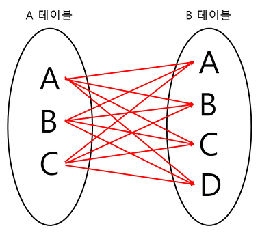

# 🐬 SQL
## 📚 Table of contents
> SQL

> JOIN

> SQL injection

## 🐬 SQL 이란?

SQL은 Structured Query Language, 구조적 질의 언어의 줄임말로, 관계형 데이터베이스 시스템(RDBMS)에서 자료를 관리 및 처리하기 위해 설계된 언어입니다.

### SQL 문법의 종류
- DDL(Data Definition Language, 데이터 정의 언어)
    - 각 릴레이션을 정의하기 위해 사용하는 언어(CREATE, ALTER, DROP)
- DML(Data Manipulation Language, 데이터 조작 언어)
    - 데이터를 추가/수정/삭제하기 위한, 즉 데이터 관리를 위한 언어(SELECT, INSERT, UPDATE)
- DCL(Data Control Language, 데이터 제어 언어)
    - 사용자 관리 및 사용자별로 린레이션 또는 데이터를 관리하고 접근하는 권한을 다루기 위한 언어(GRANT, REVOKE)

### SQL 언어적 특징

1. SQL은 대소문자를 가리지 않음
2. SQL 명령어 끝에 `;`을 붙여야 한다.
3. 고유의 값은 `''` 따옴표로 감싼다. `ex. SELECT * FRIM LAWYER WHERE NAME = 'steve';`
4. SQL에서 객체를 나타낼 때는 백틱(``)으로 감싼다. `ex. SELECT `COST`, `TYPE` FROM `INVOICE`;`
5. 주석은 문장앞에 `--`을 붙임
6. 여러 줄 주석 `/* */`

<br><br>

## 🐬 JOIN
> JOIN은 두개 이상의 테이블이나 데이터베이스를 외래키를 통하여 연결하여 데이터를 검색하는 방법(적어도 하나의 attribute를 공유하고 있어야 한다.)

### JOIN의 종류
- INNET JOIN
- LEFT OURTER JOIN
- RIGHT OUTER JOIN
- FULL OUTER JOIN
- CROSS JOIN
- SELF JOIN

Table 예시

>ANIMAL_INS

|NAME|	TYPE|	NULLABLE|
|----|------|-----------|
|ANIMAL_ID|VARCHAR(N)|FALSE|
|ANIMAL_TYPE|VARCHAR(N)|FALSE|
|DATETIME	|DATETIME	|FALSE|
|INTAKE_CONDITION|	VARCHAR(N)	|FALSE|
|NAME|	VARCHAR(N)|	TRUE|
|SEX_UPON_INTAKE|	VARCHAR(N)|

<br>

> ANIMAL_OUTS table

|NAME|	TYPE|	NULLABLE|
|----|------|-----------|
|ANIMAL_ID	|VARCHAR(N)	|FALSE|
|ANIMAL_TYPE|	VARCHAR(N)|	FALSE|
|DATETIME	|DATETIME	|FALSE|
|NAME	|VARCHAR(N)|	TRUE|
|SEX_UPON_OUTCOME	|VARCHAR(N)|	FALSE|

[예제](https://programmers.co.kr/learn/courses/30/lessons/59043)

#### INNER JOIN

>

=> 교집합으로 기준 테이블과 join 테이블의 중복된 값을 보여준다.
Inner Join은 공통된 요소들을 통해 결합하는 조인 방식으로 sql에서 일반적으로 사용되는 join입니다.

> query : 보호소에 들어온 정보와 나간 정보가 있는 동물의 id를 출력하시오.
```SQL
select ins.animal_id
from animal_ins as ins
join animal_outs as outs on ins.animal_id = outs.animal_id
```

#### LEFT OUTER JOIN

>

=> 기준테이블값과 조인 테이블과 중복된 값을 보여준다. 왼쪽테이블 기준으로 join을 한다고 생각하면 편하다. 왼쪽 테이블을 기준으로 join했기 때문에 왼쪽에는 id값이 있지만, 오른쪽 테이블의 id가 널값도 포함하여 출력한다.

```SQL
select ins.animal_id
from animal_ins as ins
left outer join animal_outs as outs on ins.animal_id = outs.animal_id
```

[예제](https://programmers.co.kr/learn/courses/30/lessons/59043)

> 문제)관리자의 실수로 일부 동물의 입양일이 잘못 입력되었습니다. 보호 시작일보다 입양일이 더 빠른 동물의 아이디와 이름을 조회하는 SQL문을 작성해주세요. 이때 결과는 보호 시작일이 빠른 순으로 조회해야합니다.

>정답
```sql
SELECT ins.animal_id, ins.name
from animal_ins as ins
left outer join animal_outs as outs on ins.animal_id = outs.animal_id
where outs.datetime < ins.datetime
order by ins.datetime
```

#### RIGHT OUTER JOIN

>

=> 기준테이블값과 조인 테이블과 중복된 값을 보여준다. 오른쪽테이블 기준으로 join을 한다고 생각하면 편하다. 오른쪽 테이블을 기준으로 join을 했기 때문에 왼쪽 테이블의 id가 null인 것도 포함하여 출력한다.

```SQL
select ins.animal_id
from animal_ins as ins
right outer join animal_outs as outs on ins.animal_id = outs.animal_id
```

[예제](https://programmers.co.kr/learn/courses/30/lessons/59042)

> 문제) 천재지변으로 인해 일부 데이터가 유실되었습니다. 입양 간 기록은 있는데, 보호소에 들어온 기록이 없는 동물의 id와 이름을 id 순으로 조회하는 sql문을 작성해주세요.

>정답 코드
```sql
SELECT a.animal_id, b.animal_id, b.name
from animal_ins as a right outer join animal_outs as b
on a.animal_id = b.animal_id
-- where a.animal_id is null
order by b.animal_id asc
```

#### FULL OUTER JOIN

>

=> Ins와 Outs 테이블의 모든 데이터가 검색된다.

```SQL
select ins.animal_id
from animal_ins as ins
full outer join animal_outs as outs on ins.animal_id = outs.animal_id
```

#### CROSS JOIN

>

=> 모든 경우의 수를 전부 표현해주는 방식이다. A가 3개, B가 4개라면 총 3*4 = 12개의 데이터가 검색된다.

```SQL
select ins.animal_id, outs.animal_id, hour(ins.datetime) as hour
from animal_ins as ins
cross join animal_outs as outs
where hour(ins.datetime) < 10
order by hour
```

#### SELF JOIN

>

=> 자기 자신과 자기 자신을 조인하는 것이다. 하나의 테이블을 여러번 복사해서 조인한다고 생각하면 편하다. 자신이 가지고 있는 칼럼을 다양하게 변형시켜 활용할 때 자주 사용한다. Self join을 이용할 때는 별칭을 필수로 입력해주어야한다. 같은 테이블 2개 또는 그 이상 사용하는데 별칭을 정해주지 않으면 혼동되고 에러가 뜨기도 한다.

```SQL
select ins1.animal_id, ins2.animal_id
from animal_ins as ins1
join animal_ins as ins2 on ins2.animal_id = ins1.animal_id
```
<br><br>

## 🐬 SQL Injection

> 악의적인 사용자가 보안상의 취약점을 이용하여 임의의 SQL문을 주입하고 실행되게 하여 데이터베이스가 비정상적인 동작을 하도록 조작하는 행위이다. 인젝션 공격은 top10 중 첫 번째에 속해 있으며, 공격이 비교적 쉬운편이고 공격에 성공할 경우 큰 피해를 입힐 수 있는 공격이다.

### Injection 공격 방법

1. 인증 우회

보통 로그인을 할 때, 아이디와 패스워드를 input 창에 입력한다. 그 때 전송되는 쿼리의 모양은 아래와 같다. id = loouserid, password = 1111일 때,

```sql
select * from user where id='loouserid' and password = '1111';
```

SQL injection으로 공격할 때, input 창에 비밀번호를 입력함과 동시에 다른 쿼리문을 함께 입력한다.

```sql
1111; delete * user from id = '1';
```

보안에 취약하다면 비밀번호와 아이디가 일치해서 True로 리턴하고 뒤에 작성한 delete문도 데이터베이스에 영향을 줄 수 있는 상황이 올 수 있다.

> 

위의 사진 처럼 뒤에 where절에 or문을 추가하여 true를 반환하는 쿼리로 만들어 무조건 적용되도록하여 db를 조작할 수도 있다.

2. 데이터 노출

시스템에서 발생하는 에러 메시지를 이용해 공격하는 방법이다. 보통 에러는 개발자가 버그를 수정하는 면에서 도움을 받을 수 있는 존재인데, 해커들은 이를 역이용해 악의적인 구문을 삽입하여 에러를 유발시킨다.

ex) 해커가 GET 방식으로 동작하는 URL 쿼리 스트링을 추가하여 에러를 발생기킨다. 이에 해당하는 오류가 발생하면 이를 통해 해당 웹앱의 데이터베이스 구조를 유추할 수 있고 해킹에 활용한다.

### Injection 방어방법

1. input 값을 받을 시 특수 문자 여부 검사
- 로그인 전에 검증 로직을 추가하여 특수 문자들이 포함되어 있을 경우 요청을 거부한다.

2. SQL 서버 오류 발생 시 해당하는 에러 메시지 감춤
- view를 활용해서 원본 데이터베이스 테이블의 접근 권한을 높인다. 일반 사용자는 view로만 접근하여 에러를 확인할 수 없도록 만든다.

3. Prepare statement 사용
- prepare statement를 사용하면 특수문자를 자동으로 escaping 해준다. 이 기능을 이용하면 서버 측에서 필터링 과정을 통해서 공격을 방어한다.


<br><br>

### 📚 참고

[SQL이란?](https://edu.goorm.io/learn/lecture/15413/%ED%95%9C-%EB%88%88%EC%97%90-%EB%81%9D%EB%82%B4%EB%8A%94-sql/lesson/767683/sql%EC%9D%B4%EB%9E%80)

[JOIN1](https://github.com/gyoogle/tech-interview-for-developer/blob/master/Computer%20Science/Database/%5BDatabase%20SQL%5D%20JOIN.md)

[JOIN2](https://doorbw.tistory.com/223)

[SQL injection1](https://github.com/gyoogle/tech-interview-for-developer/blob/master/Computer%20Science/Database/SQL%20Injection.md)

[SQL injection2](https://noirstar.tistory.com/264)


### 면접 질문

> 1. SQL injection의 공격 방식에는 무엇이 있나요?

> 2. injection을 방어하기 위한 방법은 어떤게 있나요?

> 3. join에서 left와 right join의 차이점을 말해주세요.

> 4. SQL 문법 종류와 예시를 들어주세요.