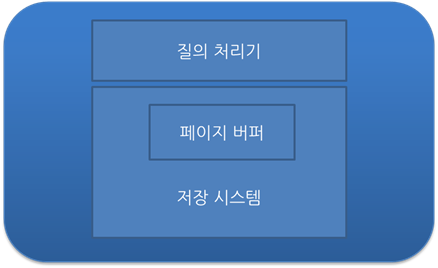

# 🧾 Transaction

## 📚 Table of Content

> Transaction 이란?

> > Transaction을 사용하는 이유

> ACID

> Transaction 격리 수준 & 격리 수준 설정 시 문제점

> Transaction 관리를 위한 DBMS의 전략

<br>

## 🧾 Transaction 이란?
> 쪼개질 수 없는 업무처리의 단위

- 트랜잭션이란 데이터베이스의 상태를 변화시키는 하나의 `논리적인 작업의 단위`라고 할 수 있고, 트랜잭션에는 여러개의 연산이 수행될 수 있다.
- 하나의 트랜잭션은 `Commit`, `Rollback`된다.


- Commit
    - 모든 부분작업이 정상적으로 완료되면 이 변경사항을 한꺼번에 DB에 반영
- Rollback
    - 부분 작업이 실패하면 트랜잭션 실행 전으로 되돌린다.
        - 하나의 트랜잭션 처리가 비정상적으로 종료되어 데이터베이스 일관성을 깨뜨렸을 때 트랜잭션의 일부가 정상적으로 처리되었더라도 트랜잭션의 원자성을 구현하기 위해 이 트랜잭션이 행한 모든 연산을 취소한다.
    - SAVEPOINT
        - 일반적으로 rollback을 명시하면 insert, delete, update 등의 작업 전체가 취소되지만 saveporint를 사용하면 전체가 아닌 특정 부분에서 트랜잭션을 취소시킬 수 있다.
        - 취소하려는 지점을 savepoint로 명시한 뒤 `rollback to savepoint 세이브포인트명;`을 하면 savepoint 지점까지 처리한 작업으로 rollback된다.

### Transaction을 사용하는 이유

> 트랜잭션은 하나의 논리적인 작업 단위로 여러개의 작업을 하나의 논리적인 단위로 묶어서 반영과 복구를 조정할 수 있기 위해 사용한다. 따라서 데이터의 부정합이 일어났을 경우 롤백을 하여 데이터의 부정합을 방지할 수 있다.

ATM으로 계좌 이체를 하는 상화으로 예시를 들어보면
```
1. A은행에서 출금하여 B은행으로 송금
2-1/case1 ) 송금 도중에 시스템 및 서버 오류가 발생하여 A은행 계좌에서 
돈은 빠져 나갔지만 B은행은 계좌에 입금되지 않았음
2-2/case2 ) 오류가 발생하지 않고 A, B 은행 모두 성공적으로 동작함.(Commit)
3-1/case1 ) 이와 같은 상황을 막기위해 거래가 성공적으로 모두 끝나야 이를 완전한 
거래로 승인하고, 거래 도중에 오류가 발생했을 때에는 이 거래를 무효화(Rollback)(거래 이전 상황으로)시킴
```

거래의 ___안전성을 확보하는 방법___ => 트랜잭션

데이터베이스에서는 테이블에서 데이터를 읽어 온 후 다른 테이블에 데이터를 입력하거나 갱신, 삭제하는데 처리 도중 오류가 발생하면 ___원상태___ 로 복구한다.

<br>

## 🧾 ACID
> 트랜잭션의 특징

1. Atomicity-원자성 
    - 트랜잭션이 데이터베이스에 모두 반영되거나 전혀 반영되지 않아야 한다.
2. Consistency-일관성
    - 트랜잭션의 작업 처리 결과는 항상 일관성이 있어야 한다.
3. Isolation-독립성
    - 둘 이상의 트랜잭션이 동시에 병행 실행되고 있을 때, 어떤 트랜잭션도 다른 트랜잭션 연산에 끼어들 수 없다.
4. Durability-영속성
    - 트랜잭션이 성공적으로 완료 되었다면 결과는 영구적으로 반영되어야한다.

<br>

## 🧾 Trancsaction 격리 수준(Isolation level) & 격리 수준 설정 시 문제점

### Transaction 격리 수준
> 트랜잭션 격리 수준에 따라 데이터 조회 결과가 달라질 수 있다. 격리 레벨에 따라서 읽기 일관성이 달라진다. 트랜잭션 격리 수준에 따라 데이터 조회 결과가 달라지게 하는 기술을 MVCC(Multi Version Concurrency Consistency) 라고 함.

### DB lock 

1. Shared Lock(Read Lock)

공유 락은 데이터를 읽을 때 사용하는 lock이다. read lock 끼리는 데이터의 일관성과 무결성을 해치지 않기 때문에 동시에 접근이 가능하다. 즉 리소스를 다른 사용자가 동시에 읽을 수 있게 하지만 변경은 불가능하다. 만약 특정 데이터에 exclusive lock이 걸리면 shared lock을 걸 수 없지만 여러 shared lock은 동시에 적용될 수 있다.

1. Exclusive lock(write lock)

베타락은 데이터를 변경할 때 사용하는 lock이다. 하나의 트랜잭션이 완료될 때 까지 유효하며, 베타락이 끝날 때 까지 어떠한 접근도 허용되지 않는다. Exclusive lock이 걸리면 shared lock을 걸 수 없다. exclusive 상태의 데이터에 대해 다른 트랜잭션이 exclusive lock을 걸 수 없다.


격리 수준 레벨
- READ UNCOMMITTED(lv.0) (커밋되지 않은 읽기)
- READ COMMITTED(lv.1) (커밋된 읽기)
- REAPEATABLE READ(lv.2) (반복 가능한 읽기)
- SERIALIZABLE(lv.3) (직렬화 가능)

### Read Uncommitted
- select 문장이 수행되는 동안 __해당 데이터에 shared lock__ 이 걸리지 않는 계층
- 트랜잭션에 처리중이거나, 아직 commit되지 않은 데이터를 다른 트랜잭션이 읽는 것을 허용
- 데이터베이스의 __일관성을 유지하는 것이 불가능함__
- __dirty read 발생__


```
dirty read 발생
1. 트랜잭션 1을 시작한다. 
2. 트랜잭션 2를 시작한다. 
3. 트랜잭션 1이 ID = 1, VAL = 'MIN'인 데이터의 VAL을 KIM으로 변경했다. 
4. 트랜잭션 2가 ID = 1을 조회한다. VAL = 'KIM'이 조회되었다. 
5. 트랜잭션 1, 2가 종료된다.
```

### Read Committed
- select 문장이 수행되는 동안 해당 데이터에 shared lock이 걸리는 계층
- __트랜잭션이 수행되는 동안 다른 트랜잭션이 접근할 수 없어 대기한다.__
- dirty read 방지
    - 트랜잭션이 커밋되어 확정된 데이터를 읽는 것을 허용한다.
- 대부분의 DBMS가 기본으로 채택하고 있는 격리수준이다.
- __Commit된 정보만 읽는다.__
- __Non-Repeatable Read 발생__


```
Non-repeatable read ex / 나이가 바뀌어서 출력이되면 안되는 상황임.
1. 트랜잭션 1 시작
2. 트랜잭션 1이 id=1인 데이터의 value를 kim으로 변경
3. 트랜잭션 2가 시작
4. 트랜잭션 2가 id=1인 데이터를 조회. min이 검색된다.
5. 트랜잭션 1이 커밋하고 종료한다.
6. 트랜잭션 2가 id=1인 데이터를 조회한다. kim이 검색된다.
7. 트랜잭션 2가 커밋을 하고 종료한다.
```

### Repeatable Read
- 트랜잭션이 완료될 떄까지 __select 문장이 사용되는 모든 데이터에 shared lock이 걸리는 계층__ 
- 트랜잭션이 범위 내에서 __조회한 데이터 내용이 항상 동일함을 보장__
- `다른 사용자는 트랜잭션 영역에 해당되는 데이터에 대한 수정 불가능` -> 입력은 가능
- MySQL DBMS에서 기본으로 사용한다.
- __Non-Repeatable read 부정합 발생하지 않는다.__


```
Non-Repeatable Read 
1. 트랜잭션 1을 시작
2. 트랜잭션 1이 id=1인 데이터를 조회한다.
3. 트랜잭션 2가 시작되었다.
4. 트랜잭션 2가 id=1인 데이터를 kim으로 변경한다.
5. 트랜잭션 1이 id=1인 데이터를 조회한다. 트랜잭션 2의 변경 내역이 보이지 않는다.
6. 트랜잭션 2가 id=2인 데이터를 삽입 후 commit하여 트랜잭션을 종료한다.
7. 트랜잭션 1이 id=2인 데이터를 조회한다. 데이터가 정상적으로 확인된다.
```

### Serializable 
- __트랜잭션이 완료될 때까지 select 문장이 사용되는 모든 데이터에 shared lock이 걸리는 계층__
- 가장 엄격한 격리 수준으로 __완벽한 읽기 일관성 모드를 제공함__
- `다른 사용자는 트랜잭션 영역에 해당되는 데이터에 대한 수정 및 입력 불가능`

MySQL : Repeatable Read
Oracle : Read Committed

결론은 레벨이 높아질수록 트랜잭션간 고립정도가 높아지며, 성능이 떨어지는 것이 일반적이며, 일반적인 온라인 서비스에서는 READ COMIITTED나 REPEATABLE READ 중에 하나를 사용한다고 한다. 


### Transaction 격리 수준 설정 시 문제점
> Isolation level(격리 수준 레벨)에 대한 조정은 동시성과 데이터 무결성과 연관되어있다.

___동시성을 증가시키면 데이터의 무결성에 문제가 발생하고, 데이터의 무결성을 유지하면 동시성이 떨어지게 된다.___


>레벨이 낮아질수록 동시성은 높아지고 데이터 일관성은 낮아진다.
>레벨이 높아질수록 동시성은 낮아지고 데이터 일관성은 높아진다.


#### 낮은 단계 Isolation Level을 활용할 때 발생하는 현상들

- Dirty Read
    - 어떤 트랜잭션에서 아직 실행이 끝나지 않은 다른 트랜잭션에 의한 변경사항을 보게되는 경우
    - 커밋되지 않은 수정중인 데이터를 다른 트랜잭션에서 읽을 수 있도록 허용할 때 발생하는 현상
- Non_repeatable Read
    - 한 트랜잭션에서 같은 쿼리를 두 번 수행할 때 그 사이에 다른 트랜잭션 값을 수정 또는 삭제함녀서 두 쿼리의 결과가 상이하게 나타나는 일관성이 깨진 현상
    - 한 트랜잭션에서 똑같은 select를 수행했을 때 항상 같은 결과를 반환해야 한다는 repeatable read 정합성에 어긋남
- Phantom Read
    - 한 트랜잭션 안에서 일정 범위의 레코드를 두 번 이상 읽었을 때, 첫 번째 쿼리에서 없던 레코드가 두 번째 쿼리에서 나타나는 현상
    - 트랜잭션 도중 새로운 레코드를 삽입을 허용하기 때문에 나타남


<br>

## Transaction 관리를 위한 DBMS의 전략

이해가 필요한 개념 

> DBMS의 구조

> Buffer 관리 정책


### DBMS의 구조

DBMS 구성요소 :Query Processor (질의 처리기), Storage System(저장 시스템)

입출력 단위 :고정길이의 page 단위로 disk에 읽거나 씀

저장 공간 : 비휘발성 저장 장치인 disk에 저장, 일부분을 main memory에 저장



### Page Buffer Manager or Buffer manager

> DBMS의 storage system에 속하는 모듈 중 하나로, main memory에 유지하는 페이지를 관리하는 모듈
> 

Buffer 관리 정책에 따라 undo 복구와 redo 복구가 요구되거나 그렇지 않게 되므로 transaction 관리에 매우 중요한 결정을 가져온다.

#### Undo

필요한 이유 : 수정된 page들이 **buffer 교체 알고리즘에 따라서 디스크에 출력**될 수 있음. Buffer 교체는 transaction과는 무관하게 buffer의 상태에 따라서 결정된다. 이로 인해서 정상적으로 종료되지 않은 transaction이 변경한 page들은 원상 복구 되어야 하는데, 이를 undo라고 한다.

- steal : 수정된 페이지를 언제든지 디스크에 쓸 수 있는 정책
    - 대부분의 dbms가 채택하는 buffer 관리 정책
    - undo logging과 복구를 필요로 함.
- not steal : 수정된 페이지들을 EOT (End Of Transaction)까지는 버퍼에 유지하는 정책
    - undo 작업이 필요하지 않지만, 매우 큰 메모리 버퍼가 필요함

#### Redo

이미 commit한 transaction의 수정을 재반영하는 복구 작업

buffer관리 정책에 영향을 받는다. → transaction이 종료되는 시점에 해당 transaction이 수정한 page를 디스크에 쓸 것인가 아닌가로 기준

- FORCE : 수정했던 모든 페이지를 Transaction commit 시점에 disk에 반영
    - transaction이 commit 되었을 때 수정된 페이지들이 disk 상에 반영되므로 redo 필요 없음
- not FORCE :commit 시점에 반영하지 않는 정책
    - transaction이 disk 상의 db에 반영되지 않을 수 있기에 redo 복구가 필요(대부분의 dbms정책)

<br><br>

### 📚 참고

[트랜잭션1](https://devuna.tistory.com/30)

[트랜잭션2](https://github.com/NKLCWDT/cs/blob/main/Database/Transaction.md)

[트랜잭션 격리수준1](https://dar0m.tistory.com/225)

[트랜잭션 격리수준2](https://zzang9ha.tistory.com/381)

<br><br>

### ⁉️ 면접 예상 질문

> 트랜잭션 격리 수준은 무엇인가요? 격리 수준의 종류를 설명해주세요

>> 격리 수준의 종류에 따른 오류를 말하고 오류를 설명하시오

> Transaction은 무엇인가요?

> Transaction에 특성이 있는데 각각을 설명해주세요.
