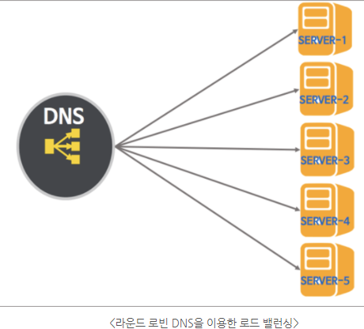
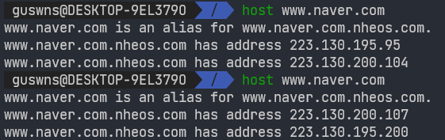

# DNS Round Robin

> Round Robin
> 
> DNS Round Robin
> 
> DNS Round Robin 문제점
> 

# *Round Robin*

라운드 로빈은 CPU 스케쥴링의 한 방법으로 프로세스끼리 할당된 시간만큼 돌아가면서 CPU를 할당받는 방식이다.

- 라운드 로빈 스케쥴링을 사용하면 프로세스 사이에 우선순위를 두지 않는다.
- 라운드 로빈 방식에서 모든 프로세스마다 동일한 시간할당량을 가진다.
- 라운드 로빈 방식은 `라운드 로빈 DNS`  등과 같은 시스템에서 사용하고 있다.

> Round Robin의 예시 ([참고](https://foxtrotin.tistory.com/35))
> 

프로세스 P1, P2, P3가 있을 때 시간 할당량이 `3`이고, 각각 작업을 완료하기 까지 필요한 실행시간이 8, 5, 2인 경우를 생각해보자

| 도착시간 | P1 | P2 | P3 |
| --- | --- | --- | --- |
| 0 | 도착 (8) |  |  |
| 1 | 7 | 도착 (5) |  |
| 2 | 6 | 대기 | 도착 (2) |
| 3 | 5 | 대기 | 대기 |
| 4 | 대기 | 4 | 대기 |
| 5 | 대기 | 3 | 대기 |
| 6 | 대기 | 2 | 대기 |
| 7 | 대기 | 대기 | 1 |
| 8 | 대기 | 대기 | 0 ⇒ 끝 |
| 9 | 4 | 대기 |  |
| 10 | 3 | 대기 |  |
| 11 | 2 | 대기 |  |
| 12 | 대기 | 1 |  |
| 13 | 대기 | 0 ⇒ 끝 |  |
| 14 | 1 |  |  |
| 15 | 0 ⇒ 끝 |  |  |

# *DNS Round Robin*

([강의](https://www.youtube.com/watch?v=c7W40_bn3Ss), [2](https://www.youtube.com/watch?v=TGX9J21oJ8Y))

DNS Round Robin은 별도의 로드 밸런싱 장비 없이 오직 DNS만을 이용하여 도메인 레코드 정보를 조회하는 시점에 트래픽을 분산하는 기법이다.

- 웹 뿐만 아니라 Domain을 사용하는 모든 서비스(FTP, SMTP)에 사용이 가능하다
- 쉽게 풀어 설명하자면, DNS 서버를 Round Robin 형식으로 구성할 경우 부하에 대한 걱정이 필요 없어져 Load Balancer가 필요없게된다. 자동으로 시간에 따라 스케쥴링이 변환되기 때문이다.

> DNS Round Robin의 원리
> 

사용자는 웹 서비스에 접근하기 위해 해당 도메인을 URL에 입력한다. 그러면 DNS 서버는 입력된 도메인 네임에 해당하는 IP 주소를 찾아줘야한다. 만약 해당 웹 서비스를 제공하는 웹 서버가 여러대 있다면 어떨까?

웹 서버스를 담당하는 여러대의 웹 서버마다 자신의 공인 IP 주소를 가지고 있다.

- 웹 서버 한대만으로 request를 담당하기 힘든 경우 여러대의 웹 서버를 증설한다.
- SERVER-1, SERVER-2, .. , SERVER-5는 서로 다른 웹서버이고 모두 동일한 웹 서비스를 제공한다.

사용자가 도메인 주소를 브라우저에 입력하면 DNS는 입력된 도메인 웹 서비스를 담당하는 여러 대의 서버 IP 리스트 중에서 Round Robin 방식으로 랜덤하게 하나 또는 여러개를 선택하여 선택된 IP주소를 결과로 돌려준다.

- 웹서버 IP 리스트 = SERVER-1, SERVER-2, .. , SERVER-5의 IP 주소들이다.
    - 결과로 받은 여러개의 IP 주소들 중 하나를 선택하는 방식은 사용자의 OS에 따라 다르다.

위와 같이 `www.naver.com` 의 웹서비스를 담당하는 여러 대의 웹 서버의 IP 주소 리스트(`223.130.195.95` , `223.130.200.104` )를 결과로 돌려준다. 

- 다시 해당 도메인에 접근했을 때 반환받은 IP 주소 리스트 정보(`223.130.200.107` , `223.130.195.200` )가 다르다.
    - 즉, DNS Round Robin 방식을 통해 나라는 클라이언트의 요청을 수행할 웹 서버를 선택해준다.

**DNS Round Robin 방식을 통해 웹사이트를 접속하는 다수의 클라이언트는 결과적으로 여러 웹서버에 나뉘어 접속하게 된다.** 

# *DNS Round Robin 문제점*

## ## 1. 서버의 수 만큼 공인 IP 주소가 필요하다

서버 부하를 줄이기 위해 서버 수를 늘리면 그만큼의 공인 IP 주소가 필요하다는 문제점이 있다.

- 이게 왜 문제일까? → IPv4 주소 고갈 (?)

## ## 2. 균둥하게 분산되지 않는다

> 프록시 서버는 DNS request 결과를 캐싱한다
> 

스마트폰으로 웹 서버에 접속할 때 캐리어 게이트웨이라고 하는 `프록시 서버`를 경유한다. 이때 프록시 서버는 DNS response를 일정시간동안 캐싱한다. 그러므로 같은 프록시 서버를 경유하는 접속은 항상 같은 서버로 접속된다.

- DNS Round Robin은 클라이언트를 여러 웹 서버로 나누어 분산하는데에 장점을 가지지만, 프록시 서버의 캐싱으로 인해 해당 장점을 누리지 못한다.

> 웹 브라우저의 DNS 캐싱
> 

PC 웹브라우저 또한 DNS request 결과를 캐싱하기 때문에 같은 서버로 접속된다. 결국 균등하게 부하 분산이 일어나지 않는다.

> DNS record의 TTL값
> 

`TTL`(Time To Live)이란 DNS request에 대한 결과값을 캐시에 저장하는 시간을 의미한다. 즉, 다음 DNS 레코드 변경사항이 적용될때까지 걸리는 시간을 결정하는 DNS 레코드 값이 TTL이다.

- 예를 들어 TTL값이 86400초인 DNS 레코드는 변경사항이 적용되기까지 24시간이 소요된다.

DNS의 TTL값을 짧게 설정하여 어느정도 불균등 분산 문제를 해결할 수 있지만, TTL값에 따라 캐시된 DNS request에 대한 결과값을 해제하는게 아니므로 주의가 필요하다.

# 참고

[DNS란](https://github.com/alstjgg/cs-study/blob/main/%EB%84%A4%ED%8A%B8%EC%9B%8C%ED%81%AC/DNS.md), [2](https://github.com/wjdrbs96/Today-I-Learn/blob/master/Network/Application/DNS%EB%9E%80%3F.md)

[라운드 로빈이란](https://terms.naver.com/entry.naver?docId=797080&cid=42347&categoryId=42347), [2](https://en.wikipedia.org/wiki/Round-robin_DNS)

[DNS Round Robin이란](http://dailusia.blog.fc2.com/blog-entry-362.html)

[DNS TTL](https://l2j.co.kr/2767)

[강의](https://www.youtube.com/watch?v=c7W40_bn3Ss), [2](https://www.youtube.com/watch?v=TGX9J21oJ8Y)

# 면접 예상 질문

> 1. DNS Round Robin 원리에 대해 설명해주세요

> 2. DNS Round Robin의 문제점에 대해 설명해주세요
