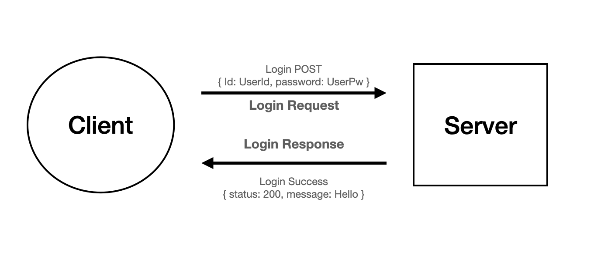

# HTTP Method

> HTTP 특징

> HTTP 동작

> HTTP Method

> HTTP Status Code

 

## HTTP 특징

- HTTP 메시지는 HTTP 서버와 HTTP 클라이언트에 의해 해석된다.

- TCP/IP 를 이용하는 응용 프로토콜이다.

- HTTP는 연결 상태를 유지하지 않는 비연결성(Stateless) 프로토콜이다.

- HTTP는 연결을 유지하지 않는 프로토콜이기 때문에 요청/응답 방식으로 동작한다.

__장점__

- 불특정 다수를 대상으로 하는 서비스에 적합하다. -> 서버에서 다수의 클라이언트와 연결을 지속하게 되면 많은 리소스가 발생하게 된다. 그래서 서버가 응답을 마친 후 연결을 끊어 연결 유지를 위한 리소스를 줄이고 더 많은 연결을 할 수 있게 된다.

__단점__

- 연결을 끊어버리기 때문에 클라이언트의 이전 상황을 알 수 없다. -> 이러한 특징 때문에 정보를 유지하기 위해 __쿠키, 세션, 토큰__ 이 사용된다.

- 평문 통신이기에 도청이 가능하다. -> 암호화

 

## HTTP 동작

Client가 브라우저를 통해 URI을 통해 특정 요청(Request)을 보내면, Server는 해당 요청(Request)을 받아 처리를 하여 Client에게 응답(Response)을 하는 형태

 

## HTTP Method
클라이언트가 서버에게 사용자 요청의 목적이나 종류를 알리는 수단

| Method  | 설명                                                                                                    |
| ------- | ------------------------------------------------------------------------------------------------------- |
| GET     | URI가 가진 정보를 검색하기 위해 요청하는 메소드                                                         |
| HEAD    | GET메소드와 방식은 동일하지만, `응답에 BODY가 없고 응답 코드와 HEAD만 응답하는데 사용`되는 메소드       |
| POST    | 요청된 자원을 생성하기 위한 메소드                                                                      |
| PUT     | 요청된 자원을 수정할때 사용하고, `PATHCH와는 다르게 자원 전체를 갱신하는데 사용`되는 메소드             |
| PATCH   | PUT메소드와 유사하게 요청된 자원을 수정할때 사용되지만, `자원의 일부를 수정`하는 의미로 사용되는 메소드 |
| DELETE  | 요청된 자원을 삭제하기 위한 메소드                                                                      |
| CONNECT | 동적으로 터널 모드를 교환하고 프락시 기능을 요청할때 사용하는 메소드                                    |
| TRACE   | 원격 서버에 루프백 메세지를 호출하기 위해 테스트용도로 사용하는 메소드                                  |
| OPTIONS | 웹 서버에서 지원하는 메소드의 종류들을 확인할 경우 사용하는 메소드                                      |

 

__GET__ : 요청하는 데이터가 HTTP Request Message의 Header 부분에 url 이 담겨서 전송된다. 때문에 url 상에 ? 뒤에 데이터가 붙어 request 를 보내게 되는 것이다. 

ex) www.example.com/show?name1=value1&name2=value2

이러한 방식은 url 이라는 공간에 담겨가기 때문에 전송할 수 있는 데이터의 크기가 제한적이다. 또 보안이 필요한 데이터에 대해서는 데이터가 그대로 url 에 노출되므로 GET방식은 적절하지 않다. 

__POST__ : POST 방식의 request 는 HTTP Request Message의 Body 부분에 데이터가 담겨서 전송된다.( body 의 타입은 Content-Type 헤더에 따라 결정 된다.)

POST 로 데이터를 전송할 때 길이 제한이 따로 없어 용량이 큰 데이터를 보낼 때 사용하거나 GET처럼 데이터가 외부적으로 드러나는건 아니라서 보안이 필요한 부분에 많이 사용된다. ( 하지만 데이터를 암호화하지 않으면 body의 데이터도 결국 볼 수 있는건 똑같다. )

 

### __HTTP 메서드의 속성__
HTTP 메소드의 속성에는 안전(Safe Methods), 멱등(Idempotent Methods), 캐시가능(Cacheable Methods)가 있다.

1. 안전(Safe Methods): 계속해서 메서드를 호출해도 리소스를 변경하지 않는다.
2. 멱등(Idempotent Methods): 메소드를 계속 호출해도 결과가 똑같다.
3. 캐시가능(Cacheable Methods): 캐싱을 해서 데이터를 효율적으로 가져올 수 있다.

 

## HTTP Status code
클라이언트가 보낸 요청의 처리 상태를 응답에서 알려주는 기능

보통 100번대에서 500번대를 사용한다.

 

### 정보전송 임시응답 (1xx)
- 서버가 요청을 클라이언트에서 성공적으로 수신을 했고 서버에서 처리중인 정보를 보낸디.

    | Status Code | 설명               |
    | ----------- | ------------------ |
    | 100         | Continue           |
    | 101         | Swiching protocols |

### 성공 (2xx)
- 서버가 요청을 `성공`적으로 받았음을 알려준다.

    | Status Code | 설명                          |
    | ----------- | ----------------------------- |
    | 200         | Ok!                           |
    | 201         | Created                       |
    | 202         | Accepted                      |
    | 203         | Non-authoritative Information |
    | 204         | No Cotent                     |

### 리다이렉션 (3xx)
- 요청 완료를 위해 추가 작업 조치가 필요하다

    | Status Code | 설명              |
    | ----------- | ----------------- |
    | 301         | Moved permanently |
    | 302         | Not temporarily   |
    | 303         | Not modified      |

### 클라이언트 요청 오류 (4xx)
- 클라이언에서 서버에 잘못된 요청을 보내 서버가 요청을 해결 할 수 없을때 발생하는 코드이며, `클라이언트측에서 발생하는 코드`이다.

    | Status Code | 설명                          |
    | ----------- | ----------------------------- |
    | 400         | Bad Request                   |
    | 401         | Unauthorized                  |
    | 402         | Payment required              |
    | 403         | Forbidden                     |
    | 404         | Not found                     |
    | 405         | Method not allowed            |
    | 407         | Proxy authentication required |
    | 408         | Request timeout               |
    | 410         | Gone                          |
    | 412         | Precondition failed           |
    | 414         | Request-URI too long          |

### 서버에러 (5xx)
- 클라이언트의 요청을 받고 서버에서 처리하지 못할때 발생하는 코드이며, `서버측에서 발생하는 코드`이다.

    | Status Code | 설명                       |
    | ----------- | -------------------------- |
    | 500         | Internal server error      |
    | 501         | Not implemented            |
    | 503         | Service unnailable         |
    | 504         | Gateway timeout            |
    | 505         | HTTP version not supported |

 

### 📚 참고
[HTTP 특징](https://velog.io/@sujeong/2-%EC%9B%B9%EC%9D%98-%EB%8F%99%EC%9E%91-HTTP-%ED%94%84%EB%A1%9C%ED%86%A0%EC%BD%9C-%EC%9D%B4%ED%95%B4)

[HTTP Method 1](https://girawhale.tistory.com/66)

[HTTP Method 2](https://github.com/JaeYeopHan/Interview_Question_for_Beginner/tree/master/Network#http의-get과-post-비교)

[HTTP 동작 & 메서드 & 상태코드](https://github.com/devsungmin/Ready-For-Tech-Interview/blob/master/Network/HTTP동작과정과%20HTTP%20Method%2C%20상태코드.md) 

 

***

## Summary

***

 

# ⁉️ 면접 예상 질문

> 1. GET과 POST의 차이점에 대해서 설명하시오.

> 2. 조회하기 위한 용도로 POST가 아닌 GET 방식을 사용하는 이유에 대해서 설명하시오.

> 3. PUT 메서드와 PATCH 메서드의 차이점에 대해 설명하시오.

> 4. HTTP Statue Code(HTTP 상태 코드) 의 종류에 대해 설명하시오.

