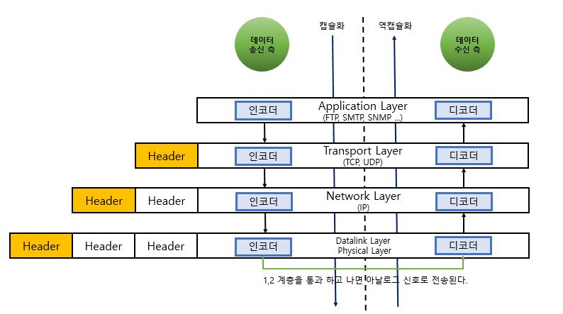

# 네트워크 시스템의 Layer and Architecture 

> TCP/IP 5 Layer

> OSI 7 Layer

 

# 인터넷 프로토콜 스택 5 Layer

- __Protocol Stack__
    - 다양한 계층의 `프로토콜`을 모두 합하여 프로토콜 스택이라고 한다.
- __Protocol__
    - 프로토콜은 둘 이상의 통신 개체 간에 교환되는 메시지 포맷과 순서뿐 아니라, 메시지의 송수신과 다른 이벤트에 따른 행동들을 정의한다.
    - 두 관련 프로그램 간에 교환되는 데이터에 일정한 형태를 규정하는 규칙을 말하며 데이터의 교환을 효율적으로 만드는 기능을 수행한다.
    - 사용자 별로 환경이 다르고 통신의 규칙이 없으면 충돌, 지연 등 여러가지 문제가 발생할 수 있기 때문에 프로토콜이 필요하다.
    - 데이터 처리 시스템에서는 통신의 복잡성으로 인하여 하나의 프로토콜에서 모든 작업을 수행하는 것은 바람직하지 않다. 그러므로, 서로 다른 기능을 수행하며, 상호작용을 통하여 사용자에게 서비스를 제공하는 다중의 프로토콜 층 형태로 이루어진 다수의 통신 프로토콜을 사용한다.

 

__노드(node)__

컴퓨터 네트워크에 있어서 노드는 네트워크에 연결되어 있는 1개 1개의 기계를 의미한다. 구체적으로는 컴퓨터부터 시작해 네트워크를 교통 정리하는 루터나 허브, 네트워크 상에 다양한 서비스를 제공하고 있는 서버, 더욱이 네트워크에 연결되어 있는 프린터나 IP전화기등에 관해서도 노드라고 부를 수 있다. 그 외에 네트워크에 연결되어 있는 것이라면 스마트폰이나 태블릿 PC등의 기기도 물론 노드라고 할 수 있다.

- __인터넷 프로토콜 스택 5 계층 구조__
    - `애플리케이션 계층(응용)`
        - HTTP(웹 문서와 요청 전송), SMTP(전자메일 전송), FTP(파일전송)
        - 애플리케이션끼리 정보 패킷을 교환할 때 이 계층을 사용, 이 계층에서 패킷을 `메시지(message)`라고 한다.

    - `트랜스포트 계층(전송)`
        - TCP, UDP 
        - 클라이언트와 서버 간에 애플리케이션 계층 메시지를 전송하는 서비스를 제공. 트랜스포트 계층 패킷을 `세그먼트(segment)`라고 한다.
            - 엄밀히 말하자면 인터넷 문서(RFC)에서는 TCP 에 대한 패킷을 `세그먼트(segment)`라고 정의하고 있고, UDP 에 대한 패킷을 `데이터그램(datagram)` 이라고 표현하고 있다.
        - __전송 계층을 한마디로 정의하자면 EndPoint 간 `신뢰성` 있는 데이터 `전송`을 담당하는 계층이라고 생각하면 된다.__
            - 신뢰성 : 데이터를 순차적, 안정적으로 전달
            - 전송 : 포트 번호에 해당하는 프로세스에 데이터를 전달
            - 따라서, 데이터를 받고자 하는 프로세스들은 `포트 번호(Port Number)`를 가져야 한다.
            > 포트 번호(Port Number)란 하나의 컴퓨터에서 동시에 실행되고 있는 프로세스들이 서로 겹치지 않게 가져야 하는 정수 값을 의미한다.

    - `네트워크 계층(IP)`
        - IP
        - 인터넷 네트워크 계층의 패킷을 `데이터그램(datagram)` 이라고 한다.
            - 작은 데이터그램 각각을 조각(fragment)라고 한다.
        - 한 호스트에서 다른 호스트로 데이터그램(datagram)을 `라우팅`하는 책임을 진다. 
        - `라우팅(routing)과 포워딩(forwarding)`
            - 수 많은 네트워크들의 연결로 이루어지는 인터넷 네트워크 속에서
            - 어딘가에 있는 목적지 컴퓨터로 데이터를 전송하기 위해
            - IP 주소를 이용해 길을 찾고(routing)
            - 자신 다음의 라우터에게 데이터를 넘겨주는 것(forwarding)
            > Wikipedia. 라우터(router 혹은 라우팅 기능을 갖는 공유기)는 컴퓨터 네트워크 간에 데이터 패킷을 전송하는 네트워크 장치다.

    - `데이터 링크 계층(링크)`
        - 이더넷, 와이파이 등
        - 경로상 한 노드에서 다른 노드로 패킷을 이동하기 위해, 네트워크 계층은 링크 계층 서비스에 의존해야 한다. 네트워크 계층은 데이터그램을 아래 링크 계층으로 보내고 링크 계층은 그 데이터그램을 경로상의 다음 노드에 전달한다. 링크 계층의 패킷을 `프레임(frame)`이라고 한다.
        - __같은 네트워크에 있는 여러 대의 컴퓨터들이 데이터를 주고 받기 위해서 필요한 모듈__

    - `물리 계층`
        - 네트워크 어댑터, 리피터, 네트워크 허브, 모뎀
        - 하드웨어적으로 구현되어 있다.
        - 링크 계층의 기능이 전체 프레임을 한 네트워크 요소에서 이웃 네트워크 요소로 이동하는 것이라면, 물리 계층의 기능은 프레임 내부의 `각 비트(물리 계층에서 사용되는 통신 단위)`를 한 노드에서 다음 노드로 이동하는 것이다. 이 계층의 프로토콜은 링크에 의존하고 더 나아가 링크의 실제 전송 매체(Ex. 꼬임쌍선, 단일 모드 광케이블)에 의존한다.
        - `비트를 이용한 통신`
            - 비트는 0과 1로 나타내지는 전기적 온 오프 상태를 의미
            - 비트의 나열을 아날로그 신호로 바꾸어 전선으로 흘려보내고(`encoding`)
            - 아날로그 신호가 들어오면 비트의 나열로 해석하여(`decoding`)
            - `물리적으로 연결된(전선)` 두 대의 컴퓨터가 비트의 나열을 주고 받을 수 있게 해주는 모듈을 의미

- __OSI 7 Layer 와의 차이점__
    - 인터넷 프로토콜 스택은 프레젠테이션 계층(표현)과 세션 계층을 애플리케이션 계층에 포함시켰다.

## PDU(Protocol Data Unit) : 각 계층의 데이터 단위

- 세션, 표현, 어플리케이션 계층: Message(Data)
- 전송 계층: Segment
- 네트워크 계층: Packets(Datagram 이라고도 함)
- 데이터링크 계층: Frame
- 물리 계층 : Bit

### 데이터 캡슐화

- __동작 방식__
    - 송신자 쪽에서 상위 계층에서 하위 계층으로 데이터를 보낼 때, 각 계층의 인코더를 통해 데이터를 캡슐화 하며, 1-2 계층을 통과하면 아날로그 신호로 바뀌어 전선을 타고 수신자 측의 하위 계층 디코더로 진입한다. 송신자 쪽에서 데이터를 보내면서 헤더가 추가되는 과정을 캡슐화라고하며, 수신자 쪽에서 캡슐화된 헤더를 벗겨내는 과정이 역캡슐화라고 한다.

- __PDU(Protocol Data Unit)__
    - SDU(Service Data Unit)
    - PCI(Protocol Control Information)

PDU는 SDU(Service Data Unit) 와 PCI(Protocol Control Information)로 구성되어 있다. SDU 는 전송하려는 데이터고, PCI 는 제어 정보다. PCI 에는 송신자와 수신자 주소, 오류 검출 코드, 프로토콜 제어 정보 등이 있다. 데이터에 제어 정보를 덧붙이는 것을 캡슐화(Encapsulation)라 한다.

다시 말해, 캡슐화는 어떤 네트워크를 통과하기 위해 전송하려는 데이터를 다른 무언가로 감싸서 보내고 해당 네트워크를 통과하면 감싼 부분을 다시 벗겨내어 전송하는 기능을 말한다.

 

## 계층을 구조화하는 이유(Layered Architecture)

네트워크는 상당히 복잡한 구조를 가지기 때문에 이를 효과적으로 분업하기 위해서 `기능별로 나누어 계층적 구조화`를 시키는 것이다. 

Layered Architecture 를 사용하면 `복잡한 시스템을 명확하고 구체적으로 구분`할 수 있고, 각 계층이 자신의 역할에 집중할 수 있게 되고, 모듈로써 제공할 수 있다.

> MVC 패턴은 소프트웨어 아키텍처 중 하나인데, Layered Architecture 로 구성되어있다. 네트워크 시스템도 마찬가지이다.

 

# OSI 7 Layer

OSI 7 Layer 는 인터넷 프로토콜 스택과 비슷하지만, 프레젠테이션 계층과 세션 계층이 추가되었다는 점이다.

- __Application Layer__
- __Presentation Layer__
    - 표현 계층은 코드 간의 번역을 담당하여 사용자 시스템에서 데이터의 형식상 차이를 다루는 부담을 응용 계층으로부터 덜어준다. 
    - MIME 인코딩이나 암호화 등이 이 계층에서 이루어진다.
    - 해당 데이터가 text 인지, gif, jpg 인지 구분하는 역할을 담당한다.
- __Session Layer__
    - 데이터가 통신하기 위한 논리적인 연결을 담당
    - TCP/IP 세션을 만들고 없애는 책임을 진다.
    - 통신하는 사용자들을 동기화하고 오류복구 명령들을 일괄적으로 다룬다.
- __Transport Layer__
- __Network Layer__
- __Datalink Layer__
- __Physical Layer__

사실 현재의 인터넷은 OSI 모델이 아니라 `TCP/IP` 모델을 따르고 있다. TCP/IP 모델도 OSI 모델과 마찬가지로 네트워크 시스템에 대한 모델이다. 현대의 인터넷이 TCP/IP 모델을 따르는 이유는 OSI 모델이 TCP/IP 모델과의 시장 점유 싸움에서 졌기 때문이다. 그럼에도 `OSI 7 Layer` 를 배우는 이유는 네트워크 구조를 이해하는데 도움이 되기 때문이다.

 

# TCP/IP Layer

TCP/IP Layer 는 사실 두 가지 버전이 있다.

- TCP/IP Original(4 Layer)
- TCP/IP Updated(5 Layer)

아래 그림을 보면서 비교해보자.

OSI 7 Layer 의 5,6,7 계층이 Application Layer 하나로 통합되었다. 1,2 게층이 Network Interface 로 통합되었다.

오늘날에는 `TCP/IP Updated` 모델이 더 많이 사용된다.

TCP/IP Updated 모델을 자세히 보면 맨 위에서 배운 `인터넷 프로토콜 스택`과 구조가 동일하다. 

'컴퓨터 네트워킹 하향식 접근 제 7판' 이라는 책에서 인터넷 프로토콜 스택 5 Layer 라고 설명이 되어있고 목차가 저렇게 구성되어있는 이유는 바로 인터넷 프로토콜 스택 5 Layer 가 현대에서 사용 중인 TCP/IP Updated 을 따르기 때문이다.

"현대에서 클라이언트와 서버간의 통신을 하기위한 프로토콜로 `TCP/IP 프로토콜`을 많이 사용합니다. 아래에서는 네트워크의 통신 방식을 디테일하게 알아보기 위해 IP 와 TCP/IP 통신 방식에 대해서 배워보겠습니다."

 

# IP

- __IP(Internet Protocol)__
    - 네트워크에 연결된 장치들(Ex. 서버, 라우터 등)이 서로 통신하기 위한 `고유 주소`를 의미
    - `패킷(Packet)` 이라는 통신 단위로 데이터를 전달
- __IP 주소(Internet Protocol Address) : 전화번호__
    - IP 주소란 인터넷에서만 사용되는 전화번호라고 생각할 수 있다.
    - 특정 사이트를 접속하기 위해서 IP 주소를 전부 입력하라고 하면 매우 불편하고 힘들기 때문에 등장한 것이 `DNS(Domain Name System)` 즉, 인터넷 전화번호부가 등장했다.
- __DNS(Domain Name System) : 전화번호부__
    - DNS 는 도메인 이름을 IP 주소로 변환합니다.
    - 구글에 접속하기 위해 google.com 을 입력하면 DNS 를 통해 구글의 IP 주소를 찾아 이동하게 되는 것입니다. 좀 더 디테일하게 설명하자면 전화번호부 안에서도 또 다른 전화번호부를 가지고 있습니다. google.com 을 치면 가장 상위 전화번호부로 이동한 다음, 해당 전화번호부에서 goole.com 을 아는 하위 전화번호부를 알려주게 된다. 이러한 하위 전화번호부를 `registry` 라고 한다. registry 는 사기업들에 의해서 운영되며, .com registry 의 경우 미국의 Verisign 이라는 기업이 운영하고 있다.
    - 전화번호부에는 웹사이트 주소 = IP 주소 형태로 적혀있다.
    - 전화번호부는 계층형 형태로 구성되어 있으며, 하위 전화번호부를 `registry`라고 한다.
- __특징__
    - `비연결성`
        - 패킷을 받을 대상이 없거나 서비스 불능 상태여도 패킷을 전송
    - `비신뢰성`
        - 중간에 패킷이 사라지면 ? 
        - 패킷이 순서대로 안오면 ?
        - 따라서, IP 는 신뢰할 수 없는 서비스를 제공한다.

TCP/IP 5 Layer 의 Network 계층 패킷을 `데이터그램(datagram)`이라고 부른다라는 것을 배웠다. IPv4, IPv6 는 데이터그램(패킷)으로 데이터를 전송한다.

 

## IPv4

- __특징__
    - 32비트 방식을 사용
    - Ex. 192.168.10.1
    - `.(점)`으로 구분하며 십진 표기법(dotted-decimal notation)을 사용한다.
- __IPv4 의 데이터그램 포맷__
    - 

"되게 많은 부분들로 구성이 되어있는데 가장 중요한 부분에 대해서만 소개하겠습니다."

- __데이터(페이로드)__
    - 데이터 그램이 존재하는 이유이자 가장 중요한 마지막 필드다.

"페이로드가 중요한 이유는 `IPv4의 단편화와 재결합`의 개념을 공부하면 알 수 있습니다."

### 단편화와 재결합

링크 계층에서 네트워크 계층으로 패킷을 전달할 때 항상 같은 크기로 전달 할 순 없다.
어떤 프로토콜은 큰 데이터그램을 전달하는 반면, 다른 프로토콜은 작은 데이터그램만을 전달할 수 있다. 링크 계층 프레임이 전달할 수 있는 최대 데이터 양을 `MTU(maximum transmission unit)` 라고 부른다. MTU 는 조각(fragment, 단편)를 나누는 기준이 된다.

"단편화와 재결합을 이해하기 위해서 예시를 들어 설명하겠습니다."

- Ex. 서로 다른 A, B 라우터가 있고  A -> B 로 데이터그램을 보낸다고 가정
    - 전제. B 의 MTU 가 A 보다 작다.
    - 그러면 A 에서 데이터그램을 자신의 MTU 최대로 해서 보내게되면 B 에서는 어떻게 받아서 짜맞추고 처리해야할지 난감하다.
    - 이러한 문제를 해결하고자 IP 데이터그램의 페이로드를 작게 `분할`하고 -> 분할된 데이터그램을 캡슐화하여 출력 링크로 보낸다.
    - 이렇게 분할되어 작아진 데이터그램 각각을 `조각(fragment, 단편)`이라고 한다.

"이렇게 잘린 단편(fragment)들은 전송 계층(Transport Layer)에 도달하기 전에 재결합 되어야 합니다."

목적지 호스트(Destination Host)에서 `재결합`을 잘 수행하기 위해 내부적으로 `식별자, 플래그, 단편화 오프셋` 필드를 IP 데이터그램 헤더에 찍어 넣었다. IP 자체는 신뢰할 수 없는 서비스를 제공하기 때문에 패킷이 중간에 사라지거나 제대로 오지 않을 수 있다. 이러한 이유로 목적지 호스트가 원본 데이터그램의 마지막 조각을 수신했음을 확신하기 위해 마지막 데이터그램 조각의 플래그 비트는 0으로, 다른 조각들의 플래그 비트는 1로 설정한다.

__프래그먼트(fragment, 단편)을 이용하는 곳에서는 단편화가 발생한다. TCP 는 세그먼트(segment)라는 것을 이용해서 단편화가 발생하지 않는다. 반면 UDP 는 를 사용하기 때문에 단편화가 발생한다.__

 

## IPv6

- __특징__
    - 128비트 방식(16비트씩 8자리로 구성)
    - Ex. 2001:0DB8:1000:0000:0000:0000:1111:2222
    - 32비트에서 128비트로 확장이되어, 행성의 모든 모래알 마저도 IP 주소로 표현할 수 있다.
    - IPv6 는 `애니캐스트 주소(anycast address)`가 도입되었는데, 애니캐스트 주소로 명시된 데이터그램은 호스트 그룹의 어떤 이에게도 전달될 수 있다고 한다.
        - Ex. 주어진 문서를 포함한 수 많은 미러 사이트 중에서 가장 근접한 HTTP GET 을 보내는 데 사용
- __IPv6 의 데이터그램 포맷__
    - 

 
           
# PORT

포트는 같은 IP 내에서 `프로세스를 구분`하기 위한 것입니다.

- 192.168.10.1
  - Ex. 게임 : 8090
  - Ex. 화상통화 : 21000
  - Ex. 웹브라우저 : 10010

포트는 일반 적으로 세 가지로 나눌 수 있습니다.

- 0 ~ 1023 : 잘 알려진 포트(Well Known Port)
- 1024 ~ 49151 : 등록된 포트(Registered Port)
- 49152 ~ 65535 : 동적 포트(Dynamic Port)

유닉스 체제의 경우 잘 알려진 포트에 대해 방화벽을 해제하려면 루트 권한이 필요합니다.

 

### 📚 참고
[Network Layer](https://github.com/NKLCWDT/cs/blob/main/Network/%EB%84%A4%ED%8A%B8%EC%9B%8C%ED%81%AC%20%EC%8B%9C%EC%8A%A4%ED%85%9C%EC%9D%98%20Layered%20Architecutre.md)

[OSI 7 Layer vs TCP/IP 5 Layer](https://velog.io/@osk3856/TCP-Updated-Model)

[히히의 OSI 7 Layer](https://www.youtube.com/watch?v=1pfTxp25MA8)

[네트워크 프로토콜](https://dinding.tistory.com/35)

 

***

## Summary

***

 

# ⁉️ 면접 예상 질문

> 1. OSI 7 계층에 대해 설명하시오.

> 2. TCP/IP 5 Layer에 대해 설명하시오.

