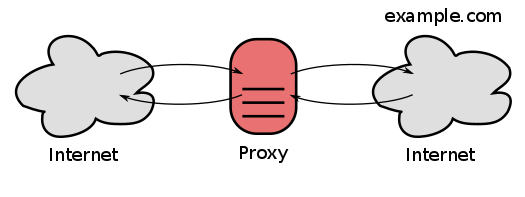
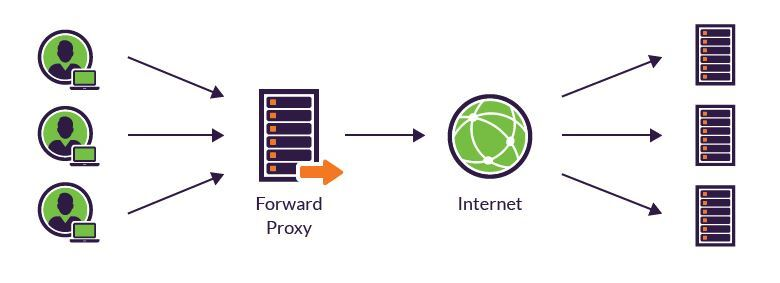
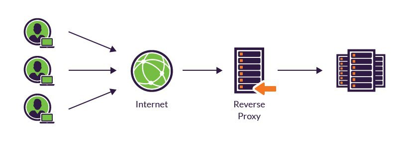
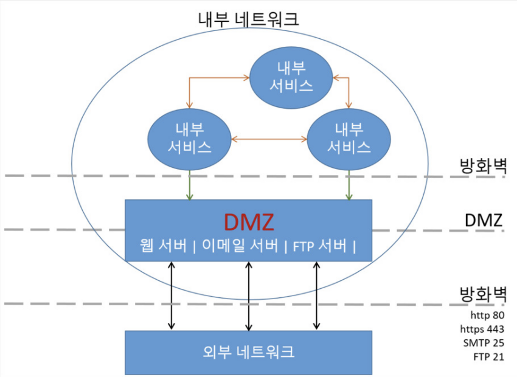

# 프록시

> 프록시 서버

> 종류(포워드 프록시/ 리버스 프록시)

> 목적

## 프록시 서버 (Proxy Server)

> 대신 처리하는 서버 

**프록시 서버**: 클라이언트와 서버 간의 중계 서버로 통신을 대리 수행하는 서버

캐시/보안/트래픽 분산 등 여러 장점을 가질 수 있다.

> 서버와 클라이언트 사이에 중계기로서 대리로 통신을 수행하는 것을 가리켜 `프록시`, 그 중계 기능을 하는 것을 `프록시 서버`라고 부른다.

## 종류 💡

## ✅ 포워드 프록시(Forward Proxy)

클라이언트에서 프록시 서버를 거쳐서 서버로 요청한다. 

> 클라이언트와 인터넷 사이에 위치

> 인터넷 입장에서 `클라이언트`가 감춰진다.

### 특징
### 1. 캐싱: 클라이언트가 요청한 내용을 캐싱
- **전송 시간을 절약**할 수 있다.
- 동시에 불필요하게 외부와의 연결을 하지 않아도 된다. (**불필요한 외부 전송 X**)
- 외부와의 트래픽을 줄이게 됨으로써 네트워크 방목 현상을 방지하는 효과도 얻을 수 있게 된다. (**네트워크 병목 현상 방지**)

### 2. 익명성: 클라이언트가 보낸 요청을 감춤
서버가 응답 받은 요청을 누가 보냈는지 알지 못하게 한다.

### 3. 보안
사내망에서 프록시 서버를 통해서 정해진 사이트만 연결 할 수 있도록 설정 할수 있다. 

> Server가 받은 요청 IP = `Proxy IP`

## ✅ 리버스 프록시 (Reverse Proxy)

클라이언트가 특정 기업 사이트에 데이터를 요청하면 **리버스 프록시**가 이 요청을 받아 내부 서버에서 데이터를 받은 후 클라이언트에 전달한다.

> 인터넷과 서버 사이에 위치

> 인터넷 입장에서 `서버`가 감춰진다.

클라이언트는 내부 서버에 대한 정보를 알 필요 없이 **리버스 프록시**에만 요청하면 된다. 

**리버스 프록시**는 클라이언트가 요청하는 End Point가 리버스 프록시 서버의 도메인이기 때문에 실제 서버의 정보는 알 수 없다.

### 특징
### 1. 캐싱: Forward Proxy와 동일

### 2. 보안: 서버 정보를 클라이언트로부터 숨김
클라이언트는 `Reverse Proxy`를 실제 서버라고 생각하여 요청한다.

- 실제 서버의 IP가 노출되지 않는다.

- 서버에 직접 접근하는 것을 막기 위해 `DMZ`같은 네트워크에 `리버스 프록시`를 구성하여 접근하도록 할 수 있다.

**DMZ**

내부 네트워크에서 외부 네트워크로 직접적인 통신을 막고, 그 사이에 `DMZ`를 위치 시킨다.
즉 `DMZ`는 내부 네트워크와 외부 네트워크 사이에 위치하는 구간을 의미한다. 

이 구간에는 웹 서버, 메일 서버, FTP 서버 등 외부 서비스를 제공하는 서버가 위치한다.

`리버스 프록시 서버`를 `DMZ`에 두고 실제 서비스 서버는 내부망(WAS)에 위치시킨후 서비스를 하는 것이 일반적인 형태이다.

### 3. Load Balancing
> 하는 경우도 있고 하지 않는 경우도 있다.(선택적)

**여러 대의 서버가 분산 처리**할 수 있도록 요청을 나누어주는 서비스 

**Load Balancer 종류**

|:---:|:---:|:---:|
|L2|`Data link 계층` Mac 주소 기반 부하 분산| |
|L3|`Network 계층` IP 주소 기반 부하 분산| |
|L4|`Transport 계층` Port 기반 부하 분산| TCP UDP|
|L7|`Application 계층` 요청(URL)기반 부하 분산| HTTP, HTTPS| 

### 4. 필터링
웹 서버 앞단에서 악의적인 요청을 필터링하는 것이 가능하다.

### 5. 무중단 서비스
한 서버에 장애가 발생했을 때, 다른 서버를 통해 서비스를 제공할 수 있다.

## ✅ 공개 프록시
**공개 프록시**또는 **오픈 프록시**는 누구나 자유롭게 접속하여 사용할 수 있는 프록시 서버를 말한다.

공개 프록시를 사용하면 자신의 IP주소를 남기지 않고 익명으로 활동하기가 쉽기 때문에, `크래킹`, `악성 코드` 또는 `바이러스 유포`, `불법 행동` 등에 악용되기 쉽다. 
따라서 많은 프로그램은 공개 프록시를 검출하여 사용을 금지한다. 

## 목적
`프록시 서버`의 사용 목적은 잠재적으로 다양하다.

- **익명**으로 컴퓨터를 유지(주로 **보안**을 위하여)
- **캐시**를 사용하여 리소스로의 접근을 빠르게 하기 위해. (웹 프록시는 웹 서버로부터 웹 페이지를 캐시로 저장하는데 흔히 쓰인다.)
- **네트워크 서비스나 콘텐츠로의 접근 정책**을 적용하기 위해 (ex. 원치 않은 사이트를 차단)
- **사용률을 기록하고 검사**하기 위해(ex. 회사는 인터넷 이용을 파악)
- **보안 및 통제를 뚫고** 나가기 위해
- 바이러스 전파, 악성 루머 전파, 다른 정보들을 빼낼 목적으로
- 역으로 IP 추적을 당하지 않을 목적으로
- 전달에 앞서 악성 코드를 목적으로 전달된 콘텐츠를 검사하기 위해
- 밖으로 나가는 콘텐츠를 검사하기 위해(데이터 유출 보호)
- **지역 제한을 우회**하기 위해

### 📚 참고
[웹 프록시](https://ko.wikipedia.org/wiki/%ED%94%84%EB%A1%9D%EC%8B%9C_%EC%84%9C%EB%B2%84#%EB%A6%AC%EB%B2%84%EC%8A%A4_%ED%94%84%EB%A1%9D%EC%8B%9C)

[리버스 프록시](https://github.com/NKLCWDT/cs/blob/main/Network/%ED%94%84%EB%A1%9D%EC%8B%9C.md)

[로드 밸런싱](https://deveric.tistory.com/91)

[10분 테코톡: Forward Proxy, Reverse Proxy](https://www.youtube.com/watch?v=YxwYhenZ3BE)

## Summary

***

 

# ⁉️ 면접 예상 질문

> 1. Proxy란 무엇이고 왜 사용하나요?

> 2. Proxy server의 종류에는 무엇이 있나요?

> 3. 포워드 프록시/ 리버스 프록시 란 무엇이고 특징에 대해 설명해주세요.