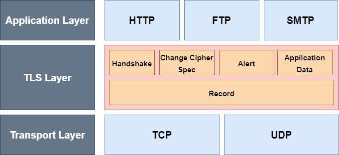
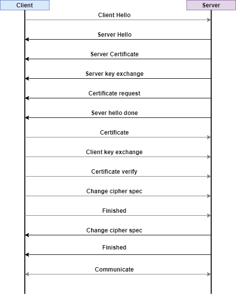

# 🔒 SSL
### 📚 Table of contents
> SSL과 TLS

> 공개키(비대칭키), 비공개키(대칭키)

> SSL 동작방식

> Handshake

## 🔑 SSL과 TLS
SSL(Secure Sockets Layter)와 TLS(Transport Layer Security)은 같은 것이라고 할 수 있다. SSL은 TCP/IP 암호화 통신에서 사용되는 규약이고 SSL 3.0 버전 이후에는 IETF에서 TLS 1.0으로 규정했습니다.

암호화는 텍스트를 누구나 읽지 못하도록 하기위해서 암호화하는 알고리즘이며 키는 암호화 동작을 변경하는 매객변수 역할을 하며 키에 따라서 암호가 달라지므로 키를 모르면 복호화가 불가능하다. 

SSL 암호화 방법
- 대칭키
- 공개키

## 공개키 암호화 (비대칭키 암호 알고리즘)
> 

공개키 암호화 방식은 두개의 키를 사용한다. 두 키중에서 하나를 개인키(private key, 비공개키)라고 하며 나머지 하나를 공개키(public key)라고 한다. 공개키로 암호화하고 공개키와 매칭되는 개인키로만 복화할 수 있으며, 공개키는 누구든지 알아도 상관 없고, 개인키는 복호화하는 쪽만 알 수 있도록 해야 한다.

쉽게 말해서 `암호화할 때와 복호화할 때 이용하는 키가 다른 키, 비대칭인 암호화 방식이 공개키 암호화이다.`


### 공개키 암호화 종류(참고)
- RSA
- ElGamal
- ECC(Eliptic Curve Crytosystems)
- Digital Signature(전자서명)

### 공개키 암호화와 전자서명의 비밀키와 공개키의 역할은 다르다.
공개키 암호화 방식은 두 키를 사용한다. 대략적으로 말하면 암호화(평문 암호화)만 할 수 있는 키(공개키), 그리고 복호화(암호문을 평문으로)만 할 수 있는키(비밀키, 비공개키)를 구분하여 공통키 암호방식의 문제인 운송문제를 해결하는 방법입니다.
공개키 알고리즘
```
1. 키 생성 ...암호화 키 E(공개키)와 복호화 키 D(비밀키)를 준비한다.
2. 암호화  ...암호화 키 E를 사용하여 평문 M을 암호문 C로 변환 할 수 있다.
3. 복호화  ...복호화 키 D를 사용하여 암호문 C를 평문 M으로 변환할 수 있다.
```

전자서명의 비밀키는 `평문을 사용하여 서명`하기 위한 것이고, 공개키는 `서명이 올바른지 검증`하는 것이다. 즉 공개키 암호화에서의 비밀키와 공개키의 역할과는 전혀 다르다.

> 

```
1. B는 CA에게 자신이 B임을 증명하고 자신의 공개키가 B의 공개키가 맞음을 인증하는 인증서 발급한다.
2. A에게 B의 공개키가 포함된 이 인증서를 준다.
3. 이를 받은 A는 자신이 신뢰할 수 있는 CA에게 CA가 발급한 인증서인지 확인한다.
4. 맞으면 그 인증서에 포함된 B의 공개키로 데이터를 암호화해서 B에게 전달한다.
```

## 비공개키 암호화
>

비대칭키와는 반대로 대칭키라고 한다. a, b사이에 private key 1개를 공유하고 그 키를 통해서 암호화 복호화한다. 만약에 "ABCD"라는 키로 암호화를 하면 복호화시에 "ABCD"를 입력해야한다. 대칭키를 누군가 도청하거나, 유출된다면 암호화된 데이터를 알아낼 수 있다. 비공개키의 하나의 종류로 블록 암호 알고리즘이 있다. 대칭키 알고리즘으로 암,복호화 시 데이터를 블록 단위로 처리하는 알고리즘으로 SSL/TLS에서 많이 사용된다.

## 대칭키 비대칭키 암호화 장단점
대칭키 암호화는 서버와 클라이언트가 같은 키를 사용해야 하므로 키를 공유하는데 문제가 있고, 비대칭키 암호화는 공개키를 배포함으로써 키 공유 문제는 해결되지만, 처리 속도가 느린 문제가 있다. HTTPS 통신에서 실제 전송되는 데이터의 암호화에는 대칭키 암호화 방식을 사용하고, 키 교환에는 비대칭키 암호화를 사용하여 이러한 문제를 해결하고 있다.


## SSL 동작 방식
SSL의 동작 방식을 알기 위해서는 인증기관에 대하여 알아야 한다. 

### 🏢 인증 기관(Certification Authority)
HTTPS 통신에서는 제3자 인증을 사용한다. 인증기관 CA로부터 공인 인증서를 발급받아서 서버에 설치해야 경고 없이 HTTPS 통신을 할 수 있다. 인증기관의 인증을 받았다는 것은 웹 서비스를 제공하는 소유자를 보증해준다는 의미이다. 자세히는 웹 서비스 제공자의 공개키가 키 소유자의 것이라는 것을 보증해주는 것이다.

HTTPS로 웹서비스를 제공하려는 사람은 자신의 공개키와 개인키를 생성하고, 공개키를 인증기관에 보낸다. 인증기관에서는 보내온 공개키, 유효기간, 도메인 등의 정보를 포함하여 인증기관의 개인키로 전자서명한 인증서를 발급한다.

웹서비스 제공자는 발급받은 인증서와 자신의 개인키를 웹서버에 설정하여 HTTPS 통신을 할 수 있게 된다.

클라이언트 즉, 웹 브라우저에는 이미 여러 인증기관의 공개키를 포함한 인증서가 이미 설치되어 있다. 그래서 웹서버와 통신시 인증기관의 개인키로 서명된 인증서를 받았을 때 이미 설치되어 있는 인증기관의 공개키로 복호화가 가능한 것이다.

---
인증기관으로부터 인증서를 발급받아서 웹서버에 설치하고 HTTPS 통신이 가능한 상태라고 가정한다.

1. 사용자가 웹브라우저로 사이트에 접속하면 웹서버는 인증서를 웹 브라우저에게 보낸다. 이 인증서에는 인증기관의 개인키로 암호화된 사이트의 정보와 공개키가 들어있다.
2. 웹 브라우저는 이미 가지고 있는 인증기관의 공개키로 웹 서버에서 받은 인증서를 복호화해서 확인한다.
3. 웹 브라우저는 실제 데이터의 암호화에 사용될 대칭키를 생성하고, 인증서에서 꺼낸 웹 서버 측의 공개키로 암호화해서 웹 서버로 보낸다.
4. 웹 서버는 자신이 가지고 있는 개인키로 웹 브라우저가 보내온 대칭키를 복호화해서 얻습니다. 이제 이 대칭키로 데이터를 암호화해서 주고 받게 된다.

실제 데이터 전송을 위해 웹 브라우저가 지원하는 암호화 방식과 서버가 지원하는 암호화하는 방식들 중 둘 다 지원하는 암호화 방식을 선택하는 등의 많은 작업이 있고, 키 교환도 다른 방식이 있을 수 있다.

## SSL Handshake
앞서 언급한 것과 같이 대칭키를 공유할 때 외부로의 노출이 발생하게 된다. 만약 이 키를 중간에서 가로채는 일이 발생하게 되면 안되기 때문에, 우리는 대칭키 대신에 비대칭키로 암호화 통신을 하면 되지 않을 것인가 생각한다. 하지만 너무 느리고 비효율적이다. 그래서 처음에 대칭키를 교환할 때만 비대칭키 암호를 사용하는데, TLS가 바로 그렇게 동작한다.
### TLS에서 제공하는 보안 서비스
1. 기밀성
    - 대칭키 암호를 사용하게 되면 기밀성을 제공할 수 있다. 남들이 데이터를 훔쳐가도 볼 수 없는 비밀을 제공한다.
2. 무결성
    - 메시지 인증코드(MAC: Message Authentication Code)를 통해서 메시지 인증을 제공한다. 변조 여부 확인 가능.
3. 인증
    - 연결 초기 설정에서 주고 받는 인증서를 통해서 신회할 수 있는 개체인지 인증할 수 있다.

TLS는 전송 계층 위에서 TLS 계층을 따로 두어 동작하게 된다. TLS를 사용하는 어플리케이션 프로토콜은 끝에 s가 붙게되는 TLS기반 HTTP -> HTTPS, TLS기반 FTP -> FTPS.
> 

### TLS의 세부 프로토콜

|프로토콜|내용|
|-------|----|
|Handshake|양쪽 간에 연결을 설정할 때 보안 협상을 위한 프로토콜이다.|
|Change cipher spec|보안 파라미터를 변경하거나 적용할 때 사용한다. 예를 들어 대칭키 알고리즘을 변경할 때 이프로토콜이 사용된다.|
|Alert|오류를 전송할 때 사용되는 프로토콜이다.|
|Application Data|실제 데이터가 전송될 때 사용되는 프로토콜이다.|
|Record|협상된 보안 파라미터를 이용하여 암, 복호화, 무결성 검증등을 수행하는 프로토콜이다.|

### 상태 유지(stateful) 프로토콜
TLS는 세션과 연결별로 상태정보를 유지한다. TLS는 full handshake를 통해서 세션을 생성하고 이 세션 정보를 공유하는 여러 연결을 abbreviation handshake를 통해서 성립한다.
Full hanshoke는 아래 그림과 같이 설명한다. Abbreviation handshake는 세션이 이미 존재할 때 사용하는 handshoing 방식이다.
- 연결
    - 서버와 클라이언트 간 통신의 단위
- 세션 
    - 연결의 다수로 이루어지고 세션은 한번 성립되면 다음 연결을 위해서 상태 유지를 할 수 있다.
> 


1. client -> server/ `client hello`

Client가 서버에 접속할 때 
- random 
    - 클라이언트는 32바이트 난수값을 전달, 이 랜덤값은 비밀 데이터를 위해서 사용한다. 비밀 데이터 = master secret
- session ID
    - 세션을 처음 생성할 때는 빈 값, 이미 생성된 세션이 있다고면 그 세션 ID를 전달한다.
- cipher suite
    - 클라이언트가 지원 가능한 키 교환 알고리즘, 대칭키 암호 알고리즘, 해시 알고리즘 등을 알려준다. 이중 최적의 방식을 선택


2. server -> client/ `server hello`

사용할 TLS버전, 클라이언트, 서버 공통으로 지원 가능한 최적의 cipher suite, 압축방식 등을 client에게 전달. 
- random
    - 역시 server도 32바이트 난수 생성해서 client에게 전달. master secret = 비밀값 생성할 때 사용하는 것.
- session ID
    - 세션 정보

3. server -> client/ `Server certificate`

아까 TLS가 인증(기밀성, 무결성, 인증) 서비스를 제공한다고 했는데, 이 인증서를 통해서 서버가 믿을만한 서버인지 확인한다.

4. server -> client/ `Server Key exchange`

키 교환에 필요한 정볼르 제공한다. 만약 필요없다면 생력가능하다. 하지만 diffie-hellman을 키교환 알고리즘으로 이용한다면 소수, 원시근 등이 필요하기 때문에 이런 데이터 전송 용도.

5. server -> client/ 
`Certificate request`

서버 역시 클라이언트를 인증해야할 때 인증서를 요구할 수 있다. 요청하지 않을수도 있다.

6. server -> client/ `Server hello done`

서버의 인사 마무리.

7. client -> server/ `Certificate`

방금 전 서버가 요청했던 인증서를 줄 수 있다. 요청하지 않았다면 필요없는 과정이다.

8. client -> server/ `Client key exchange`

키교환에 필요한 정보를 서버에 제공. 이정보를 pre-master secret이라고 하는데 이게 대칭키에 사용되는 것으로 노출되면 안된다. pre-master secret은 이전에 서버로부터 받은 랜덤값을 조합하여 서버에게 전송한다. 암호화하여 보내야하기 때문에 이전에 받은 인증서 내부의 공개키로 암호화하여 전송한다. 클라이언트는 자기가 생성했으니 이미 가지고 있고, 서버가 무사히 암호화된 pre-master secret을 받았다면 자신의 개인키로 복호화할 수 있다. 이제 서로가 pre-master secret을 공유하고 있고 이 과정을 거쳐 client/server는 master secret으로 만들게 된다.
client/server는 master secret으로 세션에 사용될 키를 생성하는데, 이 키가 바로 대칭키이다.
9. client -> server/ `Certificate Verify`
클라이언트에 대한 certificate request를 받았다면 보낸 인증서에 대한 개인키를 가지고 있다는 것을 증명한다. handshake과정에서 주고 받은 메시지 + master secret을 조합한 hash값에 개인티로 디지털 서명하여 전송한다.
10. client -> server/ `Change cipher spec`
협상된 보안 파라미터를 적용하거나 변경할 때 서버에게 알린다.
11. client -> server/ `Finished`
클라이언트 끝.
12. server -> client/ `Change cupher spec`
클라이언트에게 보안 파라미터 변경을 알린다.
13. server -> client/ `Finished`
서버 끝.

14. server <-> client/ `통신`

<br><br><br>

### 참고
[SSL동작 방식](https://blog.naver.com/PostView.nhn?isHttpsRedirect=true&blogId=leejongcheol2018&logNo=221449123851)
<br>

[공개키 암호 방식](https://ko.wikipedia.org/wiki/%EA%B3%B5%EA%B0%9C_%ED%82%A4_%EC%95%94%ED%98%B8_%EB%B0%A9%EC%8B%9D)
<br>

[전자서명과 공개키암호화의 차이](https://perfectmoment.tistory.com/2098)
<br>

[SSL handshake](https://reakwon.tistory.com/106)
***

## 🍉 Summary
### SSL과 TLS
### 공개키, 비공개키
### SSL 동작방식
### SSL handshake

<br><br>

## ⁉️ 면접 예상 질문
> 1. SSL과 TLS에 대해서 설명하시오.

> 2. 공개키 암호화 알고리즘에 대해서 설명하시오.

> 3. SSL 동작 방식은 어떻게 되나요?

> 4. SSL handshake에 대해서 설명하세요.

