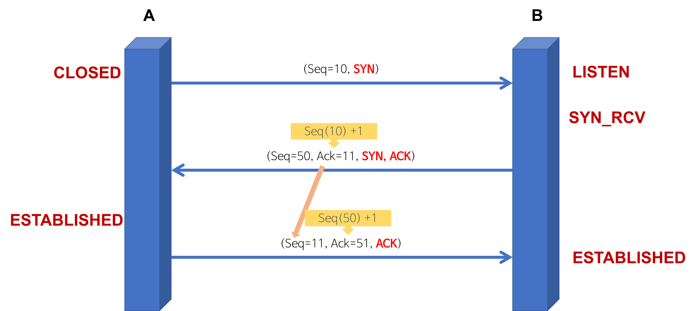
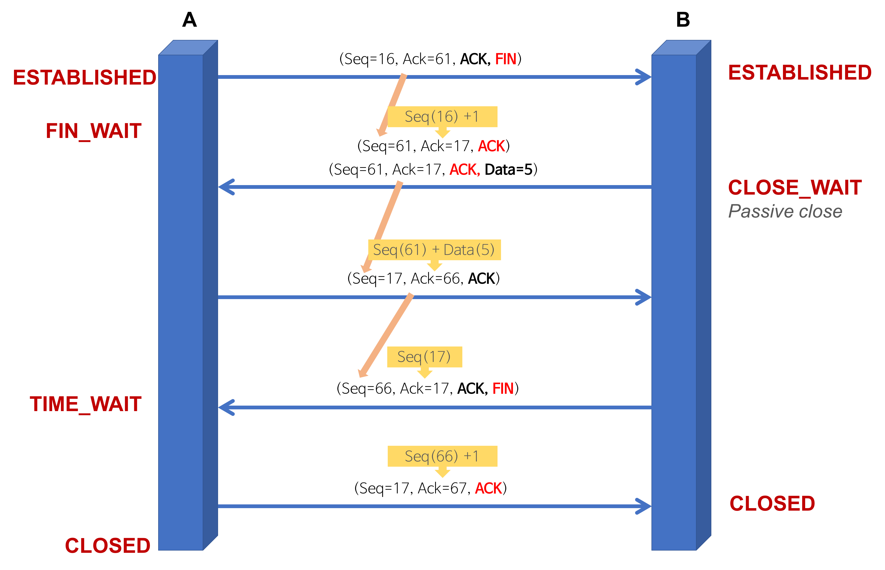

# TCP 3 way handshake & 4 way handshake

> 3 Way Handshake

> 4 Way Handshake

## 3 way handshake - 연결 성립
TCP는 통신하기에 앞서, 논리적인 접속을 성립하기 위해 `3 way handshake` 과정을 진행한다. 

**1. A -> B:SYN(flag)**
- 클라이언트는 서버에게 연결 요청 메세지 전송(`SYN`)
- 송신자가 최초로 데이터를 전송할 때 **Sequence Number**를 임의의 랜덤 숫자로 지정하고, `SYN` 플래그 비트를 1로 설정한 세그먼트를 전송한다. 
- 이때 서버는 **Listen 상태**로 포트 서비스가 가능한 상태여야 한다.
- PORT 상태:  **A**-`CLOSED`, **B**-`LISTEN`

**2. B -> A: SYN+ACK**
- 접속 요청을 받은 서버가 요청을 수락했으며, 클라이언트도 포트를 열어달라는 메세지를 전송(`SYN+ACK`)
- 수신자는 **Acknowledgement Number** 필드를 **Seqeunce Number + 1**로 지정하고(이 번호를 전송하므로써 잘 받았다는 것을 알려준다), `SYN과 ACK` 플래그 비트를 1로 설정한 세그먼트를 전송한다. 동일하게 **Sequence Number**도 지정해서 보낸다. 
- PORT 상태: **A**-`CLOSED`, **B**-`SYN_RCV`

**3. A -> B: ACK**
- PORT 상태: **A**-`ESTABLISHED`, **B**-`SYN_RCV`
- 마지막으로 클라이언트가 수락 확인을 보내 연결을 맺음(`ACK`)
- **Acknowledgement Number** 필드를 **Seqeunce Number + 1**로 지정하고
- 이후로 부터 연결이 이루어지고 데이터가 오가게 된다.  
- PORT 상태: **A**-`ESTABLISHED`, **B**-`ESTABLISHED`

## 4 way handshake - 연결 해제
연결 성립 후 모든 통신이 끝났다면 해제해야 한다.

**1. A -> B: FIN**
- 클라이언트는 연결을 종료하겠다는 `FIN` 플래그를 전송
- 서버가 `FIN` 플래그로 응답하기 전까지 연결을 계속 유지한다.
- 이때 클라이언트는 `FIN_WAIT` 상태가 된다.  

**2. B -> A: ACK**
- 서버는 `FIN`플래그를 받고 일단 확인 메세지를 보내고 자신의 통신이 끝날 때까지 기다린다. 
- 서버는 `CLOSED_WAIT` 상태다.
- 수신자는 **Acknowledgement Number** 필드는 **Sequence Number + 1**로 지정하고, ACK 플래그 비트를 1로 설정한 세그먼트를 전송한다. 
- 그리고 자신이 전송할 데이터가 남아있다면 이어서 계속 전송한다.

**3. B -> A: FIN**
- 서버가 통신이 끝났으면 연결 종료 요청에 합의한다는 의미로 클라이언트에게 `FIN` 플래그를 전송

**4. A -> B: ACK**
- 클라이언트 해지 준비가 되었다는 `ACK`를 확인했다는 메세지 보낸다. 
- 클라이언트의 ACK 메세지를 받은 서버는 **소켓 연결을 close**한다.
- 클라이언트는 아직 서버로부터 받지 못한 데이터가 있을 것을 대비해 일정 시간동안 세션을 남겨놓고 잉여 패킷을 기다리는 과정을 거친다. (`TIME_WAIT`)
- 클라이언트의 상태가 `FIN_WAIT` -> `TIME_WAIT`으로 변경된다. 

### 포트(PORT) 상태 정보
- CLOSED: 포트가 닫힌 상태
- LISTEN: 포트가 열린 상태로 연결 요청 대기 중
- SYN_RCV: SYN 요청을 받고 상대방의 응답을 기다리는 중
- ESTABLISHED: 포트 연결 상태

### 플래그 정보
TCP Header에는 `control bit`가 존재하며 각각의 bit는 `URG-ACK-PSH-RST-SYN-FIN`의 의미를 가진다. 

즉 해당 위치의 bit가 1이면 해당 패킷이 어떠한 내용을 담고 있는 패킷인지를 나타낸다.

- SYN(Synchronize Sequence Number) `000010`
    - 연결 설정
    - Sequence Number를 랜덤으로 설정하여 세션을 연결하는데 사용하며, 초기에 Sequence Number을 전송한다.
- ACK(Acknowledgement) `010000`
    - 응답 확인
    - 패킷을 받았다는 것을 의미한다. 
    - Acknowledgement Number 필드가 유효한지를 나타낸다.
    - 양단 프로세스가 쉬지 않고 데이터를 전송한다고 가정하면 최초 연결 설정 과정에서 전송되는 첫번째 세그먼트를 제외한 모든 세그먼트의 ACK 비트는 1로 지정된다고 생각 할 수 있다. 
- FIN(Finish) `00001` 
    - 연결 해제
    - 세션 연결을 종료시킬 때 사용되며, 더 이상 전송할 데이터가 없음을 의미한다. 

## 왜 Sequence Number를 난수로 설정할까?
처음 클라이언트에서 `SYN` 패킷을 보낼 때 Sequence Number에는 랜덤한 숫자가 담겨진다. 초기 sequence number를 ISN이라고 한다. ISN을 0부터 시작하지 않고 난수로 생성해서 설정하는 이유는 

Connection을 맺을 때 사용하는 포트는 유한 범위 내에서 사용하고 시간이 지남에 따라 재사용된다. 따라서 두 통신 호스트가 과거에 사용된 포트 번호 쌍을 사용하는 가능성이 존재한다.

서버 측에서는 패킷의 SYN를 보고 패킷을 구분하게 되는데 난수가 아닌 순차적인 number가 전송된다면 이전의 connection으로부터 오는 패킷으로 인식할 수 있다. 

이러한 문제가 발생할 가능성을 줄이기 위해서 난수로 ISN을 설정하는 것이다.

***

## Summary

***

 

# ⁉️ 면접 예상 질문

> 1.  3-way handshaking이란?

> 2. 3-way handshaking의 과정에 대해 설명해주세요.

> 3. 4-way handshaking이란?

> 4.  4-way handshaking의 과정에 대해 설명해주세요.