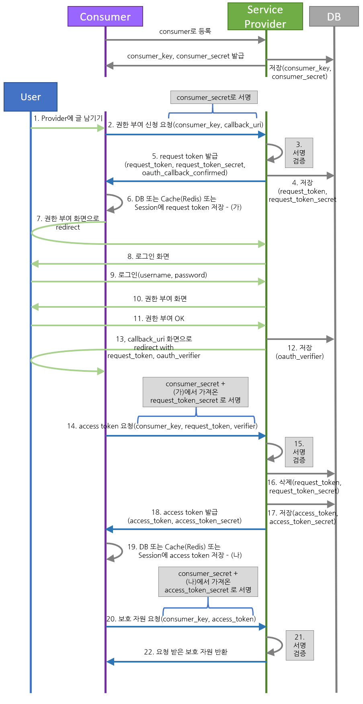
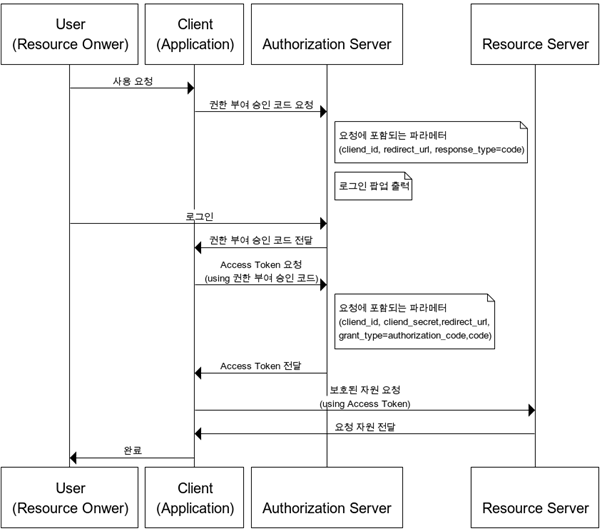
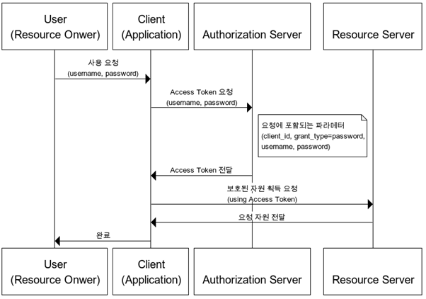
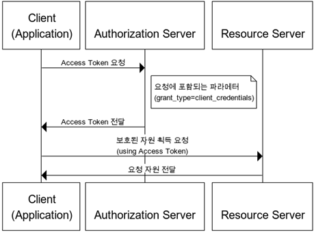

# 🔑 OAuth

### 📚 table of Contents
> OAuth 란?

> OAuth 1.0 Vs. 2.0

> OAuth 1.0

> OAuth 2.0


## 🔑 Oauth란?
웹 서핑을 할 때 간편히 회원 가입 및 로그인 할 수 있는 웹 어플리케이션을 쉽게 찾아볼 수 있다. 연동되는 외부 웹 애플리케이션에서 facebook 및 twitter 등이 제공하는 기능을 간편하게 사용할 수 있는 장점이 있다. 
위와 같은 편한 기능을 사용할 때 사용되는 프로토콜이 oauth이다. 

> OAuth란 인터넷 사용자들이 비밀번호를 제공하지 않고 다른 웹사이트 상의 자신들의 정보에 대해 웹사이트나 애플리케이션의 접근 권한을 부여할 수 있는 공통적인 수단으로서 사용되는 접근 위임을 위한 개방형 표준이다.(wikipedia)

oauth는 쉽게 말해서 다른 서비스의 회원 정보를 안전하게 사용하기 위한 방법이라고 생각하면 된다. 여기에 안전하게의 주체는, 회원 정보를 가지고 있는 주체, 우리의 고객이다. 즉, 고객이 안전하게 다른 서비스의 정보를 우리 서비스에 건네주기 위한 방법이다. 고객이 자신의 네이버 아이디, 비밀번호를 우리 서비스에 알려주지 않아도, 네이버에 있는 고객의 정보를 우리 서비스에서 안전하게 사용하기 위한 방법이다.

하지만 oauth는 인증 authentication만 사용하는 것이 아니라 '허가 Authorization' 또한 포함하고 있다 그렇기 때문에 OAuth 인증을 진행할 때 해당 서비스 제공자는 '제 3자~' 안내 메시지를 보여주는 것이다. 

___일반적인 로그인과 OAuth를 이용한 로그인의 차이점이 있습니다.___
> 일반 로그인은 회원가입 할 때 사용했던 아이디와 비밀번호를 통한 Authentication이라면 OAuth를 통한 로그인은 타사 서비스(네이버, 카카오, 구글)의 계정 정보에 우리가 만든 서비스의 접근을 Authorization을 줘서 사용자를 Authentication을 하는 것 입니다.

Authentication/인증
- 유저가 누구인지 확인하는 절차

Authorization/인가
- 유저에 대한 정보 권한을 허락하는 것

<br><br><br>

## OAuth 1.0과 2.0 차이점
|항목|OAuth 1.0|OAuth 2.0|
|---|----------|---------|
|역할|User<br>Consumer<br>Service Provider|Resource Owner<br>Client<br>Resource Server<br>Authorization Server|
|토큰|Request Token<br>Access Token|Access Token<br>Refresh Token|
|open API 호출 및 보안|서명|HTTPS 기본<br>서명:Resource Server가 별도로 서명을 요구하는 경우|
|유효기간|Access Token 유효기간 없음|Access Token 유효기간 부여 [Refresh Token](CookieSessionJWT.md)에서 배운 내용 떠올리시면 될 것 같습니다.|

<br><br><br>

## 🔑 OAuth 1.0
### OAuth1.0 대표 용어
|용어|설명|
|---|---|
|User|Service Provider에 계정을 가지고 있으면서, Consumer를 이용하려는 사용자(~로 로그인하기를 이용하는 나)|
|Service Provider|OAuth를 사용하는 Open API를 제공하는 서비스(네이버, 카카오, 구글)|
|Consumer|OAuth 인증을 사용해 Service Provider의 기능을 사용하려는 애플리케이션이나 웹 서비스(구글로 로그인하기를 쓰려는 사이트나 앱)|
|Request Token|Consumer가 Service Provider에게 접근 권한을 인증받기 위해 사용하는 값. 인증이 완료된 후에는 Access Token으로 교환한다.|
|Access Token|인증 후 Consumer가 Service Provider의 자원에 접근하기 위한 키를 포함한 값|

## 🔑 OAuth 1.0 진행 과정

> Oauth 1.0a
> 

> 

1. User가 Consumer에 글을 쓰고 ‘Service Provider에도 남기기’ 버튼을 누른다.

2. Consumer는 자신의 등록 정보를 바탕으로 Signature를 만들고 Service Provider에게 Signature를 보내서 사용자로부터 권한 부여 요청을 받았음을 Service Provider에게 알리고, Service Provider는 권한 부여 요청을 확인했다는 임시 증표(Request Token)를 저장하고 Request Token을 Consumer에게 발급한다. (1)

3. Consumer는 권한 부여 요청 확인 증표(Request Token)와 함께 User의 요청을 Service Provider의 인가(권한 부여) 화면으로 리다이렉트한다.

4. User가 Service Provider에 로그인 한 상태가 아니라면 로그인 한다. (2)

5. 인가 화면에는 ‘Consumer에게 권한 부여’ 버튼이 표시된다.

6. User가 ‘Consumer에게 권한 부여’ 버튼을 클릭하면, Service Provider는 User가 (Request Token을 확인하고) Consumer에게 권한을 부여했음을 확인하고, 확인 코드(Verifier 또는 Authorization_code)를 저장 및 User에게 반환하고 Consumer가 제공하는 callback 화면으로 리다이렉트한다. (3)

7. 리다이렉트를 통해 권한 부여 확인 코드를 전달 받은 Consumer는 Consumer Key, Request Token, Verifier 등을 대상으로 Consumer Secret, Request Token Secret를 이용해서 Signature를 만들고 Service Provider에게 Signature를 보낸다.

8. Service Provider는 Consumer가 보낸 Signature를 확인하고 User만 접근할 수 있었던 보호 자원에 대한 접근 증표(Access Token)를 Consumer에게 발급한다.

9. 이후 Consumer는 Access Token를 Service Provider에게 보여주면서 User를 대신해서 보호 자원에 접근한다.


회사 방문 과정이라고 가정하고 어떤식으로 oauth가 진행되는지 살펴보자. [출처](https://d2.naver.com/helloworld/24942)

|회사 방문 과정|OAuth 인증 과정|
|---|---|
|1. 나방문씨가 안내데스크에서 업무적인 목적으로 김목적씨를 만나러 왔다고 말한다.|Request Token의 요청과 발급|
|2. 안내 데스크에서는 김목적씨에게 나방문씨가 방문했다고 연락한다.|사용자 인증 페이지 호출|
|3. 김목적씨가 안내 데스크로 찾아와 나방문씨의 신원을 확인해 준다.|사용자 로그인 완료|
|4. 김목적씨는 업무 목적과 인적 사항을 안내 데스크에서 기록한다.|사용자의 권한 요청 및 수락|
|5. 안내 데스크에서 나방문 씨에게 방문증을 발급해준다.|Access Token 발급|
|6. 김목적씨와 나방문씨는 정해진 장소로 이동해 업무를 진행한다.|Access Toekn을 이용해 서비스 정보 요청|

`Access Token-방문증`

<!-- ### Request Token
OAuth에서 Consumer가 Request Token 발급을 요청하고 Service Provider가 Request Token을 발급하는 과정은 `1번. 나방문씨가 안네데스크에 김목적씨 만나러 왔다고 말하는` 절차이다. Request Token의 Request 절차는 아래와 같다.
```
GET /naver.oauth?mode=req_req_token&oauth_callback=http://example.com/OAuthRequestToken.do&oauth_consumer_key=WEhGuJZWUasHg&oauth_nonce=zSs4RFI7lakpADpSsv&oauth_signature=wz9+ZO5OLUnTors7HlyaKat1Mo0=&oauth_signature_method=HMAC-SHA1&oauth_timestamp=1330442419&oauth_version=1.0 HTTP/1.1  
Accept-Encoding: gzip, deflate  
Connection: Keep-Alive  
Host: nid.naver.com  
```
### Access Token 사용하기
이제 방문증이 발급되면 출입문을 통과하는 일만 남았다. 방문증을 가지고 출입문을 통과한다는 것은 User의 권한으로 Service Provider의 기능을 사용하는 것과 비슷하다. 다시 말해, 권한이 필요한 오픈 API를 호출할 수 있게 되는 것이다. 

호출하는 URL의 예시는
`http://openapi.naver.com/특정항목/getMenuList.xml` -->

<br><br><br>

## 🔑 OAuth 2.0
### OAuth 2.0 대표 용어
|용어|설명|
|----|---|
|Resource Server|OAuth2.0 서비스를 제공하고 자원을 관리하는 서버(구글,카카오, 네이버 등등)|
|Authorization Server|Client가 Resource Server의 서비스를 사용할 수 있게 인증하고 토큰을 발급해주는 서버(구글, 카카오, 네이버 등)|
|Resource Owner|Resource Server의 계정을 소유하고 있는 사용자|
|Client|Resource Server의 API를 사용하여 데이터를 가져오려고 하는 사이트|
|Access Token|Resource Server에 자원을 요청할 수 있는 토큰|
|Refresh Token|Authorization Server에 Access Token을 요청할 수 있는 토큰|
```
Resource Server : 카카오 서버, 자원을 담당하는 서버
Authorization Server : 카카오 서버, 권한을 담당하는 서버
Resource Owner : 사용자(나)
Client : 모르는 사람이 만든 사이트
```

### OAuth 2.0 인증 방식의 종류

|종류|설명|
|----|---|
|Authorization Code Grant|- Client가 다른 사용자 대신 특정 리소스에 접근을 요청할 때 사용<br>- resource 접근을 위해, Authorization Server에서 받은 권한 코드로 리소스에 대한 액세스 토큰을 받는 방식<br>- 다른 인증 절차에 비해 보안성이 높기에 주로 사용된다.|
|Implicit Grant|- Authorization Code Grant와 다르게 권한 코드 교한 단계가 있다. <br>- Access Token을 즉시 반환 받아 이를 인증에 이용하는 방식|
|Resource Owner Password Credentials Grant|- Client가 암호를 사용하여 액세스 토큰에 대한 사용자의 자격 증명을 교환하는 방식<br>- Resource Owner에서 id, pwd를 전달받아 Resource Server에 인증하는 방식으로 신뢰할 수 있는 client에서 가능|
|Client Credentials Grant|- Client가 컨텍스트 외부에서 Access Token을 얻어 특정 리소스에 접근을 요청할 때 사용하는 방식|

### Authorization Code Grant

권한 부여 승인을 위해 자체 생성한 authorization code를 전달하는 방식으로 많이 쓰이고 기본이 되는 방식이다. 간편 로그인 기능에서 사용되는 방식으로 클라이언트가 사용자를 대신하여 특정 자원에 접근을 요청할 때 사용되는 방식이다. 보통 타사의 클라이언트에게 보호된 자원을 제공하기 위한 인증에 사용된다. refresh token의 사용이 가능한 방식이다.

> 

```
1. client에서 Authorization server로 권한 부여 요청을 보낸다.
2. 로그인 팝업창이 전달되면 사용자는 로그인을 한다.
3. 로그인 정보가 맞다면 권한 부여 승인 코드를 client에 전달한다.
4. client는 authorization code를 통해 access token 발급을 요청한다.
5. authorization server는 자기가 가지고 있는 client id, client secret, authorization code를 전달받은 정보와 비교하여 동일할 때 access token을 전달한다.
6. client는 resoruce server에게 인증을 위한 access token을 전달하면서 필요한 자원을 요청한다.
7. resource server는 access token이 유효하면 해당 자원을 제공한다.
```
- redirect_uri :인증 승인 이후 redirect될 url
- response_type :사용을 원하는 grant type 설정
    - code :authorization code
    -  token :implicit

### Implicit Code Grant

자격증명을 안전하게 저장하기 힘든 클라이언트(javascript등)에게 최적화된 방식이다. 암시적 승인 방식에서는 권한 부여 승인 코드 없이 바로 access token이 발급된다. Access token이 바로 전달되므로 만료기간을 짧게 설정하여 누출의 위험을 줄일 필요가 있다. Refresh token의 사용이 불가능한 방식이며, 권한 서버는 client secret을 사용해 클라이언트를 인증하지 않는다.

> 

```
1. Client가 인증서버에게 사용자 로그인 및 권한 동의 웹 페이지를 요청한다.
2. 로그인 팝업창이 전달되면 사용자는 로그인을 합니다.
3. 로그인 정보가 맞다면 Redirect URL로 Authorization Code가 아니라 Access token을 전달한다.
4. 획득한 Access token으로 Resource Server에 API 요청을 보낸다.
```

### Resource Owner Password Credentials Grant

간단하게 username, pwdfh access token을 받는 방식이다. refresh token 사용 가능하다. 중요한 점은 서버, 리소스 서버, 클라이언트가 모두 같은 시스템에 속해 있을 때 사용되어야 하는 방식이다.
> 

```
1. Resource Owner는 인증정보를 client에게 직접 전달한다.
2. Client는 앞서 받은 인증 정보를 Authorization Server로 전송하여 Access token을 발급받는다.
3. 획득한 Access token으로 Resource Server에 API 요청을 보낸다. 이방식은 Resource Owner의 id, pwd가 client에게 그대로 노출되므로 client와 service provider가 같은 도메인, 솔류션 내에 존재하여 서로 신뢰할 수 있는 경우 사용한다.
```

### Client Credentials Grant

Oauth 2.0의 권한 부여 방식 중 가장 간단한 방식으로 클라이언트의 자격증명만으로 access token을 획득하는 방식이다. 이 방식은 자신이 관리하는 리소스 혹은 권한 서버에 해당 클라이언트를 위한 제한된 리소스 접근 권한이 설정되어 있는 경우 사용된다. 이 방식은 자격 증명을 안전하게 보관할 수 있는 클라이언트에서만 사용되어야 하고, refresh token은 사용할 수 없다.

> 


<br><br><br>

### 📚 참고

[ouath 개념](https://tecoble.techcourse.co.kr/post/2021-07-10-understanding-oauth/)

[oauth 개념](https://programmer93.tistory.com/52)

[oauth-dance](https://d2.naver.com/helloworld/24942)

[oauth-간단한정리](https://velog.io/@undefcat/OAuth-2.0-%EA%B0%84%EB%8B%A8%EC%A0%95%EB%A6%AC)

[OAuth2.0/1.0](https://doqtqu.tistory.com/295)

<br><br>

### ⁉️ 면접질문
> OAuth 1.0과 OAuth 2.0의 차이점을 설명하시오.

> OAuth란 무엇인가요?

> OAuth 1.0의 진행 절차를 설명하시오.

> OAuth 2.0의 종류에 대해서 설명하시오.

> OAuth 2.0 인증 방식 중 1가지의 절차를 설명하시오.