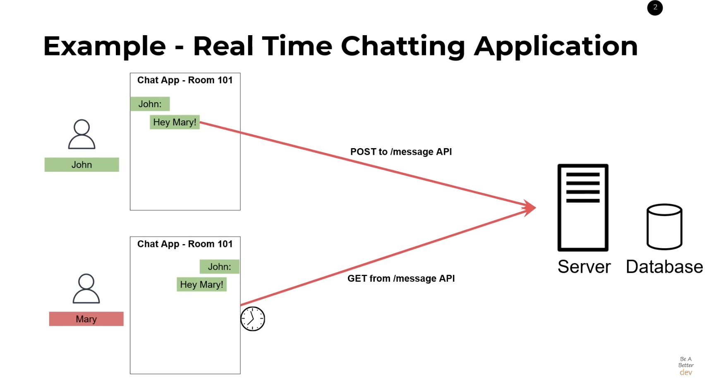
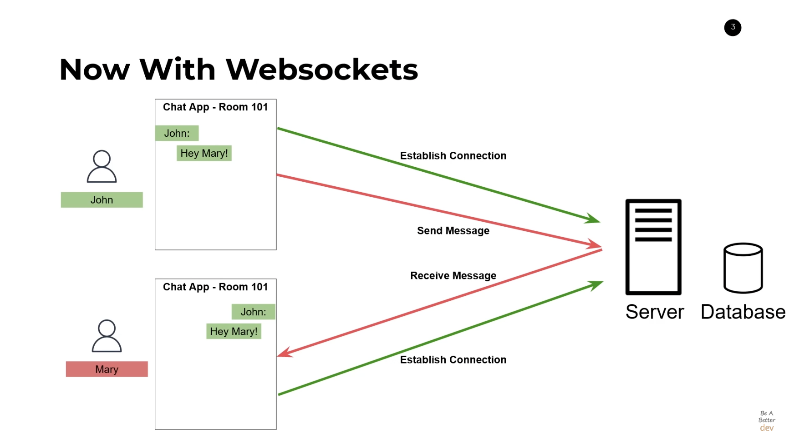

# 📡 Socket
> HTTP review

> Socket 통신

> Socket vs. RestAPI

## 📡 Http review
HTML 파일을 전송하는 프로토콜로써 웹 ㅂ라우저에서 통신이 일어납니다. 초기에는 HTMP 파일을 전송하는 목적으로 만들어졌으나 현재는 json, image 파일 등 또한 전송합니다.

Http 통신은 클라이언트에서 서버로 요청을 보내고 서버가 응답하는 방식으로 통신이 이루어집니다. 응답에 클라이언트의 요청에 따른 결과를 반환합니다.

`클라이언트의 요청이 있을 때 서버가 응답하는 방식으로` ___단방향 통신___

- HTTP 통신은 클라이언트 서버가 요청, 응답을 하는 단방향 통신이다.
- json, xml, image, html 등등 파일을 전송한다.
- 응답을 받으면 connetction이 끊어진다. 하지만 keep alive 옵션으로 일정 시간동안 연결을 유지할 수 있다.

## 📡 Socket
소켓 통신은 두 프로그램이 서로 데이터를 주고 받을 수 있도록 야쪽에 생성되는 통신 단자입니다. 기존의 HTTP 통신은 클라이언트가 요청을하면 서버가 응답을 보내는 방식이지만 소켓 통신은 `서버와 클라이언트 양방향 연결이 이루어지는 통신`으로, 서버와 클라이언트 모두 요청과 응답을 할 수 있는 방식이다. ___양방향 통신.___

이런 장점으로 스트리밍이나 실시간 채팅 등 실시간으로 데이터를 주고 받아야 하는 경우에 connection을 자주 맺고 끊는 http 통신보다 소켓 통신이 적합하다. 소켓 통신은 http보다 리소스가 많이 소모된다.(연결을 계속 하고 있기 때문.)

---
## 💬 RestAPI Vs. Socket
>  1. 채팅앱을 통하여 메리와 존이 대화를 하고 있다.
> 2. 존 - 송신자, 메리 - 수신자
> 3. 서버 쪽 db에는 대화의 내용이 저장된다.

### RestAPI
> 

```json
{
    method : post,
    user_id : "john",
    message_payload :{
        "hey mary!"
    }
}
```
rest API를 사용하면 위 사진과 같은 방식으로 통신을 하게된다. 여기서 문제는 만약 메시지를 주고 받는 과정에서 메리는 어떻게 john이 보낸 메시지를 알아차릴 것인지이다.
- short polling
- long polling

short polling은 메리의 앱이나 존의 앱이 get 방식을 통해서 새로운 메시지가 이쓴ㄴ지 짧은 시간 텀(타이머)을 가지고 확인하는 방식이다. 계속 반복하다 보면 메시지가 새로 수신되면 메리의 앱에서는 message end-point로부터 업데이트된 셋을 db로 부터 요청하게 된다. 사람들은 이런 쉬운 방법의 의존성 때문에 이용하지만 이 방식은 server, client 모두에게 좋지 않은 방식이다. 왜냐하면 latency delay가 발생하기 때문이다. 만약 타이머를 5초를 두면 5초 간격마다 메시지 딜레이가 발생하게 된다. 그리고 http로 통신하기 때문에 request가 발생할 때마다 server로 요청하게 되는데 이 때문에 서버에 부하가 발생한다.

이를 개선한 방법으로 long polling이 있다. long polling을 이용하게 되면 매 x초마다 검사를 하는 것이 아니고 delay를 줘서 만약 새로운 메시지가 수신될 때마다 request를 하는 방식이다. short polling에 비해서 좋은 방식이지만 적용시키기에 다소 어렵고 백엔드에서 더 많은 작업이 요구된다.

짧게 말해서 restAPI는 http 방식으로 동작하기(단방향 통신) 때문에 server에서 request를 보낼 수 없기 때문에 메시지가 새로 들어와도 client에게 알릴 방법은 없고 client가 get 요청을 server에게 지속적으로 보내서 확인하는 수밖에 없다.

### Websocket
> 

websocket 통신은 초기에 연결이 성립됐다는 것을 client가 서버에게 알린다. 만약 존이 메리에게 메시지를 보내게되면 메리 측에서는 지속적으로 request를 보낼 필요가 없이 server에 메리에게 송신된 메시지가 있으면 즉시 메시지를 메리에게 전달하게된다. 즉 양방향 통신이 가능한 것이다.
이처럼 websocket 통신을 이용하면 end to end가 연결된 통신을 하게되어 서버의 부하를 줄임과 동시에 http를 통해 송수신 할때보다 원할하게 통신할 수 있다.

<br><br><br>

### 📚 참고
[http통신과 socket통신](https://kotlinworld.com/75)

[RestApiVs.Socket youtube](https://www.youtube.com/watch?v=fG4dkrlaZAA)

<br><br>

### ⁉️ QnA

> 1. http통신과 socket 통신의 차이점을 설명하시오.

> 2. RestAPI과 Websocket을 사용하는 상황을 예시를 통해서 설명하시오.