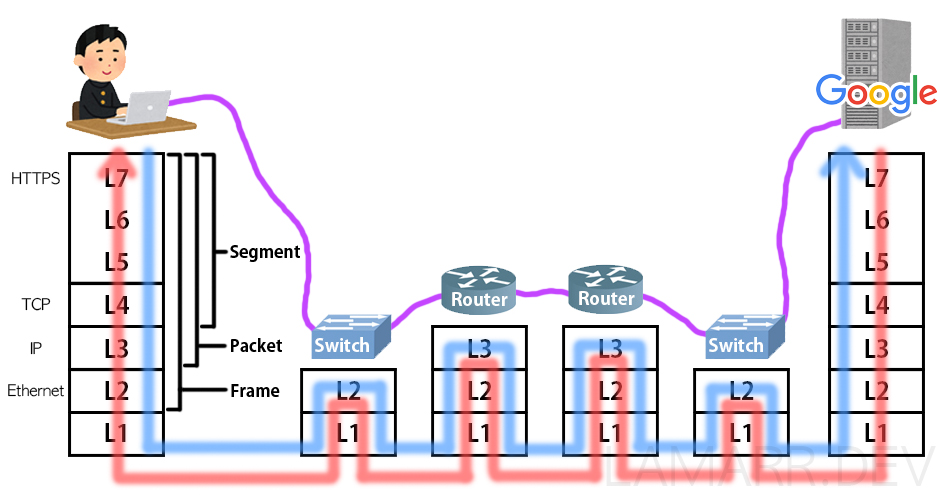

# 웹 통신의 큰 흐름

> 사전 지식  
> 작동 방식

 

# 사전 지식

## 라우터

데이터의 목적지 주소가 지정되면 해당 목적지까지 가는 최적의 경로를 알려주는 역할을 한다. 

- 네트워크에서 특정 컴퓨터를 식별할 수 있는 주소가 있는데 이를 `ip 주소` 라고 한다.

## IP 주소

IP 주소란 여러 컴퓨터들이 인터넷 상에서 서로를 인식하기 위해 지정받은 식별 번호이다.

- IP주소가 있다면 다른 네트워크에 있는 목적지 컴퓨터를 지정할 수 있다.
- 목적지 IP주소로 데이터를 어떤 경로로 보낼지 결정하는 것을 `라우팅` 이라고 한다.

## IP (Internet Protocol)

OSI 7계층의 네트워크 계층에 속하는 프로토콜이다.

- IP header에 `출발지 ip 주소`, `목적지 ip 주소` 가 있다.
- 네트워크 계층에서 데이터에 IP header를 추가한다. (`데이터 + IP header` = `ip 패킷`)

## IP 주소

> IP 버전
> 

IP 버전에는 IPv4, IPv6가 있다.

- `IPv4` : 32비트로 구성되어있고, IP 주소를 43억개를 만들 수 있다.
- `IPv6` : 64비트로 구성되어있고, IPv4보다 많은 IP 주소를 만들 수 있다

 

> IP 주소의 종류
> 

IP 주소에는 `공인 IP 주소`(ISP가 제공), `사설 IP 주소`가 있다.

- IP 주소가 고갈되고 있는 상황에서 모든 컴퓨터에 `공인 IP 주소`를 부여하기 힘드므로 `사설 IP 주소` 와 함께 사용한다.
    - 인터넷에 직접 연결되는 컴퓨터, 라우터에 ← 공인 IP 주소를 할당하고
    - 회사, 가정에 있는 컴퓨터는 ← 사설 IP 주소를 할당한다.

 

> IP 주소의 구조
> 

IP 주소는 `네트워크 ID` , `호스트 ID` 로 나누어져있다.

- `네트워크 ID` : 어떤 네트워크인지 나타내는 정보
- `호스트 ID` : 해당 네트워크의 어떤 컴퓨터인지 나타내는 정보

32비트의 IPv4는 8비트 4개로 이뤄져있다.

- `11000000`.`10101000`.`00000001`.`00001010` = `192.168.1.12`

 

## Domain Name

도메인 네임이란 12자리의 숫자로 이뤄진 IP 주소를 문자로 표현한 것이다.

 

## DNS (Domain Name System)

`DNS` 는 `도메인 네임` 과 이에 해당하는  `IP 주소` 값을 한 쌍으로 저장하고 있는 데이터베이스이다.

- 도메인 네임은 사람의 편의성을 위해 만든 주소이다. 따라서 도메인 네임을 컴퓨터가 이해할 수 있는 IP 주소로 변환하는 작업이 필요하다. 이 때 사용하는 게 DNS라는 데이터베이스이다.

 

# 동작 방식

 

 

## *1. URL(`www.google.com`)을 브라우저 주소창에 친다*

URL에 입력된 값을 브라우저 내부에 결정된 규칙에 따라 파싱하여 의미를 조사한다.

> URL 구조
> 

 

## *2. 브라우저는 캐싱된 DNS 기록을 통해 URL(`www.google.com`)에 대응되는 IP 주소의 존재 유무를 확인한다*

> DNS
> 

DNS는 사람들에게 편의성을 주기 위해 존재하는 `도메인 네임 - IP 주소` 쌍의 데이터를 저장하는 데이터베이스이다. 

> 브라우저는 DNS 기록을 4가지 캐시에서 확인한다.
> 
1. 브라우저 캐시
    - 브라우저에 일정 기간동안 DNS 기록을 저장하고 있다.
    - DNS 쿼리는 이곳에서 가장 먼저 실행된다.
2. OS 캐시
    - 브라우저 캐시에서 `www.google.com`의 IP 주소가 발견되지 않았다면, 브라우저는 시스템콜을 통해 OS가 저장하는 DNS 기록 캐시에 접근한다.
3. 라우터 캐시
    - OS 캐시에서도 찾지 못했다면, 브라우저는 DNS 기록을 캐싱하는 라우터와 통신하여 IP 주소를 탐색한다.
4. ISP 캐시
    - 라우터 캐시에도 찾지 못했다면, ISP 캐시에서 IP 주소를 탐색한다.
    - ISP는 DNS 서버를 구축하고 있다.

 

> 여러 곳에서 DNS 캐시를 저장하는 이유
> 

네트워크 트래픽을 조절하고 데이터 전송시간을 줄이기 위해서이다.

 

## *3. 4가지 DNS 캐시에서 IP 주소를 찾지 못하면, ISP의 DNS 서버가 DNS 쿼리를 날려 IP 주소를 얻는다*

> DNS query
> 

DNS query(DNS Request라고도 불림)란 DNS Client에서 DNS 서버로 전송되는 쿼리이다. 
- DNS query의 목적은 여러 다른 DNS 서버들을 검색하여 해당 사이트의 IP를 찾는 것이다.
- IP 주소를 못찾아서 오류 응답을 반환할때까지 DNS 서버에서 다른 DNS 서버를 오고가며 반복적으로 검색을 진행하기 때문에 이러한 검색을 `Recursive Search` 라고 부른다.

 

> ISP의 DNS 서버
> 

인터넷을 통해 여러 DNS 서버들에서 올바른 IP 주소를 찾는데 책임을 가지고 있다.

- ISP의 DNS 서버를 DNS Recursor라 부르고 다른 DNS 서버들을 Name Server라 부른다.

 

> Recursive Search 과정 (www.google.com)
> 
1. `DNS Recursor`가 `Root DNS Server(.)`에 DNS query를 날린다.
2. `Root DNS Server(.)`는 호스트 네임에 대한 IP 주소를 모르기 때문에 `Top-Level DNS Server(.com)` 로 Redirect한다.
3. `Top-Level DNS Server(.com)`도 모르기 때문에 `Second-Level DNS Server(google.com)`로 Redirect한다.
4. `Second-Level DNS Server(google.com)` 는 `www.google.com`의 DNS 레코드에서 `www.google.com`과 매칭되는 IP 주소를 찾아 `DNS Recursor`에게 반환한다.
5. `DNS Recursor` 는 찾은 IP 주소를 브라우저로 전송한다.

Name Server는 URL의 도메인 이름 구조에 기반하여 IP 주소를 검색한다. 그리고 Name Server들 간의 모든 요청들은 작은 데이터 패킷을 통해 이뤄진다. 

- 패킷에는 `보내는 요청의 내용 + DNS Recursor의 IP주소` 가 포함되어있다.
- 패킷은 원하는 DNS 기록을 가진 Name Server에 도달할때까지 여러 Name Server들을 여러번 오간다.
- 패킷은 Routing Table을 기반으로 빠른 경로를 통해 이동한다.
- 도중에 패킷이 유실되면 Request Fail Error가 발생한다

 

> HTTP 요청 메시지 생성
> 

클라이언트는 URL 정보와 IP 주소를 받고 HTTP 프로토콜을 통해 `www.google.com` 웹페이지를 요구하는 HTTP 요청 메시지를 생성한다. 

- HTTP 요청 메시지는 TCP 프로토콜을 통해 인터넷을 거쳐 목적지 IP 주소의 컴퓨터(서버)로 전송된다.

 

## *4. 브라우저는 웹 서버와 TCP connection을 수립한다*

ISP의 DNS 서버로부터 URL에 해당하는 서버의 IP주소를 받으면 서버와 데이터를 주고받기 위해 TCP connection을 수립하게 된다.  

- TCP는 가상 회선 방식을 통해 데이터 발신지와 수신지 사이의 논리적인 경로를 배정하는 프로토콜로 HTTP 요청의 경우 일반적으로 TCP를 사용한다.

 

> TCP/IP 3-way handshake
> 

TCP connection은 `TCP/IP 3-way handshake` 를 통해 이뤄진다. 이는 가상회선을 수립하는 단계로 클라이언트는 서버에게 요청을 전송할 수 있는지, 서버는 클라이언트에게 응답을 전송할 수 있는지 확인하는 단계이다.

1. 클라이언트는 서버에게 접속을 요청하는 SYN(x) 패킷을 보낸다
    - SYN(x) 패킷이란 TCP Header의 SYN 플래그 비트를 1로 설정한 패킷으로 헤더의 Sequence Number 필드에 임의의 난수(x)가 설정된다.
2. 서버는 클라이언트의 SYN(x) 패킷을 받고, 이에 대한 응답으로 ACK(x+1) 패킷과 클라이언트와 연결을 요청하는 SYN(y) 패킷을 보낸다.
    - 서버는 클라이언트의 `응답 패킷(SYN) 헤더의 시퀀스 넘버 + 1` 한 수로 ACK 플래그 패킷의 시퀀스 넘버를 설정하여 클라이언트에게 보낸다.
3. 클라이언트는 서버의 ACK(x+1), SYN(y) 패킷을 받고, SYN(y) 패킷에 대한 응답으로 ACK(y+1) 패킷을 서버로 보낸다. 서버는 이를 받고 이로써 TCP connection이 수립된다.

 

## *5. 브라우저가 웹 서버로 HTTP Request Message를 보내고, 웹 서버는 브라우저에게 HTTP Response Message를 보낸다*

TCP connection이 수립되었다면 클라이언트는 HTTP 요청 메시지를 전송할 수 있다.

 

> 캡슐화, 역캡슐화
> 

- `캡슐화`란 응용 계층부터 물리 계층까지 각 계층별로 데이터를 전달할 때, 헤더를 붙여 전달하는 과정이다.
- `역캡슐화`란 물리 계층부터 응용 계층까지 데이터를 전달할 때, 헤더를 제거하며 전달하는 과정이다.

 

> HTTP Request Message의 캡슐화
> 

TCP connection이 확립되면 구글 서버 (IP주소)에 웹페이지를 요청하는 데이터를 보낸다. 데이터는 L7부터 L1까지(파란색 선) 각 계층마다 사용되는 프로토콜의 Header가 붙으며 `캡슐화`가 진행된다.
1. 응용 계층에서 데이터가 만들어지고 `HTTP 헤더`가 붙음
    - `HTTP 헤더 + 데이터` = `메시지`
2. 전송 계층에서 데이터에 `TCP 또는 UDP 헤더`가 붙음
    - `TCP 헤더 + HTTP 헤더 + 데이터` = `세그먼트`
    - TCP 헤더에 출발지 포트번호, 목적지 포트번호 정보가 있다
3. 네트워크 계층에서 데이터(세그먼트)에 `IP 헤더`가 붙음
    - `IP 헤더 + TCP 헤더 + HTTP 헤더 + 데이터` = `패킷`
    - IP 헤더에 출발지 IP 주소, 목적지 IP 주소 정보가 있다.
4. 데이터링크 계층에서 데이터(패킷)에 `Ethernet 헤더`가 붙음
    - `Ethernet 헤더 + IP 헤더 + TCP 헤더 + HTTP 헤더 + 데이터` = `프레임`
    - Ethernet 헤더에 목적지로 가기 위해 처음 거쳐야 할 라우터의 MAC 주소 정보가 있다.
5. 물리 계층에서 비트 데이터는 LAN 카드라는 장비를 거쳐 `전기신호로 변환됨`. 그리고 케이블과 물리적으로 연결된 스위치라는 장비로 전달됨

 

> 스위치 -> 최초의 라우터
> 

데이터가 스위치에 도착하면 1계층 → 2계층 순서로 `역캡슐화` 가 진행된다. 

1. 2계층까지 데이터(프레임)을 역캡슐화한다
2. Ethernet 헤더에서 목적지 라우터의 MAC 주소 정보를 알아낸다.
3. MAC 주소 테이블을 이용하여 데이터(프레임)를 보낼 포트를 조사한다
4. 다시 캡슐화하여 데이터(프레임)을 전기 신호로 변환하고 목적지로 가기 위해 처음 거쳐야 할 라우터로 전송한다

 

> 라우터에 도착한 데이터
> 

데이터(프레임)가 라우터에 도착하면 1 → 2 → 3계층 순서로 `역캡슐화`가 진행된다

1. 2계층까지 데이터(프레임)을 역캡슐화한다
2. Ethernet 헤더속 `목적지 라우터의 MAC 주소` 와 `해당 라우터의 MAC 주소`를 비교한다
3. 같다면 3계층까지 역캡슐화한다
4. IP 헤더속 목적지 IP 주소를 알아내고, 해당 라우터의 라우팅 테이블을 기반으로 목적지 IP까지의 경로를 계산한다(`라우팅`)
    - 출발지 IP 주소가 `사설IP 주소`라면, IP 헤더속 출발지 IP주소를 `공인IP주소`로 수정한다
5. Ethernet 헤더의 목적지 라우터의 MAC 주소를 `그 다음 hop의 라우터의 MAC 주소`로 수정한다
6. 데이터를 캡슐화하여 `다음 hop의 라우터로 전송`한다

위와 같은 방식으로 목적지까지 ***여러 라우터를 거치며(그림에서는 2개의 라우터)*** 역캡슐화, 캡슐화 과정을 반복한다.

 

> 마지막 라우터에 도착한 데이터
> 

마지막 라우터의 라우팅 테이블을 통해 `목적지 IP 주소`까지의 경로를 알 수 있다.
1. 3계층까지 역캡슐화하여 IP 헤더의 `출발지 IP 주소`를 `해당 라우터 내부 IP 주소`로 수정한다.
2. 2계층의 Ethernet 헤더의 `MAC 주소`를 `서버측 스위치 주소`로 수정한다
3. 데이터를 캡슐화하여 서버측 스위치로 전송한다

 

> 서버(목적지)측의 데이터 처리
> 
1. 스위치는 1계층 → 2계층 순서로 `역캡슐화`하여 Ethernet 헤더의 MAC 주소가 자신의 것과 동일한지 확인한다. 동일하면 데이터를 캡슐화하고 `전기신호로 변환`하여 구글 서버로 전달한다.
2. 구글 서버의 물리 계층에서 `전기 신호`를 `비트 데이터`로 변환한다
3. 데이터링크 계층에서 역캡슐화하여 `Ethernet 헤더의 목적지 MAC 주소`와 `구글 서버의 MAC 주소`를 비교한다. 같다면 Ethernet 헤더 & 트레일러를 분리하고 네트워크 계층으로 전달한다
4. 네트워크 계층에서 `IP 헤더의 목적지 IP 주소`와 `구글 서버의 IP 주소`를 비교한다. 같다면 전송 계층으로 전달한다
5. 전송 계층에서 `TCP 헤더의 목적지 포트번호`에 해당하는 포트를 사용하는 어플리케이션을 확인한다. 만약 데이터에 오류가 있다면 송신측에 `재전송`을 요청한다.
6. 응용 계층에서 `HTTP Request Message`를 받고 `HTTP Response Message`를 생성하여 브라우저로 전송한다.

웹 서버에서 브라우저로 HTTP Response Message를 보내는 과정은 위와 역순으로 진행된다
 

# 참고

[총정리 네트워크 전체의 흐름](https://lamarr.dev/networkingbeginner/2020/03/23/13.html)

[네트워크 계층의 역할](https://github.com/wjdrbs96/Today-I-Learn/blob/master/Network/Network/Network%20Layer.md)

[주소창에 naver.com을 치면 일어나는 일](https://github.com/WooVictory/Ready-For-Tech-Interview/blob/master/Network/%EC%A3%BC%EC%86%8C%EC%B0%BD%EC%97%90%20naver.com%EC%9D%84%20%EC%B9%98%EB%A9%B4%20%EC%9D%BC%EC%96%B4%EB%82%98%EB%8A%94%20%EC%9D%BC.md)

[Browser에 www.google.com을 검색하면 어떤 일이 일어날까?](https://devjin-blog.com/what-happen-browser-search/)

[What is a DNS query?](https://www.cloudns.net/wiki/article/254/)

[What is a TCP 3-way handshake process?](https://afteracademy.com/blog/what-is-a-tcp-3-way-handshake-process)

 

# 면접 예상 질문

> 1. 웹 통신의 큰 흐름에 대해 설명해보세요

> 2. 클라이언트와 서버가 데이터를 주고 받을 때 캡슐화, 역캡슐화의 진행과정을 설명해보세요
