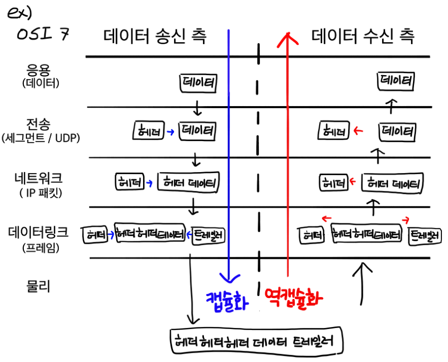

# 웹 통신의 큰 흐름

> 사전 지식  
> 작동 방식

 

# 사전 지식

## 라우터

데이터의 목적지 주소가 지정되면 해당 목적지까지 가는 최적의 경로를 알려주는 역할을 한다. 

- 네트워크에서 특정 컴퓨터를 식별할 수 있는 주소가 있는데 이를 `ip 주소` 라고 한다.

## IP 주소

IP 주소란 여러 컴퓨터들이 인터넷 상에서 서로를 인식하기 위해 지정받은 식별 번호이다.

- IP주소가 있다면 다른 네트워크에 있는 목적지 컴퓨터를 지정할 수 있다.
- 목적지 IP주소로 데이터를 어떤 경로로 보낼지 결정하는 것을 `라우팅` 이라고 한다.

## IP (Internet Protocol)

OSI 7계층의 네트워크 계층에 속하는 프로토콜이다.

- IP header에 `출발지 ip 주소`, `목적지 ip 주소` 가 있다.
- 네트워크 계층에서 데이터에 IP header를 추가한다. (`데이터 + IP header` = `ip 패킷`)

## IP 주소

> IP 버전
> 

IP 버전에는 IPv4, IPv6가 있다.

- `IPv4` : 32비트로 구성되어있고, IP 주소를 43억개를 만들 수 있다.
- `IPv6` : 64비트로 구성되어있고, IPv4보다 많은 IP 주소를 만들 수 있다

> IP 주소의 종류
> 

IP 주소에는 `공인 IP 주소`(ISP가 제공), `사설 IP 주소`가 있다.

- IP 주소가 고갈되고 있는 상황에서 모든 컴퓨터에 `공인 IP 주소`를 부여하기 힘드므로 `사설 IP 주소` 와 함께 사용한다.
    - 인터넷에 직접 연결되는 컴퓨터, 라우터에 ← 공인 IP 주소를 할당하고
    - 회사, 가정에 있는 컴퓨터는 ← 사설 IP 주소를 할당한다.

> IP 주소의 구조
> 

IP 주소는 `네트워크 ID` , `호스트 ID` 로 나누어져있다.

- `네트워크 ID` : 어떤 네트워크인지 나타내는 정보
- `호스트 ID` : 해당 네트워크의 어떤 컴퓨터인지 나타내는 정보

32비트의 IPv4는 8비트 4개로 이뤄져있다.

- `11000000`.`10101000`.`00000001`.`00001010` = `192.168.1.12`

## Domain Name

도메인 네임이란 12자리의 숫자로 이뤄진 IP 주소를 문자로 표현한 것이다.

## DNS (Domain Name System)

`DNS` 는 `도메인 네임` 과 이에 해당하는  `IP 주소` 값을 한 쌍으로 저장하고 있는 데이터베이스이다.

- 도메인 네임은 사람의 편의성을 위해 만든 주소이다. 따라서 도메인 네임을 컴퓨터가 이해할 수 있는 IP 주소로 변환하는 작업이 필요하다. 이 때 사용하는 게 DNS라는 데이터베이스이다.

 

# 작동 방식

## *1. URL(`www.google.com`)을 브라우저 주소창에 친다.*

URL에 입력된 값을 브라우저 내부에 결정된 규칙에 따라 파싱하여 의미를 조사한다.

> URL 구조
> 

 

## *2. 브라우저는 캐싱된 DNS 기록을 통해 URL(`www.google.com`)에 대응되는 IP 주소의 존재 유무를 확인한다.*

> DNS
> 

DNS는 사람들에게 편의성을 주기 위해 존재하는 `도메인 네임 - IP 주소` 쌍의 데이터를 저장하는 데이터베이스이다. 

> 브라우저는 DNS 기록을 4가지 캐시에서 확인한다.
> 
1. 브라우저 캐시
    - 브라우저에 일정 기간동안 DNS 기록을 저장하고 있다.
    - DNS 쿼리는 이곳에서 가장 먼저 실행된다.
2. OS 캐시
    - 브라우저 캐시에서 `www.google.com`의 IP 주소가 발견되지 않았다면, 브라우저는 시스템콜을 통해 OS가 저장하는 DNS 기록 캐시에 접근한다.
3. 라우터 캐시
    - OS 캐시에서도 찾지 못했다면, 브라우저는 DNS 기록을 캐싱하는 라우터와 통신하여 IP 주소를 탐색한다.
4. ISP 캐시
    - 라우터 캐시에도 찾지 못했다면, ISP 캐시에서 IP 주소를 탐색한다.
    - ISP는 DNS 서버를 구축하고 있다.

> 여러 곳에서 DNS 캐시를 저장하는 이유
> 

네트워크 트래픽을 조절하고 데이터 전송시간을 줄이기 위해서이다.

 

## *3. 요청한 URL이 캐시에 존재하지 않으면, 해당 URL(`www.google.com`)을 호스팅하고 있는 서버의 IP 주소를 찾기 위해 ISP의 DNS 서버가 DNS query를 날린다.*

> DNS query
> 

DNS query(DNS Request라고도 불림)란 사용자의 컴퓨터(DNS Client)에서 DNS 서버로 전송되는 쿼리이다. 

- DNS query의 목적은 여러 다른 DNS 서버들을 검색하여 해당 사이트의 IP를 찾는 것이다.
- IP 주소를 못찾아서 오류 응답을 반환할때까지 DNS 서버에서 다른 DNS 서버를 오고가며 반복적으로 검색을 진행하기 때문에 이러한 검색을 `Recursive Search` 라고 부른다.

> ISP의 DNS 서버
> 

인터넷을 통해 여러 DNS 서버들에서 올바른 IP 주소를 찾는데 책임을 가지고 있다.

- ISP의 DNS 서버를 DNS Recursor라 부르고 다른 DNS 서버들을 Name Server라 부른다.

> Name Server의 검색과정
> 
1. DNS Recursor(ISP의 DNS)는 Root Name Server에 연락을 한다
2. Root Name Server는 `.com` 도메인 Name Server로 Redirect한다
3. `.com` Name Server는 `google.com` Name Server로 Redirect한다
4. `google.com` Name Server는 DNS 기록에서 `www.google.com` 에 매칭되는 IP주소를 찾아 DNS Recursor로 보낸다

Name Server는 URL의 도메인 이름 구조에 기반하여 IP 주소를 검색한다. 그리고 Name Server들 간의 모든 요청들은 작은 데이터 패킷을 통해 이뤄진다. 

- 패킷에는 `보내는 요청의 내용 + DNS Recursor의 IP주소` 가 포함되어있다.
- 패킷은 원하는 DNS 기록을 가진 Name Server에 도달할때까지 여러 Name Server들을 여러번 오간다.
- 패킷은 Routing Table을 기반으로 빠른 경로를 통해 이동한다.
- 도중에 패킷이 유실되면 Request Fail Error가 발생한다

> HTTP 요청 메시지 생성
> 

클라이언트는 URL 정보와 IP 주소를 받고 HTTP 프로토콜을 통해 `www.google.com` 웹페이지를 요구하는 HTTP 요청 메시지를 생성한다. 

- HTTP 요청 메시지는 TCP 프로토콜을 통해 인터넷을 거쳐 목적지 IP 주소의 컴퓨터(서버)로 전송된다.

 

## *4. 브라우저가 서버와 TCP Connection을 한다.*

ISP의 DNS 서버로부터 URL에 해당하는 서버의 IP주소를 받으면 서버와 데이터를 주고받기 위해 TCP connection을 수립하게 된다.  

- TCP는 가상 회선 방식을 통해 데이터 발신지와 수신지 사이의 논리적인 경로를 배정하는 프로토콜로 HTTP 요청의 경우 일반적으로 TCP를 사용한다.

> TCP/IP 3-way handshake
> 

TCP connection은 `TCP/IP 3-way handshake` 를 통해 이뤄진다. 이는 가상회선을 수립하는 단계로 클라이언트는 서버에게 요청을 전송할 수 있는지, 서버는 클라이언트에게 응답을 전송할 수 있는지 확인하는 단계이다.

1. 클라이언트는 서버에게 접속을 요청하는 SYN(x) 패킷을 보낸다
    - SYN(x) 패킷이란 TCP Header의 SYN 플래그 비트를 1로 설정한 패킷으로 헤더의 Sequence Number 필드에 임의의 난수(x)가 설정된다.
2. 서버는 클라이언트의 SYN(x) 패킷을 받고, 이에 대한 응답으로 ACK(x+1) 패킷과 클라이언트와 연결을 요청하는 SYN(y) 패킷을 보낸다.
    - 서버는 클라이언트의 `응답 패킷(SYN) 헤더의 시퀀스 넘버 + 1` 한 수로 ACK 플래그 패킷의 시퀀스 넘버를 설정하여 클라이언트에게 보낸다.
3. 클라이언트는 서버의 ACK(x+1), SYN(y) 패킷을 받고, SYN(y) 패킷에 대한 응답으로 ACK(y+1) 패킷을 서버로 보낸다. 서버는 이를 받고 이로써 TCP connection이 수립된다.

 

## *5. 브라우저가 웹 서버에 HTTP 요청을 하고, 서버는 요청을 처리하여 HTTP 응답을 보낸다.*

TCP connection이 수립되었다면 클라이언트는 HTTP 요청 메시지를 전송할 수 있다.

> 캡슐화, 역캡슐화
> 

캡슐화란 응용 계층부터 물리 계층까지 각 계층별로 데이터를 전달할 때, 헤더를 붙여 전달하는 과정이다.

역캡슐화란 물리 계층부터 응용 계층까지 데이터를 전달할 때, 헤더를 제거하며 전달하는 과정이다.

- TCP로 전송할 때 4계층에서 붙이는 헤더를 `TCP 헤더` 라고 하고, TCP 헤더가 붙은 데이터를 `세그먼트` 라고 한다.

> 이용자 데이터의 캡슐화
> 

TCP connection이 확립되면 구글 서버 (IP주소)에 웹페이지를 요청하는 데이터를 보낸다. 데이터는 L7부터 L1까지(파란색 선) 각 계층마다 사용되는 프로토콜의 Header가 붙으며 `캡슐화`가 진행된다.

1. 7계층(응용 계층)에서 `HTTPS의 헤더`가 먼저 붙는다.
2. 6,5계층의 헤더가 붙고,
3. 4계층(전송 계층)에서 `TCP 헤더` 가 붙는다. 
    - TCP 헤더에는 신뢰할 수 있고 정확한 데이터 송수신을 위해 `출발지 포트번호` 와 `목적지 포트번호` 정보가 기록된다.
    - 여기까지의 데이터를 `세그먼트(segment)` 라고 한다
4. 3계층(네트워크 계층)에서 `IP 프로토콜의 헤더` 가 붙는다.
    - IP 헤더에는 `출발지 IP주소` 와 `목적지 IP주소` 가 기록된다
    - 여기까지의 데이터를 `패킷(packet)` 이라고 한다
5. 2계층(데이터 링크 계층)에서 `Ethernet`의 헤더가 붙는다.
    - Ethernet 헤더에는 목적지로 가기위해 거쳐야할 IP주소를 가지고 있는 장비인 `라우터의 MAC 주소` 가 기록된다.
    - 여기까지의 데이터를 `프레임(frame)` 이라고 한다.
6. 1계층(물리 계층)에서 `LAN 카드` 라는 장비를 거쳐 데이터는 전기신호로 변환된다. 그리고 `케이블(UDP)` 와 물리적으로 연결되어있는 `스위치(switch)` 장비로 향한다. (보라색 선)

> 스위치에 도착한 데이터
> 

데이터가 스위치에 도착하면 1계층 → 2계층 순서로 `역캡슐화` 가 진행된다. 

1. 2계층까지 역캡슐화하여 Ethernet 헤더에서 목적지 라우터의 MAC 주소를 알아내고, MAC 주소 테이블을 활용하여 어느 포트로 내보낼지 조사한다.
2. 다시 데이터를 캡슐화하여 전기신호로 그 다음 라우터로 전송한다.

> 라우터에 도착한 데이터
> 

라우터는 도착한 데이터를 일단 1계층 → 2계층 순서로 `역캡슐화`한다.

1. 2계층까지 역캡슐화하여 Ethernet 헤더의 `목적지 라우터 MAC주소`를 알아내고, 해당 MAC 주소가 자신의 MAC주소와 동일하면 3계층까지 역캡슐화를 진행한다.
2. 3계층까지 역캡슐화하여 IP 프로토콜 헤더의 `목적지 IP주소`를 알아내고, 자신의 라우팅 테이블을 기반으로 목적지 IP까지의 경로를 알 수 있으면 `라우팅` 을 진행한다.
    - 만약 출발지 IP 주소가 `사설 IP` 라면 3계층 IP 헤더에서 출발지 IP 주소를 `공인 IP` 주소로 설정한다.
3. Ethernet 헤더의 `목적지 라우터 MAC 주소`를 라우팅을 통해 알아낸 그 다음 목적지 라우터의 MAC 주소로 수정한다.
4. 데이터를 다시 캡슐화하여 다음 라우터로 전송한다.

위와 같은 방식으로 목적지까지 ***여러 라우터를 거치며(그림에서는 2개의 라우터)*** 역캡슐화, 캡슐화 과정을 반복한다.

> 마지막 라우터에 도착한 데이터
> 

마지막 라우터의 라우팅 테이블을 통해 `목적지 IP 주소`까지의 경로를 알 수 있다.

1. 3계층의 IP 프로토콜 헤더에서 `출발지 IP 주소`를 `자신의 라우터 내부 IP 주소`로 변경한다.
2. 2계층의 Ethernet 헤더의 MAC 주소를 스위치에 전달되도록 수정한다.
3. 데이터를 다시 캡슐화하고 전기신호를 해당 라우터와 연결된 스위치로 전달한다.

> 서버(목적지)측의 데이터 처리
> 
1. 스위치는 역캡슐화 → 캡슐화를 진행하고, 데이터를 구글 서버에 전기신호로 전달한다.
2. 구글 서버는 클라이언트가 보낸 HTTP 요청 데이터를 1계층 → 7계층까지 역캡슐화 한다.
    - 2계층에서
        - `Ethernet 프레임의 목적지 MAC주소` 와 자신의 MAC 주소를 비교한다. 같다면 2계층의 Ethernet 헤더와 트레일러를 분리하고 3계층으로 전달한다.
    - 3계층에서
        - `IP 프로토콜 헤더의 목적지 IP 주소` 와 웹 서버의 IP 주소를 비교한다. 같다면 IP 헤더를 분리하고 4계층으로 전달한다.
    - 4계층에서
        - `TCP 헤더의 목적지 포트 번호` 를 확인하여 어떤 어플리케이션으로 데이터를 전달할지 정한다. 만약 데이터의 오류가 있다면, 송신측에게 데이터 재전송을 요청한다. 오류가 없다면 TCP 헤더를 분리하고 5계층으로 전달한다.
    - 5,6계층을 거쳐 7계층으로 데이터가 도착한다.
        - 이후 구글 서버는 클라이언트에게 HTTP 응답 메시지를 보낸다. 전달되는 과정은 위 과정의 역순으로 진행된다.

 

# 참고

[총정리 네트워크 전체의 흐름](https://lamarr.dev/networkingbeginner/2020/03/23/13.html)

[네트워크 계층의 역할](https://github.com/wjdrbs96/Today-I-Learn/blob/master/Network/Network/Network%20Layer.md)

[주소창에 naver.com을 치면 일어나는 일](https://github.com/WooVictory/Ready-For-Tech-Interview/blob/master/Network/%EC%A3%BC%EC%86%8C%EC%B0%BD%EC%97%90%20naver.com%EC%9D%84%20%EC%B9%98%EB%A9%B4%20%EC%9D%BC%EC%96%B4%EB%82%98%EB%8A%94%20%EC%9D%BC.md)

[Browser에 www.google.com을 검색하면 어떤 일이 일어날까?](https://devjin-blog.com/what-happen-browser-search/)

[What is a DNS query?](https://www.cloudns.net/wiki/article/254/)

[What is a TCP 3-way handshake process?](https://afteracademy.com/blog/what-is-a-tcp-3-way-handshake-process)

 

# Summary

- 브라우저는 입력된 url을 파싱합니다. 
파싱한 값에 따라 HTTP Request 메시지를 만들고, 
OS에게 만들어진 메시지 송신 요청합니다.
- OS에 송신을 의뢰할 때, 도메인명이 아닌 IP주소로 목적지를 지정해야하는데,
이 과정에서 DNS Lookup 과정을 통해 도메인에 매칭된 IP 주소를 찾습니다.
(DNS Lookup 과정 : 브라우저 → hosts 파일 → DNS cache)
- IP주소를 찾고 나서
OS에 내장된 `프로토콜 스택` 이라는 네트워크 제어용 소프트웨어가 브라우저로부터 메시지를 받습니다.
그 후, 2계층에서 메시지를 수신처 주소등의 제어정보와 함께 패킷에 담습니다.
그리고 이 패킷을 LAN 어댑터로 전송하면, 
LAN 어댑터는 패킷에 다음 hop의 mac 주소를 붙힌 프레임을 전기신호로 변환하여 송출합니다.
- 프레임은 스위칭 허브를 경유하여 인터넷 접속용 라우터에 전달되고 인터넷으로 이동합니다.
통신사용 라우터로 운반되고 인터넷의 핵심부로 전달됩니다.
고속 라우터들 사이를 통해 목적지 까지 흘러갑니다.
- 패킷은 목적지의 LAN에 도착합니다
목적지의 방화벽이 패킷을 검사하고 캐시서버로 보내어 웹서버에 갈 필요가있는지 검사합니다
- 웹서버에 도착한 패킷은 프로토콜 스택을 따라 패킷의 데이터를 추출한뒤 메시지를 응용 프로그램에게 전달합니다
- 응용프로그램은 응답에 대한 요청 메시지를 만들고 이를 클라이언트에게 전송합니다
전송되는 과정은 여태 전달된 과정의 반대로 수행됩니다.

 

# 면접 예상 질문

> 1. 웹 통신의 큰 흐름에 대해 설명해보세요

> 2. 클라이언트와 서버가 데이터를 주고 받을 때 캡슐화, 역캡슐화의 진행과정을 설명해보세요
