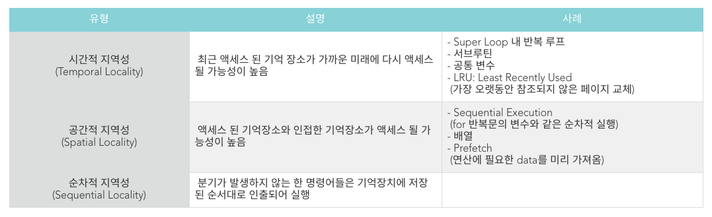
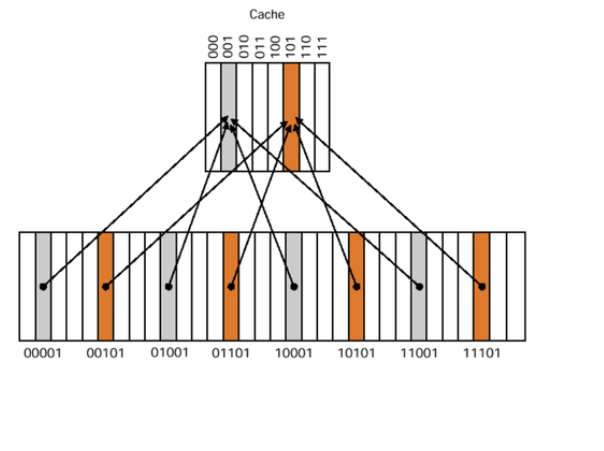

# 캐시의 지역성

> 캐시의 지역성

> Caching line

 

# 캐시의 지역성의 원리

- 캐시 메모리는 속도가 빠른 장치와 느린 장치간의 속도차에 따른 병목 현상을 줄이기 위한 고속 버퍼 메모리
- 주기억장치 내에서 자주 읽고 쓰는 데이터의 일부를 캐시 메모리에 불러와 속도 차이를 줄이고, 주기억장치와 CPU 간 신호 교환에 이용되는 Memory Bandwidth를 I/O 사용에 집중할 수 있기 때문에 궁극적으로 성능 향상의 결과를 불러옵니다.
- 캐시의 성능은 작은 용량의 캐시 메모리에 CPU가 참조할 쓸모 있는 정보가 어느 정도 들어있느냐에 따라 좌우되기 때문에 CPU가 어떤 데이터를 원할 것인가를 어느정도 예측할 수 있어야 합니다. 
- 이때 적중률을 극대화 시키기 위해 데이터 지역성의 원리 사용
- 지역성 (Locality)이란 기억 장치 내의 정보를 균일하게 Access 하는 것이 아닌 어느 한 순간에 특정 부분을 집중적으로 참조하는 특성(데이터 접근이 시간적, 혹은 공간적으로 가깝게 일어나는 것)

 

## Cache의 종류

- L1 Cache
    - 프로세서와 가장 가까운 캐시
    - 속도를 위해 IC와 DC로 나눔
    - IC(instruction Cache):메모리에서 text영역의 데이터를 다루는 캐시
    - DC(DATA Cache): 메모리에서 text영역을 제외한 모든 데이터를 다루는 캐시
- L2 Cache
    - 용량이 큼
- L3 Cache
    - 멀티 코어 시스템에서 여러 코어가 공유하는 캐시
    
    레지스터→L1 캐시(sram)→L2캐시→주기억장치(Dram)→보조기억장치(EEPROM)→순으로 캐시에 접근

## 캐시 적중률,실패율

cpu가 데이터를 요청했을 때 캐시 메모리가 해당 데이터를 가지고 있다면 이를 캐시히트라고 부르며, 해당 데이터가 없어서 DRAM에 접근해야 한다면 캐시 미스라고 부른다.

적중률: 캐시 메모리 적중 횟수/전체 메모리 참조 횟수

Miss Ratio(실패율): 1-적중률

 

## 대표적인 지역성 2가지

- 시간 지역성: 특정 데이터가 한번 접근되었을 경우, 가까운 미래에 또 한번 데이터에 접근할 가능성이 높다.
- 공간 지역성: 참조된 데이터 근처에 있는 데이터가 잠시 후 사용될 가능성이 높다.

## 캐시 메모리 쓰기 정책과 캐시 일관성

- CPU에서 데이터를 읽는 동작이 아니라 입력하는 동작이 발생하고, 데이터를 변경할 주소가 캐싱된 상태라면 메모리의 데이터가 업데이트 되는 대신 캐시의 데이터가 업데이트 된다.
- 따라서, 메인 메모리를 업데이트해주어야 하는데 이 메인 메모리를 업데이트 하는 시점에 따라 정책이 두 가지로 나뉜다.

- Write Through 정책
  - 메인 메모리를 바로 업데이트
  - 단순하고 캐시와 메인 메모리의 일관성을 유지할 수 있지만, 매번 바꿔줘야 되므로 느리다는 단점이 존재한다.

- Write Back 정책
  - 캐시만 업데이트 하다가, 업데이트된 데이터가 캐시에서 빠지게 될 때 메인 메모리를 업데이트
  - 캐시와 메모리가 서로 값이 다른 경우가 발생할 때가 있다.
  - 데이터가 변경되었는지 확인하기 위해 캐시 블록마다 dirty bit를 추가해야하며 캐시 블록의 데이터가 변경되었다면 1로 바꿔준 후 해당 블록이 교체될 때 dirty bit가 1이라면 메모리의 데이터를 변경한다.

 

# Caching line
> 캐시에 저장하는 데이터에는 해당 데이터의 메모리 주소 등을 쓴 태그를 달아놓을 필요가 있다. 그리고 메모리로부터 가져오는 데이터 묶음(단위)를 캐싱 라인이라고 한다.

- 캐시에 목적 데이터가 저장되어 있다면 바로 접근하여 출력할 수 있어야 캐시가 의미있어짐
- 즉, 캐시에 저장하는 데이터에 데이터의 메모리 주소 등을 기록해 둔 태그를 달아놓아야 함 -> 이 묶음을 캐싱 라인이라 하고 메모리로부터 가져올 때도 캐싱 라인을 기준으로 가져옴

- 캐시 메모리의 매핑 프로세스(Mapping Process)
매핑 프로세스는 주기억장치로부터 캐시 메모리로 데이터를 전송하는 방법
    
  - Full Associative
      - 비어있는 캐시 메모리 아무 공간에 저장
      - 원하는 데이터를 찾기 위해 cache set을 모두 확인해봐야 하므로 시간이 꽤 걸림

  - Set Associative(Fully+Dircet 의 좋은점을 취한 중간방식)(현재의 cpu 캐시는 대부분 이방식)
      - Direct+Fully 방식으로 특정 set을 정해놓고(Cache line을 묶은것이 Cache set)
      - 그중 비어있는곳 아무 곳에나 저장
      - 즉,특정 로우를 지정해 그 로우 안의 어떤 열이든 비어있으면 저장함

  - Direct Map
    
    
    
    - 메모리 주소의 index field를 기준으로 캐시 메모리에 Mapping
    - 간단하고 빠르지만 Conflict Miss가 발생한다는 단점 존재
    - Conflict Miss: 동일 공간에 매핑되어야 하는 다른 블록을 위해 이미 매핑된 캐시 공간이 필요할때
    - 여러개의 주소가 캐시메모리의 한 주소에 대응되는 다대 일 방식

- 캐싱라인의 구성요소
    - Tag
        - 메모리와 캐시 메모리 간 mapping
    - Data
        - 캐시 메모리가 가지고 있는 데이터
    - Valid bit
        - Miss 시 0으로 표시
        - Invalidation portocol에서 사용
    - Dirty bit
        - 어떤 block 에 쓰기 동작이 일어났을 때. 메모리와 일관성이 유지되지 않는 상태를 표시

 

 

### 📚 참고

[캐시의 지역성 1](https://www.notion.so/coding-study-page/8e86779c6261485fa777e21b1a1cd220?v=bb0b468144444314871d355f43e0dce1)

[캐시의 지역성 2](https://github.com/JaeYeopHan/Interview_Question_for_Beginner/tree/master/OS#캐시의-지역성)

[캐시의 지역성 3](https://ezbeat.tistory.com/455)

[캐시의 지역성 4](https://chelseashin.tistory.com/43)

 

***

## Summary

***

 

# ⁉️ 면접 예상 질문

> 1. 캐시의 지역성에 대해 설명하세요.

> 2. 캐시 라인을 사용하는 이유는 무엇인가요?

