# Memory Management

> 주소 바인딩

> 메모리 관리와 관련된 용어

> 물리적 메모리의 할당 방식

> 페이징 기법

 

# 주소 바인딩
> 프로세스의 가상(논리적) 주소를 물리적 메모리 주소로 연결하는 작업을 말합니다.

### 주소 공간(address space)
- 우리가 흔히 사용하는 컴퓨터 시스템은 32비트 혹인 64비트의 주소 체계를 사용하고 있다.
- 32비트의 주소 체계를 사용할 경우 2^32가지의 서로 다른 메모리 위치를 구분할 수 있게 된다.
- 컴퓨터에서는 byte 단위로 메모리 주소를 부여하기 때문에 32비트 주소 체계를 사용하면 2^32 바이트만큼의 메모리 공간에 서로 다른 주소를 할당할 수 있다.

### 가상 주소 vs 물리적 주소
- 가상(논리적) 주소(virtual address): 
    - 프로그램이 실행을 위해 메모리에 적재되면 그 프로세스를 위한 독자적인 주소 공간이 생성된다. 
    - 각 프로세스마다 0번지부터 시작한다. 
    - CPU가 보는 주소이다.

- 물리적 주소(physical address): 
    - 메모리에 실제로 올라가는 위치이다. 
    - 보통 물리적 메모리의 낮은 주소 영역에는 운영체제가 올라가고, 높은 주소 영역에는 사용자 프로세스들이 올라간다.
    

주소 바인딩의 방식은 프로그램이 적재되는 물리적 메모리의 주소가 결정되는 시기에 따라 세 가지로 분류될 수 있다.

- Compile time binding: 물리적 메모리 주소가 프로그램을 컴파일할 때 결정되는 주소 바인딩 방식

- Load time binding: 프로그램의 실행이 시작될 때에 물리적 메모리 주소가 결정되는 주소 바인딩 방식

- Execution time binding(Runtime binding): 
    - 프로그램이 실행을 시작한 후에도 그 프로그램이 위치한 물리적 메모리상의 주소가 변경될 수 있는 바인딩 방식
    - CPU가 주소를 참조할 때마다 해당 데이터가 물리적 메모리의 어느 위치에 존재하는지 확인해야하는데, 이때 주소 매핑 테이블(+MMU)을 사용한다.
    - 런타임 바인딩 방식이 가능하기 위해서는 기준 레지스터(base register)와 한계 레지스터(limit register)를 포함해 MMU라는 하드웨어적인 지원이 필요하다.

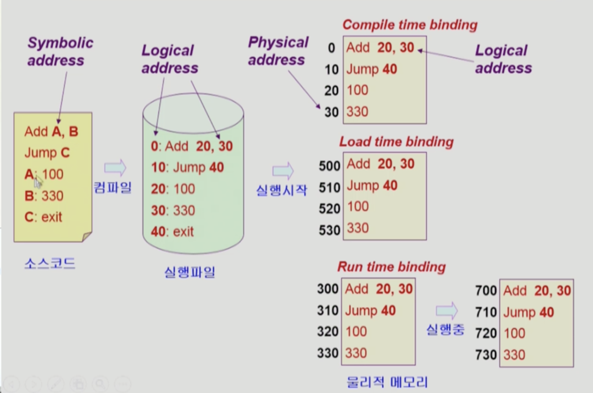

### MMU(Memory-Management Unit)
> 논리적 주소를 물리적 주소로 매핑해주는 하드웨어 장치

- MMU를 사용해 가장 기본적인 방식으로 주소 변환을 수행하는 MMU 기법(MMU scheme)

#### MMU 기법(MMU scheme) 동작 과정

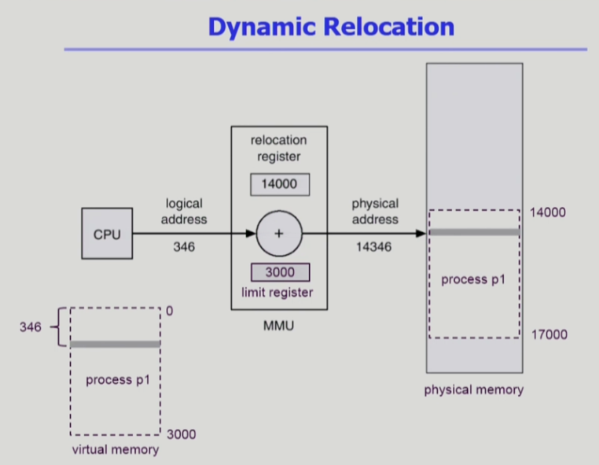

- CPU가 특정 프로세스의 가상 주소를 참조하려고 할 때 MMU 기법은 그 주소값에 기준 레지스터(base register)의 값을 더해 물리적 주소값을 얻어낸다.
- 기준 레지스터는 해당 프로세스의 물리적 메모리 시작 주소를 가지고 있다.
- 문맥교환으로 CPU에서 수행 중인 프로세스가 바뀔 때마다 기준 레지스터의 값을 그 프로세스에 해당되는 값으로 재설정함으로써 각 프로세스에 맞는 위치에 접근하는 것을 지원한다.
- 한계 레지스터는 프로세스가 자신의 주소 공간을 넘어서는 메모리 참조를 하려고 하는지 체크하는 용도로 사용되며, 현재 CPU에서 수행 중인 프로세스의 논리적 주소의 최댓값, 즉 그 프로세스의 크기를 담고 있다.

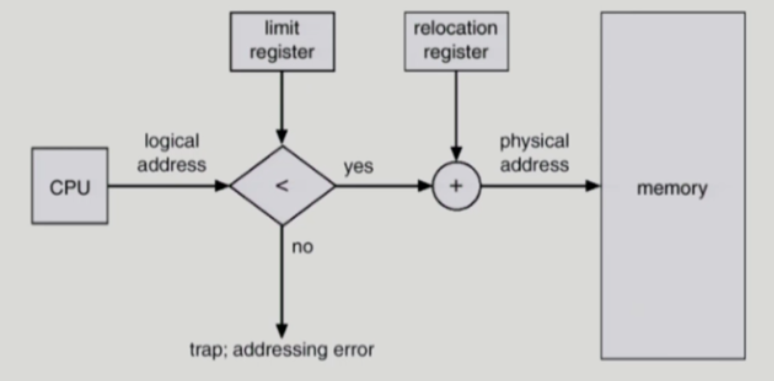

# 메모리 관리와 관련된 용어

### 동적 로딩(dynamic loading)
> 프로세스 내에서 실행에 필요한 부분이 실제로 불릴 때마다 메모리에 적재하는 것

- 다중 프로그래밍 환경에서 메모리 사용의 효율성을 높이는 기법 중 하나이다.
- 가끔씩 사용되는 많은 양의 코드의 경우 유용하다.
    - ex) 오류 처리 루틴
- 운영체제의 특별한 지원 없이 프로그램 자체에서 구현이 가능하며, 운영체제가 라이브러리를 통해 지원할 수도 있다.

### 중첩(overlays)
> 프로세스의 주소 공간을 분할해 실제 필요한 부분만을 메모리에 적재하는 기법

- 초창기 컴퓨터 시스템에서 물리적 메모리의 크기 제약으로 인해 하나의 프로세스조차도 메모리에 한꺼번에 올릴 수 없을 때, 프로세스의 주소 공간을 분할해서 당장 필요한 일부분을 메모리에 올려 실행하고 해당 부분에 대한 실행이 끝난 후에 나머지 부분을 올려 실행하는 기법을 뜻한다.
- 프로세스의 크기가 메모리보다 클 때 유용하다.
- 작은 공간의 메모리를 사용하던 초창기 시스템에서 운영체제의 지원 없이 수작업으로 프로그래머가 구현하였다.
    - 수작업 오버랩
    - 프로그래밍이 상당히 복잡하다.
- 동적 로딩과의 차이점
    - 동적 로딩: 다중 프로세스 환경에서 메모리에 더 많은 프로세스를 동시에 올려놓고 실행하기 위한 용도이다.
    - 오버랩: 단일 프로세스만을 메모리에 올려놓는 환경에서 메모리 용량보다 큰 프로세스를 올리기 위한 어쩔 수 없는 선택이다.

### 스와핑(swapping)
> 메모리에 올라온 프로세스의 주소 공간 전체를 디스크의 스왑 영역(swap area)에 일시적으로 내려놓는 것

- 메모리에 올라온 프로세스의 주소 공간 전체를 디스크의 스왑 영역으로 쫓아내는 것이다.
    - swap area는 backing store라고 부르며, 디스크 내에 파일 시스템과는 별도로 존재하는 많은 사용자의 프로세스를 담을 만큼 충분히 빠르고 큰 저장 공간이다.
- 디스크에서 메모리로 올리는 작업을 swap in, 메모리에서 디스크로 내리는 작업을 swap out라고 부른다.
- swap이 일어나는 과정
    - 일반적으로 중기 스케줄러가 swap out할 프로세스를 선정한다.
        - 주로, 우선 순위 기반 CPU 스케줄링을 사용한다.
        - 우선 순위가 낮은 프로세스를 swap out함.
        - 우선 순위가 높은 프로세스를 swap in함.
    - 만약 컴파일 타임 바인딩 혹은 로드 타임 바인딩이 사용되고 있다면, swap out되었다가 swap in이 되면 원래 존재하던 메모리 위치로 다시 올라가야 한다.
    - 반면 런타임 바인딩이 사용되고 있다면, 추후 빈 메모리 영역 아무 곳에나 프로세스를 올릴 수 있으므로 Swapping에 적합하다.
- swap time은 디스크의 탐색 시간이나 회전 지연 시간 보다는 디스크 섹터에서 실제 데이터를 읽고 쓰는 전송 시간(transfer time)이 대부분을 차지한다.

### 동적 연결(dynamic linking)
> 컴파일을 통해 생성된 목적 파일과 라이브러리 파일 사이의 연결을 프로그램의 실행 지점까지 지연시키는 기법

- 연결(linking)이란 프로그래머가 작성한 소스 코드를 컴파일하여 생성된 목적 파일(object file)과 이미 컴파일된 라이브러리 파일들을 묶어 하나의 실행 파일을 생성하는 과정이다.
- 정적 연결
    - 라이브러리가 프로그램의 실행 파일 코드에 포함된다.
    - 실행 파일의 크기가 커진다.
    - 동일한 라이브러리를 각각의 프로세스가 메모리에 올리므로 메모리 낭비가 심하다. (ex. printf 함수의 라이브러리 코드)
- 동적 연결
    - 실행 파일에 라이브러리 코드가 포함되지 않으며, 프로그램이 실행되면서 라이브러리 함수를 호출할 때가 되어서야 라이브러리에 대한 연결이 이루어진다.
    - 라이브러리 호출 부분에 라이브러리 루틴의 위치를 찾기 위한 stub이라는 작은 코드를 둔다.
    - 라이브러리가 이미 메모리에 있으면 그 루틴의 주소로 가고, 없으면 디스크에서 읽어 온다.
    - 운영 체제의 도움이 필요하다.

## 물리적 메모리의 할당 방식

- 물리적 메모리는 운영체제 상주 영역과 사용자 프로세스 영역으로 나뉜다.
    - 운영체제 상주 영역은 인터럽트 벡터와 함께 낮은 주소 영역을 사용한다.
    - 사용자 프로세스 영역은 높은 주소 영역을 사용한다.
- 사용자 프로세스 영역의 할당 방법
    - 연속 할당
        - 각각의 프로세스가 메모리의 연속적인 공간에 적재되도록 하는 것이다.
        - 고정 분할 방식과 가변 분할 방식이 존재한다.
    - 불연속 할당
        - 하나의 프로세스가 메모리의 여러 영역에 분산되어 올라가는 것이다.
        - Paging, Segmentaing, Paged Segmentation 방식이 존재한다.

## 연속 할당

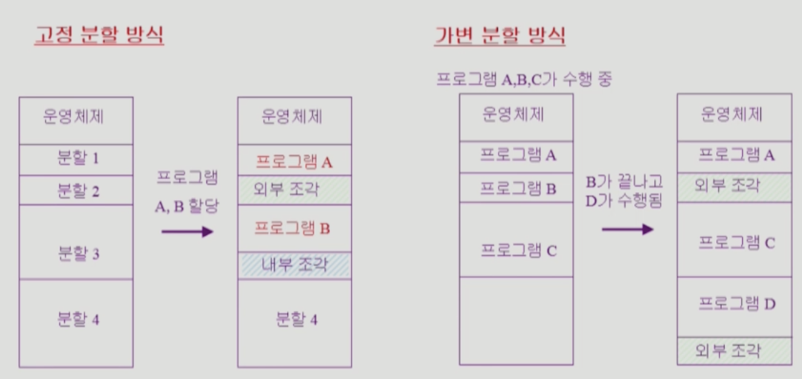

### 고정 분할 방식

- 메모리를 주어진 개수만큼의 영구적인 파티션으로 미리 나누어두고 각 파티션에 하나의 프로세스를 적재해 실행한다.
- 동시에 메모리에 올릴 수 있는 프로그램의 수가 고정되어 있으며 수행 가능한 프로그램의 최대 크기 또한 제한된다는 점에서 융통성이 떨어진다.
- 외부 조각과 내부 조각이 발생할 수 있다.
    - 외부 조각: 프로그램의 크기보다 파티션의 크기가 작은 경우 해당 파티션이 비어있는 데도 불구하고 프로그램을 적재하지 못하기 때문에 생기는 메모리 공간을 의미한다.
        - 내가 올리려는 프로그램보다 메모리 크기가 작다.
    - 내부 조각: 프로그램의 크기보다 파티션의 크기가 큰 경우 해당 파티션에 프로그램을 적재하고 남는 메모리 공간을 의미한다.
        - 내가 올리려는 프로그램보다 메모리 크기가 크다.

### 가변 분할 방식

- 메모리에 적재되는 프로그램의 크기에 따라 파티션의 크기, 개수가 동적으로 변하는 방식이다.
- 고정 분할 방식과 달리 미리 메모리 영역을 나누어 놓지 않는다.
- 프로그램이 실행될 때마다 차곡차곡 메모리에 올리므로 내부 조각이 발생하지 않는다.
    - 다만 중간에 프로그램이 종료되어 메모리에서 빠져 나가고, 그 공간에 새로운 프로그램이 메모리에 할당될 경우 외부 조각이 발생할 수 있다.

**Hole**

- 가용 공간을 의미한다.
    - 가용 공간이란 사용되지 않은 메모리 공간으로서 메모리 내의 여러 곳에 산발적으로 존재할 수 있다.
- 프로세스가 도착하면 수용 가능한 hole을 할당해야 한다.
- 운영 체제는 이미 사용 중인 메모리 공간인 할당 공간과 사용하고 있지 않은 가용 공간에 대한 정보를 유지하고 있다.
- 아래 그림에서 어두운 색 영역이 Hole이다.

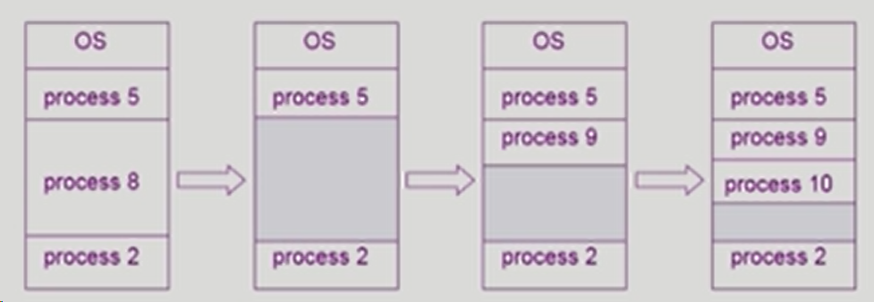

**동적 메모리 할당 문제**

- 가변 분할 방식에서 주소 공간의 크기가 n인 프로세스를 메모리에 올릴 때 물리적 메모리 내의 가용 공간 중 어떤 위치에 올릴 것인지 결정하는 문제이다.
- First-fit
    - size가 n 이상인 것 중 최초로 찾아지는 hole에 할당한다.
- Best-fit
    - size가 n 이상인 가장 작은 hole을 찾아서 할당한다.
    - Hole들의 리스트가 크기 순으로 정렬되지 않은 경우 모든 hole을 탐색해야 한다.
    - 많은 수의 아주 작은 hole이 생성된다.
- Worst-fit
    - 가장 큰 hole에 할당한다.
    - 역시 hole을 탐색해야 한다.
    - 상대적으로 아주 큰 hole이 생성된다.
- First-fit과 Best-fit이 Worst-fit보다 속도와 공간 이용률 측면에서 효과적이다.

**Compaction (압축)**

- 외부 조각 문제를 해결하는 방법 중 하나이다.
- 물리적 메모리 중에서 프로세스에 의해 사용 중인 메모리 영역을 한 쪽으로 몰고, 가용 공간들을 다른 한쪽으로 몰아서 하나의 큰 가용 공간을 만드는 방법이다.
- 매우 비용이 많이 드는 방법이다.
- 최소한의 메모리 이동으로 압축하는 방법은 매우 복잡한 문제이다.
- 압축은 프로세스의 주소가 실행 시간에 동적으로 재배치가 가능한 런타임 바인딩 방식을 지원하는 환경에만 가능하다.

## 페이징 기법

- 프로세스의 주소 공간을 동일한 크기의 페이지 단위로 나누어 물리적 메모리의 서로 다른 위치에 페이지를 저장하는 방식이다.
- 각 프로세스의 주소 공간 전체를 물리적 메모리에 한꺼번에 올릴 필요가 없고, 일부는 backing storage, 일부는 물리적 메모리에 혼재하는 것이 가능하다.
- 물리적 메모리를 페이지와 같은 동일한 크기의 프레임으로 미리 나누어 둔다.
- 메모리에 올리는 단위가 동일한 크기의 페이지 단위이므로 외부 조각이 발생하지 않고, 동적 메모리 할당 문제도 고려할 필요가 없다.
- 페이지 테이블을 사용하여 논리적 주소를 물리적 주소로 변환하는 작업이 필요하다.
- 프로그램의 크기가 항상 페이지 크기의 배수가 된다는 보장이 없으므로 프로세스의 주소 공간 중 제일 마지막에 위치한 페이지에서는 내부 조각이 발생할 수 있다.

### 페이징 예시

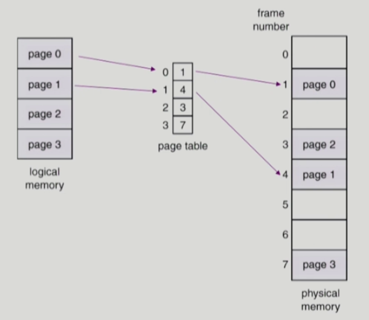

- 논리적 메모리는 페이지 단위로 분할이 되고, 물리적 메모리는 프레임 단위로 분할이 되어 서로 매칭된다. 이때 논리적 주소를 물리적 주소로 변환하기 위해 페이지 테이블을 활용한다.

### 주소 변환 기법

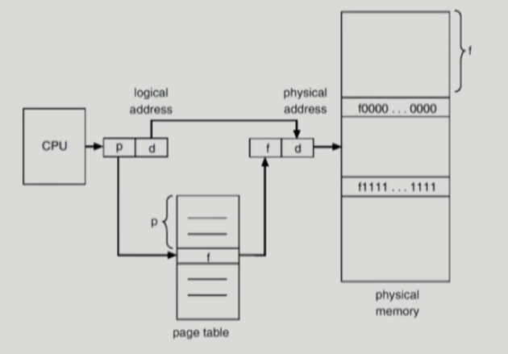

- 페이징 기법에서는 CPU가 사용하는 논리적 주소를 페이지 번호(p)와 페이지 오프셋(d)으로 나누어 주소 변환에 사용한다.
- 페이지 번호는 각 페이지별 주소 변환 정보를 담고 있는 페이지 테이블 접근 시 인덱스로 사용되고, 해당 인덱스의 항목에는 그 페이지의 물리적 메모리 상의 기준 주소, 즉 시작 위치가 저장된다.
- 따라서 특정 프로세스의 p번째 페이지가 위치한 물리적 메모리의 시작 위치를 알고 싶다면 해당 프로세스의 페이지 테이블에서 p번째 항목을 찾아보면 된다.
- 페이지 오프셋은 하나의 페이지 내에서의 변위를 알려준다. 따라서 기준 주소 값에 변위를 더함으로써 요청된 논리적 주소에 대응하는 물리적 주소를 얻을 수 있다.
- 위 그림에서 f (물리적 주소의 시작 위치) + d를 취하면 처음에 CPU가 요청한 논리적 주소에 대응하는 물리적 주소가 된다.

### 페이지 테이블의 구현

- 페이지 테이블은 페이징 기법에서 주소 변환을 하기 위한 자료 구조로, 물리적 메모리인 Main Memory에 상주한다.
- 현재 CPU에서 실행 중인 프로세스의 페이지 테이블에 접근하기 위해 2개의 레지스터를 사용한다.
    - 페이지 테이블 기준 레지스터(page-table base register)
        - 메모리 내에서 페이지 테이블의 시작 위치를 가리킴
    - 페이지 테이블 길이 레지스터(page-table length register)
        - 페이지 테이블의 크기를 보관함
- 페이징 기법에서 모든 메모리 접근 연산은 총 2번씩 필요하다.
    - 주소 변환을 위해 페이지 테이블에 접근
    - 변환된 주소에서 실제 데이터에 접근
    - 이러한 오버헤드를 줄이고 메모리의 접근 속도를 향상하기 위해 **TLB(Translation Look-aside Buffer)**라고 불리는 고속의 주소 변환용 하드웨어 캐시를 사용한다.

### TLB

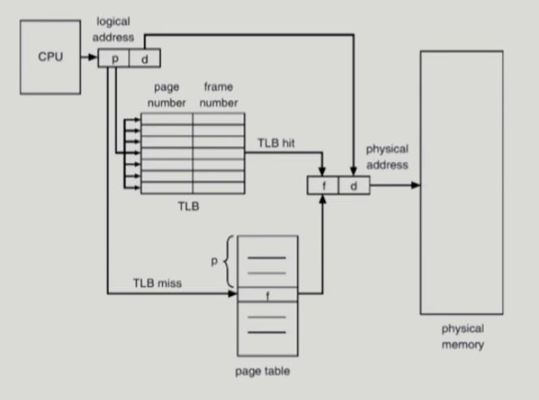

- TLB는 가격이 비싸기 때문에 빈번히 참조되는 페이지에 대한 주소 변환 정보만 담게 된다.
- 요청된 페이지 번호가 TLB에 존재한다면 곧바로 대응하는 물리적 메모리의 프레임 번호를 얻을 수 있지만, TLB에 존재하지 않는 경우에는 메인 메모리에 있는 페이지 테이블로부터 프레임 번호를 알아내야 한다.
- 페이지 테이블에는 페이지 번호가 주어지면 해당 페이지에 대응하는 프레임 번호를 얻을 수 있지만, TLB에는 페이지 번호와 프레임 번호 쌍을 가지고 있으므로 특정 페이지 번호가 있는지 TLB 전체를 찾아봐야 한다.
    - 이때 TLB 풀 스캔 시간이 오래 걸리므로 병렬적으로 탐색이 가능한 연관 레지스터를 사용한다.
- TLB는 context switch시, 이전 프로세스의 주소 변환 정보를 담고 있는 내용이 전부 지워진다.

### 연관 레지스터를 사용한 평균 메모리 접근 시간 (Effective Access Time)

- 메모리에 접근하는 시간을 1이라 하고, 연관 레지스터에 접근하는 시간을 ε이라고 하자. (이때, ε은 1보다 충분히 작은 값이다.)
- 요청된 페이지에 대한 주소 변환 정보가 연관 레지스터에 존재할 확률을 a라고 하자.
- 평균적인 메모리 접근 시간 EAT는 다음과 같다.
    - EAT = (1 + ε)a + (2 + ε)(1 - a) = 2 + ε - a
    - (1 + ε)a 항은 요청된 페이지의 주소 변환 정보가 TLB에 존재하는 경우이다.
        - TLB로부터 직접 물리적인 메모리에 얻는 데 ε시간이 소요되고, 실제 원하는 데이터에 접근하기 위해 한 번에 메모리 접근이 필요하므로 (1 + ε)이 된다. 여기에 TLB에서 존재하는 확률인 a를 곱하면, (1 + ε)a가 된다.
    - (2 + ε)(1 - a) 항은 요청된 페이지에 대한 주소 변환 정보가 TLB에 존재하지 않는 경우이다.
        - 요청된 페이지에 대한 주소 변환 정보가 TLB에 있는지 확인하는 시간 ε이 소요되고, 페이지 테이블에 접근하는 시간 ε과 실제 원하는 데이터에 접근 시간 a, 두 번의 메모리 접근이 필요하게 된다. 따라서 (2 + ε)의 시간이 소요되며, 여기에 TLB에서 찾지 못하는 비율인 (1 - a)를 곱하여 (2 + ε)(1 - a)가 된다.
    

### 계층적 페이징

- 현대의 컴퓨터는 주소 공간이 매우 큰 프로그램을 지원한다.
    - 예를 들어 32비트 주소 체계를 사용하는 컴퓨터에서는 4GB의 주소 공간을 갖는 프로그램을 지원한다.
        - 페이지 사이즈가 4K라면, 한 프로세스당 페이지 테이블을 위해 1M 크기의 페이지 테이블 메모리 공간이 필요하다.
        - 그러나 대부분의 프로그램은 4G의 주소 공간 중 지극히 일부분만 사용하므로 페이지 테이블 공간이 심하게 낭비된다.
- 위 문제로 인하여 페이지 테이블 자체를 페이지로 구성하는 2단계 페이징 기법을 사용한다.

**2단계 페이징 기법**

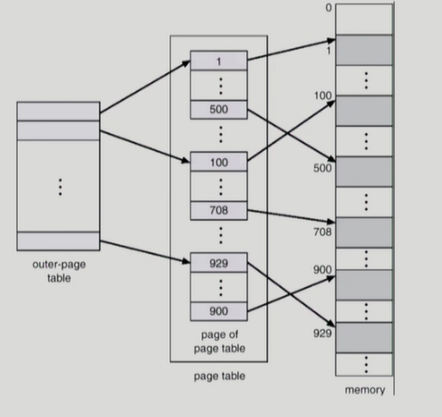

- 주소 변환을 위해 외부 페이지 테이블과 내부 페이지 테이블의 두 단계에 걸친 페이지 테이블을 사용한다.
- 사용하지 않는 주소 공간에 대해서는 외부 페이지 테이블의 항목을 NULL로 설정하며, 여기에 대응하는 내부 페이지 테이블을 생성하지 않는다.
- 페이지 테이블을 위해 사용되는 메모리 공간을 줄이지만, 페이지 테이블의 수가 증가하므로 시간적인 손해가 뒤따른다.

**2단계 페이징 기법의 주소 변환**

- 프로세스의 논리적 주소를 두 종류의 페이지 번호(P1, P2)와 페이지 오프셋(d)으로 구분한다.
    - P1은 외부 페이지 테이블의 인덱스이고, P2는 내부 페이지 테이블의 인덱스이다.
    - 논리적 주소를 <P1, P2, d> 형태로 표시할 수 있게 된다.
- 외부 페이지 테이블로부터 P1만큼 떨어진 위치에서 내부 페이지 테이블의 주소를 얻게 되고, 내부 페이지 테이블로부터 P2만큼 떨어진 위치에서 요청된 페이지가 존재하는 프레임의 위치를 얻은 후, 해당 프레임으로부터 d만큼 떨어진 곳이 바로 찾으려는 물리적 주소이다.

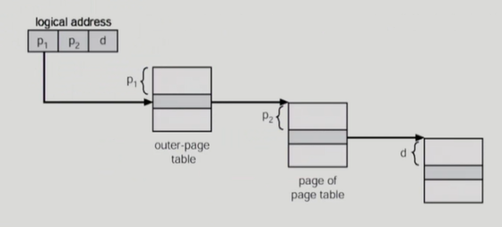

- 32비트 주소 체계를 갖는 시스템에서 페이지 하나의 크기를 4KB라 하고 페이지 테이블 항목의 크기를 4byte라고 할 때, 32비트의 논리적 주소 중 페이지 번호와 페이지 오프셋을 위해 각각 몇 비트씩 할당해야 하는가?
    - 먼저 페이지의 크기가 4KB이므로 하나의 페이지 내에서의 byte 오프셋을 결정하기 위해 12비트가 필요하다.
    - 2단계 페이징 기법에서는 내부 페이지 테이블 자체를 하나의 프레임에 보관하게 되므로 내부 페이지 테이블의 크기 역시 4KB가 된다. 페이지 테이블 항목의 크기가 4byte이므로 내부 페이지 테이블은 4KB/4byte, 즉 1K개의 항목을 가지게 된다. 1K 항목을 구분하기 위해서는 10비트가 필요하다.
    - P1은 (32 - 12- 10)을 취하여 10비트가 할당된다.

**다단계 페이징 기법**

- 프로세스의 주소 공간이 커질수록 페이지 테이블의 크기도 커지므로 주소 변환을 위한 메모리 공간 낭비가 심해진다.
- 다단계 페이지 테이블을 사용하면 페이지 테이블을 위해 사용되는 메모리 공간의 소모를 줄일 수 있지만, 메모리 접근 시간이 늘어난다.
- TLB를 통해 메모리 접근 시간을 줄일 수 있다.
- 4단계 페이지 테이블을 사용하는 경우
    - 메모리 접근 시간이 100ns, TLB 접근 시간이 20ns
    - 요청된 페이지에 대한 주소 변환 정보가 TLB에 존재할 확률 98%
    - 평균 메모리 접근 시간 (EAT) = 0.98 x 120 + 0.02 x 520 = 128ns
        - TLB hit이 성공할 때는 TLB 접근 시간과 메모리 접근 시간의 합인 120ns가 된다.
        - TLB hit이 실패할 때는 TLB 접근 시간과 메모리 접근 시간 x 5의 합인 520ns이 된다.
    - 결과적으로 주소 변환을 위해서만 28ns가 소요된다.

### 역페이지 기법

- 페이지 테이블로 인한 메모리 공간의 낭비가 심한 이유
    - 모든 프로세스의 모든 페이지에 대한 페이지 테이블 항목을 구성해야 함.
- 이 문제를 해결하기 위해 역페이지 기법을 사용할 수 있다.
    - 물리적 메모리의 페이지 프레임 하나당 페이지 테이블에 하나씩의 항목을 두는 방식이다.
    - 논리적 주소에 대해 페이지 테이블을 만드는 것이 아니라, 물리적 주소에 대해 페이지 테이블을 만드는 것이다.
    - 시스템 전체에 페이지 테이블을 하나만 둔다.
    - 페이지 테이블의 각 항목은 어느 프로세스의 어느 페이지가 이 프레임에 저장되었는 지의 정보를 보관하고 있다.
        - 페이지 테이블의 각 항목은 프로세스 번호(pid)와 그 프로세스 내의 논리적 페이지 번호(p)를 담고 있다.
    - 페이지 전체를 탐색해야 하는 단점이 있다.
        - 따라서 일반적으로 연관 레지스터를 사용하여 병렬 탐색을 수행한다.

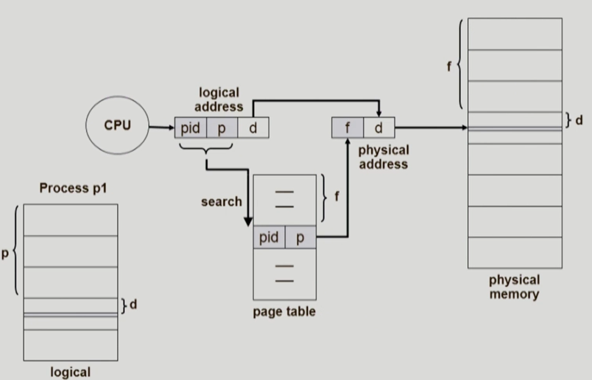

### 공유 페이지

- 공유 코드는 메모리 공간의 효율적인 사용을 위해 여러 프로세스에 의해 공통적으로 될 수 있도록 작성된 코드를 말한다.
    - 재진입 가능 코드, 순수 코드라고도 불리며, 읽기 전용의 특성을 가지고 있다.
- 공유 페이지는 공유 코드를 담고 있는 페이지를 말한다.
    - 공유 페이지는 여러 프로세스에 의해 공유되는 페이지이므로 물리적 메모리에 하나만 적재되어 메모리를 효율적으로 사용할 수 있다.
- 예를 들어 문서 편집기 프로그램을 공유 페이지를 사용해서 작성한 경우, 이 프로세스를 여러 개 수행하더라도 공유 코드를 담은 페이지는 메모리에 하나만 올라간다.
    - 공유 코드는 읽기 전용의 성질을 가져야 하고 모든 프로세스의 논리적 주소 공간에서 동일한 위치에 존재해야 한다.
- 사유 페이지는 프로세스들이 공유하지 않고, 프로세스 별로 독자적으로 사용하는 페이지를 뜻함.
    - 사유 페이지는 해당 프로세스의 논리적 주소 공간 중 어떠한 위치에 있어도 무방하다.

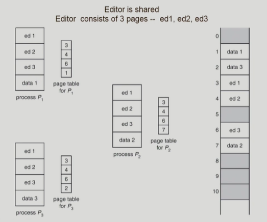

- ed 1, ed 2, ed 3는 공유 페이지이고, data 1, data 2, data 3는 사유 페이지이다.

### 메모리 보호

- 페이지 테이블의 각 항목에는 주소 변환 정보 외에 메모리 보호를 위한 보호 비트와 유효-무효 비트가 존재한다.
- 보호 비트는 각 페이지에 대해 읽기-쓰기/읽기 전용 등의 접근 권한을 설정하는 데 사용된다.
- 유효-무효 비트는 해당 페이지의 내용이 유효한 지에 대한 내용을 담고 있다.
    - 유효-무효 비트가 ‘유효’: 해당 메모리 프레임에 해당 페이지가 존재. 따라서 접근 허용
    - 유효-무효 비트가 ‘무효’: 해당 페이지가 물리적 메모리에 올라와 있지 않고, backing store에 존재하여 해당 메모리 프레임에 접근 불가

아래는 유효-무효 비트와 관련된 사진이다.

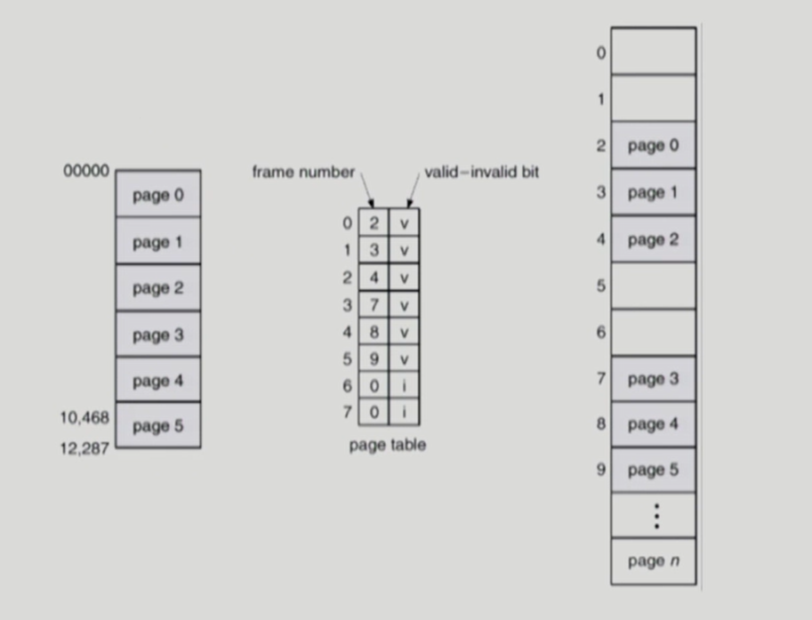

     

 

### 📚 출처

[반효경교수님 운영체제 강의](http://www.kocw.net/home/search/kemView.do?kemId=1226304&ar=relateCourse)

[운영체제 정리 깃헙](https://github.com/pjy1368/operating-system-study/tree/main/학습%20내용)

 

***

## Summary

***

 

# ⁉️ 면접 예상 질문

> 1. 사용자 프로세스 영역의 할당 방법의 종류에 대해 설명해주세요. -> (연속 할당, 불연속 할당) 각각의 종류 특징 설명

> 2. Paging 기법에 대해 설명해주세요.

> 3. Paging의 장단점에 대해 설명해주세요. 

