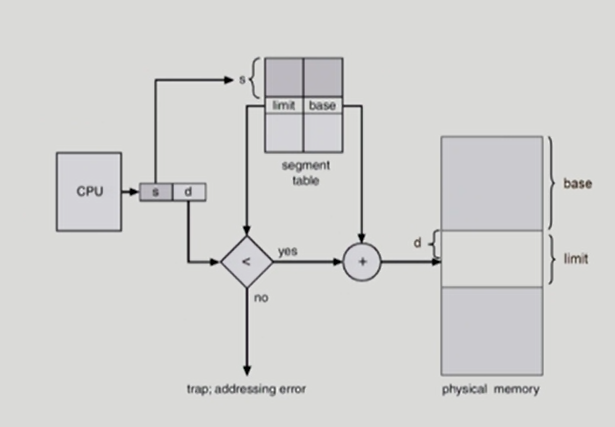
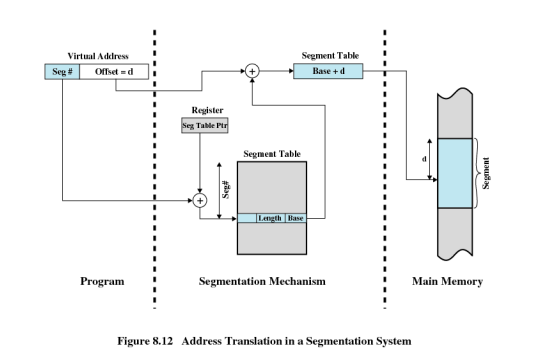
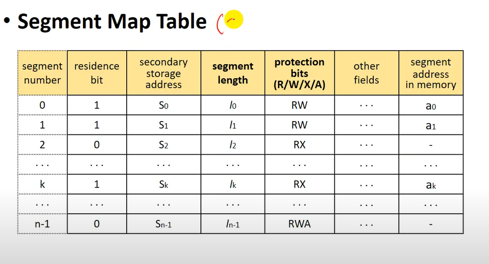
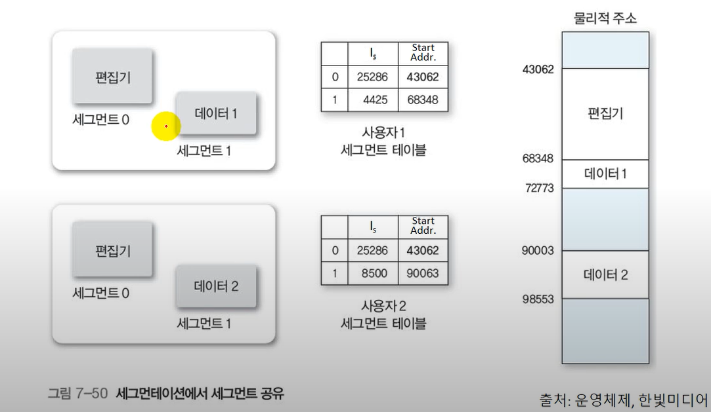
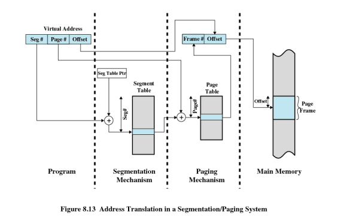

# 메모리 전략

> Segmentation

> Segmentation Architecture

> Segmentation with Paging

## Segmentation
프로그램은 의미 단위인 여러 개의 `segment`로 구성
    - 작게는 프로그램을 구성하는 함수 하나하나를 세그먼트로 정의
    - 크게는 프로그램 전체를 하나의 세그먼트로 정의
    - 일반적으로는 `code`, `data`,`stack` 부분이 하나씩의 세그먼트로 정의됨

`Segment`는 **논리적인 하나하나의 단위**이다.
    - main()
    - function
    - global variables
    - stack
    - symbol table, arrays

> 돼지를 도축할 때, 페이징은 돼지를 같은 크기로 잘라서 보관하는 것이라면, 세그멘테이션은 부위별로 잘라서 보관하는 것이다

**세그멘테이션(Segmentation)**
- 프로세스를 물리적 단위인 페이지가 아닌 논리적 단위인 세그먼트로 분할해서 메모리에 적재하는 방식

## Segementation의 사상
- Logical address는 두가지로 구성
    - <`Segement-number`,`offset`>
- Segment table
    - base: starting physical address of the segment
    - limit: length of the segment
- Segment-table base register(STBR)
    - 물리적 메모리에서의 segment table의 위치
- Segment-table length register(STLR)
    - 프로그램이 사용하는 segment의 수

- 가상주소는 세그먼트 번호(s)와 세그먼트 내의 위치 값(d)으로 표현되고, 세그먼트 테이블의 시작주소에 s를 더해 해당 엔트리를 찾는 과정은 페이징과 다를것이 없다. 
- 세그먼트 테이블에서 한 엔트리가 가지는 정보는 `존재 비트`, `존재 비트의 값에 따라 유효한 디스크 주소`와 `메모리 주소를 갖는 필드`들이 있다. 
    - 여기서 페이징과 다른 점은 (페이징 때의 프레임 번호와 같이 실주소를 위해 계산을 요구하는 형태가 아닌)**실주소**라는 점이다. 
    - 엔트리에 해당 **세그먼트가 적재된 메모리의 시작주소**가 적혀있다. 
    - 존재 비트가 0인 경우(segment fault) swap device로 부터 해당 segment를 메모리로 적재 segment map table 갱신
- 다음으로 **세그먼트의 길이(Length)**가 적혀 있는 필드가 있는데 이것은 세그먼트의 크기가 서로 다름으로 인해 필요한 조치를 위해 사용된다.
      - d가 segment 길이보다 큰 경우 (d>length)에는 segment overflow exception 처리 모듈 호출
- 세그먼트의 실행을 제어할 때 사용하는 몇 개의 비트들을 구현에 따라 설정 할 수 있다.
    - 즉 읽기, 쓰기, 실행, 추가와 같은 작업을 각 비트를 1 또는 0으로 지정하고 그 조합으로 해당 세그먼트에 대해 정교하게 제어할 수 있는데 이런 비트들을 `접근 제어 키(Access Control Key)`라 부른다. 
     - 허가되지 않은 연산일 경우(protection bit 검사) segment protection exception 처리 모듈을 호출

## 세그먼트의 보호(Protection)와 공유(Sharing)

> segement는 의미 단위이기 때문에 공유(sharing)와 보안(protection)에 있어 paging보다 훨씬 효과적이다.

- Protection
    - 각 세그먼트 별로 **protection bit**가 있음
    - (예시) 사상에서 실주소를 위해 더해지는 위치 값(d)이 세그먼트의 길이 값을 초과하면, 트랩을 통해 프로세스의 실행을 중지시켜 사용자 간의 메모리 보호가 가능하다. 
    - 접근 제어 키를 사용하여 세그먼트 별로 허용되는 작업을 제어하여, 사용자의 잘못된 접근으로부터 보호될 수 있다. 

- Sharing
    - shared segment
    - same segment number 
        - 공유하는 방법은 엔트리에서 같은 주소 값을 가지도록하면 된다. 
    - segment는 논리적으로 나눠져있기 때문에 해당 논리안의 branch의 경우 내부적으로 얼마 만큼 이동해야하는지 알려준다. 이동은 segment 내부에서 이뤄지기 때문에 **서로 다른 프로세스라도 문제가 되지 않는다.**

### 세그먼트의 할당(allocation)
- Allocation
    - first fit/ best fit
    - external fragmentation 발생
    - segmentation의 길이가 동일하지 않으므로 가변분할 방식에서와 동일한 문제점들이 발생

## 세그먼테이션 장단점
### 장점
- 보호와 공유 면에서 효과적
    - 두 user process가 동일한  코드(text segment)를 공유하기 용이
    - 각 memory section들에게 각기 다른 read/write 권한 설정할 수 있음

### 단점
- 세그먼트는 가변적이라 동적 메모리 할당을 해야함 -> `외부 단편화`발생할 수 있다.
- 평균 세그먼트 크기가 작을수록 외부 단편화 작음

## Segmentation with Paging

> 페이징의 편리함과 세그먼테이션의 논리적 장점을 함께 가지기 위한 기법이다.

- 프로그램을 먼저 세그먼트로 나눈 후, 각 세그먼트는 다시 페이지들로 나뉜다.
    - 즉 각각의 세그먼트는 여러 개의 페이지들로 이루어질 것이고, 사상의 최종 단위는 페이지이므로 (페이징을 할 때와 같이) 메모리는 페이지와 같은 크기의 프레임들로 구성되어 있다. 
    - 사상을 위해 `세그먼트 테이블이 하나 `필요하고, `세그먼트 테이블의 엔트리 개수만큼 페이지 테이블`이 필요해진다.
- `가상주소`는 `세그먼트 번호(s)`, `페이지 번호(p)`, 그리고 `페이지 내의 위치 값(d)`으로 표현되는데, 세그먼트 테이블의 각 엔트리는 나누어진 자신의 페이지들을 위한 페이지 테이블의 시작주소를 가지고 있다. 
- 가상주소 <s,p,d>가 참조되면, 세그먼트 테이블의 시작주소를 가지는 기준레지스터 값에 s를 더해 세그먼트 s를 위한 엔트리를 검색한 후 s를 위한 페이지 테이블의 시작주소를 알게 된다. 
    - 이때 엔트리에 표시된 접근 제어 키의 위반 여부에 따라 실행이 중지될 수도 있으며, 적재는 페이지 단위이므로 존재 비트를 둘 필요는 없다. 
- 페이지 테이블의 시작주소를 얻은 후 가상주소의 p를 더해 p를 위한 엔트리를 검색하면(존재 비트가 0일 경우 먼저 적재 과정을 거쳐야 한다.) p가 적재된 프레임 번호를 알 수 있다. 그 다음은 (프레임 번호에 페이지 크기를 곱한 후 가상 주소의 위치 값 d를 더해서 얻게 되는) 실주소를 접근하면 된다. 

> 이 기법은 사상을 위한 테이블의 전체 크기가 커지고 실주소로의 접근까지 메모리 접근이 더 요구되는 단점은 있으나, 잘 구현 했을 때의 장점 때문에 OS/2 운영체제 등에서 사용되고 있다. 

### pure segmentation과의 차이점
- segment-table entry가 segment의 base address를 가지고 있는 것이 아니라 segment를 구성하는 page table의 base address를 가지고 있음

## 페이징(Paging)과 세그멘테이션(Segmentation)
### 단순 페이지
- 각 프로세스는 프레임들과 같은 길이를 가진 균등 페이지로 나뉨
- 외부 단편화가 생기지 않음
- 소량의 내부 단편화 존재

### 단순 세그멘테이션
- 각 프로세스는 여러 세그멘트들로 나뉨
- 내부 단편화가 생기지 않음
- 메모리 효율 개선
- 동적 분할을 통한 오버헤드 감소
- 외부 단편화 존재

### 가상 메모리 페이징
- 단순 페이징과 비교해 프로세스 페이지 전부를 로드 시킬 필요가 없음
- 필요한 페이지가 있으면 나중에 자동으로 불러들임
- 외부 단편화가 생기지 않음
- 복잡한 메모리 관리로 오버헤드가 발생

### 가상 메모리 세그멘테이션
- 필요하지 않은 세그먼트들은 로드되지 않음
- 필요한 세그먼트가 있을 때 나중에 자동으로 불러들임
- 내부 단편화가 생기지 않음
- 복잡한 메모리 관리로 오버헤드 발생 

## 페이징과 세그멘테이션의 차이는 무엇인가?
페이징과 세그멘테이션 모두 프로그램을 실행하기 위해 디스크에 있는 내용을 분할하여 메모리에 적재하는 불연속 메모리 관리 기법입니다. 

둘의 차이는 프로그램을 어떻게 분할할 것인가입니다. **페이징의 경우 프로그램을 같은 크기의 페이지로 분할하는 데에 비해, 세그멘테이션은 논리적 의미를 기준으로 세그먼트를 분할합니다.**

# 참고
[반효경 교수님 운영체제 강의](https://core.ewha.ac.kr/publicview/C0101020140509142939477563?vmode=f)

[OS?Oh Yes!책]

[페이징(Paging)과 세그멘테이션(Segmentation)](https://github.com/alstjgg/cs-study/blob/main/%EC%9A%B4%EC%98%81%EC%B2%B4%EC%A0%9C/Paging%20%26%20Segmentation.md)

# 면접 예상 질문

> 세그멘테이션이란?

> 세그멘테이션의 장단점은?

> 페이징과 세그멘테이션의 차이는 무엇인가?

> 세그멘테이션과 페이징을 사용하는 세그멘테이션의 차이점에는 무엇이 있을까?