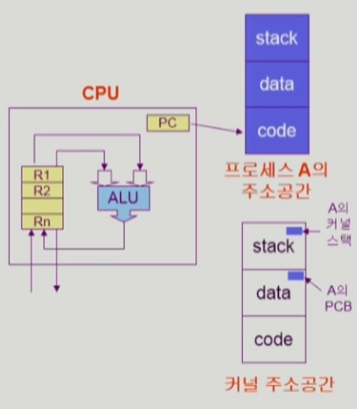

# 프로세스와 스레드

> Process  
Thread  
Multi-Process & Multi-Thread  
프로세스 관리  
프로세스 간 협력  
> 

 

# *Process*

> *“Process is a program in execution”*
> 

프로세스는 실행중에 있는 프로그램을 의미한다. 

- 디스크에 실행 파일(exe 등)의 형태로 존재하는 프로그램이 → 메모리에 적재되어 실행되기 시작하면 → 생명력을 가진 프로세스가 된다.

 

## ## 프로세스 Context

> 프로세스의 Context(문맥)
> 

여러 프로세스가 실행중인 시분할 환경에서 자주 CPU 점유권을 빼앗기고 획득하게 된다. CPU 점유권을 다시 획득한 프로세스는 이전의 상태를 재현하기 위해 정보가 필요한데, 그 정보를 `프로세스 Context(문맥)` 이라고 한다.

프로세스 Context에는 크게 3가지로 나뉜다.

1. `CPU의 수행 상태를 나타내는 하드웨어 문맥 (pc값, 레지스터 정보)`
    
    하드웨어 문맥이란 CPU의 수행 상태를 나타내는 정보로서, Program Counter 값과 각종 레지스터에 저장하고 있는 값들을 의미한다.
    
    Program Counter 값은 프로세스가 명령어를 어디 지점까지 수행했는지 가리키고 있다.
    
2. `프로세스의 주소 공간 (code, data, stack)`
3. `프로세스 관련 커널 자료 구조 (PCB, Kernel stack)`
    
    PCB
    
    운영 체제 커널의 자료구조로서 프로세스에게 할당할 자원을 설정하고 감시하는 데 필요한 프로세스의 정보를 PCB(Process Control Block)라 한다.
    
    - 운영체제는 현재 실행중인 프로세스를 관리하기 위해 자신(커널)의 데이터 영역에 해당 프로세스의 PCB를 둔다.
    
    Kernel stack
    
    프로세스가 시스템 콜을 하면 (프로세스가 수행할 수 없는 작업을 요청하면) PC가 Kernel 주소 공간의 code를 가리키며 명령어를 수행한다. 이때, 함수 호출이 이뤄지면 관련된 정보를 Kernel stack에 쌓아둔다. 
    
    - 커널은 모든 프로세스의 시스템 콜을 수행하기 때문에 프로세스마다 별도의 Kernel stack 공간을 둔다.
    

이와 같이 프로세스 Context 정보를 가지고 있으면(=프로세스의 이전 상태를 알고 있으면), 다음 시점의 명령어를 수행할 수 있게 된다.

 

> 프로세스의 상태 → Running, Ready, Blocked
> 
- `Running`
    - CPU를 잡고 명령어를 수행 중인 상태
- `Ready`
    - **메모리에 적재되어 바로 실행될 수 있는 조건을 만족한** 프로세스가 CPU 점유권을 얻지 못해 대기중인 상태 (Ready 상태의 프로세스들이 CPU 점유권을 획득하고 빼앗으면서 시분할 환경을 구성한다)
- `Blocked (Wait, Sleep)`
    - CPU를 할당받더라도 당장 명령을 실행할 수 없는 상태 (IO 작업과 같이 요청한 event가 바로 수행 결과를 반환하지 못할 때 프로세스는 Blocked 상태가 된다)
- `Suspended (Stopped)`
    - 외부적인 이유로 프로세스의 수행이 정지된 상태이다. Suspended 상태의 프로세스는 통째로 디스크에 swap out 된다. (중기 스케쥴러에 의해 메모리를 빼앗긴 프로세스의 상태이다)
        - 사용자가 프로그램을 일시 정지시키거나, 시스템이 메모리에 프로세스가 너무 많이 올라와 있어 잠시 중단 시킬 경우 Suspended 상태가 된다.
- `New` : 프로세스가 생성 중인 상태
- `Terminated` : 프로세스의 수행이 끝난 상태

 

> 프로세스 상태도
> 

- `new → ready` 프로세스가 생성중(new)이 다가 생성이 되면 ready 상태가 된다.(ready 상태에서는 cpu 점유권을 얻으면 당장 실행이 가능하다)
- `ready → running` ready 상태의 프로세스는 cpu의 점유권을 얻으면 running 상태로 변환된다.
- running 상태의 프로세스는 3가지 경우에 의해 상태가 변환된다.
    1. `running → terminated` : 프로세스의 수행이 끝날 경우 CPU 점유권을 내놓는다.
    2. `running → waiting` : 오래걸리는 작업(IO 작업)을 수행할 경우 CPU 점유권을 내놓는다
    3. `running → ready` : timer interrupt가 들어와서(=할당된 시간이 끝나서) CPU 점유권을 내놓는다.

 

> 프로세스 상태 전환 예시 : blocked와 queue
> 

- CPU는 하나의 프로세스만 실행한다. 이 때 timer interrupt가 들어오면 해당 프로세스는 Ready Queue 뒤로 들어가 ready 상태가 된다.
- 프로세스가 CPU점유권을 얻어 실행중인 running 상태였다가, Disk IO 작업을 수행하게 되면 Disk IO Queue 뒤로 들어가 blocked 상태가 된다.
    - Disk IO 작업이 끝나면 Disk Controller가 CPU에게 Interrupt를 날려 이를 알린다.
    - CPU는 운영체제에게 이를 알리고, 운영체제는 해당 프로세스를 ready 상태로 변환시키고 Ready Queue 뒤에 넣는다.
- 하드웨어 자원뿐만 아니라 소프트웨어 공유 자원(데이터)가 있다.
    - 여러 프로세스가 공유 데이터에 동시에 접근하면 일관성이 깨질 수 있다. 데이터의 일관성을 유지하기 위해 공유 데이터에 접근한 프로세스는 Resource Queue 뒤에 들어가 blocked 상태가 된다. (공유 데이터를 접근하는 작업이 오래걸릴 경우 blocked 상태가 되는 것이다)

사실 queue는 운영체제의 Kernel data 영역에서 자료구조로 구현되어있다.

 

> PCB
> 

PCB는 운영체제가 각 프로세스를 관리하기 위해 프로세스당 유지하는 정보로 구조체로 유지된다.

1. 운영체제가 관리상 사용하는 정보
2. CPU 수행 관련 하드웨어 값
3. 메모리 관련 정보
4. 파일 관련 정보

 

## ## 프로세스 문맥 교환 (Context Switch)

`문맥 교환` 이란 CPU 점유권이 현재 프로세스에서 다른 프로세스로 넘어가는 과정이다.

프로세스는 CPU 점유권을 뺏기던 시점의 문맥을 기억해두었다가 CPU 점유권을 다시 획득했을 때, 기억해둔 문맥을 이용하여 다음 명령어를 수행한다. 

1. `CPU 점유권을 빼앗기는 상황`
    
    뺏기던 시점의 문맥을 기억하기 위해 해당 프로세스의 PCB에다 CPU의 PC값과 레지스터 값을 저장해둔다. (프로세스의 PCB 정보는 Kernel data에 프로세스마다 저장되어있다)
    
2. `CPU 점유권을 얻는 상황`
    
    운영체제는 Kernel data에 저장된 해당 프로세스의 PCB에서 CPU의 PC값 및 레지스터 값을 복원시켜준다. 그런 다음에 CPU 점유권을 프로세스에게 넘겨주면 실행된다. 
    

 

> System call이나 Interrupt가 발생하면 항상 Context Switch가 발생하는가? → NO!
> 

`시스템 콜` 은 프로세스가 본인이 필요한 작업을 운영체제에게 요청하는 것이고, `인터럽트` 는 Controller와 같은 장치가 CPU에게 정보를 전달하기 위한 수단이다. 

시스템 콜이나 인터럽트가 발생하면 CPU 제어권이 사용자 프로세스 → 운영체제 커널로 넘어간다. 이 때, **유저 모드의 사용자 프로세스가 운영체제 커널모드로 전환되는 것을 문맥 교환이라고 하지 않는다. (문맥 교환은 사용자 프로세스에서 다른 사용자 프로세스로 CPU 제어권이 넘어가는 것이다)**

- `사용자 프로세스 A → 운영체제 커널 → 사용자 프로세스 A` : 문맥 교환이 일어나지 않는다.
    
    물론 이 경우에도 CPU 문맥의 일부를 PCB에 저장하지만 문맥 교환만큼 부담이 크지 않다
    
- `사용자 프로세스 A → 운영체제 커널 → 사용자 프로세스 B` : 문맥 교환이 일어난다.
    
    프로세스 A가 사용하던 캐시 메모리를 모두 지워(flush)야 하기 때문에 부담이 크다
    

## ## 프로세스 스케쥴링를 위한 큐(Queue)

프로세스들은 각 큐를 오가며 수행된다.

1. `Job Queue` : 현재 시스템 내에 있는 모든 프로세스 집합이다. (Ready Queue, Device Queues를 포함한다)
2. `Ready Queue` : 현재 메모리에 있으면서 CPU를 잡아서 실행되기를 기다리는 준비 상태의 프로세스 집합이다.
3. `Device Queue` : I/O 디바이스의 처리를 기다리는 봉쇄 상태의 프로세스 집합이다.

그림으로 나타낸 Ready Queue를 실제 자료구조에 맞게 나타내면 다음과 같다.

 

> 프로세스 스케쥴링 큐
> 

- 프로그램이 시작이 되면 ready queue에서 대기하다가 CPU 점유권을 얻게 된다.
- CPU 점유권을 가지고 있다가
    - CPU 할당 시간이 만료되면 다시 ready queue에서 대기하게 된다.
    - 오래걸리는 작업(IO 작업)을 수행하게 되면, 해당 작업 queue에서 대기하다가 작업을 수행하고 → IO 작업이 완료되면 Controller가 interrupt를 일으켜 CPU에게 알리면 → 프로세스는 ready queue에서 CPU 점유를 대기하게 된다.

## ## 스케쥴러

`스케줄러`란 어떤 프로세스에게 자원을 할당할지를 결정하는 **운영체제 커널의 코드를 지칭**한다. 스케줄러에는 3가지 스케줄러가 존재한다.

1. `Long-Term Scheduler (장기 스케줄러 or job scheduler)`
    
    메모리 및 각종 자원을 어떤 new 상태의 프로세스에게 할당할지 결정하는 스케쥴러이다.
    
    - 프로세스가 생성 중이다가(new) 메모리 할당을 받으면 비로소 ready 상태가 되어 ready queue에서 대기한다. 이 때 new 상태의 프로세스에 메모리를 할당해주는 역할을 하는게 Long-Term 스케쥴러이다.
    - `degree of Multiprogramming 제어` : 메모리에 동시에 올라갈 프로세스의 수를 제어한다.
    
    보통 우리가 사용하는 시분할 시스템에서는 **장기 스케쥴러가 없다**. (new 상태의 프로세스는 곧바로 ready 상태가 된다.) 그렇다면 시분할 시스템에서는 `degree of Multiprogramming 제어`를 어떻게 할까? → **중기 스케쥴러를 이용**한다.
    
2. `Short-Term Scheduler (단기 스케줄러 or CPU scheduler)`
    
    CPU 점유권을 어떤 프로세스에게 할당할지 결정하는 스케쥴러이다.
    
    - 스케쥴링이 일어나는 단위가 milisecond로 굉장히 자주 일어난다.
3. `Medium-Term Scheduler (중기 스케줄러 or Swapper)`
    
    메모리에 많은 프로그램이 동시에 올라가게 되면 중기 스케쥴러가 일부 프로세스를 골라내어 디스크로 쫓아낸다(프로세스에게서 메모리를 빼앗는다). → 이러한 방식으로 `degree of Multiprogramming 제어`를 하여 메모리에 동시에 올라가 있는 프로세스의 수를 조절한다.
    
    중기 스케쥴러에 의해 메모리를 빼앗긴 프로세스는 Suspended 상태가 된다.
    

 

> Blocked 상태와 Suspended 상태의 차이점
> 

`Blocked`상태는 프로세스 본인이 요청한 이벤트(IO 작업)를 수행하고 있는 상태의 프로세스이다. Blocked 상태의 프로세스는 이벤트 수행을 마치면 Ready 상태로 변환된다. (프로세스 입장에서는 계속 특정한 작업을 수행중이다)

`Suspended`상태는 CPU 또는 외부(사람 또는 중기 스케쥴러)에서부터 강제로 정지 당했을 때의 프로세스 상태이다. Suspended 상태의 프로세스는 메모리를 빼앗겨 디스크로 swap out이 된다. 따라서 외부(사람)에서 resume해줘야 active(Running, Ready)한 상태가 된다.

- Running (user mode), Running (monitor mode)
    
    시스템 콜을 한 유저모드의 프로세스는 커널 모드로 전환되어 해당 작업을 수행한다. 유저 모드에서 명령어를 실행하는 프로세스를 Running(user mode), 커널 모드로 전환되어 명령어를 실행하는 프로세스를 Running(moitor mode)로 나타낸다.
    
    
    
- Suspeded Blocked, Suspended Ready
    
    프로세스가 IO 작업중이라 Blocked 상태일 때 메모리를 빼앗겨 디스크로 swap out 되었다면 Suspended Blocked 상태가 된다. IO 작업을 마치면 Suspended Ready 상태로 전환된다.
    
    - Swap Out :  메모리 → 디스크
    - Swap In : 디스크 → 메모리

 

# *Thread*

> 스레드라는 개념이 없다면...?
> 

프로세스가 생성되면 프로세스만의 주소 공간과 Kernel data 영역에 프로세스 정보인 PCB가 생성된다.

만약 동일한 작업을 수행을 하기 위해 여러 프로세스를 생성하면, 메모리 주소 공간과 PCB가 여러개가 만들어져 메모리 공간 낭비가 심해진다.

 

> 스레드란
> 

*"A Thread (or lightweight process) is a basic unit of CPU utilization”*

`스레드` 란 프로세스가 할당 받은 자원을 이용하는 실행 단위이다.

프로세스 하나에 CPU 수행 단위만 여러개를 두었을 때, 그 각각을 스레드라고 한다.

- CPU 수행을 위해서 실행할 명령어의 위치를 담는 PC값과 CPU에 세팅할 레지스터 값이 필요하다. → `스레드마다 별도로 PC값, 레지스터값을 가지고 있다`
- 스레드가 code 부분을 수행하다 함수 호출이 일어나면, 함수에 관련된 정보를 stack에 쌓아둔다. → `스레드마다 stack이 별도로 존재한다. (code, data는 공유)`

 

> 스레드의 구성
> 
- CPU 수행과 관련된 정보(PC값, 레지스터값)
- 함수 호출시 관련 정보를 담아둘 stack 영역

즉, 이 값들은 스레드마다 독립적으로 가지는 정보이다.

> 스레드끼리 공유하는 부분 = task
> 
- code, data 영역
- OS 자원

하나의 프로세스에 여러 개의 스레드있고 하나의 task만 존재한다.

 

# *Multi-Process & Multi-Thread*

## ## Multi-Process

하나의 프로그램을 여러개의 프로세스로 구성하여 각 프로세스가 병렬적으로 작업을 수행하는 것이다. 각 프로세스 간 메모리 구분이 필요하거나 독립된 주소 공간을 가져야 할 경우 사용한다.

### ### 장점

1. `안전성`
    
    독립된 구조로 하나의 프로세스에 문제가 발생해도 다른 프로세스에 영향을 주지 않는다.
    

### ### 단점

1. `오버헤드`
    
    독립된 메모리 영역이기 때문에 Context Switching이 자주 일어나는데, Context Switching 과정에서 캐시 메모리 초기화 등 무거운 작업이 진행되고 시간이 소모되는 등 오버헤드가 발생한다.
    
2. `프로세스 간의 통신 방식이 따로 필요하다` → IPC
    
    프로세스 간에는 커뮤니케이션이 원칙적으로 제한되어 있다. 프로세스마다 독립적인 메모리 공간을 가지고 있고, CPU가 콘텍스트 스위칭을 수시로 하는데, 한 프로세스에서 다른 프로세스의 메모리에 접근해서 값을 바꾸거나 주소를 변경해버리면 해킹이나 다름없는 것이다.
    
    그럼에도 불구하고 별도의 통신이 필요한 때가 있는데 **`IPC(Inter-Process Communication)`** 이라는 통신을 활용한다.
    
    - `file 공유하기`
        
        프로세스 간 저장매체는 공유하므로 사용 가능하나, 시스템콜 등등 거치기에는 실시간으로 업데이트하기 어렵다.
        
    - `메시지 큐`
        
        키값을 가지고 양방향 통신을 함
        
    - `shared memory`
        
        커널에 메모리를 하나 파고, 읽고 쓰는 변수를 하나 지정함
        
    - `파이프`
        
        fork()해서 생성한 부모/자식 관계에 있는 프로세스의 경우에 단방향으로 통신하여 사용 가능하다.
        
    - `signal`
        
        커널 모드에서 사용자모드 전환 시, 한 프로세스에서 다른 프로세스에 이벤트를 전달한다.
        
    - `세마포어`
        
        스레드에서 임계영역에 대한 접근을 일시적으로 락하기 위한 메커니즘7. 소켓 - 네트워크 통신에 사용되는 방법이다.
        
 

## ## Multi-Thread

하나의 프로세스에 여러 스레드로 자원을 공유하며 작업을 나누어 수행하는 것이다.

### ### 장점

1. `응답성 (Responsiveness)`
    - 다중 스레드로 구성된 task 구조에서 하나의 스레드가 blocked 상태인 동안에도 동일한 task 내의 다른 스레드가 running 상태로 실행되어 빠른 처리가 가능하다.
        - 웹 브라우저가 다중 스레드로 수행될 때, 하나의 스레드는 이미지를 다운로드하기 위해 서버에 네트워크 요청을 걸어 blocked 상태가 되지만(오래 걸리는 작업), 다른 스레드는 running 상태에서 받아오는 html 파일을 화면에 출력해줄 수 있다.
2. `자원 공유 (Resource Sharing)`
    
    하나의 프로세스 안에 CPU 수행 단위인 쓰레드를 두게 되면 code, data, resource 자원을 공유하여 효율적으로 자원 활용이 가능하다.
    
3. `경제성 (Ecomony)`
    - 동일한 일을 수행하는 다중 스레드가 협력하여 높은 처리율, 성능 향상을 얻을 수 있다.
    - 새로운 프로세스 하나를 만드는 것 보다 기존의 프로세스에 쓰레드를 추가하는 것이 오버헤드가 훨씬 적다. *(스레드 간의 Context Switching은 프로세스의 Context Switching과 달리 캐시 메모리를 초기화할 필요가 없고 Code, Data, Resource 영역을 공유하므로 Stack 영역만 처리하면 되기 때문)*
4. `멀티 프로세서 아키텍처에서의 이용성 (Utilization of MP Architectures)`
    
    Multi-Processer(CPU가 여러개) 아키텍쳐에서 각각의 쓰레드가 서로 다른 CPU에서 병렬적으로 작업을 진행할 수 있기 때문에 훨씬 효율적으로 작업을 수행할 수 있다.
    

### ### 단점
1. 자원을 공유하기에 `동기화 문제`가 발생할 수 있다. (병목현상, 데드락 등)
    
    동일한 자원에 대하여 동시에 작업이 들어가는 경우 각 스레드의 결과에 영향을 미친다. 이를 해결하기 위해 임계 영역에 대하여 뮤텍스(mutex), 또는 세마포어(Semaphore) 방식을 활용한다.
    
2. `하나의 스레드에 문제가 생기면 전체 프로세스가 영향을 받는다`
    
    멀티 프로세스의 경우, 한 프로세스에 문제가 생겨도 다른 프로세스의 실행에는 영향이 없다.

<

## ## 크롬 브라우저는 Multi-Process & Multi-Thread 환경이다.

크롬 브라우져는 멀티프로세스를 하면서 멀티스레드를 한다.

- `멀티프로세스`
    
    각각의 탭들은 프로세스이다. 여러 프로세스가 한번에 실행된다. 하나의 프로세스가 죽더라도 다른 프로세스는 살아있다.또한 서로 메모리를 공유하지 않는다.
    
- `멀티스레드`
    
    각 페이지안에서 한번에 여러 일을 한다. 하나의 다운로드가 끝나지 않았는데 다른 다운로드를 시작할 수 있다. 이미지 로딩이 끝나지 않아도 그 다음 글들의 로딩이 되어 있다.
    
 

# *프로세스 관리*

프로세스 관리

## ## 프로세스 생성

- 부모 프로세스가 자식 프로세스를 생성한다. (사용자 프로세스가 직접 생성하지 못하고 `fork` 라는 시스템 콜을 통해 운영체제에게 요청을 한다)
    - 부모 프로세스와 자식 프로세스 간에는 트리 형태의 계층 구조가 형성된다. (최초의 프로세스 → 자식 프로세스1 → 자식 2 ...)
- 자식 프로세스는 필요한 자원을 운영체제로부터 받거나 부모와 공유한다.
- 부모 프로세스와 자식 프로세스가 서로 공존하며 수행되는 모델이 있고, 자식이 종료될 때까지 부모가 기다리는(wait, blocked) 모델이 있다.
- 자식 프로세스만의 독자적인 주소 공간이 만들어진다
    - 부모 프로세스의 주소 공간(code, data, stack)을 복사한다. 부모 프로세스의 현재 실행중인 상태가 그대로 복사되는 것이다.
    - 자식 프로세스는 복제된 그 공간에 새로운 프로그램을 올려 실행한다. (`fork` 로 자식 프로세스를 만들고, 만들어진 자식 프로세스에 새로운 프로그램을 덮어씌워 실행시키기 위해 `exec` 시스템 콜을 이용한다)
    

 

> fork 시스템 콜
> 

`fork()` 가 실행되는 순간 똑같은 코드를 수행하는 프로세스가 새로 생긴다.

`fork()` 를 처음 실행한 `부모 프로세스`는 그 다음 코드를 실행하고, 새로 생성된 `자식 프로세스`는 부모 프로세스의 주소 공간과 PC값을 복제하였기 때문에 main 함수 시작부터 실행되는게 아니라 부모 프로세스와 똑같이 그 다음 코드를 실행하게 된다.

현재 코드를 실행하는 프로세스가 부모인지 자식인지 확인할 수 없기 때문에 fork의 반환 값을 통해 분기처리해야한다. (`fork` 시스템 콜의 반환 값은 현재 프로세스가 부모인 경우 양수, 자식인 경우 0이다)

 

> exec 시스템 콜
> 

`execlp` 라는 exec 시스템 콜이 수행되면, 현재 코드를 수행하는 프로세스가 `execlp` 에 의해 새로운 프로그램으로 덮혀씌워진다. 그러면 `execlp` 시스템 콜 아래의 코드는 실행되지 않고 새로운 프로그램이 실행된다.

이렇듯  exec 시스템 콜은 자식 프로세스에게 새로운 프로그램을 덮어씌울 때 사용한다. (pid==0 : 자식에게는 execlp로 새로운 프로그램을 돌리고, pid>0 : 부모는 본인의 프로그램을 수행한다.)

 

## ## 프로세스 종료

프로세스가 정상적으로 종료될 때는 `exit` 시스템 콜을 통해 운영체제에게 이를 알린다.

- 자식 프로세스가 종료될 때는 부모 프로세스에게 output data를 보내 이를 알린다. `wait` 시스템 콜

부모 프로세스가 자식 프로세스를 강제 종료시킬 때는 `abort` 시스템 콜을 이용한다.

- 자식이 할당 자원의 한계치를 넘어설 경우
- 자식에게 할당된 Task가 더이상 필요하지 않을 경우
- 부모 프로세스가 먼저 종료(exit)되는 경우 자식을 먼저 죽이고 부모가 종료된다.

 

> wait 시스템 콜
> 

부모 프로세스가 fork로 자식을 생성한 다음 부모가 `wait` 시스템 콜을 호출하면 → 자식 프로세스가 끝날 때까지 부모 프로세스는 `Blocked`상태가 된다. (오래 걸리는 작업이니까 Blocked 상태)

이후에 자식 프로세스가 종료되면 부모 프로세스는 `Ready` 상태로 전환된다.

 

> exit 시스템 콜
> 

프로세스를 자발적으로 종료시키는 시스템 콜이다. exit 시스템 콜로 종료되는 경우를 “자발적 종료”라고 한다.

반면에 “비자발적 종료”는 부모 프로세스가 자식 프로세스를 강제 종료시키는 경우, 부모 프로세스가 종료되는 경우, 키보드로 break key를 누른 경우이다.

 
    

# *프로세스 간 협력*

> 프로세스 간 협력 메커니즘 : IPC (Interprocess Communication)
> 

📌 `Message Passing`

프로세스 간에 공유 데이터를 일체 사용하지 않고 **커널을 통해** 메시지를 주고 받으면서 통신하는 방식이다. (사용자 프로세스끼리 직접 정보를 주고 받지 못하기 때문에 중간에 커널이 이를 대신 전달해야한다)

 

Message Passing 방식은 크게 두 가지가 있다

1. `Direct Communication`
    
    통신하려는 프로세스의 이름을 명시적으로 표시하여 전달하는 방식이다. 
    
    
    
2. `Indirect Communication`
    
    mailbox 또는 port를 통해 메시지를 간접적으로 전달하는 방식이다. (프로세스가 mailbox에 메시지를 집어넣으면, 다른 프로세스가 꺼내 본다. 특정 프로세스에게 메시지를 전달할 수 없다)
    
    
    

 

📌 `Shared Memory`

서로 다른 프로세스들이 주소 공간의 일부를 공유하여 통신하는 방식이다. 원칙적으로 프로세스들은 각자 자신의 주소 공간만 볼 수 있다. 그럼에도 불구하고 shared memory 메커니즘을 사용하면 일부 주소 공간을 공유할 수 있다. (처음에는 Kernel에게 요청을 하여 shared memory를 할당 받아야 한다.)

shared memory 기법을 사용하면 프로세스 간 동기화 문제를 스스로 책임져야 한다.

 

# 참고

[반효경 교수님 운영체제 강의](http://www.kocw.net/home/cview.do?cid=3646706b4347ef09)

[https://steady-coding.tistory.com/522](https://steady-coding.tistory.com/522)

[멀티-프로세스와-멀티-스레드](https://wooody92.github.io/os/%EB%A9%80%ED%8B%B0-%ED%94%84%EB%A1%9C%EC%84%B8%EC%8A%A4%EC%99%80-%EB%A9%80%ED%8B%B0-%EC%8A%A4%EB%A0%88%EB%93%9C/)

# 면접 예상 질문

> 프로세스가 무엇인가요? (Context, Context Switching, Blocked 상태와 Suspended 상태 차이)
> 

> 스케쥴러에 대해 아시나요? (스케쥴러 종류)
> 

> 스레드가 무엇인가요?
> 

> 멀티 프로세스, 멀티 스레드의 장단점에 대해 설명해보세요
> 

> IPC에 대해서 설명해보세요
>
