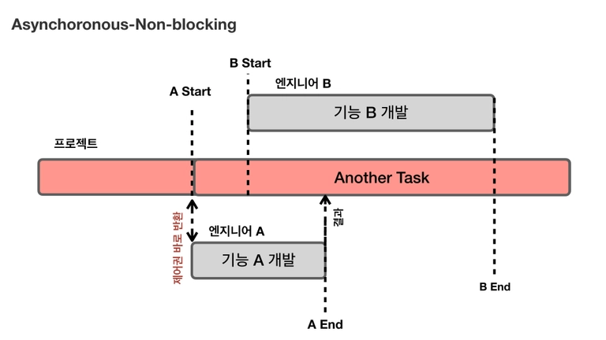

# 동기와 비동기 & 블로킹과 논블로킹

> 동기 & 비동기  
블로킹 & 논블로킹  
비교  
조합
> 

 

# *동기 & 비동기*

> 조건
> 

동기 & 비동기는 `작업을 수행하는 주체가 2개 이상`이여야 한다.

 

> 관점
> 

***처리해야 할 작업들을 어떠한 “흐름”으로 처리 할 것인가에 대한 관점***

 

> 동기와 비동기를 나누는 기준 → 작업 완료 여부
> 

`작업이 완료되었는지 아닌지 확인하는 주체에 따라` 동기 & 비동기로 나뉜다.

- 동기 : 함수를 호출한 주체는 해당 함수의 작업이 완료되었는지 확인한다.
- 비동기 : 함수를 호출한 주체는 해당 함수의 작업 완료 여부를 신경쓰지 않는다.

 

## ## 🧩동기 작업이란?

동기식 작업이란 2개 이상의 주체가 `작업을 동시에 시작` , `작업을 동시에 종료` , `하나의 작업을 끝나는 동시에 다른 주체가 작업을 시작` 하는 식의 흐름으로 작업들을 처리한다.

- 시작 시간과 종료 시간을 맞춘(Synchronize) 경우
    - ex) 프로그램 설치 작업과 설치경과를 Progress Bar로 표시하는 작업은 동시에 시작되고 동시에 끝난다. (동기 + 논블로킹 작업)

- 작업 종료 시간에 맞춰(Synchronize) 다른 주체가 작업을 시작하는 경우 (엔지니어A의 작업 결과가 있어야 엔지니어B가 작업을 할수 있다)

 

## ## 🧩비동기 작업이란?

비동기식 작업이란 2개 이상의 주제가 작업의 시작시간, 종료시간에 관계 없이 `각자 별도의 시작시간, 종료시간을 가지며` 작업들을 처리한다.

- 서로의 작업 순서가 크게 중요하지 않은 경우
    - ex) html 파일을 화면에 그리는 작업과 img 태크에 이미지를 로드하는 작업 (비동기 + 논블로킹 작업)

 

 

# *블로킹 & 논블로킹*

> 조건
> 

블로킹 & 논블로킹은 `작업의 대상이 2개 이상`이여야 한다.

 

> 관점
> 

***처리되어야 하는 (하나의) 작업이, 전체적인 작업 흐름을 “막느냐 안막느냐”에 대한 관점***

 

> 블로킹과 논블로킹을 나누는 기준 → 제어권
> 

`함수를 호출한 주체가 함수에게 제어권을 넘겨주는지` 에 따라 블로킹 & 논블로킹으로 나뉜다.

- 블로킹 : 함수를 호출한 주체가 제어권을 함수에게 넘겨주기 때문에 호출한 함수의 작업 결과를 기다린다. (호출된 함수는 작업을 마칠 때까지 제어권을 갖고 있는다)
- 논블로킹 : 함수를 호출한 주체가 계속 해서 다른 작업을 수행한다.

 

## ## 🧩블로킹 작업이란?

함수를 호출한 주체가 제어권을 함수에게 넘겨주면 호출된 함수가 작업을 완료하여 결과를 반환하기까지 기다렸다가(blocked) 작업 결과를 반환받으면 그제서야 작업을 이어간다.

- ex) Java에서 JDBC를 사용하여 DB에 쿼리를 날리고 결과를 받아오는 작업

 

## ## 🧩논블로킹 작업이란?

작업을 수행하는 주체가 함수를 호출하여 다른 작업을 요청하고, 그 결과를 받을 때까지 대기하지 않고 자신의 작업을 수행한다.

 

 

# *비교*

> 비동기와 논블로킹은 무슨 차이?
> 
- `비동기`는 작업들을 처리할 때 서로의 시간을 맞추지 않는다.
- `논블로킹`은 처리되어야 하는 하나의 작업이 전체 작업의 흐름을 막지 않는다.

 

> 동기와 블로킹은 무슨 차이?
> 
- `동기`는 작업들을 처리할 때 서로의 시간을 맞춘다.
- `블로킹`은 처리되어야 하는 하나의 작업이 전체 작업의 흐름을 막는다.

 

> 예시
> 

급하게 알아야 하는 답을 누군가에게 물어봐야하는 상황에서

1. `동기`: 전화로 물어봐서 즉답을 얻는다.
2. `비동기` : 이메일 송신을 완료(return)했지만, 답이 언제올지 모른다
3. `동기 + 블로킹` : 전화를 했지만 상대가 받지 않는다. 받을 때까지 전전긍긍 계속 대기한다.
4. `동기 + 논블로킹` : 전화를 했지만 상대가 받지 않는다. 끊었다가 나중에 다시 전화하기를 반복한다. 어느 순간 받아서 답을 얻는다.

 

# *조합*

프로젝트를 개발하는 개발 부서 예시

- 프로젝트에는 여러 작업들이 있다 → 블로킹 & 논블로킹
- 프로젝트의 여러 작업을 수행하는 주체가 여러명이다 → 동기 & 비동기

## ## 🧩동기 + 블로킹

우리가 가장 흔하게 접하는 동기 방식의 예는 바로 **`동기 & 블록킹`** 방식이다

 

📌`예시1`

> 동기
> 

기능 A의 개발이 선행되어야 기능 B를 만들 수 있기 때문에 엔지니어A의 작업이 끝나는 동시에 엔지니어 B가 작업을 시작하도록 작업 흐름(순서)을 맞추어야 한다.

> 블로킹
> 

엔지니어A가 기능A를 개발하는 동안 프로젝트의 진행이 멈춘다(blocked). 기능A를 모두 개발한 뒤에야 프로젝트가 진행된다. 

 

 

📌`예시2`

> 동기
> 

작업 순서: 커널의 Read IO 작업이 선행되고 어플리케이션의 Read() 함수의 나머지 작업이 나중에 수행된다.

> 블로킹
> 

어플리케이션은 커널의 Read IO 작업이 완료될 때까지 다음 작업을 수행하지 못하고 대기해야한다.

 

## ## 🧩동기 + 논블로킹

***모든 실행과 흐름이 순차적이기 때문에 개발자가 프로그램을 제어하기가 쉽고 가장 많이 쓰이는 조합 중 하나이다.***

 

📌`예시1`

> 동기
> 

기능A가 개발이 되어야 기능 B를 개발할 수 있다.

> 논블로킹
> 

엔지니어A가 기능A를 개발하는 동안 프로젝트의 진행을 멈추지 않는다. 대신 기능A의 개발이 끝났는지 주기적으로 확인하는 작업(polling)을 한다.

 

 

📌`예시2`

> 동기
> 

작업 순서: 커널의 Read IO 작업이 선행되고 어플리케이션의 Read() 함수의 나머지 작업이 나중에 수행된다.

> 논블로킹
> 

어플리케이션은 커널에게 Read IO작업을 요청하고 제어권을 넘기지만, 커널은 작업 완료 여부와 관계없이 제어권을 반환한다. 그리고 커널의 Read IO 작업이 완료되면 그 결과를 어플리케이션에게 반환한다.

 

## ## 🧩비동기 + 블로킹 (비효율)

작업의 흐름을 비동기로 설계했지만, 블로킹 때문에 `동기 + 블로킹`과 같은 흐름을 갖게 된다. 

1. `비동기 + 블로킹` 은 **가장 비효율적인 모델**로 의도치 않게 동작하는 경우가 있다.
2. 직관적인 코드의 흐름을 유지하면서 작업을 병렬적으로 처리하기 위해 사용한다. (Linux/UnixS OS의 I/O 다중화 모델 등에서 사용된다)
    - 1. 동기 & 블록킹 I/O의 경우 직관적이나, 여러 개의 I/O를 동시에 처리할 수 없다.
    - 2. 논블록킹 I/O는 프로세스들의 작업을 컨트롤하는 것이 까다롭다. (대부분 이런 저레벨 프로그램은 C로 짠다. JS나 Python 같은 걸 생각하면 안된다.)
    - 3. 그렇다고 동기 & 블록킹 I/O와 멀티 프로세싱이나 쓰레딩을 결합해서 쓰자니 자원 문제도 있고 프로세스/쓰레드 간 통신이나 동기화가 빡셈

 

📌`예시1`

> 비동기
> 

기능 A가 반드시 기능B보다 먼저 개발될 필요가 없다. 즉, 작업의 우선순위가 없다.

> 블로킹
> 

엔지니어A가 기능A를 개발하는 동안 프로젝트 진행을 멈춘다. 그렇기 때문에 엔지니어B는 기능A의 개발이 완료되기 전까지 기능B를 개발할 수 없다.

 

## ## 🧩비동기 + 논블로킹 (효율)

***성능과 자원의 효율면에서 가장 우수하여 많이 쓰이는 조합 중 하나이다.*** 

 

📌`예시1`

> 비동기
> 

기능 A가 반드시 기능B보다 먼저 개발될 필요가 없다.

> 논블로킹
> 

엔지니어 A,B가 기능 A,B를 개발하는 동안 프로젝트는 계속 진행된다. 따라서 기능A를 개발하는 도중에 엔지니어B는 기능B를 개발할 수 있다.

 

 

📌`예시2`

> 비동기
> 

어플리케이션의 Read() 작업과 커널의 Read IO 작업 순서가 따로 정해지지 않는다.

> 논블로킹
> 

어플리케이션은 커널에게 Read IO작업을 요청하고 제어권을 넘기지만, 커널은 작업 완료 여부와 관계없이 제어권을 반환한다. 그리고 커널의 Read IO 작업이 완료되면 그 결과를 어플리케이션에게 반환한다.

 

## ## 정리

 

# 참고

****[Blocking, Non-blocking과 Sync, Async에 대하여](https://devwhkang.gatsbyjs.io/posts/async-sync-blocking-non-blocking/)****

[운영체제-Synchronous와-Asynchronous-Blocking과-Non-Blocking](https://velog.io/@guswns3371/%EC%9A%B4%EC%98%81%EC%B2%B4%EC%A0%9C-Synchronous%EC%99%80-Asynchronous-Blocking%EA%B3%BC-Non-Blocking)

[동기/비동기와 블로킹/논블로킹](https://deveric.tistory.com/99)

[동기 vs 비동기, 블로킹 vs 논블로킹 쉽게 이해하기](https://siyoon210.tistory.com/147)

[https://cotak.tistory.com/136](https://cotak.tistory.com/136)

 

# 면접 예상 질문

> 비동기, 동기, 블로킹, 논블로킹의 개념에 대해서 설명해주세요
> 

> 비동기, 동기, 블로킹, 논블로킹의 각 조합의 특징을 말해주세요
> 

> 어떤 조합이 가장 효율적이라 생각하시나요? 그 이유는?
> 

> 어떤 조합이 가장 비효율적이라 생각하시나요? 그 이유는?
>