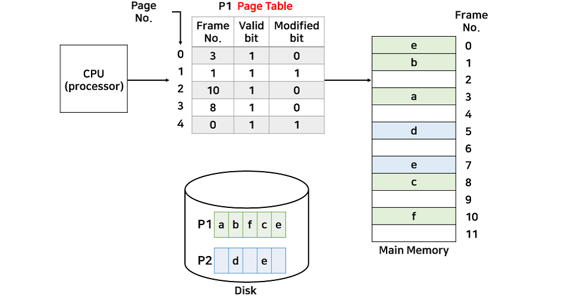

# Virtual_Memory (1)

>Demand Paging, Memory에 없는 Page의 Page Table, Page Fault

> Page Replacement

##  가상 메모리란?
다중 프로그래밍을 실현하기 위해서는 많은 프로세스들을 동시에 메모리에 올려두어야 한다. 

가상메모리는 **프로세스 전체가 메모리 내에 올라오지 않더라도 실행이 가능하도록 하는 기법** 이며, 프로그램이 물리 메모리보다 커도 된다는 주요 장점이 있다.

### 배경
실행되는 **코드의 전부를 물리 메모리에 존재**시켜야 했고, **메모리 용량보다 큰 프로그램은 실행시킬 수 없었다.** 

또한, 여러 프로그램을 동시에 메모리에 올리기에는 용량의 한계와, 페이지 교체등의 성능 이슈가 발생하게 된다. 또한, 가끔만 사용되는 코드가 차지하는 메모리들을 확인할 수 있다는 점에서, 불필요하게 전체의 프로그램이 메모리에 올라와 있어야 하는게 아니라는 것을 알 수 있다.

### 어떻게 이러한 방식이 가능할까?
프로세스를 실행할 때, **실행에 필요한 부분만 메모리에 올리는 것**이다. 

- Memory 사용량 감소
    - 물리 메모리 크기에 제약받지 않게 된다.
- 더 많은 프로그램을 동시에 실행할 수 있게 된다. 
    - 이에 따라 응답시간은 유지되고, CPU 이용률과 처리율은 높아진다.
- I/O 양의 감소
- 빠른 응답시간
    - swap에 필요한 입출력이 줄어들기 때문에 프로그램들이 빠르게 실행된다.

가상 메모리는 실제의 물리 메모리 개념과 사용자의 논리 메모리 개념을 분리한 것으로 정리할 수 있다. 이로써 작은 메모리를 가지고도 얼마든지 큰 가상 주소 공간을 프로그래머에게 제공할 수 있다.

### 가상 주소 공간
- 한 프로세스가 메모리에 저장되는 `논리적인 모습`을 **가상메모리**에 구현한 공간이다. 프로세스가 요구하는 메모리 공간을 가상메모리에서 제공함으로써 현재 직접적으로 필요치 않은 메모리 공간은 실제 물리 메모리에 올리지 않는 것으로 물리 메모리를 절약할 수 있다.

- 예를 들어, 한 프로그램이 실행되며 논리 메모리로 100KB 가 요구되었다고 하자. 하지만 실행까지에 필요한 메모리 공간(Heap영역, Stack 영역, 코드, 데이터)의 합이 40KB 라면, 실제 물리 메모리에는 40KB 만 올라가 있고, 나머지 60KB 만큼은 필요시에 물리메모리에 요구한다고 이해할 수 있겠다.

| `stack`|free(60KB)|`Heap`|`Data`|`Code`|
|--------|----------|-----|------|------|

### 프로세스 간의 페이지 공유
**가상 메모리는**
- `시스템 라이브러리`가 여러 프로세스들 사이에 공유될 수 있도록 한다. 각 프로세스들은 `공유 라이브러리`를 자신의 가상 주소 공간에 두고 사용하는 것처럼 인식하지만, 라이브러리가 올라가있는 `물리 메모리 페이지들`은 모든 프로세스에 공유되고 있다.
- 프로세스들이 메모리를 공유하는 것을 가능하게 하고, 프로세스들은 공유 메모리를 통해 통신할 수 있다. 이 또한, 각 프로세스들은 각자 자신의 주소 공간처럼 인식하지만, 실제 물리 메모리는 공유되고 있다.
- `fork()`를 통한 프로세스 생성 과정에서 페이지들이 공유되는 것을 가능하게 한다.

## Demanding Paging

위에서 **실행에 필요한 부분만 메모리**에 올린다고 했다.

이러한 프로세스의 일부분은 `페이지 단위`일 수도 있고, `세그먼트 단위`일 수도 있지만 현재 대부분은 **페이지 단위**를 사용한다. 

이처럼 현재 필요한(요구되어지는) 페이지만 메모리에 올리는 것을 `Demanding Paging(요구 페이징)` 이라고 한다.

### Valid/Invalid bit의 사용
- Invalid의 의미
    - 사용되지 않는 주소 영역인 경우
    - 페이지가 물리적 메모리에 없는 경우
- 처음에는 모든 page entry가 invalid로 초기화
- address translation(주소 변환) 시에 invalid bit이 set되어 있으면 
    - **page fault**

만약 CPU에서 P1의 3번째 페이지에 접근하는데, `valid bit 값`이 0이면 **CPU에 인터럽트 신호를 발생하여 운영체제 내부의 ISR로 점프한다.**
여기서 디스크 내부의 프로세스 P1에 있는 3번째 페이지를 메모리에 할당하는 작업을 한다. 

## Page Fault
- Invalid page로 접근하면 MMU가 `trap`을 발생시킴 (page fault trap)
- Kernel mode로 들어가서 `page fault handler`가 invoke됨
- 다음과 같은 순서로 page fault를 처리한다. 
    1. Invalid reference(잘못된 요청인지 확인)? (eg. bad address, protection violataion(접근권한이 잘못된경우 강제로 abort 시킴))
    2. Get an empty page frame(빈 페이지 없으면 뺏어온다.: replace)
    3. 해당 페이지를 disk에서 memory로 읽어온다. (느린 작업)
        1. disk I/O가 끝나기까지 이 프로세스는 CPU를 선점 당함 (뺏겨서 block 상태로 변환) 
        2. Disk read가 끝나면 page tables entry 기록, `valid/invalid bit`에 "valid"로 기록
        3. ready queue에 process를 insert -> dispatch later
    4. 이 프로세스가 CPU를 잡고 다시 running
    5. 아까 중단되었던 instruction을 재개

    위 그림은 page fault가 발생했을 때 처리하는 과정을 나타내는 과정이다.

    1. 해당 페이지가 메모리에 있는지 valid bit를 확인한다.
    2. valid bit가 0이라면 CPU에 인터럽트 신호를 보내 운영체제 내부 해당 ISR로 점프한다.
    3. 해당 ISR에서 backing store(디스크)를 탐색하여 해당 프로세스의 페이지를 찾는다.
    4. 해당 페이지를 물리적 메모리의 비어있는 프레임에 할당한다.
    5. 페이지 테이블을 갱신한다. (프레임 번호 설정, valid bit 1로 설정)
    6. 다시 명령어로 돌아가서 실행한다. 

### pure Demaning Paging
Pure Demanding Paging은 **프로세스가 최초로 실행될 때는 어떤 페이지가 필요한지 알 수 없으므로, 아무 페이지도 올리지 않는다.** 그러므로 프로그램을 실행하자마자 page fault가 발생한다. 즉, 순수하게 필요한 페이지만 올리는 것을 말한다. Pure Demanding Paging의 장점은 메모리를 최대한 효율적으로 사용할 수 있다. 하지만 시작부터 page fault가 발생하므로 속도면에서 느리다.

### Preparing
Prepaging은 pure demanding paging과 반대대는 개념이다. 프로그램을 실행할 때 **필요할 것이라 판단되는 페이지를 미리 올리는 것이다.** 이것의 장점은 page fault가 발생할 확률이 적으므로 속도면에서 빠르지만, 단점으로 미리 올라간 페이지를 사용하지 않는다면 메모리가 낭비된다.

### Swapping vs Demanding Paging
Swapping와 Demanding Paging의 공통점은 둘 다 메모리와 backing store 사이를 서로 오고 가는 기능을 수행하지만, `Swapping`은 **프로세스 단위**로 이동하고 `Demanding Paging`은 **페이지 단위**로 이동하는 차이점이 있다.

### Performance of Demand Paging
- Page Fault Rate 0 <= p <= 1.0
    - if p = 0 no page faults
    - if p = 1 every reference is a fault
- Effective Access Time
    - = (1-p) x memory access
    - + p(OS & HW page fault overhead
    - + [swap page out if needed]
    - + swap page in
    - OS & HW restart overhead)

page fault가 발생하면 시간이 매우 오래걸리게 된다. 

현실에서는 `지역성의 원리(Locality of reference)`로 인해 페이지 부재 확률은 매우 낮다. 

> 지역성의 원리(Locality of reference): 메모리 접근은 시간적 지역성과 공간적 지역성을 갖는다. 

- 시간적 지역성: CPU는 어느 메모리 공간을 읽은 후, 시간이 지나도 그 공간을 다시 읽을 확률이 매우 높다는 것을 말한다.
    - 대표적인 예로 반복문이 있다. 반복문은 하나의 코드 공간을 여러 번 읽는다.
- 공간적 지역성: CPU가 메모리 공간을 읽을 때는 인접한 범위 내에서 읽는다는 의미이다.
    - 프로그램은 대부분 절차적인 순서로 구현되어 있어 순서대로 읽는 경우가 빈번하다

+) 여기서 더 효율적으로 사용하기 위해서는 페이지 부재일 때 소요되는 시간을 줄일 수 있는데, `backing store`로 HDD를 사용하기 보다는 더욱 빠르게 동작하는 **SSD**나 저가 **DRAM**과 같은 것을 사용하는 방법이 있다.

## Free fram이 없는 경우(물리 메모리가 모두 사용중인 상황)
- Page replacement
    - 어떤 frame을 빼앗아올지 결정해야 함
    - 곧바로 사용되지 않을 page를 쫒아내는 것이 좋음
    - 동일한 페이지가 여러번 메모리에서 쫒겨났다가 다시들어올 수 있음

- Replacement Algorithm
    - page fault rate를 최소화하는 것이 목표
    - 알고리즘의 평가
        - 주어진 page reference string에 대해 page fault를 얼마나 내는지 조사
        - ex. reference string = 1,2,3,4,1,2,5,1,2,3,4,5

### 기본적인 방법
물리 메모리가 모두 사용중인 상황에서의 메모리 교체 흐름이다.

1. 디스크에서 필요한 페이지의 위치를 찾는다
2. 빈 페이지 프레임을 찾는다.
    1. 페이지 교체 알고리즘을 통해 희생될(victim) 페이지를 고른다.
    2. 희생될 페이지를 디스크에 기록하고, 관련 페이지 테이블을 수정한다.
3. 새롭게 비워진 페이지 테이블 내 프레임에 새 페이지를 읽어오고, 프레임 테이블을 수정한다.
4. 사용자 프로세스 재시작

### victim page(희생양 페이지)
> victim page: backing store로 page-out이 된 페이지

### 만약 victim page가 메모리에서 디스크로 올라온 이후에 내용이 변경되었다면?
쫒아내기만 하면 되는게 아니라 변경된 내용을 page-out이 될 때 backing store에 쓰기(write) 연산을 해야한다.

backing store는 읽는 시간도 느리지만, 거기에 더해 쓰기 작업까지 한다면 더욱 비효율적일 것이다.

그러면 **해당 페이지가 수정되었는지 안되었는지를 판단**할 수 있어야 하는데, 이를 위해 페이지 테이블에 `modified bit(=dirty bit)`를 추가하여 이를 검사한다. 

해당 페이지가 수정되었다면 이 비트를 1로 두고, 수정되지 않으면 0으로 둔다. 이를 이용해서 victim page는 최대한 수정되지 않은 페이지를 선택한다.

> modified bit를 추가한 페이지 테이블의 모습이다. 여기서 수정되지 않은 페이지는 0, 2, 3번 3개의 페이지가 존재하는데 이 중에서는 어떤 페이지를 선택해야 할까?

# 참고

[가상 메모리](https://velog.io/@codemcd/%EC%9A%B4%EC%98%81%EC%B2%B4%EC%A0%9COS-15.-%EA%B0%80%EC%83%81%EB%A9%94%EB%AA%A8%EB%A6%AC)
[가상 메모리 개념](https://github.com/JaeYeopHan/Interview_Question_for_Beginner/tree/master/OS#%EA%B0%80%EC%83%81-%EB%A9%94%EB%AA%A8%EB%A6%AC)
[반효경 교수님 강의](https://core.ewha.ac.kr/publicview/C0101020140509151648408460?vmode=f)

## 면접 질문
 
> 1. 가상 메모리의 역할은 무엇인가요?

> 2. page fault에 대해 설명하시오.

> 3. demand paging에 대해 설명하시오 