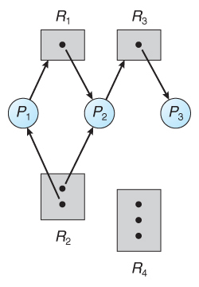
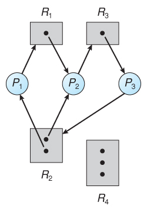
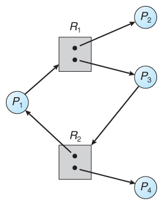
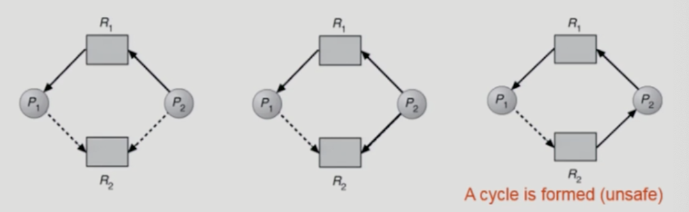
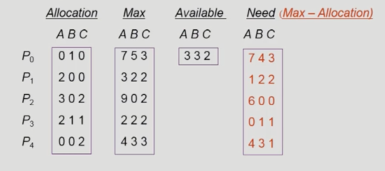
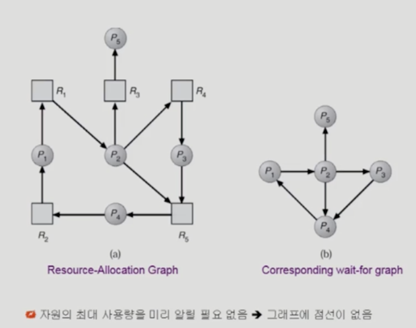
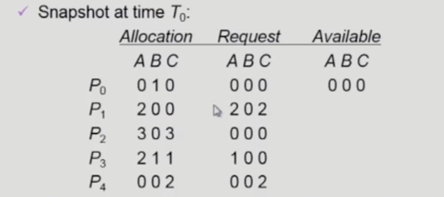

# 🔒 Deadlock

## 📚 Table of Content

> 1.Deadlock

>> Resource

>> Resource-Allocation Graph

>> Deadlock 예시

> 2.Deadlock 발생 조건 

> 3.Deadlock 처리 방법

>> Deadlock Prevention

>> Deadlock Avoidance

>>> Resource Alloc Algorithm, Banker's Algorithm

>> Deadlock Detection and Recovery

>> Deadlock Ignorance

<br><br><br>

## 🔒 1. Deadlock

⇒ 일련의 프로세스들이 서로가 가진 자원을 기다리며 block된 상태, 교착상태

### Resource

- 하드웨어, 소프트웨어 등을 포함하는 개념
    - IO device, CPU cycle, memory space, semaphore
- 프로세스가 자원을 사용하는 절차(일련의 과정)
    - request -> allocate -> use -> release

### Resource Allocation Graph 

> 자원 할당 그래프는 교착 상태를 관리하기 위한 유향 그래프

```
G = (V, E)
V : 정점(vertex의 집합)
1. 프로세스 집합 P = {P1, P2, ..., Pn}
2. 자원 형태 집합 R = {R1, R2, ..., Rn}

E : 간선(edge)의 집합, Pi -> P, Rj -> R

요청 에지 : Pi -> Rj
할당 에지 : Rj -> Pi

1. 요청 :요청 에지를 생성
2. 사용 :요청 에지를 할당 에지로 변환
3. 해제 :할당 에지를 삭제
```



자원 할당 그래프를 통한 교착 상태 판별
- 자원 할당 그래프가 사이클을 가지고 있지 않으면, 교착 상태가 아님
- 자원 할당 그래프가 사이클을 가지고 있으면, 교착 상태일 수도 아닐 수도 있음
1. 각 자원 유형의 수가 하나인 경우 :필요 충분 조건 (deadlock)
2. 각 자원 유형이 여러 개인 경우 :필요 조건o, 충분 조건x (deadlock O, deadlock X)


#### 자원 할당 그래프를 통한 교착상태 판별 예제

1. 교착 상태의 자원 할당 그래프

> 

```
사이클 2개 존재, 교착 상태임
1. P1 -> R1 -> P2 -> R3 -> P3 -> R2 -> P1
2. P2 -> R3 -> P3 -> R2 -> P2
```

2. 사이클이 있으나 교착 상태가 아닌 자원할당 그래프

> 

```
사이클 1개 존재, 교착 상태 아님
- P4에 할당된 R2가 해제되어 P2에 할당될 수 있기 때문
- P2, P4가 자원과 무관하게 연결되어 있기 때문에 deadlock 아님
```

### Deadlock 예시
> 자원을 동시 충족할 수 없을 때 벌어짐

- deadlock first case
    - 시스템에 2개의 tape drive가 있다.
    - 프로세스 p1과 p2 각각 하나의 다른 tape drive를 보유한 채 다른 하나를 기다리고 있다.
- deadlock second case
    - 이진 세마포어 A와 B가 있다.
    - 프로세스 P1이 자원을 얻은 상태에서 context switch가 발생하여 프로세스 P2에게 cpu 제어권이 넘어갔고, 프로세스 p2가 B 자원을 얻었다.
    - 다시 context switch가 발생하여 프로세스 p1에게 cpu 제어권이 넘어갔고, 프로세스 p1이 b 자원을 얻고 싶어하지만 이미 프로세스 p2가 B자원을 가지고 있다.
    - 마찬가지로 프로세스 P2가 A자원을 얻고 싶어하지만 이미 프로세스 P1이 A자원을 가지고 있다.
    - 무한히 서로를 기다린다.

<br><br><br>

## 🔒 2. Deadlock 발생의 4가지 조건

- __상호 배제, Mutual exclusion__
    - 동시에 두 개의 프로세스가 공유 자원에 접근할 수 없다.
- __비선점, No preemption__
    - 프로세스는 자원을 내놓을 뿐 강제로 빼앗기지 않음
- __점유 대기, Hold and wait__
    - 자원을 가진 프로세스가 다른 자원을 기다릴 때 보유 자원을 놓지 않고 계속 가지고 있음
- __순환 대기, Circular wait__
    - 자원을 기다리는 프로세스 간에 사이클이 형성되어야 함.
    - 프로세스 {P0, P1, ... Pn}가 있다면 P0 → P1 → P2 → ..Pn → P0

**위 4가지 조건이 동시에 성립할 때 발생합니다.**

<br><br>

## 🔒 3. 교착 상태 처리 방법

- Deadlock Prevention, 교착 상태 예방
    - 자원 할당 시 데드락의 4가지 필요 조건 중 어느 하나가 만족되지 않도록 하는 것
- Deadlock Avoidance, 교착 상태 회피
    - 자원 요청에 대한 부가정인 정보를 이용해서 데드락의 가능성이 없는 경우에만 자원을 할당
    - 시스템 상태가 원래 상태로 돌아올 수 있는 경우에만 자원 할당
- Deadlock Detection and recovery, 교착 상태 탐지
    - 데드락 발생은 허용하되 그에 대한 탐지 루틴을 두어 데드락 발견시 회복
- Deadlock Ignorance, 교착 상태 무시
    - 데드락을 시스템이 책임지지 않음
    - unix를 포함한 대부분의 os가 채택

⇒ *예회탐회*

<br>

### 3-1. Deadlock Prevention, 교착 상태 예방

> 교착 상태 발생 조건 중 하나를 제거함으로 해결하는 방법. 자원의 낭비가 심하다는 단점이 존재한다.

1. **Mutual exclusion**, 상호 배제 부정 여러 프로세스가 공유 자원을 사용하도록 한다.
    - 공유해서는 안되는 자원의 경우 반드시 성립해야 함.
2. **Hold and wait**, 점유 대기 부정 프로세스가 실행되기 전 필요한 모든 자원을 할당한다.
    - 프로세스가 자원을 요청할 때 다른 어떤 자원도 가지고 있지 않아야 함.
        1. 프로세스 시작 시 모든 필요한 자원을 할당 받게 하는 방법
        2. 자원이 필요할 경우 보유 자원을 모두 놓고 다시 요청
3. **No preemption**, 비선점 부정 자원 점유 중인 프로세스가 다른 자원을 요구할 때 점유 중인 자원을 반납하고 요구한 자원을 사용하기 위해 기다리게 한다.
    - 프로세스가 어떤 자원을 기다려야 하는 경우 이미 보유한 자원이 선점됨
    - 모든 필요한 자원을 얻을 수 있을 때 그 프로세스는 다시 시작됨
    - 상태를 쉽게 저장하고 복구할 수 있는 자원에서 주로 사용(CPU(context를 저장해놓기 때문에 뺏기 가능), memory는 빼앗을 수 있음)
4. **Circular wait**, 순환 대기 부정 자원에 고유한 번호를 할당하고 번호 순서대로 자원을 요구하도록 한다.
    - 모든 자원 유형에 할당 순서를 정하여 정해진 순서대로만 자원을 할당
        - ex) 순서가 3인 자원 Ri를 보유중인 프로세스가 순서가 1인 자원 Rj를 할당 받기 위해서는 우선 Ri를 반납해야 함

**예방 방법을 사용하게 될 때 발생하는 문제점 ⇒ utilization 저하(system 입장), throughput 감소(system 입장), starvation 문제(process 입장)**

<br>

### 3-2. Deadlock Avoidance, 교착 상태 회피

> 교착 상태가 발생하면 피해나가는 방법. 

- 프로세스가 자원을 요구할 때, 시스템은 자원을 할당한 후에도 안정 상태로 남아있게 되는지를 검사하여 교착 상태를 회피하는 기법이다.
- 안정 상태에 있으면 자원을 할당하고 그렇지 않으면 다른 프로세스들이 자원을 해제할 때까지 대기한다.
- 시스템이 안전 상태에 있으면 데드락이 아니고, 불안전 상태에 있으면 데드락의 가능성이 있다. *데드락 회피*는 시스템이 불안전 상태에 들어가지 않는 것을 보장.

```markdown
자원 유형 1개 당 1개의 인스턴스 존재 → 자원 할당 그래프 알고리즘

자원 유형 1갱 당 2개 이상의 인스턴스 존재 → 은행원 알고리즘, banker’s algorithm
```

___교착 상태 회피를 하기 위해 알아야하는 추가적인 정보___

- safe state, 안전 상태
    - 시스템 내의 프로세스들에 대한 safe sequence가 존재하는 상태
- safe sequence, 안전 순서열
    - 프로세스 sequence <P1, P2, P3, ..., Pn>이 safe 하려면 Pi의 자원 요청이 ___가용 자원 + 모든 Pj(j < i)의 보유 자원___ 에 의해 충족되어야 함
    - 조건을 만족하면 다음 방법으로 모든 프로세스의 수행 보장
        - Pi의 자원 요청이 즉식 충족될 수 없으면 모든 Pj가 종료될 때까지 기다린다.
        - Pi-1이 종료되면 Pi의 자원 요청을 만족시켜 수행한다.

#### 교착 상태 회피 알고리즘
- 자원 할당 그래프 알고리즘
- 은행원 알고리즘

### 3-2-1. Resource Allocation Graph algorithm (single instance per resource types)

- Claim edge Pi -> Rj
    - 프로세스 Pi가 자원 Rj를 미래에 요청할 수 있음을 뜻함(점선)
    - 프로세스가 해당 자원 요청시 request edge로 바뀜(실선)
    - Rj가 release되면 assignment edge는 다시 claim edge로 바뀐다.
- request edge의 assignment edge 변경 시 (점선을 포함하여) cycle이 생기지 않는 경우에만 요청 자원을 할당한다.
- cycle 생성 여부 조사시 프로세스의 수가 n일 때 O(n^2) 시간이 걸린다.

> 

### 3-2-2. Banker's algorithm (multiple instance per resource types)

- 5개의 프로세스, processes => P0, P1, P2, P3, P4
- 3개의 자원 형태, resource types => A(10), B(5), C(7)  / 10 5 7

> 

- safety algorithm에 의해서 sequence <P1, P3, P4, P2, P0>가 존재하므로 시스템은 safe state
- banker's도 자원을 줄 수 있음에도 불구하고 불안정이 발생할 수 있으면 자원을 주지 않는다. 정리하면 자원을 최대로 요청했을 때 그것을 가용자원으로 충족할 수 없는 상황이라면 아예 자원을 내놓지 않음.
- Need <= Available이라면 자원을 내줌

<br>

### 3-3. Deadlock detection and recovery, 교착 상태 탐지 및 회복

> 데드락 발생은 허용하되 그에 대한 탐지 루틴을 두어 데드락 발견시 회복

___탐지는 위방식과 똑같이 함___

### 3-3-1. Deadlock Detection
- Resource type 당 single instance인 경우
    - 자원할당 그래프에서의 cycle이 곧 deadlock을 의미
- Resource type 당 multiple instance인 경우
    - banker's algorithm과 유사한 방법 활용

#### Wait-for graph Algorithm(Resource type 당 single instance인 경우)

> 

- Resource type 당 single instance인 경우
- Wait-for graph
    - 자원할당 그래프의 변형 (자원을 빼고 그리면 됨!)
    - 프로세스만으로 node 구성
    - PJ가 가지고 있는 자원을 Pk가 기다리는 경우 Pk -> Pj
- Algorithm
    - Wait for graph에 사이클이 존재하는지를 주기적으로 조사
    - O(n^2)

#### Banker's Algorithm(Resource type 당 multiple instance인 경우)
- 5 processes :P0, P1, P2, P3, P4
- 3 resource types : A(7), B(2), C(6)

> 

- No deadlock sequence <P0, P2, P3, P1, P4> 로 동작 가능
- request는 추가 요청가능량이 아니라 현재 실제로 요청한 자원량을 나타냄
- bankers는 항상 최대 자원 요청을 만족시키는 것을 우선 할당을 하고 그녀석이 종료하면 가용자원이 증가하고 또 최대 자원 요청을 만족할 수 있는 순서를 찾아서 수행하는 방식, safe하는 것을 보장! => deadlock 발생 x

### 3-3-2. Deadlock recovery
- Process termination
    - 모든 교착 상태의 프로세서를 중단한다.
    - 데드락 사이클이 없어질 때까지 하나씩 프로세스를 중단
- Resource Preemption
    - 비용을 최소활할 victim 선정
    - safe state로 rollback하여 process restart
    - Starvation 문제
        - ___동일한 프로세스가 계속해서 victim으로 선정되는 경우___
        - cost factor에 rollback 횟수도 같이 고려, 다른 프로세스도 고려해보자.

<br>

### 3-4. Deadlock Ignorance, 교착 상태 무시

> 데드락을 시스템이 책임지지 않음

- 방법도 아니라고 하심.. 하지만 현대 운영체제는 이 방법을 고수하고 있음. 그럼 우린 여태 왜 이것을 배운 것인가.. 운영체제에서 고정적인 문제 deadlock이니까 그래도 알아라.. 중요성이 낮은 chapter라고 하심..
- deadlock이 일어나지 않는다고 생각하고 아무런 조치도 취하지 않음
    - deadlock이 매우 드물게 발생하므로 deadlock에 대한 조치 자체가 오버헤드일 수 있음
    - 만약 시스템에 데드락이 발생한 경우 비정상적으로 작동하는 것이 사람이 직접 process를 죽이는 등의 방법으로 대처.. 역시 전원 끄기 국룰
    - unix, windows 등 대부분의 범용 os가 채택


<br><br><br>

## 📚 참고

[deadlock](https://github.com/WooVictory/Ready-For-Tech-Interview/blob/master/Operating%20System/%EA%B5%90%EC%B0%A9%EC%83%81%ED%83%9C(DeadLock).md)

[deadlock 해결 방법](https://github.com/pjy1368/operating-system-study/blob/main/%ED%95%99%EC%8A%B5%20%EB%82%B4%EC%9A%A9/%EC%A7%84%EC%98%81_Deadlock%201%20%26%202.md)

[R-Allocation Graph](https://m.blog.naver.com/PostView.naver?isHttpsRedirect=true&blogId=three_letter&logNo=220380867227)

[반교수님 운체강의](http://www.kocw.net/home/search/kemView.do?kemId=1226304&ar=relateCourse)