# 📁 File System

## 📚 Table of Contents
> File and File System

> File system Implementation

> Directory system Implementation

  

## 📁 File and File System
- File 
    - A named collection of related information
    - 일반적으로 비휘발성 보조기억장치에 저장
    - 운영체제는 다양한 저장 장치를 file이라는 동일한 논리적 단위로 볼 수 있게 해줌
    - Operation
        - crete, read, write, reposition, delete, open, close 등
- File attribute(metadata)
    - 파일 자체의 내용이 아니라 파일을 관리하기 위한 각종 정보들
        - 파일 이름, 유형, 저장 위치, 파일 사이즈
        - 접근 권한(읽기/쓰기/실행), 시간 (생성/변경/사용), 소유자 등
- File system
    - 운영체제에서 파일을 관리하는 부분
    - 파일 및 파일의 메타데이터, 디렉토리 정보 등을 관리
    - 파일의 저장 방법 결정
    - 파일 보호 등

### Directory and Logical Disk
- Directory
    - 파일의 메타데이터 중 일부를 보관하고 있는 일종의 특별한 파일
    - 그 디렉토리에 속한 파일 이름 및 파일 attribute들
    - operation
        - search for a file, create a file, delete a file
        - list a directory, rename a file, traverse the file system
- Partition(=Logical Disk)
    - 하나의 (물리적) 디스크 안에 여러 파티션을 두는게 일반적
    - 여러 개의 물리적인 디스크를 하나의 파티션으로 구성하기도 함
    - (물리적) 디스크를 파티션으로 구성한 뒤 각각의 파티션에 file system을 깔거나 swapping 등 다른 용도로 사용할 수 있음

### File Operation
> Create, Delete, Open, Close, REad, Write, Append, Seek, Get attributes, Set attributes, Rename

### open()

> 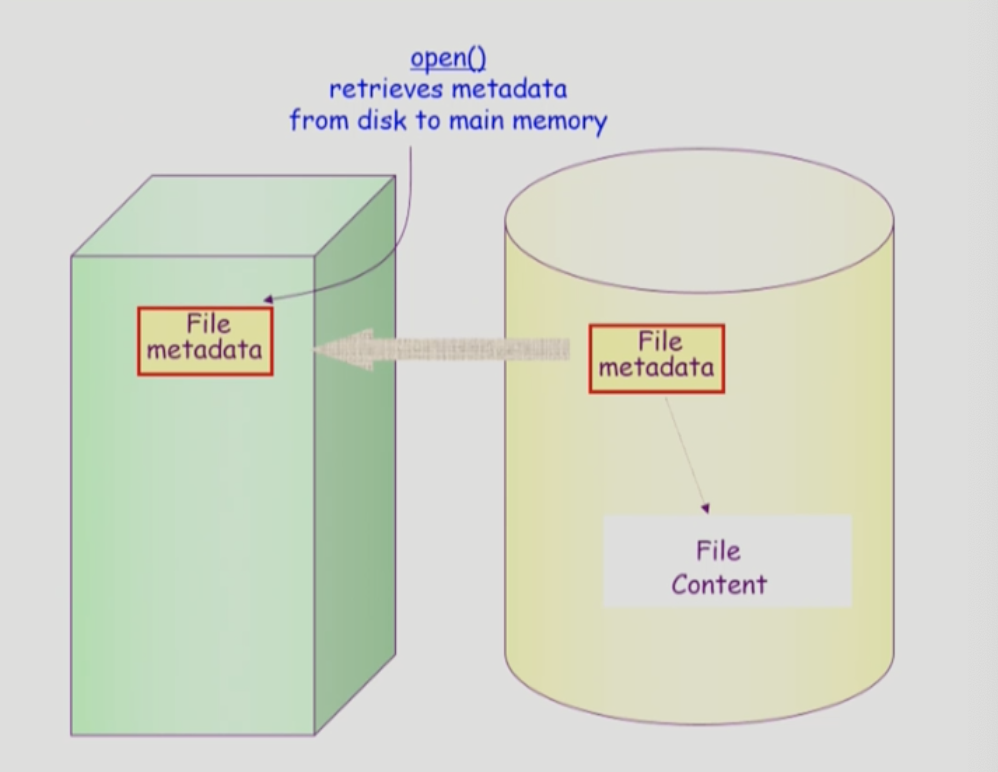

- 메타데이터를 메모리로 올려놓는 것. open하게 되면 file의 metadata가 메모리로 올라온다.
- open("a/b/c")
    - 디스크로부터 파일 c의 메타데이터를 메모리로 가지고 옴
    - 이를 위하여 directory path를 search
        - 루트 디렉토리 "/"를 open하고 그 안에서 파일 'a'의 위치 획득
        - 파일 'a'를 open한 후 read하여 그 안에서 파일 'b'의 위치 획득..
    - directory path의 search에 너무 많은 시간 소요
        - open을 read/write와 별도로 두는 이유임
        - 한번 open한 파일은 read/write와 별도로 두는 이유임
    - open file table
        - 현재 open된 파일들의 메타데이터 보관소 (in memory)
        - 디스크의 메타데이터보다 몇 가지 정보가 추가
            - open한 프로세스의 수
            - file offset :파일 어느 위치 접근 중인지 표시(별도의 테이블 필요)
    - file descriptor (file handle, file control block)
        - open file table에 대한 위치 정보(프로세스 별)

> 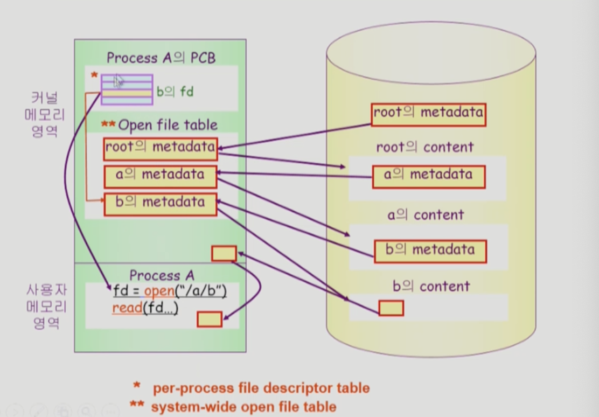

### File Protection
- 각 파일에 대해 누구에게 어떤 유형의 접근을 허락할 것인가?
- Access Control 방법
    - Access control matrix
        - Access control list :파일별로 누구에게 어떤 접근 권한이 있는 표시
        - capability :사용자별로 자신이 접근 권한을 가진 파일 및 해당 권한 표시
    - grouping
        - 전체 user를 owner, group, public의 세 그룹으로 구분
        - 각 파일에 대해 세 그룹의 접근 권한(rwx)을 3비트씩으로 표시 
        - UNIX
    - password
        - 파일마다 pwd를 두는 방법
        - 모든 접근 권한에 대해 하나의 pwd :all or nothing
        - 접근 권한별 pwd :암기 문제, 관리 문제

### Access Methods
- Sequential access, 순차 접근
    - read all bytes/records from the beginning
    - 중간에 파일을 건너 띄어서 읽을 수 없다.
    - 카세트 테이프가 매개체라면 편리함.
- Random access, 직접 접근
    - Bytes/records read in any order
    - 어떠한 순서라도 읽을 수 있다(db는 random access가 필수적임)
    - LP 레코드 판과 같이 접근

   

## 📁 File system implementation
> 파일의 크기는 동일하지 않지만 디스크에 동일한 크기의 저장 단위로 파일을 저장하고 있음. 저장 단위 = block 단위

### Allocation of File Data in Disk
- Contiguous Alloc
- Linked Alloc
- Indexed Alloc

#### Contiguous Allocation, 연속 할당
> 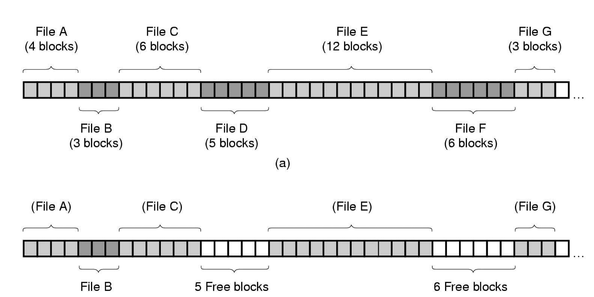

- 장점
    - 구현이 쉽다
        - 디스크의 주소가 각 첫 번째 블록임.
        - 파일의 이름 위치 정보를 디렉토리가 가지고 있음
    - 읽기 성능이 빠르다.(Fase io) (실시간용으로 사용 아니면 run 중이던 process의 swapping용으로 사용할 수 있다.)
    - Direct access 가능
- 단점
    - 시간이 지날수록 디스크 파편화가 발생할 수 있다. (외부 조각 발생)
    - 파일의 크기를 키우는데 제약이 있다.
    - 파일의 크기를 키우냐 줄이느냐에 따라 hole 발생

      
#### Linked Allocation, 연결 할당
> 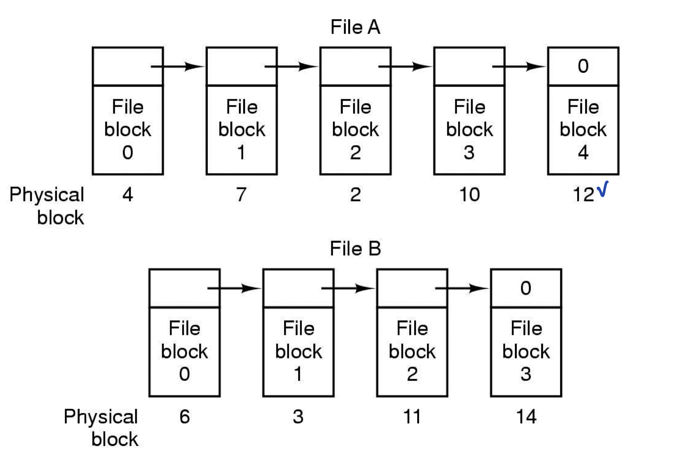

- 장점
    - 외부 단편화 발생하지 않는다
- 단점
    - No random access
    - reliability 문제가 있다.
        - 한 sector가 고장나 pointer가 유실되면 많은 부분을 잃음
    - pointer를 위한 공간이 block의 일부가 되어 공간 효율성을 떨어뜨림
        - 512 bytes/sector, 4byte/pointer
- 변형
    - file-allocation table (FAT) 파일 시스템
        - 포인터를 별도의 위치에 보관하여 reliability와 공간효율성 문제 해결

#### Indexed Allocation, 인덱스된 할당
> 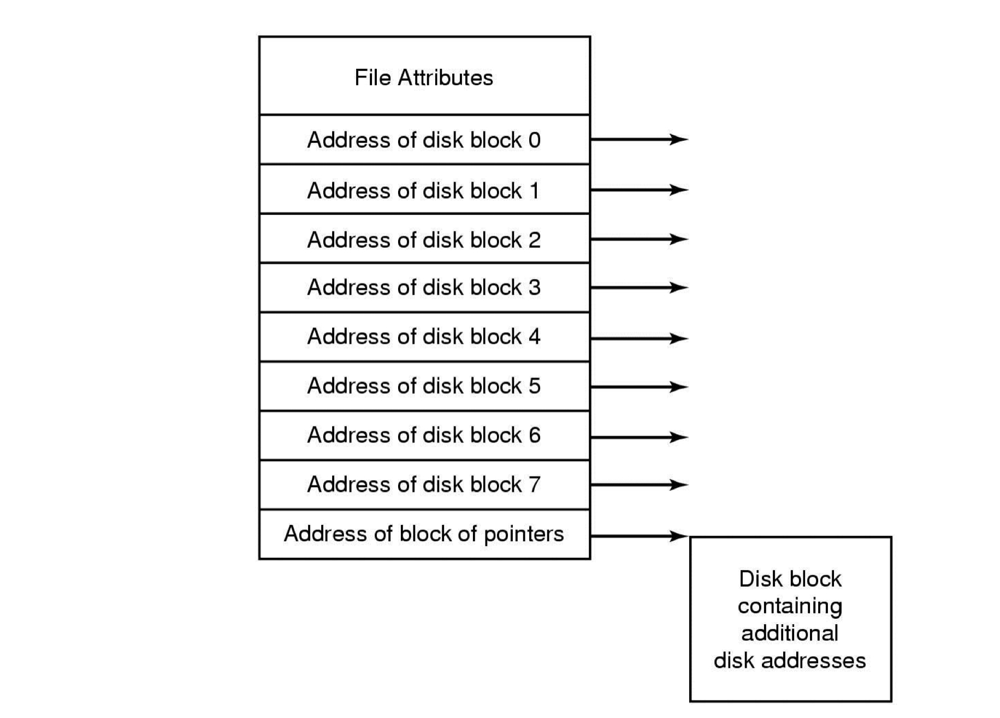

- 장점
    - 외부 조각이 발생하지 않는다.
    - direct access 가능
- 단점
    - small file의 경우 공간 낭비(실제로 많은 file들이 small)
    - too large file의 경우 하나의 block으로 index를 저장하기에 부족
        - 해결 방안
            1. linked scheme
            2. multi-level index

## UNIX 파일시스템의 구조
> 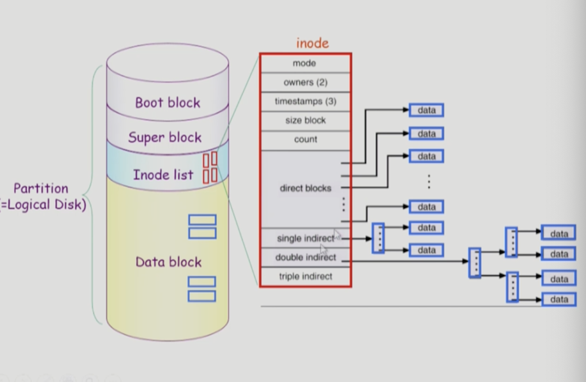

- Boot block :부팅에 필요한 정보
- Super block :파일 시스템에 관한 총체적인 정보를 담고 있음
- Inode list :파일 이름을 제외한 파일의 모든 메타 데이터를 저장
- Data block :파일의 실제 내용을 보관
- directory에 metadata저장하지 않고 inode 번호를 directory가 저장하고 있음.

## FAT file system(windows)
> 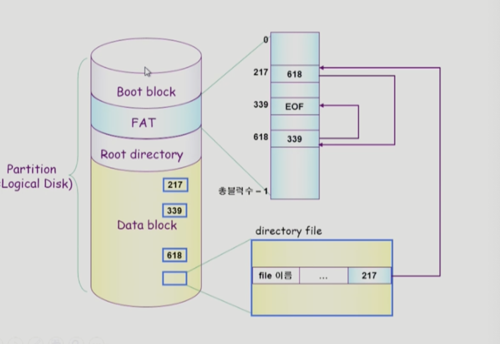

- Linked Allocation 변형하여 사용
- Boot block 
- FAT
- Root directory
- Data block

### Windows vs. UNIX
> 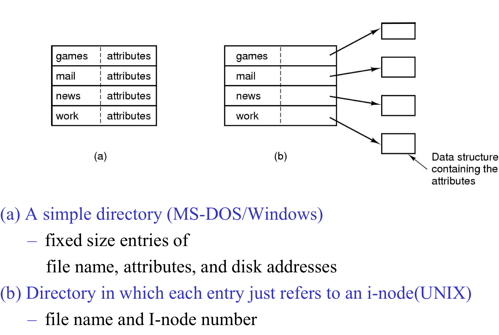

### Free Space management
> 비어있는 블록 어떻게 관리 할 것인가.
- Bitmap
> 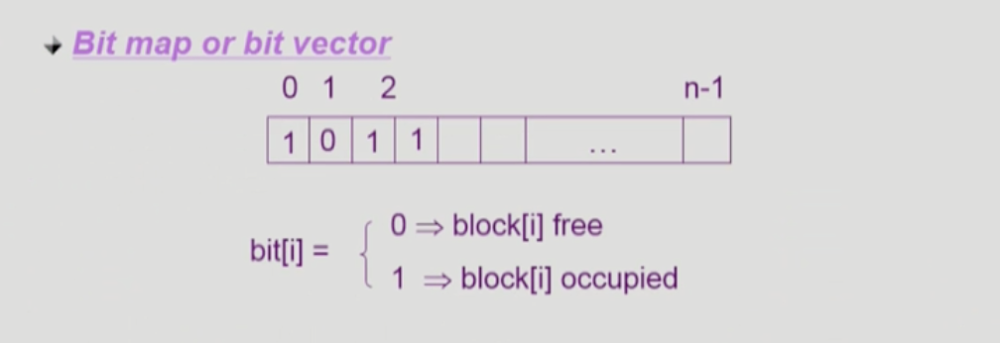

    - bitmap은 블록 별로 비트를 둬서 사용중인지 아닌지 구분
    - 부가적인 공간 필요
    - 연속적인 n개의 free block을 찾는데 효과적
- Linked list
    - 모든 free block들을 링크로 연결
    - 연속적인 가용공간을 찾는 것은 쉽지 않다
    - 공간의 낭비가 없다
- Grouping
    - linked list 방법의 변형
    - 첫번째 free block이 n개의 pointer를 가짐
        - n-1 포인터는 free data block을 가리킴
        - 마지막 pointer가 가리키는 block은 또 다시 N pointer를 가짐
- Counting
    - 프로그램들이 종종 여러 개의 연속적인 block을 할당하고 반납한다는 성질에 착안
    - first free block, # of contiguous free blocks를 유지

   

## 📁 Directory Implementation
- Linear list
    - <file name, file의 metadata>의 list
    - 구현이 간단
    - 디렉토리 내에 파일이 있는지 찾기 위해서는 linear search 필요(time consuming)
- Hash table
    - Linear list + hashing
    - Hash table은 file name을 이 파일의 linear list의 위치로 바꾸어줌
    - search time을 없앰
    - collision 발생 가능 
- File의 metadata의 보관 위치
    - 디렉토리 내에 직접 보관
    - 디렉토리에는 포인터를 두고 다른 곳에 보관
        - inode, FAT
- Long file name의 지원
    - <file name, file의 metadata>의 list에서 각 entry는 일반적으로 고정 크릭
    - file name이 고정 크기의 entry 길이보다 길어지는 경우 entry의 마지막 부분에 이름의 뒷부분이 위치한 곳의 포인터를 두는 방법
    - 이름의 나머지 부분은 동일한 directory file의 일부에 존재

   

### VFS and NFS

- Virtual File System(VFS)
    - 서로 다른 다양한 file system에 동일한 시스템 콜 인터페이스(API)를 통해 접근할 수 있게 해주는 OS의 layer
- Network File System(NFS)
> 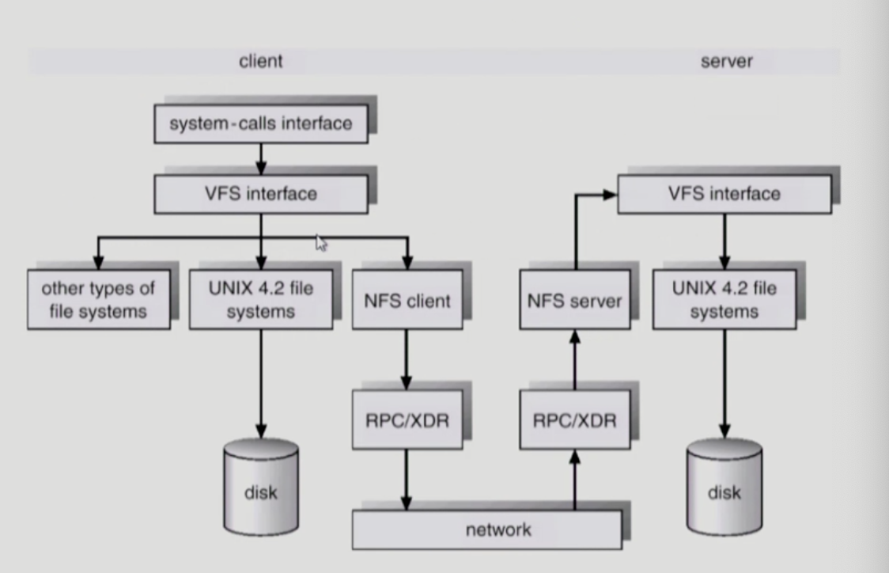

- 분산 시스템에서는 네트워크를 통해 파일이 공유될 수 있음
- NFS는 분산 환경에서의 대표적인 파일 공유 방법임

### page cache and buffer cache
- Page cache
    - Virtual memory의 paging system에서 사용하는 page frame을 caching의 관점에서 설명하는 용어
    - Memory-mapped I/O를 쓰는 경우 file의 IO에서도 page cache사용
- Memory-mapped I/O
    - File의 일부를 virtual memory에 mapping 시킴
    - mapping시킨 영역에 대한 메모리 접근 연산은 파일의 입출력을 수행하게 함
- Buffer cache
    - 파일시스템을 통한 IO 연산은 메모리의 특정 영역인 buffer cache 사용
    - file 사용의 locality 활용
        - 한번 읽어온 block에 대한 후속 요청시 buffer cache에서 즉시 전달
    - 모든 프로세스가 공용으로 사용
    - replacement algorithm 필요(LRU, LFU)
- Unified Buffer Caches
    - 최근 OS에서는 기존의 버퍼 캐시가 page cache에 통합

> 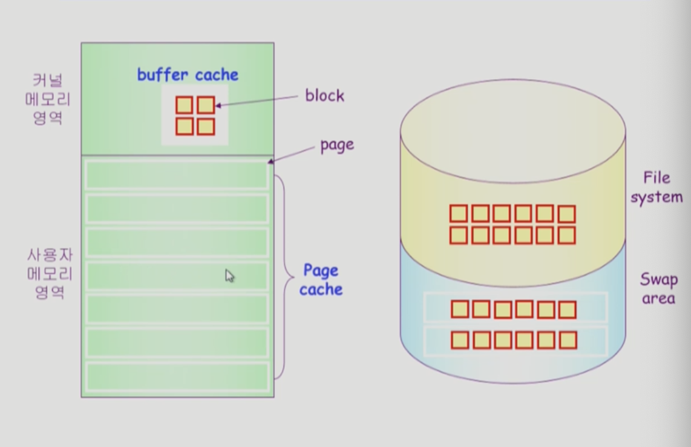

> 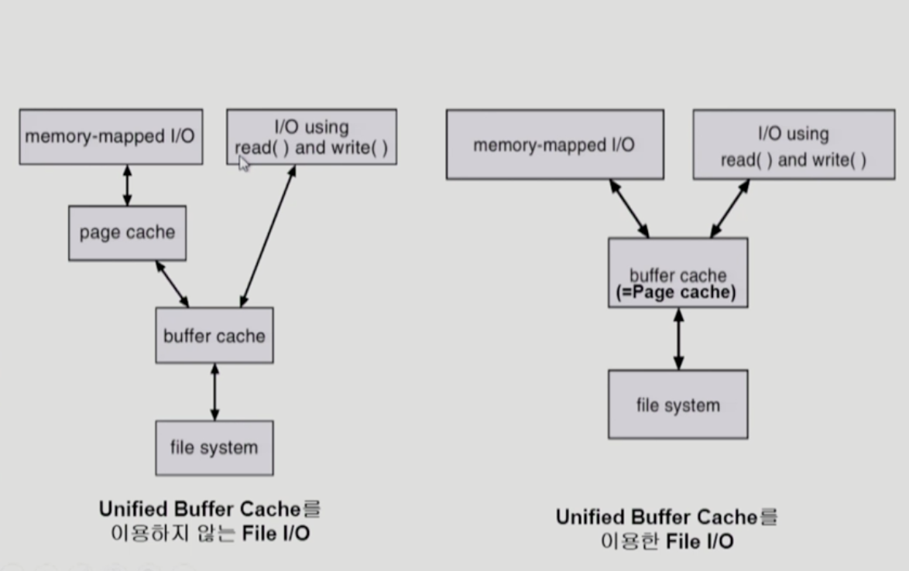

#### program execution
> 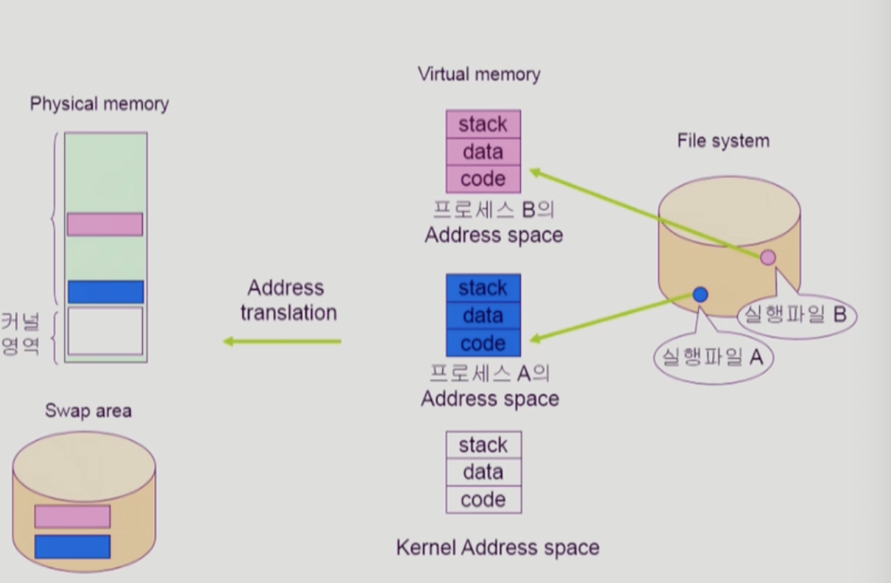

- 메모리에 code가 안올라와있으면 file system에서 불러옴
- memory mapped file이라면 swap area로 가는 것이 아니라 자신의 주소공간에 매핑되어 있음(?)

운영체제 이론이 끝났습니다. 가장 길게 느껴지는 과목이지 않았나 싶습니다. 다른 유명 리포를 보면 다루지 않는 곳이 대다수인 거 같습니다. 그래서 개인적으로 자세히 하나의 주제를 알기보다 큰 틀에서 어떤 방식과 방법을 가지고 구현을 할 수 있는지 아는게 중요하다고 생각합니다 ㅎㅎ 

  

## 📚 참고
[반교슈님 운영체제](https://core.ewha.ac.kr/publicview/)

 

## ⁉️ 면접 예상 질문

> 1. 파일 시스템이 무엇인가요?

> 2. Directory가 무엇인가요?

> 3. 파일 시스템 구현 방법에는 무엇이 있고 각 구현 방법을 설명해주세요

>> 3-1. Contiguous Alloc의 특징은 무엇인가요?

>> 3-2. Linked Alloc의 특징은 무엇인가요?

>> 3-3. Indexed Alloc의 특징은 무엇인가요?

> 4. 메모리의 빈공간은 어떻게 관리하나요? 각 관리 방법의 특징을 설명해주세요

> 5. 디렉토리의 구현 방법에 대해서 설명해주세요