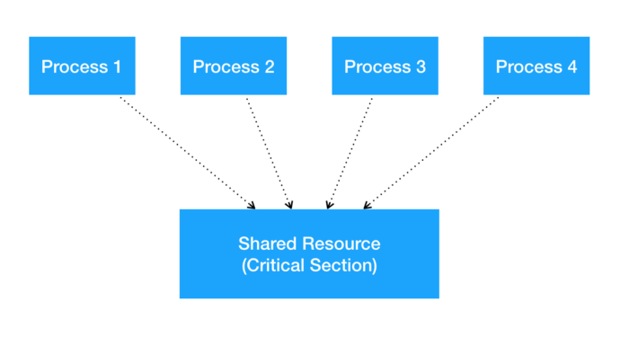
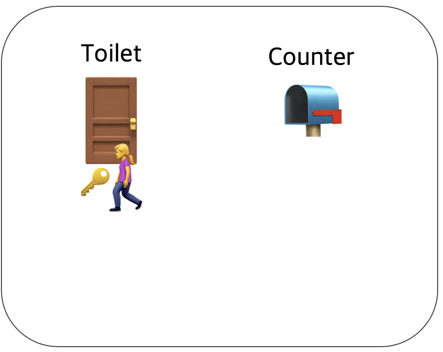
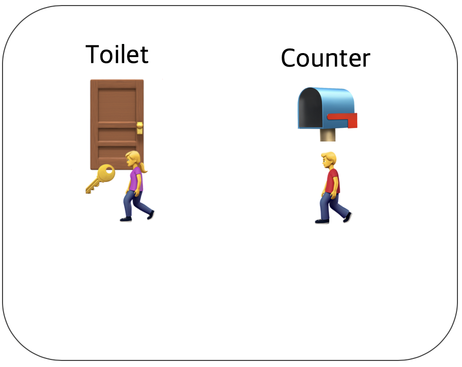
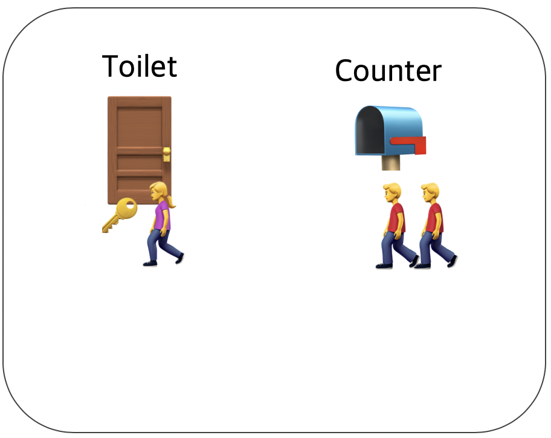
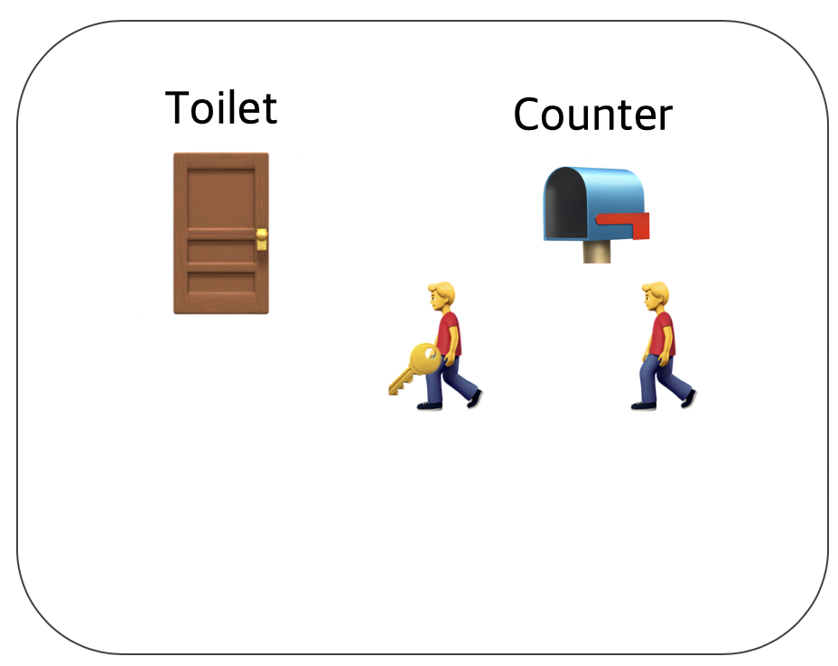
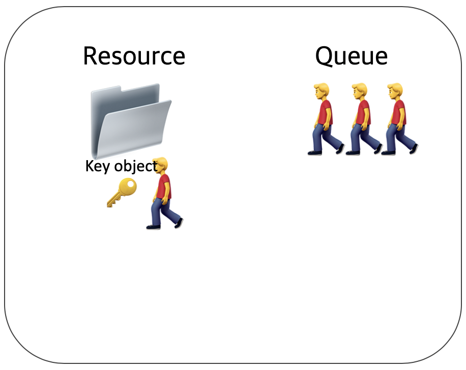
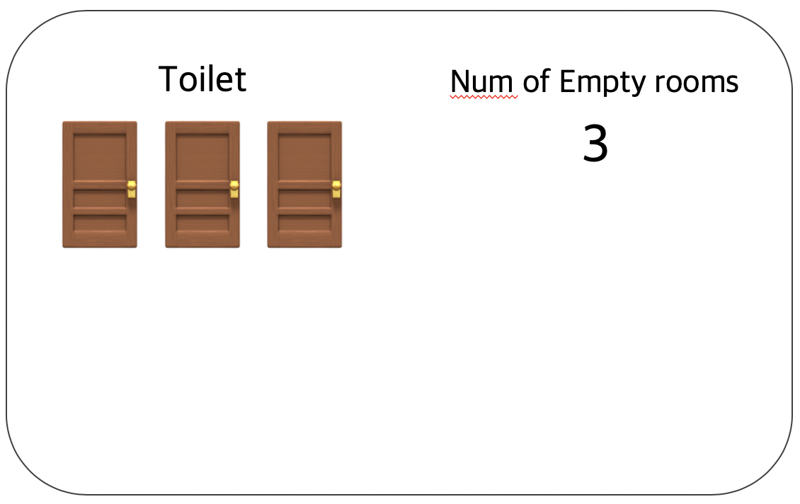
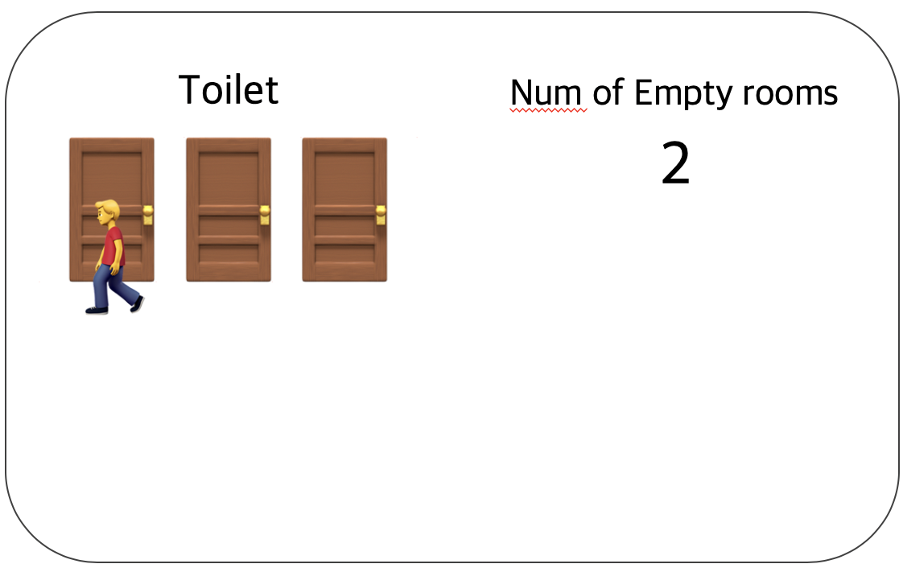
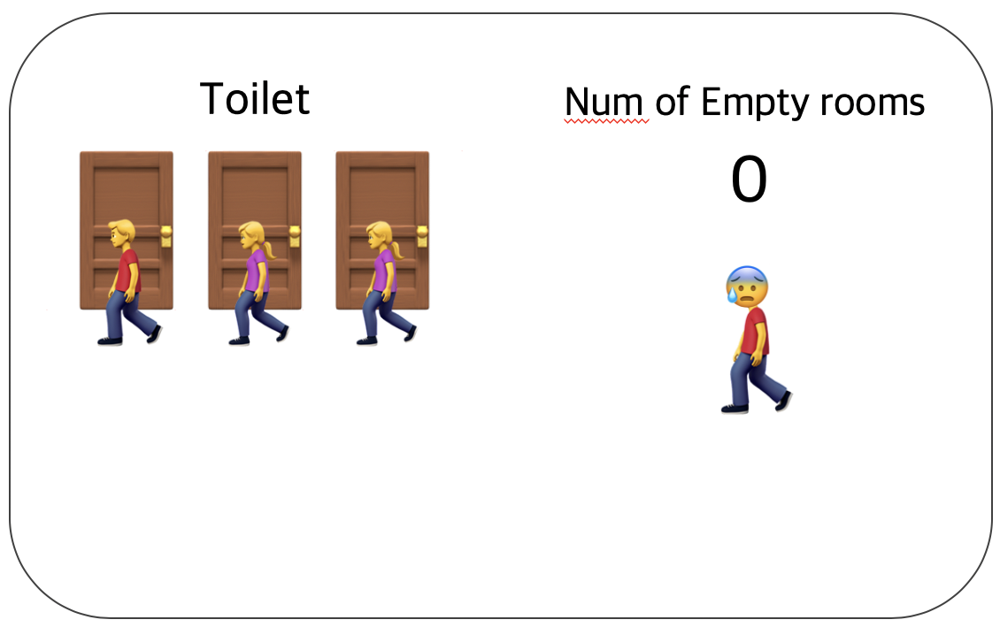
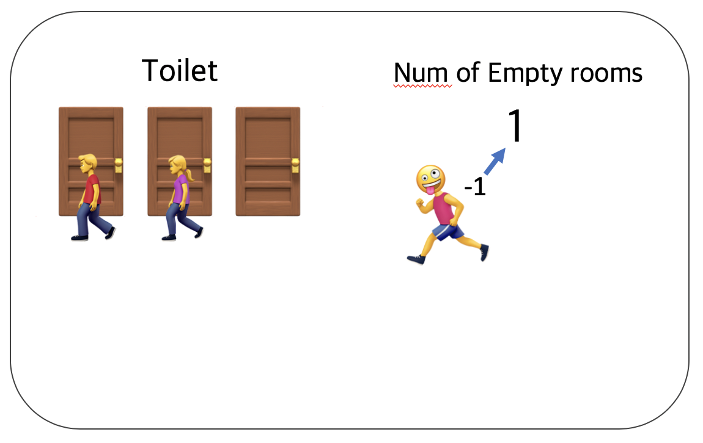

# 🫁 Process Synchronization

> Intro

> 동기화(Synchronization)

> Race Conditions

> Critical Region

> 해결책

> Mutex & Semaphore

>> Lock

>> Semaphores

>> Monitor

<br>

## 🫁 Intro

### Process란 무엇인가?
> 프로세스란 실행 중인 프로그램이다.

프로그램을 수행하기 위해서 Processor(CPU)가 필요하다. 운영체제는 사용자에게 동시에 여러개의 프로세스가 실행되고 있다는 착각을 일으킨다. 사실 CPU는 process to process로 switch를 하면서 여러개의 프로그램을 수행하는 것이다.

각각의 프로세스는 address space(core image), process table entry를 가진다.

### Process의 세가지 상태
1. Running,실행
    - 실제로 CPU를 사용하고 있는 상태
2. Ready,준비
    - Runnable, 일시적으로 다른 프로세스가 실행되도록 멈춰있는 상태
    - CPU는 process간에 공유되어야 한다.
3. Blocked
    - 중단된 상태, disk가 읽히거나 입력이 들어와서 일시적으로 run할 수 없는 상태


<br>

## 🫁 Synchronization
> 공유 데이터(Shared data)에 두 개 이상의 프로세스가 동시에 접근하면 data inconsistency(데이터 모순성)가 발생 할 수 있다.

### Interprocess Communication, 프로세스간 통신
- 세 가지 이슈
    - 어떻게 한 프로세스가 다른 프로세스에게 정보를 넘길 것인가?
    - 두개 이상의 프로세스가 하나의 데이터에 동시에 접근하지 않도록 할 것인가?
    - 의존 관계가 존재할 때 어떻게 적절한 순서 부여를 할 것인가?
        - 만약 process A가 데이터 C 생산하고, B가 C를 출력하는 역할을 수행한다면, B는 A가 수행된 후 끝날 때까지 기다려야 한다.

<br>

## 🫁 Race Conditions
> Race condition(경쟁 상태)은 두 개 또는 이상의 프로세스가 shared data를 동시에 읽거나 쓰는 상황에서 마지막 결과는 정확히 어떤 프로세스가 언제 수행되었는지에 따라서 결정된다.

### Race Condition 발생 할 때
1. 커널 작업을 수행 중에 인터럽트가 발생할 때
2. 프로세스가 system call을 하여 커널 모드로 진입하여 작업을 수행하는 도중 context switch가 발생할 때
3. 멀티 프로세서에서 공유 메모리 내의 커널 데이터에 접근할 때

<br>

## 🫁 Critical Region(Critical section)



- Mutual Exclusion(상호배제)
    - 한 프로세스가 Critical region에 들어오면 다른 프로세스는 critical region에 들어갈 수 없다.
- Critical Region(임계구역)
    - 멀티 프로세스 환경에서 둘 이상의 프로세스가 동시에 접근해서는 안되는 공유 자원의 __코드 영역__ 이다.

critical region은 시간이 지나면 종료되며, 어떤 프로세스가 임계구역에 접근하기 위해서는 지정된 시간만큼 대기해야 한다. 이때 스레드나 프로세스가 배타적인 사용권을 보장받기 위해서 세마포어 같은 동기화 메커니즘을 사용한다.

#### Critical region 문제를 해결하기 위한 네 가지 조건
1. Mutual Exclusion 
    - 두개의 프로세스는 동시에 critical region에 들어갈 수 없다.
2. CPU의 갯수나 성능에 관하여 어떠한 가정도 해서는 안된다.
3. Critical region 밖에 있는 프로세스가 다른 process를 block해서는 안된다.
4. Bounded Waiting(한정 대기)
    - 그 어떤 프로세스도 critical region에 들어가기 위해 영원히 기다려서는 안된다.

저는 위 네 가지로 배웠지만 다른 곳에서 세 가지로 정리한게 많아 세 가지도 적어보겠습니다.

#### Critical region 문제를 해결하기 위한 네 가지 조건

1. Mutual Exclusion(상호배제) - 하나의 프로세스가 임계구역에 있다면 다른 프로세스는 들어갈 수 없다.
2. Progress(진행) - 임계구역에 들어간 프로세스가 없다면 어느 프로세스가 들어갈 것인지 적절히 선택해줘야 한다.
3. Bounded Waiting(한정 대기) - 기아상태를 방지하기 위해, 한 번 들어갔다 나온 프로세스는 다음에 들어 갈 때 제한을 준다.

<br><br>

## 🫁 해결책
임계문제를 해결하기 위한 방식은 많지만 크게 정리를 해보면 
- Disabling Interrupt
- Lock
- Peterson's solution
- TSL instruction(h/w)
- Sleep and Wakeup
- Producer-consumer
- Semaphore
- Monitor 
등등 많습니다.
하지만 주로 다루는 것은 정해져 있기 때문에 궁금하신 분들은 개인적으로 찾아보시면 되고 제 생각에는 면접을 보기 위해서 꼭 알아야 하는 개념은 아래 세가지 정도인 거 같습니다.

<br>

### Lock (test and set)
> 소프트웨어적인 해결방법으로 공유락을 이용한다.

#### 동작 방식
1. 어떤 프로세스가 critical region에 들어가려 할 때 lock을 검사한다.
2. 만약 lock이 0이라면, 프로세스는 lock->1로 바꾸고 critical region에 들어간다.
3. 만약 lock이 이미 1이라면, 프로세스는 lock이 0으로 바뀔 때 까지 기다린다.

*Spooler directory와 같은 결점을 가지고 있다.

하지만 이 방식은 mutual exclusion을 제공하지 못합니다.

__문제 상황 예시__
```
1. A가 lock을 0인 것 확인
2. B 차례가 되어 lock이 0인 것을 확인하여 critical region에 진입하면서,
 lock -> 1로 바꿈
3. 하지만 A가 critical region에 들어가려고 확인한 거였어서 critical region
에 들어가고 변수 1로 바꾼다.
=> A, B 동시에 critical region에 들어가고 조건 1에 위배
```

<br>

### Semaphore

- 세마포어는 자원의 개수를 뜻한다.
- 동시에 자원에 접근할 수 있는 허용가능한 __counter의 개수__
- 세마포어는 여러 프로세스들에 의해 __공유되는 변수__ 로 정의
- 이 변수는 오직 P, V라는 atomic한 연산에 의해서만 접근 가능
- 리소스 상태를 나타내는 __카운터__ 개념이다.
- lock의 경우에는 0, 1로만 구분을 했지만 세마포어는 shared data 개수를 의미한다. semaphore는 lock과는 달리 1로 초기화하고 사용중이면 0으로 바뀐다.
- 세마포어는 소유의 개념이 없다.(카운터로 여러개를 가지고 있기 때문)
    - 세마포어를 소유하지 않은 프로세스가 세마포어를 해제할 수도 있는 문제가 있음 => mutual exclusion 이 보장되지 않는게 아닌가..?
- Semaphore counter 갯수 1개 - binary semaphore, 2 이상 - counting semaphore


#### Semaphore 연산

- Down(P) operation
    - 만약 세마포어가 0보다 크다면, 값을 감소시킨다.
    - 만약 세마포어가 이미 0이라면 process는 down(P) op를 끝내지않고 sleep한다.
- critical region
- up(V) operation
    - 세마포어 값을 증가시키면서 세마포어에 의해 두 개 이상의 프로세스가 자고 있다면 이전의 작업을 끝낼 수 없기 때문에 자고 있는 것들중에서 하나를 깨워 작업을 끝내고 down상태로 갈 수 있게 한다.


```c
// 세마포어를 활용하여 producer consumer 문제 해결 코드 (참고만 하세요!)
#define N 100
typedef int semaphore;
semaphore mutex = 1;
semaphore empty = N;
semaphore full = 0;

void producer(){
    int item;

    while(TRUE){
        item = produce_item();
        down(&empty);
        down(&mutex);
        insert_item(item);
        up(&mutex);
        up(&full);
    }
}

void consumer(){
    int item;
    while(TRUE){
        down(&full);
        down(&mutex);
        item = remove_item();
        up(&mutex);
        up(&empty);
        consume_item(item);
    }
}
```

<br>

### Mutex
- 세마포어의 간소화된 버전, semaphore가 아니다.
- Unlock :0, lock :1
- 뮤텍스 객체를 두 스레드가 동시에 사용할 수 없다.
- 일종의 locking 매커니즘으로 공유 자원에 대한 접근을 조율하기 위해 locking과 unlocking을 low level에서 관리한다.

__아래 예제는 tsl instruction을 이용한 mutex 제어 입니다.__

* TSL instruction은 하드웨어적 도움을 받는 메커니즘입니다.
TSL(test set lock)은 mutual exclusion을 가능하게 하기 위해서 lock과 unlock을 하드웨어적으로 동작시키고 두개의 operation은 쪼갤 수 없습니다.즉, 한 프로세서가 메모리에서 값을 읽어오고 그 주소에 값을 저장하는 도중 다른 프로세서가 그 메모리에 접근하지 못하는 것을 하드웨어가 보장해 주는 것이다. TSL 명령을 실행할 때 메모리 버스를 잠궈서 다른 CPU가 메모리에 접근하지 못하는 방법을 사용하기도 한다.
```
mutex_lock:
    TSL REGISTER, MUTEX | mutex를 레지스터 값으로 옮기고 mutex는 1로 바꾼다.
    CMP REGISTER, #0 
    JZE ok
    CALL mutex_lock
ok: RET | critical region에 들어간다.

mutex_unlock:
    MOVE MUTEX #0 | mutexfmf 0으로 바꾼다.
    RET
```
<br><br>

## Toilet problem with Mutex&Semaphore (예제 느낌입니다잉)

동시성 프로그래밍의 가장 큰 숙제는 `공유자원 관리`입니다. 공유자원을 안전하게 관리하기 위해서는 상호배제를 달성하는 기법이 필요합니다.

### Mutex
뮤텍스는 `화장실이 하나 뿐이 없는 식당`과 비슷합니다. 예를 들어서 화장실을 가기위해 카운터에서 열쇠를 받아 가야 한다고 생각합시다.

화장실을 가려고 하는데 카운터에 키가 있으면 화장실이 비어있는 것이고 그 열쇠를 이용해서 화장실에 갈 수 있습니다.
👇

> 

화장실에서 행복한 시간을 보내고 있는데 다른 테이블에서 어떤 남자가 화장실에 가고 싶어졌습니다. 이 남자는 아무리 용무가 급해도 꾹 참아야겠죠? 화장실이 풀방이니까요.. 결국 남자는 내가 화장실을 다 쓸 때까지 카운터에서 인내의 시간을 보내야 합니다. 
👇

> 

곧이어 옆 테이블에 있던 여자도 화장실에 가고 싶은 가봐요,, 어떡하지? 어떡하긴 기다려야죠,, 카운터에서..
👇

> 

이제 내가 화장실에서 나왔고 카운터에 키를 돌려놨습니다. 그래서 아까 인내의 시간을 보내던 너무 급했던 남자는 카운터에 올려진 키를 들고 바로 화장실로 직행~
👇

> 


이게 뮤텍스가 동작하는 방식입니다. 화장실을 이용하는 사람들을 프로세스 혹은 쓰레드이고 화장실은 공유자원인 것이죠. 화장실 키는 공유 자원에 접근하기 위해 필요한 어떤 오브젝트입니다. 운영체제 수업 때 교수님의 말씀을 더듬어서 생각을 해보면 이 화장실 키를 하드웨어적으로 관리한다고 하셨던거 같아요. tsl lock 처럼요.! 그래서 이 화장실키는 일반 lock과는 다른 것이라고 생각해도 좋을거 같습니다.
👇

> 

<br>

### Semaphore

세마포어는 손님이 화장실을 좀 더 쉽게 이용할 수 있는 술집입니다. 세마포어를 이용하는 술집 화장실에는 여러 개의 화장실 칸이 있어요.. 다행이네요. 그리고 재밌게도 화장실 현황판이 있다고 가정을 했네요.
👇
> 

내가 화장실에 가고 싶으면 입구에서 현황판을 통해 빈 칸이 있는지 확인하고 현황판을 n-- 입장해주면 됩니다. 만약 볼 일을 다 마치면 n++ 시켜야겠죠?
👇
> 

모든 칸에 사람들이 차있다면 빈 칸의 개수는 0인데요 이때부터 또 다시 인내의 시간이 시작됩니다. 사람이 나올 때까지 기다려야죠..
👇
> 

사람들이 나올 때 마다 빈 칸의 개수++ 시켜줘야 하고 기다리던 사람은 다시 빈 칸의 개수-- 하고 입장하셔야 합니다.
👇
> 

정리하면 
<br>mutex <= 한 쓰레드, 프로세스에 의해 소유되는 키를 기반으로한 mutual exclusion 기법
<br>semaphore <= signaling mechanism으로 현재 공유자원에 접근할 수 있는 스레드 프로세스의 수를 나타내는 값을 두어 상호배제를 달성한다고 합니다.

<br>

### Monitor
- Mutex와 Condition Variables를 가지고 있는 synchronization 매커니즘이다.
- Mutex와 monitor는 상호배제를 함으로써 임계구역에 하나의 프로세스만 들어갈 수 있다.(세마포어는 여러개의 프로세스 들어갈 수 있음.)
- 세마포어를 실제 프로그램을 구현한 것이다.
- 상호 배제를 위한 데이터 및 프로그램 모듈, 운영체제 내부의 프로글매을 모니터라고 한다.

<br>

### Semaphore vs. Mutex vs. Monitor
> 아직 안끝났습니다... 아직 한발 남았습니다...

#### mutex vs. monitor
- 뮤텍스는 다른 프로세스나 스레드 간에 동기화를 위해 사용된다.
- 모니터는 하나의 프로세스 내에서 다른 스레드 간에 동기화할 때 사용한다.
- 뮤텍스는 운영체제 커널에 의해 제공된다.
    - kernal에 접근하기 때문에 system call을 이용함. 그래서 느리다.
- 모니터는 프레임워크나 라이브러리 그 자체에서 제공된다.
    - 프로그램에서 제공하는 것으로 user level에서 제공가능, 그래서 빠름

#### monitor vs. semaphore 
- 자바에서는 모니터를 모든 객체에게 기본적으로 제공하지만 C에서는 사용할 수 없다.
- 세마포어는 카운터라는 변수값으로 프로그래머가 상호배제나 정렬의 목적으로 사용 시 매번 값을 따로 지정해줘야하는 번거러움이 있다.
- 반면에 모니터는 이러한 일들이 캡슐화 되어 있어서 개발자는 카운터 값을 0또는 1로 주어야 하는 고민을 할 필요가 없이 synchronized, wait(), notify() 등의 키워드를 이용해 좀 더 편하게 동기화할 수 있다.

#### semaphore vs. mutex
- 세마포어는 뮤텍스가 될 수 있지만 뮤텍스는 세마포어가 될 수 없다.
- 세마포어는 소유할 수 없지만 뮤텍스는 소유할 수 있고 소유주가 그 책임을 진다.(?)
- 뮤텍스의 경우 뮤텍스를 소유하고 있는 스레드가 이 뮤텍스를 해제할 수 있다. 하지만 세마포어는 소유하지 않고 있는 다른 스레드가 세마포어를 해제할 수 있다.
- 뮤텍스는 동기화 대상이 1개 일 때 사용하지만 세마포어는 동기화 대상이 여러 개일 때 사용한다. (화장실 예제를 떠올리시면될 거 같아요~)

## *Misconception about mutex and semaphore
> There is an ambiguity between binary semaphore and mutex. We might have come across that a mutex is a binary semaphore. But it is not! The purpose of mutex and semaphore are different. Maybe, due to similarity in their implementation a mutex would be referred to as a binary semaphore. 

뮤텍스와 세마포어에 대해서 많이 헷갈릴 수 있습니다. 특정 사이트에서는 "mutex가 binary semaphore이다"라는 설명이 있는데 geeks for geeks에서는 이게 잘못된 거라고 하네요. 뮤텍스와 세마포어는 아예 다른 것 입니다. 학교 운영체제 강의에서도 교수님이 다른거 라고 강조하셨던 기억이 납니다. 엄격히 말해서 
> Strictly speaking, a mutex is a locking mechanism used to synchronize access to a resource. Only one task (can be a thread or process based on OS abstraction) can acquire the mutex. It means there is ownership associated with a mutex, and only the owner can release the lock (mutex). geeks for geeks 본문..

엄격히 말해서 뮤텍스는 locking 메커니즘으로써 공유 자원 접근에 대한 동기화에 쓰입니다. 단 하나의 업무 즉 공유 자원 접근 동기화만 하는 것이라고 합니다. 뮤텍스는 소유권이 있다고 합니다. 그리고 그 소유자만이 lock을 걸고 풀 수 있습니다.

> Semaphore is signaling mechanism (“I am done, you can carry on” kind of signal). For example, if you are listening to songs (assume it as one task) on your mobile phone and at the same time, your friend calls you, an interrupt is triggered upon which an interrupt service routine (ISR) signals the call processing task to wakeup. 

세마포어는 signaling 메커니즘이라고 합니다. 예를 들어서 제가 음악을 듣고 동시에 친구에게 전화를 하는 상황이라면 interrupt가 발생해 service routine을 유발해 음악을 멈추고 친구와 통화를 하고 전화를 끊으면 다시 음악 스트리밍 프로그램에 wakeup 신호를 줘서 음악이 저절로 재생되는 것과 같습니다.

### mutex의 헷갈리는 질문
#### Q1. Binary semaphore와 mutex는 같은가요?
-> 아닙니다. 우리는 그것을 다른 것이라고 생각해야합니다. signaling 과 locking 메커니즘이라고 생각해요~.~

#### Q2. mutex는 두 번 이상 lock될 수 있나요?
-> 뮤텍스는 lock입니다. 단 하나의 상태(lock/unlock)과 연관되어 있습니다. 하지만 재귀적인 뮤텍스(POSIX)는 한 번 이상 잠길수 있습니다. 프로그래머가 반드시 mutex를 잠군 횟수만큼 unlock하도록 제어해야합니다.

[출처](https://www.geeksforgeeks.org/mutex-vs-semaphore/)

위 출처로 가셔서 한 번 정독하는 것도 나쁘지 않을 것 같습니다. :)
수고하셨습니다.

<br><br>

### 📚 참고

[Critical Region](https://dduddublog.tistory.com/25)

[Process sync](https://jungwoon.github.io/os/2019/07/31/Process-Synchronization.html)

[Mutex&semaphore](https://worthpreading.tistory.com/90)

[Monitor,mutex,semaphore](https://worthpreading.tistory.com/90)

[Mutex vs. semaphore](https://www.geeksforgeeks.org/mutex-vs-semaphore/)

[mutex](http://www.qnx.com/developers/docs/qnxcar2/index.jsp?topic=%2Fcom.qnx.doc.neutrino.sys_arch%2Ftopic%2Fkernel_Mutexes.html)


<br><br>

### ⁉️ 면접 예상 질문

> 1. Process를 동기화 해야하는 이유가 무엇인가요?

>> 1-1. 동기화를 하기 위해서 어떤 이슈를 해결해야하나요?

> 2. Race Condition은 무엇인가요?

>> 2-1. Race condition은 언제 발생하나요?

> 3. Critical Region은 무엇인가요?

>> 3-1. Critical region의 문제를 해결하기 위한 세 가지 조건을 말해주세요.

>>3-2. 이 문제를 해결하기 위한 대표적인 방법에 무엇이 있나요?

>>3-3. Semaphore, mutex, monitor이 무엇인가요? (내용 설명)

> 4. Mutex vs. Semaphore vs. Monitor를 말해주세요

>> 4-1. Mutex vs. semaphore

>> 4-2. semaphore vs. monitor

>> 4-3. monitor vs. mutex