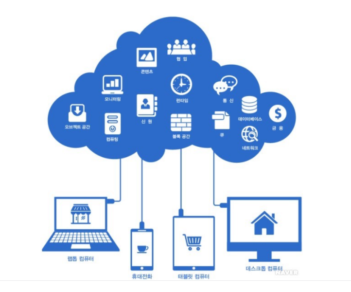
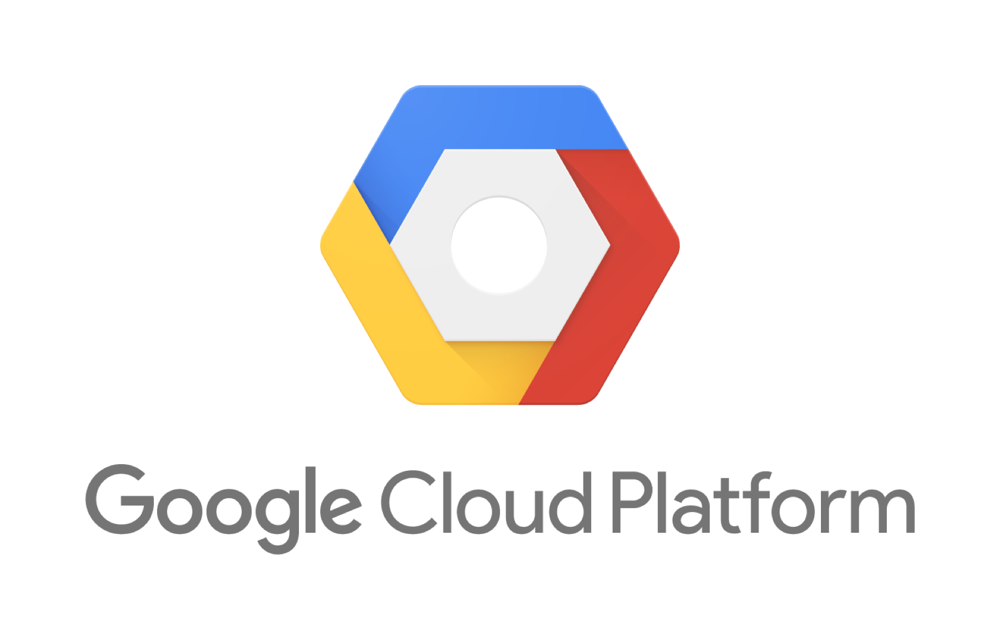
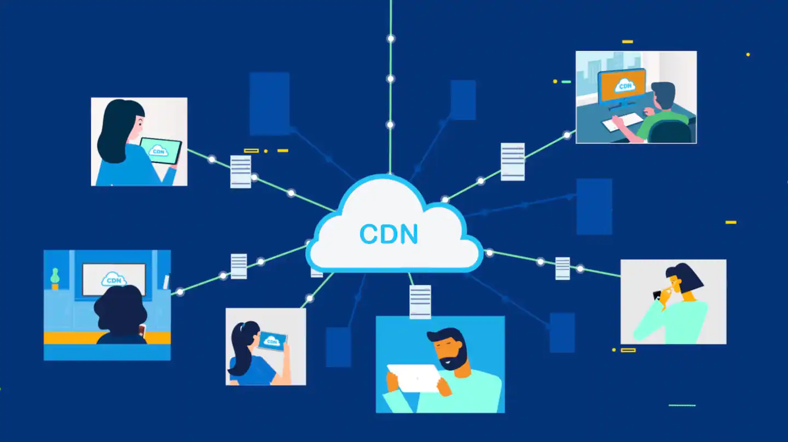
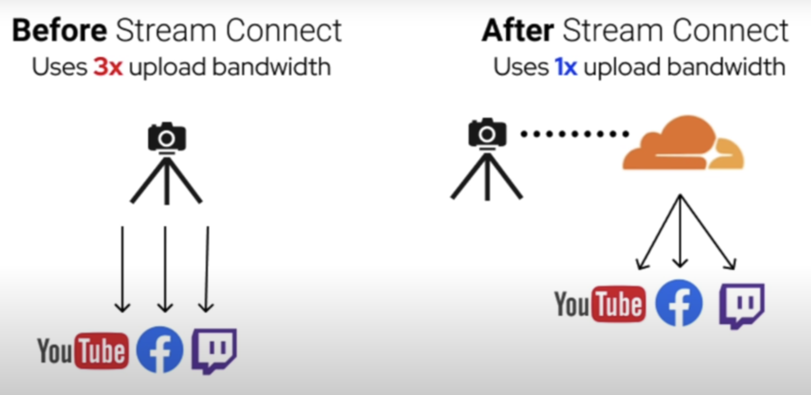

# AWS_GCP_Cloudflare

> 클라우드 컴퓨팅 

> AWS

> GCP

> AWS vs GCP

> Cloudflare

 

# 클라우드 컴퓨팅
>  인터넷(“클라우드”)을 통해 서버, 스토리지, 데이터베이스, 네트워킹, 소프트웨어, 분석, 인텔리전스 등의 컴퓨팅 서비스를 제공하는 것

- 일반적으로 사용한 클라우드 서비스에 대해서만 요금을 지불하므로, 운영 비용을 낮추고 인프라를 보다 효율적으로 운영할 수 있습니다. 그뿐만 아니라, 비즈니스 요구 사항의 변화에 따라 규모를 조정할 수 있습니다.

## 클라우드 컴퓨팅의 이점
1. 비용
    - 클라우드 컴퓨팅을 사용하면 하드웨어 및 소프트웨어를 구입하고 온사이트 데이터 센터를 설치 및 운영하면서 발생하는 지출을 줄일 수 있습니다. 서버 랙, 전원 및 냉각에 사용되는 상시 대기 전기세, 인프라 관리를 위한 IT 전문가 비용 등의 비용이 빠르게 절감됩니다.

2. 속도
    - 대부분의 클라우드 컴퓨팅 서비스는 주문형 셀프 서비스로 제공됩니다. 따라서 많은 양의 컴퓨팅 리소스도 대부분 몇 번의 마우스 클릭으로 몇 분 만에 프로비전될 수 있어 기업에 많은 유연성이 제공되며 기업은 용량 계획 부담을 덜 수 있습니다.

3. 뛰어난 확장성
    - 탄력적인 확장은 클라우드 컴퓨팅 서비스의 큰 이점 중 하나입니다. 클라우드 세계의 이러한 특성은 바로 필요한 때에 적절한 지리적 위치에서 대략적인 컴퓨팅 성능, 스토리지, 대역폭 등 적절한 양의 IT 리소스를 제공하는 것을 의미합니다.

4. 생산성
    - 일반적으로 온사이트 데이터 센터에는 하드웨어 설치, 소프트웨어 패치 및 기타 시간이 오래 걸리는 IT 관리 작업 등 많은 “래킹과 스태킹(racking and stacking)”이 필요합니다. 클라우드 컴퓨팅을 사용하면 이러한 작업의 상당수가 불필요해지므로 IT 팀은 더 중요한 비즈니스 목표를 달성하는 데 시간을 투자할 수 있습니다.

5. 성능
    - 최대 규모의 클라우드 컴퓨팅 서비스가 전 세계에 위치한 보안 데이터 센터 네트워크에서 실행됩니다. 이러한 데이터 센터는 최신 세대의 빠르고 효율적인 컴퓨팅 하드웨어로 정기적으로 업그레이드됩니다. 따라서 일반 개별 기업이 보유한 데이터 센터와 비교하면 애플리케이션의 네트워크 대기 시간 단축과 더 큰 규모의 경제 등 몇 가지 이점이 제공됩니다.

6. 안정성
    - 클라우드 컴퓨팅을 사용하면 클라우드 공급자 네트워크의 여러 중복 사이트에 데이터를 미러할 수 있으므로 데이터 백업, 재해 복구 및 비즈니스 연속성을 더 쉽게 제공할 수 있으며 비용도 덜 듭니다.

7. 보안
    - 많은 클라우드 공급자가 전체적인 보안 태세를 강화하는 광범위한 정책 집합, 기술 및 컨트롤을 제공하여 데이터, 앱 및 인프라를 잠재적인 위협으로부터 보호합니다.

 

## 클라우드 컴퓨팅 유형
> 모든 클라우드가 같지 않으며 하나의 클라우드 컴퓨팅 유형만이 누구에게나 적합한 것은 아닙니다. 여러 가지 서로 다른 모델, 유형 및 서비스가 결합되어 사용자에게 적합한 솔루션을 제공합니다.

먼저, 클라우드 서비스를 구현할 클라우드 배포 유형 또는 클라우드 컴퓨팅 아키텍처를 결정해야 합니다. 클라우드 서비스를 배포하는 방식으로는 공용 클라우드, 프라이빗 클라우드 또는 하이브리드 클라우드의 세 가지가 있습니다.

1. 공용 클라우드
    - 인터넷을 통해 서버 및 스토리지와 같은 컴퓨팅 리소스를 제공하는 타사 클라우드 서비스 공급자가 소유하고 운영합니다. 공용 클라우드를 사용할 경우 모든 하드웨어, 소프트웨어 및 기타 지원 인프라를 클라우드 공급자가 소유하고 관리합니다. 사용자는 웹 브라우저를 사용하여 이러한 서비스에 액세스하고 계정을 관리합니다.

2. 프라이빗 클라우드
    - 단일 비즈니스 또는 조직에서 독점적으로 사용되는 클라우드 컴퓨팅 리소스를 의미합니다. 프라이빗 클라우드는 회사의 실제 온사이트 데이터 센터 내에 배치할 수 있습니다. 일부 회사에서는 해당 프라이빗 클라우드를 호스트하기 위해 타사 서비스 공급자에 비용을 지급하기도 합니다. 프라이빗 클라우드는 서비스와 인프라가 개인 네트워크에서 유지 관리되는 클라우드입니다.

3. 하이브리드 클라우드
    - 공용 클라우드와 프라이빗 클라우드 간에 데이터와 애플리케이션을 공유할 수 있는 기술로 함께 바인딩된 공용 클라우드와 프라이빗 클라우드를 결합합니다. 하이브리드 클라우드는 데이터 및 애플리케이션을 프라이빗 클라우드와 공용 클라우드 간에 이동할 수 있도록 하여, 비즈니스에 더 높은 유연성, 더 많은 개발 옵션을 제공하며 기존 인프라, 보안 및 규정 준수를 최적화하도록 지원합니다.

 

## 클라우드 서비스 형식: IaaS, PaaS, 서버리스, SaaS

이러한 클라우드 컴퓨팅 서비스는 중첩되어 빌드되므로 클라우드 컴퓨팅 "스택"이라고도 합니다.

1. IaaS(Infrastructure as a Service)
    - 클라우드 컴퓨팅 서비스의 가장 기본적인 범주입니다. IaaS를 사용할 경우 클라우드 공급자로부터 종량제 방식으로 서버와 VM(가상 머신), 스토리지, 네트워크, 운영 체제 등의 IT 인프라를 대여합니다.

2. PaaS(Platform as a Service)
    - PaaS(Platform-as-a-Service)는 소프트웨어 애플리케이션을 개발, 테스트, 제공 및 관리하기 위한 주문형 환경을 제공하는 클라우드 컴퓨팅 서비스를 의미합니다. PaaS는 개발자가 개발에 필요한 서버, 스토리지, 네트워크 및 데이터베이스의 기본 인프라를 설정하거나 관리할 필요 없이 더 쉽고 빠르게 웹앱이나 모바일 앱을 만들 수 있도록 디자인되었습니다.

3. 서버리스 컴퓨팅
    - PaaS와 중첩된 서버리스 컴퓨팅은 필요한 서버와 인프라를 지속해서 관리하는 데 시간을 소비하지 않고 앱 기능을 빌드하는 데 초점을 맞추고 있습니다. 클라우드 공급자가 설정, 용량 계획 및 서버 관리를 처리합니다. 서버리스 아키텍처는 확장성이 높고 이벤트를 기반으로 하며 특정 함수 또는 트리거가 발생하는 경우에만 리소스를 사용합니다.

4. SaaS(Software as a Service)
    - SaaS(Software-as-a-Service)는 인터넷을 통해 주문형과 일반적인 구독 방식으로 소프트웨어 애플리케이션을 제공하는 방법입니다. SaaS를 사용할 경우 클라우드 공급자는 소프트웨어 애플리케이션과 기본 인프라를 호스트하고 관리하며 소프트웨어 업그레이드 및 보안 패치와 같은 유지 관리를 처리합니다. 사용자는 일반적으로 휴대폰, 태블릿 또는 PC에서 웹 브라우저를 사용하여 인터넷을 통해 애플리케이션에 연결합니다.

 

# AWS

아마존의 AWS는 2004년 공용 클라우드 서비스를 시작으로 현재는 업계 최고수준의 자동화, 보안 및 확장성을 갖춘 클라우드를 제공하고 있습니다. 네이티브 애플리케이션 설계 및 서버리스, 스토리지, 네트워크, 소프트웨어 인프라 서비스 등의 모든 범주에서 사용자가 요구하는 기능을 모두 제공하고 있습니다. 따라서 사용자는 AWS만 사용함으로 전체 인프라스트럭처를 통합 운영할 수 있는 최대 장점이 있습니다.

## AWS 서비스 종류

### Compute

- EC2 (Elastic Compute Cloud)
    - 클라우드 환경에서 서버를 할당 받아 사용할 수 있는 서비스로, 서버 호스팅과 비슷한 개념이지만 물리적인 서버가 아닌 AWS 클라우드에서 가상 환경을 할당받는다.

### Networking

- Direct Connect
    - AWS와 사용자의 데이터 센터, 사무실, 코로케이션 환경 사이에서 프라이빗 연결을 설정할 수 있다.
    - 802.1q VLAN을 사용하기 때문에 여러 가상 인터페이스로 나눌 수 있어, 퍼블릭 환경과 프라이빗 환경 간의 네트워크 분리를 유지하면서 동일한 연결을 사용한다.

- Route 53
    - AWS에서 제공하는 DNS 서비스로 IPv6를 사용할 수 있고, Amazon EC2 인스턴스, Elastic Load Balancing 로드 밸런서, Amazon S3 버킷 등 AWS에서 실행되는 인프라에 효과적으로 연결할 수 있다.
    - 트래픽을 정상적인 엔드포인트로 라우팅하거나 애플리케이션 및 해당 엔드포인트의 상태를 개별적으로 모니터링하도록 DNS 상태 확인을 구성할 수 있고, 트래픽 흐름을 사용하면 지연 시간 기반 라우팅, 지역 DNS, 지역 근접성, 가중치 기반 라운드 로빈을 비롯하여 다양한 라우팅 유형을 통해 전역적으로 트래픽을 관리할 수 있다.

- VPC (Virtual Private Cloud)
    - 사설 네트워크 서비스로 IPv4와 IPv6를 모두 사용하여 리소스와 애플리케이션에 접근할 수 있다.

- Elastic Load Balancing
    - AWS의 LB 서비스로 애플리케이션 트래픽을 Amazon EC2 인스턴스, 컨테이너, IP 주소, Lambda 함수, 가상 어플라이언스와 같은 여러 대상에 자동으로 분산할 수 있다.

### Storage & Content Delivery

- S3 (Simple Storage Service)
    - 규모와 업종에 상관없이 고객이 이 서비스를 이용하여 데이터 레이크, 웹사이트, 모바일 애플리케이션, 백업 및 복원, 아카이브, 엔터프라이즈 애플리케이션, IoT 디바이스, 빅 데이터 분석과 같은 다양한 사용 사례에서 원하는 만큼의 데이터를 저장하고 보호할 수 있는 서비스

- EBS (Elastic Block Storage)
    - 대규모로 처리량과 트랜잭션 집약적인 워크로드 모두를 지원하기 위해 Amazon Elastic Compute Cloud(EC2)에서 사용하도록 설계된 사용하기 쉬운 고성능 블록 스토리지 서비스

- Storage Gateway
    - 클라우드 스토리지에 대한 온프레미스 액세스 권한을 제공하는 하이브리드 클라우드 스토리지 서비스
    - 로컬에 있는 스토리지 장비와 S3를 연동해서 메인 데이터는 S3에 두고 접근 빈도가 높은 데이터는 로컬 스토리지에 케싱 하거나, 모든 데이터는 로컬 스토리지에 두고 일정 시간에 따라 주시적으로 데이터의 스냅숏을 S3에 저장하는 등의 서비스를 구축할 수 있다.

### Database (BigData)
- RDS (Relational Database Service)

    - Amazon Aurora, PostgreSQL, MySQL, MariaDB, ORACLE, Microsoft SQL Server 등 관계형 데이터베이스 서비스
    - AWS에서 메모리, 성능 또는 I/O 최적화를 진행하며, 기존 데이터베이스를 Amazon RDS로 마이그레이션 또는 복제할 수 있다.

- DynamoDB

    - 어떤 규모에서도 10밀리초 미만의 성능을 제공하는 키-값 및 문서 데이터베이스(NoSQL)

- SDB (Simple Database)

    - 데이터베이스 관리 작업의 부담을 덜어주는 고가용성의 NoSQL 데이터 스토어
    - 개발자는 웹 서비스 요청을 통해 데이터 항목을 저장하고 쿼리 하며 이후 나머지 부분은 Amazon SimpleDB가 처리한다.

- EMR (Elastic MapReduce)

    - Apache Spark, Apache Hive, Apache HBase, Apache Flink, Apache Hudi 및 Presto와 같은 오픈 소스 도구를 사용하여 방대한 양의 데이터를 처리하기 위한 빅 데이터 플랫폼
    - 프로비저닝 용량 및 클러스터 조정 등의 시간이 소요되는 작업을 자동화하여 빅데이터 환경을 쉽게 설치, 운영, 확장할 수 있다.

 

## 장점
1. 가장 성숙한 클라우드 서비스 제공사
2. 광범위한 서비스 및 파트너 생태계를 갖춘 시스템
3. 가상 환경에서 모두 잘 실행되는 사용 사례들

## 단점
1. 관리를 위해선 고급 전문 지식이 필요
2. 강력한 하이브리드 클라우드 지원이 부족
3. 파악하기 힘든 너무나 광범위한 서비스

 

# GCP

구글 클라우드 플랫폼 (GCP)는 2011년에 공개된 클라우드 컴퓨팅 플랫폼입니다. 

GCP는 가상 머신 생성 시 AWS, Azure와 다르게 직접 사양을 커스터마이징 할 수 있으며, 가격이 저렴합니다.

기능적 부분에서는 다른 클라우드 플랫폼과 비슷하거나 동일한 서비스를 제공하고 있으며, 특히 구글 자사에서 운영하는 플랫폼과 CNCF 재단에서 관리하고 있는 애플리케이션 간의 연동성이 뛰어나다는 특징이 있습니다.

### Compute

- Compute Engine
    - 클라우드에서 제공하는 가상 머신 컴퓨팅 서비스

- App Engine
    - 서버리스 애플리케이션 플랫폼
    - 서버 관리와 구성 배포가 필요 없기 때문에 개발자는 관리 오버헤드 없이 우수한 애플리케이션을 구축하는 데 집중할 수 있다.

- Kubernetes Engine
    - 컨테이너식 애플리케이션 배포를 위한 관리형 환경 제공
    - 개발자 생산성, 리소스 효율성, 자동화된 작업, 오픈소스 유연성을 가지고 있음
    - 구글의 15년간의 프로덕션 컨테이너 클러스터링 시스템 노하우를 통해 가장 안정적인 서비스 제공

### Networking
- Cloud Load Balancing
    - 부하 분산된 컴퓨팅 리소스를 사용자와 가까운 지역 한 곳이나 여러 곳에 배포하여 고가용성 요건을 충족

- Cloud CDN
    - 세계 전역에 경계 지점이 퍼져 있는 Google의 망을 활용하여, Google Compute Engine과 Google Cloud Storage를 기반으로 하는 웹사이트와 애플리케이션의 콘텐츠 전송 속도 향상
    - 네트워크 지연 시간을 낮추고, 원본에 걸리는 부하를 분산하고, 서버 사용 비용을 절감

### Storage &  Databases

- BigQuery
    - 모든 데이터 분석가의 생산성을 높일 수 있도록 설계된 Google의 확장성이 뛰어난 기업용 서버리스 데이터 웨어하우스
    - 관리할 인프라가 없기 때문에 익숙한 SQL로 데이터를 분석해 의미 있는 유용한 정보를 찾는 데 집중할 수 있다.

- Cloud Dataflow
    - 신뢰성과 표현 능력은 그대로 유지하면서 스트림(실시간) 및 일괄(기록) 모드에서 데이터를 변환하고 강화하는 전체 관리형 서비스
    - 소스 프로비저닝 및 관리에 대한 서버리스 접근 방식 덕분에 무제한에 가까운 용량을 이용해 대규모 데이터 처리 과제를 해결

- Cloud PubSub
    - 스트림 분석 및 이벤트 기반 컴퓨팅 시스템  

### Artificial intelligence
- Cloud Auto ML
    - 제한적인 머신러닝 전문 지식을 보유한 개발자도 Google의 최첨단 전송 학습 및 Neural Architecture Search 기술을 활용하여 비즈니스 요구사항에 맞게 고품질 모델을 학습시킬 수 있는 머신러닝 제품

- Cloud Translation API
    - 인공신경망 기계 번역을 이용하여 임의 문자열을 지원되는 언어로 번역할 수 있는 간단한 프로그래밍 인터페이스를 제공

- Prediction API
    - Firebase 예측은 Google 머신러닝을 사용하여 사용자의 예측된 행동을 기준으로 동적 사용자 그룹을 생성한다.
    - 예측을 사용하면 사내 데이터 분석팀을 만들 필요 없이 정보를 토대로 제품에 대한 결정을 내릴 수 있도록 도와준다.

 

## 장점
1. 오픈 소스 커뮤니티에서 쌓은 명성
2. 분석 및 머신러닝에 대한 많은 투자
3. 빅데이터 애플리케이션, ML 벤처 및 클라우드 네이티브 애플리케이션을 위한 최적의 옵션

## 단점
1. 계약 협상에서 매우 엄격
2. 소규모 파트너 생태계
3. 대기업을 위한 제한된 범위의 서비스

 

## AWS vs GCP
> 사용자는 클라우드 사업자의 각각의 특징을 확인함으로써 적절한 서비스를 운영할 수 있어야 하고, 멀티 클라우드 혹은 하이브리드 시스템을 통해서 시스템 구성에 들어가는 비용을 절감할 수 있습니다.

1. CDN(Content Delivery Network) 기능

    - Cloudfront : 자체 CDN 서비스 및 파트너 할인요율 적용
    - GCP CDN : CDN Interconnect를 사용하여 여러 CDN제공업체에 할인된 요율 제공 (Akamai, Cloudflare 등)

2. 네트워킹 기능

    - AWS VPC : 가상 사설망을 할당하여 라우팅, VPN, NACL 등 네트워크 지원
    - GCP Private Cloud : 모든 서비스에 적용되는 전역 기능 네트워크 지원

3. Compute 기능

    - EC2 : 인스턴스 생성 전 Key Pair 생성 필요. 분실 시 접근 불가.

    - Compute : GCP콘솔에서 접속가능. 실행 중이어도 Key 생성 가능

4. Serverless Compute 기능 비교

    - Lambda : 다양한 언어 코드 지원 (Node.js. Java, C#, Go, Python)
    - Cloud Functions : Node.js 6, Node.js 8, Python

5. LoadBalancing 기능

    - [L4]
        - AWS NLB : L4부하 분산 시 TCP, TLS 프로토콜만 지원
        - GCP LB: L4부하 분산 시 TCP, UDP 프로토콜만 지원
    - [L7]
        - AWS ALB : HTTP, HTTPS 프로토콜 지원
        - GCP LB : HTTP, HTTPS, SSL/TLS, TCP 프로토콜 지원

6. DNS 기능

    - AWS Route53 : 지역 기반 라우팅 지원, 지연 기반 라우팅 지원
    - GCP DNS : DNS서비스용 DNSSEC 지원

7. WAF(Web Application Firewall) 기능

    - AWS WAF : DDOS Protection ($ 3,000), 1개 IP에서 무작위 요청 시 차단 기간 설정 가능
    - GCP Armor : DDOS Protection ($ 0), 1개 IP 무작위 요청 차단 기능 없음

8. 모니터링 기능 비교

    - AWS CloudWatch : 하나의 단일 계정에 대한 모니터링, 대시보드 및 경보/알림 수에 따른 비용 추가
    - GCP Monitoring : 1개 계정에 포함된 다수의 프로젝트 1~1000개 모니터링, 대시보드 및 경보/알림 비용 무료

9. 데이터분석/메시지서비스

    - AWS SNS/SQL : SQS를 통해 메시지 큐를 주고받는 서비스를 할 수 있으며 클라이언트에 전송하기 위해서는 SNS를 연동해야 함
    - GCP Pub/Sub : Pub/Sub에서 메시지 큐, 내보내기 기반 메시지 전송 및 대용량 스트리밍 메시지를 전역 서비스로 제공

10. 데이터베이스 서비스

    - AWS RDS : Oracle, MySQL, PostgreSQL, MSSQL 지원
    - GCP CloudSQL : 완전관리형 MySQL 지원

    - DB 마이그레이션을 위해서는 AWS RDS는 폭넓은 지원, GCP는 제한적인 지원을 제공

11. 저장소 서비스

    - S3와 Cloud Storage 기능이 대부분 비슷함

12. 전용선 서비스

    - AWS DX와 GCP DI 기능과 요금 수준은 전용선 전문 업체 비용에 따라 상이할 수 있음.

13. NoSQL 서비스

    - DynamoDB, Bigtable 두 서비스 모두 비슷한 기능의 NoSQL (키값) 저장 서비스 제공

14. 인메모리 서비스

    - ElastiCache, Memorystore 두 서비스 모두 비슷한 기능의 인메모리(redis) 데이터 저장 서비스 제공

 

# Cloudflare
> Cloudflare는 인터넷에 연결하는 모든 것을 안전하고 비밀을 유지하면서 신속하고 안정적으로 연결하도록 설계된 전역 네트워크입니다. 가장 빠르고 큰 글로벌 네트워크. 95%의 인터넷 연결된 사람들에게서 단 50 milliseconds 떨어져있습니다. 또 100개 이상의 국가, 250개 도시에 서버를 갖고 있습니다. 제일 중요한건 네트워크 스피드가 1초당 100 테라바이트라는 것...

## Cloudflare CDN

- CDN(콘텐츠 전송 네트워크)은 지리적으로 분산된 여러 개의 서버입니다. 웹 콘텐츠를 사용자와 가까운 곳에서 전송함으로써 전송 속도를 높입니다. 전 세계 데이터센터는 파일 복사본을 임시로 저장하는 프로세스인 캐싱을 사용합니다. 따라서 사용자는 가까운 서버를 통해 웹 활성화 디바이스 또는 브라우저에서 인터넷 콘텐츠에 빠르게 접속할 수 있습니다.

- Cloudflare는 글로벌 에지 네트워크에서 매우 빠른 정적/동적 콘텐츠 전송 서비스를 제공합니다. 콘텐츠 캐시 방식을 정밀하게 관리하고 대역폭 비용을 줄이면서 기본 제공되는 무제한 DDoS 보호 기능을 이용할 수 있습니다.

- Cloudflare는 주로 CDN 업체로 알려져 있습니다. 많은 서비스들은 AWS 상에 구축되는 추세이고 AWS에서는 CloudFront라는 CDN을 제공하고 있기 때문에, 굳이 왜 별도의 CDN을 사용하느냐? -> Cloudflare를 CloudFront의 대체재가 아닌, 별도의 가치를 부여하는 인프라로 간주하고 있습니다. 

## Cloudflare R2 vs AWS S3

- S3

    - 파일 보관에 매우 저렴, 네트워크 전송 비용 매우 비쌈
    - 사진 업로드는 무료이고, 보관은 저렴하지만, 그 사진을 보려는 사람이 많으면 사용료(request Data -> Egress fees)가 엄청남
    - 1G 1달 보관 0.02 USD, Egress fees : 1G per 0.09 USD
    

- R2

    - 1G 1달 보관 0.015 USD -> 아주 큰 장점은 아니다
    - 1초당 10회 미만으로 요청하는 경우, 돈 안받음 (하루에 77만 7천회 요청 가능)
    받아도 AWS 보다는 훨씬 저렴함

## Cloudflare Image

- 이미지 관련된 서비스는 R2와 별개로 아예 따로 만들었습니다. 사이즈 조절, 포멧변환 등의 기능까지 제공합니다.
    - 이미지를 업로드 하고나서 나중에 리퀘스트를 하면 리사이즈 되어서 전달되게 할 수 있습니다. 또는 퀄리티를 50% 낮추거나 JPG로 바꿀 수 있습니다.
    - 이미지를 활용한 서비스 제작이 쉬워짐
- 10만개 사진을 한달에 5$ 비용으로 호스팅 가능하고, 10만개 사진을 한달에 1$ 비용으로 전송 가능
- URL만 바꾸면 이미지 변환도 가능

## Cloudflare Streams

이전에 라이브 스트리밍 서비스를 만들기 위해서는 스트리머에서 오는 영상을 받아서 인코딩 한 후 유저들에게 해당 영상을 보내야했습니다. Cloudflare Streams 을 사용하면 딱 한번 API를 부르면 인코딩, 브로드캐스팅, 라이브 방송 자동저장까지 해줍니다.

### Stream Connect 

Stream 시그널을 하나만 가지고 다른 스트림 제공자들에게 증폭시켜준다.
-> 유튜브 페이스북 트위치에 따로 업로드 하는 대신에 그냥 Cloudflare에 올리기만 하면 Cloudflare가 다른 플랫폼에 다 전달해줍니다.

- 녹화영상 1천분 저장에 한달에 5$, 매 1천분 시청마다 1$

 

 

### 📚 참고

[클라우드 컴퓨팅](https://azure.microsoft.com/ko-kr/overview/what-is-cloud-computing/#benefits)

[AWS & GCP 1](https://judo0179.tistory.com/115)

[AWS & GCP 2](https://moondol-ai.tistory.com/184)

[AWS & GCP 3](https://velog.io/@jeb1225/GCP-AWS-%ED%81%B4%EB%9D%BC%EC%9A%B0%EB%93%9C-%EC%84%9C%EB%B9%84%EC%8A%A4-%EB%B9%84%EA%B5%90)

[Cloudflare 작동 방식](https://www.cloudflare.com/ko-kr/learning/what-is-cloudflare/) 

[Cloudflare](https://www.cloudflare.com/ko-kr/cdn/)

[R2 vs S3 1](https://www.youtube.com/watch?v=-AwLsUuzgLw&list=LL&index=2)

[R2 vs S3 2](https://blog.cloudflare.com/introducing-r2-object-storage/)

 

***

## Summary

***

 

# ⁉️ 면접 예상 질문

> 1. 클라우드 컴퓨팅이 무엇인가요?

> 2. 왜 AWS(GCP)를 사용했나요? -> 둘의 장단점 & 차이점

> 3. Cloudflare를 사용한다면 어떤 면에서 사용을 하실 건가요?

