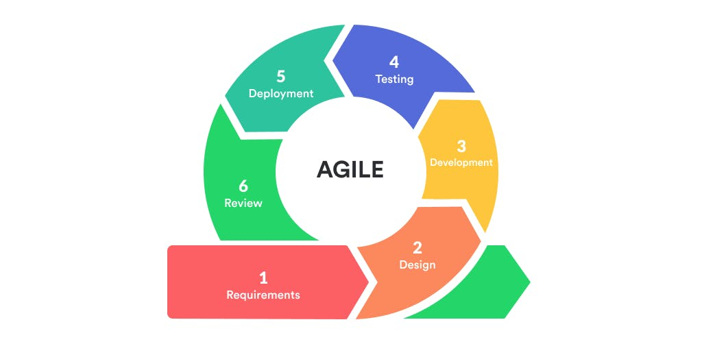
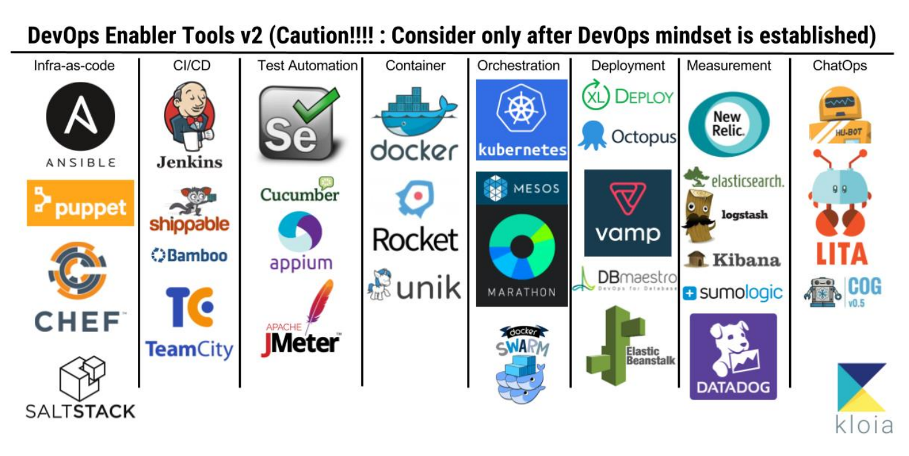
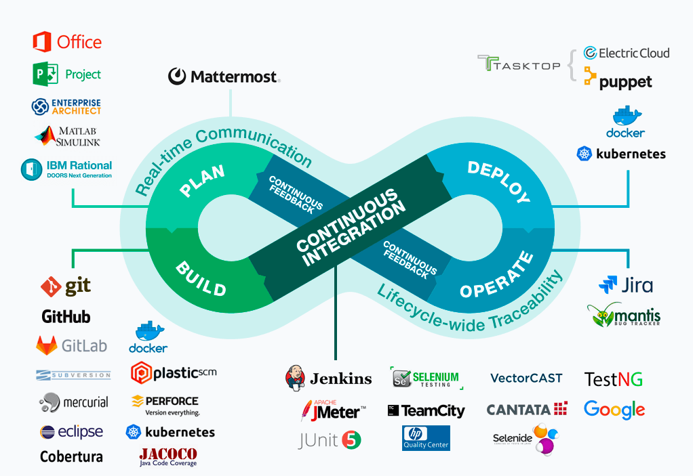

# 🔃 Agile&Waterfall+CICD+Devops

### 📚 table of contents

> Agile & Waterfall

> Devops

> CICD

 

## 🔃 Agile & Waterfall

___초기 소프트웨어 개발 방법은 계획 중심의 프로세스___
 

현재는?

소프트웨어 분야가 넓어지면서 소프트웨어 사용자 = 일반 대중 으로 트렌드가 변화했다. 거의 대부분의 사람들이 SW를 사용하는 대상으로 되면서 비즈니스 사이클(제품의 수명)이 짧아졌고 이에 따라 SW 개발의 불확실성이 높아지게 되었다.

 

### Agile
> Agile methodology is a practice that helps continuous iteration of development and testing in the software development process.

> 행동이 민첩한, 날렵한, 생각이 기민한, 재빠르게 개발하는 기법..

> 

애자일 방법론은 빠르게 변화하는 시장에서 합리주의 또는 테일러 경영방식으로 대변되는 기존의 성과 관리를 대체할 수 있는 대안으로 각광받고 있다. 
__기획 -> 개발 -> 출시__ 와 같은 개발주기를 `스프린트`라고 하는데 여러 스프린트를 거치며 고객의 요구와 환경에 맞게 개선한다.
 

애자일의 핵심은 ___협력___ + ___피드백___ 이다.

#### 협력
소프트웨어를 개발한 사람들 안에서의 협력을 말한다.

#### 피드백
학습의 가장 큰 전제조건은 피드백이다. 내가 어떻게 개발을 했고 과정 및 결과에 대한 확인을 통해 학습을 진행해야한다. 소프트웨어의 불확실성이 높을수록 학습의 중요도는 올라간다.

> ___그래서 Agile이 무엇인가?___

#### Agile 방법론의 특징
- 피드백 -> 재설계 -> 피드백 -> 재설계의 방식
- 목표를 제시하는 사람이 리더가 된다 -> 목표 리더쉽
- 무한베타버전(지속적 개선) : 출시 -> 개선 -> 출시 -> 개선의 프로세스
- 단순히 교육만으로 바뀔 수 없음.
- 사람을 발상과 변화의 주체로 보는 방식
- How & Whatever

#### Agile 조직문화의 특징
- 계획세우기에 과도한 시간과 비용을 투입하지 않는다.(우리와 다른거같습니다.)
- 권한을 고객접점에 있는 조직과 구성원에게 상당부분 위임한다.
- 민첩하면서도 효과적인 의사결정이 이루어진다.
- 정보가 모두에게 높은 수준으로 공유된다.
- 애자일 경영은 결코 빠른속도나 저렴한 비용을 뜻하는 것이 아니다.

 

### Waterfall

> 폭포수는 위에서 아래로 흐르며 아래에서 위로 다시 거슬러 올라갈 수 없다.

> Waterfall Model followed in the sequential order, and so project development team only moves to next phase of development or testing if the previous step completed successfully.

> 

소프트웨어를 개발하는데 있어서, 각 단계가 위에서 아래로 물이 떨어지는 것처럼 순차적으로 진행되며 완료된 단계에서는 다시 처음으로 되돌리기 어려운 방법론이다.
Waterfall 방법론은 크게 __요구사항분석->설계->구현->테스트->유지보수__ 로 나눌 수 있다. 폭포수라는 말 그대로 폭포에서 물이 떨어지는 것처럼 ___위에서 아래 단계로 순차적으로 각 단계가 진행___ 된다.
이때 여러 단계가 병렬적으로 진행된다거나 역으로 진행되는 경우는 없다. 또한 단계가 나눠져 있기 때문에 waterfall model의 순서를 따르는 프로젝트는 이전 단계가 완료 되어야 다음 단계를 개발한다.

#### Waterfall 방법론의 특징
- 체계화된 문서를 바탕으로 안정적으로 진행함.
- 사용자와의 의사소통이 적음.
- 요구사항 분석과 타당성 검토에서 많은 시간을 소요한다.
- 다양한 개별 업무 시스템을 사용한다.
- 관리가 용이하다.
- 목표물이 과정이 후반부에 가시화되는 특징이 있음

 

### Agile Vs. Waterfall +/-
|비교|Agile|Waterfall|
|----|-----|---------|
|+|사용자 중심의 프로세스이다. 사용자가 매 단계마다 지속적으로 연루될 수 있음.|가장 관리하기 쉬운 모델중에 하나이다. 왜냐하면 waterfall의 특성상 각단계를 세부적으로 전달하며 review과정이 있기 때문이다.|
|+|agile 방법론을 이용하는 팀은 명확한 동기가 있다.|모든 프로세스와 결과는 문서화되어 있다.|
|+|agile한 소프트웨어 개발 방법론은 양질의 개발을 유지할 수 있게 한다.|새로운 팀원이 와도 쉽게 적응할 수 있다.|
|+|소규모 팀들이 여러과제를 가각 할당받아 처리 가능|요구사항이 정의되어 있기 때문에 실행하기가 수월하고 목표를 자주 변경하지 않아도 된다.|
|+|개발과정중에 신속하게 제품 변경 가능|필요한 예산과 자원이 초기에 확정되기 때문에 예상결과와 리스크를 통제하기 어렵다|
|-|빠른 반복 작업에 익순한 숙련된 사람이 요구됨|개발속도 더디고 유연성이 부족함|
|-|수많은 변경사항이 있을 수 있으므로 번거로움 발생 가능|개발 요구사항이 초기에 정해지기 때문에 변경이 자유롭지 못하다.|
|적합한 조직|고품질의 결과물과 지속적 개선에 초점을 맞춘 조직|순차적인 프로젝트 타임라인 사전 확정 예산이 필요한팀|
|적합한조직|크고 복잡한 회사들이 프로세스를 간소화함으로써 변화에 신속댕으 하고자 할 때|개발상의 변경이나 리스크에 덜 민감한 팀|
|적합한 조직|결과물에 대해 빠른 피드백이 필요한 팀|요구사항이 간단한 팀, 타임라인이 긴 프로젝트|

 

정리하면 agile모델을 사용하게 된 이유는 waterfall 모델이 엉터리라는 것을 발견한 다음에 개선해보려는 시도이고 원래의 방법론이 잘못된 것이므로 agile도 한계점이 존재한다. 그에 대한 이유는 철학적인 방법론을 찾지 못해서가 아니라 당시의 개발 기술을 먼저 염두에 두고 개발 방법론을 구색을 갖춘것에 불과하다.(개발 기술 -> 개발 방법론)
결론은 구현 기술을 근거로 개발 방법론을 만드는 것은 엉터리이다.

## 🔃 DevOps & CICD

### Devops
> Development + operations => DevOps

소프트웨어 제품과 서비스를 빠른 시간에 개발 및 배포하는 것이다. 소프트웨어 제품이나 서비스를 알맞은 시기에 출시하기 위해 개발과 운영이 상호의존적으로 대응해야 한다는 의미로 많이 사용하고 있다.
DevOps의 개념은 애자일 기법과 CICD 개념과 연관이 있다. 애자일 기법은 실질적인 코딩을 기반으로 일정한 주기에 따라 지속적으로 프로토타입을 형성하고, 필요한 요구사항을 파악하며 이에 따라 즉시 수정사항을 적용하여 결과적으로 하나의 큰 소프트웨어를 개발하는 방법이고 자속적 통합은 통합 작업을 초기부터 계속 수행해서 지속적으로 소프트웨어의 품질제어를 적용하는 것이다.

#### How DevOps Works?
1. Continuous Development
    - Version control - git, SVN
    - Automatic builder/packager to executavles - Maven, Ant, Gradle
2. Continuous Testing - Selenium
3. Continuous Deployment - 실행 파일을 특정 서버 (testing or production server)dp qovh
    - Containerization (vs. VM) - Docker + Docker Swarm
    - Configuration management - puppet, Ansible
4. Continuous Monitoring - 네트워크 모니터링과 배포된 소프트웨어의 버그 및 사용자로부터의 feedback 수집 - Nagios
5. Continuous Integration - 위 모든 SW lifcycle의 도구들을 연합하고 연속적이고 자동ㅈ거으로 각 작업이 수행되도록 함, 모든 위 도구들과 연동
    - Jenkins (300개 이상의 plug-in 존재)
    - Kubernetes - Docker container orchestration manager (vs. docker swarm)

 

### CICD
> CICD 파이프라인은 새 버전의 소프트웨어를 제공하기 위해 수행해야 할 일련의 단께입니다. 지속적 통합/지속적 배포(CI/CD) 파이프라인은 DevOps 방식을 통해 더 효과적으로 소프트웨어를 제공하는 데 초점을 맞춘 방법이다.

> 

CI/CD는 기술이 아니다. 개발 팀 문화적인 것이며 CICD 파이프라인은 더 자주 더 신뢰성 높은 수정된 코드를 deploy할 수 있도록 DevOps 팀이 SW를 구현하는 방법론으로서 현재로서는 가장 추구되는 실제 개발 행위며 팀 문화이다. DevOps 도구를 사용하면 CI/CD를 수행하는 것과 같다.

#### CI, Continuous Integration 지속적인 통합
> 현대적인 애플리케이션 개발에서는 여러 개발자들이 각기 다른 기능을 동시에 작업하기를 원한다. 특정한 날을 정해서 모든 소스코드를 병합하게 되면 결과적으로 시간 소모가 크며 독립적으로 작업하는 개발자가 애플리케이션 변경사항을 적용할 때 다른 개발자가 동시에 적용하는 변경사항과 충돌 가능성이 있다.

#### CD, Continuous Deployment 지속적인 배포
> 개발자들이 애플리케이션에 적용한 변경사항이 버그테스트를 거쳐 레포지토리(Github)에 실시간 자동 업로드 되는 것을 뜻하고 운영팀은 이 레포지토리에서 애플리케이션을 실시간 프로덕션 환경으로 배포할 수 있다.

  

## 📚 참고

[agile](https://brunch.co.kr/@lucy5016/8)

[agile&waterfall](https://www.guru99.com/waterfall-vs-agile.html)

## ⁉️ 면접 예상 질문