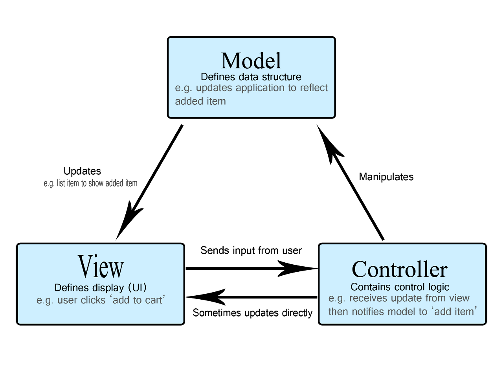
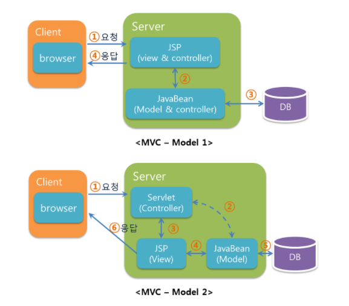

# MVC, MVVM 패턴

> MVC

> MVVM

 
디자인 패턴이란 프로그램이나 어떤 특정한 것을 개발하는 중에 발생했던 문제점들을 정리해서 상황에 따라 간편하게 적용해서 쓸 수 있는 것을 정리하여 특정한 "규약"을 통해 쉽게 쓸 수 있는 형태로 만든 것을 말합니다. 

 

# MVC
> Model-View-Controller

어플리케이션을 세 개의 영역으로 분할하고 각 구성 요소에게 고유한 역할을 부여하는 개발 방식입니다. 
MVC 패턴을 도입하면 도메인(비즈니스 로직) 영역과 UI 영역이 분리되므로 서로 영향을 주지 않고 유지보수가 가능합니다. 

## Model
프로그램에 사용되는 데이터를 의미하며 데이터베이스(DB), 상수, 문자열과 같은 변수들, 비전 프로그램이라면 카메라 정보와 같은 것들이 해당됩니다. 모델에는 뷰나 컨트롤러의 정보가 전혀 없습니다. 단지, 정보만 반환하거나 설정할 수 있습니다.

## View
텍스트박스, 라벨, 버튼 등 사용자 인터페이스(User interface) 요소들을 의미합니다. 사용자가 제어하고 데이터를 확인할 수 있는 영역입니다. 뷰에서는 별도의 데이터를 보관하지 않습니다. 뷰에서 입력받고 출력해주는 모든 데이터는 모델을 사용해야합니다.

## Controller
모델과 뷰를 관장하는 브릿지(Bridge)역할을 수행합니다. 사용자가 버튼을 클릭하면 이벤트는 뷰에서 발생하지만 내부 처리는 컨트롤러에서 관리하는 것입니다. 또한, 입력이 발생하면 이에 대한 통지를 담당합니다.

model 1은 컨트롤러와 뷰를 같이 구현하는 방식입니다. 
빠르고 쉬운 개발이 가능하지만, 컨트롤러와 뷰의 코드가 섞여있어 유지보수가 어렵다는 단점이 있습니다.

model 2는 유지보수가 어렵고, 코드를 알아보기 힘들다는 model 1의 단점을 보완하기 위해 컨트롤러와 뷰를 분리해서 구현하는 방식이다. 작업 시간은 model 1보다 길어지지만, 추후에 프로그램이 커지고 유지보수가 필요할 때는 model 2 방식이 더 유리합니다.

 

- Process

    1. Controller로 사용자의 입력이 들어온다.

    2. Controller는 Model의 데이터를 업데이트 및 읽어온다.

    3. Model은 해당 데이터를 보여줄 View를 선택해서 화면에 보여준다.

 

## MVC 패턴을 사용하는 이유
> 짧게 말하면 __효율적인 개발 및 유지보수를 위해서__ 라고 할 수 있습니다.

사용자가 보는 View, Model, 이를 제어하는 Controller로 각각 분리하여 프로그램을 개발하면, 중복개발되는 부분을 방지할 수 있어 개발시 효율성이 증대될 뿐 만 아니라, 추후 프로그램의 유연한 확장성을 가질 수 있으며, 어떠한 부분에서 문제가 발생하더라도 다른 부분에 최소한의 영향을 주며 변경할 수 있습니다.

 

## 단점
Controller가 Model과 View에 대한 모든 처리를 담당하고 있기 때문에 어느선까지는 효율적인 관리가 가능하지만 프로그램이 복잡하고 무거운 대규모 프로젝트에서는 Controller에서 업무가 과중될 수 있습니다.

개발과 유지 보수가 용이하도록 설계한 모델이지만 일정 수준이상의 복잡한 프로젝트에서는 수정시 테스트가 힘들고 하나의 수정이 다른 부분에 영향을 미치는 등 역효과가 날 수 있습니다.

## 한계
모델과 뷰를 완전히 분리하기가 어렵다는 점이다. 이는 코드가 복잡해지고, 설계시간이 길어지는 원인이 됩니다. -> MVVM, MVP 등의 등장

 

# MVVM
> Model-View-ViewModel 

## Model
앞서 말한 MVC 모델과 역할이 같습니다.

## View
클라이언트에서 발생하는 이벤트, 액션은 View가 직접 처리합니다. 액션에 따라 ViewModel에 데이터 업데이트를 요청합니다. DataBinding으로 ViewModel의 변경사항을 반영합니다.

## ViewModel
View만을 위해 정제된, 가공된 데이터를 제공하는 Model입니다. 외부에서 데이터 업데이트 명령을 받으면 데이터를 가공, 처리하여 Model로부터 새로운 데이터를 얻어옵니다. 얻어온 데이터를 다시 가공하여 가지고 있습니다.

 

- Process

    1. View에 입력이 들어오면 Command 패턴으로 ViewModel에 명령함.

    2. ViewModel은 Model에 필요한 데이터 요청.

    3. Model은 ViewModel에 필요한 데이터 응답.

    4. ViewModel은 응답받은 데이터를 가공해서 저장.

    5. View는 ViewModel과 Data Binding으로 인해 자동으로 갱신.

 

MVVM 모델의 핵심은 DataBinding입니다. 기존의 MVC와는 다르게 View가 직접 ViewModel로부터 DataBinding을 통해 데이터를 가져옵니다.

- DataBinding: 데이터가 변경되었을 때 View에 메서드로 수정된 데이터를 반영하는 것이 아니라 데이터만 변경해도 자동으로 View에 반영이 될 수 있도록 해 주는 것.

 

## 장점
Model에 의존성이 없는 View, View와 비즈니스 로직의 철저한 분리.

테스트가 수월해진다. (의존성이 없기 때문)

뷰와 뷰모델이 1:n 관계이기 때문에 중복되는 로직을 모듈화 해서 여러 뷰에 적용할 수 있다. (코드 재사용 가능)

## 단점

설계하기가 복잡하다. (데이터 바인딩에 대한 지식 필요)

뷰모델이 비대해질 수 있다.

데이터 바인딩으로 인한 메모리 소모가 심하다.

 

### 📚 참고

[MVC 1](https://junhyunny.github.io/information/design-pattern/mvc-pattern/)

[MVC 2](https://myprivatestudy.tistory.com/41)

[MVC/MVVM 1](https://velog.io/@addiescode/%EB%94%94%EC%9E%90%EC%9D%B8-%ED%8C%A8%ED%84%B4-MVC-MVVM)

[MVC/MVVM 2](https://colinch4.github.io/2020-12-03/interview-4/)
 

***

## Summary

***

 

# ⁉️ 면접 예상 질문

> 1. MVC 디자인 패턴에 대해 알고 있나요?

> 2. MVC 패턴을 사용할 때 문제점은 없나요?

> 3. MVC 패턴의 문제점을 어떤식으로 개선할 수 있나요?

