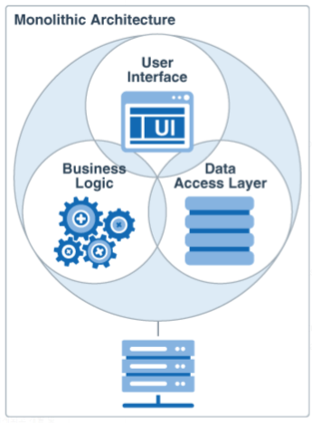

# Microservice Architecture (MSA)

> 모놀리식(Monolithic) 아키텍쳐  
마이크로서비스(Microservice) 아키텍쳐  
모놀리식 vs 마이크로서비스
> 

마이크로서비스 아키텍쳐를 이해하기 위해서 모놀리식 아키텍쳐가 무엇이고, 모놀리식에서 마이크로서비스 아키텍쳐로 전환되어 가는 이유가 무엇인지 알아야 한다.

<br/>

# *모놀리식 아키텍쳐*




`Monolithic : 단단히 짜여 하나로 되어 있는`
> 모놀리식 아키텍쳐란?
> 

프로젝트의 모든 기능이 단일 codebase에 존재하는 아키텍쳐를 `모노리식 아키텍쳐` 라고 한다.

- UI/비지니스 로직/데이터베이스 엑세스 로직이 모두 하나의 애플리케이션 산출물로 패키징되고 애플리케이션 서버에 배포되는 것을 말한다.

<br/>

> 모놀리식 아키텍쳐의 단점 : 마이크로서비스 아키텍쳐로 전환하는 이유
> 

애플리케이션에 `유저 관리` , `상품 결제` , `페이지 UI` 기능이 있다고 가정해보자.

- 시간이 지날수록 애플리케이션의 크기가 너무 커져 관리하기 어려워진다.
- 신규 개발자가 프로젝트에 참여할 경우, 모놀리식 어플리케이션의 구조를 이해하기 매우 힘들다
- 애플리케이션에 특정 계층(`유저 관리`)만 업데이트하여도 전체를 재배포해야 한다.
- 애플리케이션의 한 부분(`상품 결제`)에서 서버 부하가 발생하여 Scaling out이 필요한 경우, 전체 애플리케이션(`유저 관리, 상품 결제, 페이지 UI`) 인스턴스를 여러 서버에 배포해야한다.
    
    → 자원낭비가 매우 심하기 때문에 모놀리식 애플리케이션에서 Scaling out이 불가능하다
    
- 특정 모듈(`유저 관리`)에서 버그가 발생하더라도 전체 애플리케이션에 영향이 미친다.

<br/>

> 모놀리식 아키텍쳐의 장점
> 
- 단일 JAR/WAR 파일만 배포하기 때문에 배포 과정이 간단하다
- 네트워크 지연/보안 문제가 마이크로서비스 아키텍쳐보다 상대적으로 적다
- End-to-End 테스트가 용이하다

<br/>

# *마이크로서비스 아키텍쳐*


> 마이크로서비스 아키텍쳐란?
> 

`마이크로서비스 아키텍쳐(MSA)` 란 애플리케이션이 작은 서비스들로 구성되는 아키텍쳐이다. 각각의 서비스들은 HTTP와 같은 경량 프로토콜을 이용하여 직접 서로 통신한다.

<br/>

> 마이크로서비스 : DB = 1 : 1
> 

`느슨한 결합`

마이크로 서비스들은 각자 자신들만의 데이터베이스를 가지고 있다. 그렇기 때문에 일부 데이터가 중복되지만 **느슨한 결합(Coupling)을 보장한다는 장점**이 있다. 따라서 MSA의 이점을 얻기 위해 마이크로서비스 당 하나의 데이터베이스를 보유하는 것이 필수적이다.

`서비스에 적합한 데이터베이스 유형`

마이크로 서비스당 별도의 데이터베이스를 보유하기 때문에 **서비스의 특징에 따라 적합한 유형의 데이터베이스를 사용**할 수 있다. 

- 검색용 서비스에 Elasticsearch를 사용하여 검색 속도를 높히고, 객체간의 관계가 중요한 서비스에서는 RDB를 사용할 수 있다.

<br/>

> 마이크로서비스 원리
> 
1. `단일 책임 원칙 (SRP)`
    
    SOILD 원칙중 하나로 클래스, 메소드, 마이크로서비스 등과 같은 하나의 단위가 하나의 책임만 진다는 원칙이다. 다르게 말하면, 개발해야 할 마이크로서비스의 개수는 필요한 기능의 수와 동일하다고 볼 수 있다.
    
    - 각 마이크로서비스마다 독립된 데이터베이스를 보유하는 것이 단일 책임 원칙에 따른 것으로 볼 수 있다.
2. `비지니스 기능을 기반으로 서비스 구축`
    
    각 마이크로서비스는 비지니스 요구사항에 따라 서로 다른 기술을 사용할 수 있다.
    
    - 서비스의 특징에 따라 개발 언어, 데이터베이스 유형 등을 달리할 수 있다는 의미이다.
3. `실패에 대한 설계`
    
    하나의 마이크로 서비스가 다운되어도 전체 시스템에 영향을 미치지 않아야 하고, 다른 서비스들은 정상적으로 운영될 수 있다.
    

<br/>

> SOA(Service Oriented Architecture) vs 마이크로서비스 아키텍쳐
> 

`SOA`

단일 아키텍쳐의 문제를 해결하기 위해 등장한 아키텍쳐이다. 하나의 큰 애플리케이션을 독립적인 소규모 서비스들로 분할한다. 하지만 각각의 소규모 서비스들은 서로 직접적으로 소통하지 않고, ESB(Enterprise Service Bus)를라는 미들웨어를 통해 소통한다.

- ESB : 서로 다른 프로토콜이나 메시지 표준을 사용하는 서비스들간의 소통을 도와주는 미들웨어 또는 서버

`MSA`

마이크로서비스 아키텍쳐는 SOA의 진화이다. 즉 MSA는 SOA의 하위 개념이며 각 마이크로 서비스들은 ESB와 같은 미들웨어 없이 서로 직접 통신할 수 있다.

<br/>

> 마이크로서비스의 장점
> 
- 각각의 서비스들을 분할했기 때문에 규모가 작아 관리가 용이하다.
- 새로운 개발자는 자신이 작업할 기능을 제공하는 특정 마이크로 서비스만 이해하면 되기 때문에 프로젝트 참여가 수월하다
- **마이크로 서비스 중 업데이트가 있다면, 해당 마이크로 서비스만 재배포하면 된다.**
- 특정 마이크로 서비스에 부하가 발생하면, **해당 마이크로 서비스만 Scaling out할 수 있다.**
- **마이크로 서비스들은 비지니스 요구사항에 따라 서로 다른 기술을 상용할 수 있다.**
- **특정 마이크로 서비스가 다운되어도, 다른 마이크로 서비스에 영향을 미치지 않는다.**

<br/>

> 마이크로서비스의 단점
> 
- 분산형 시스템이기 때문에 **모놀리식 아키텍쳐보다 관리가 힘들고 복잡하다**
- 마이크로 서비스들 끼리 상호 작용해야하기 떄문에 통신이 많아진다. 통신이 많아지면 네트워크가 지연되고 비용이 많이들고 **통신 오류가 잦아져 안정성이 떨어진다.**
- End-to-End 테스트를 위해 여러개의 마이크로 서비스를 구동시켜야 하므로 **테스트 과정이 불편하다.**

<br/>

# *모놀리식 vs 마이크로서비스*


<br/>

# +

```java
이전 회사에서 마이크로서비스 환경으로 개발을 하였고,
현재 회사에서는 모놀리식 아키텍쳐로 개발되어있는 프로젝트에 투입되어있는데
개인적으로는 마이크로서비스가 개발에 조금더 용이한 것 같다.

가장 큰 이유는
매 주마다 새로운 기획안과 수정요청이 생기는데 조그마한 변경사항에도 전체를 다시 빌드하고 배포를 해야하니
부담이되고 한 기능을 수정하였는데 잘못된 부분이 있어 전체가 오류가 생기는 경우도 있었다. 
따라서 모든 기능을 다시 테스트를 하고 배포가 되는데 이것 또한 부담이었다.

처음부터 마이크로 서비스로 개발하는 것은 모놀리식 아키텍쳐의 개발방식보다 불편한 것은 확실하다.
하지만 빠르게 변화해야하는 IT 서비스 시장에서 발 맞춰 개발하려면 마이크로 서비스를 선택하는것이 좋을것이다.
```

MSA를 도입하는데 있어서 분명한 ROI(Return Of Investment, 투자 대비 효과)가 있어야 한다.

모놀리식에서 마이크로서비스 아키텍쳐로 전환하기 위해서 Application 단에서부터 Infra 까지 수정해야한다. 수정 작업만으로도 매우 부담스럽고 이후 마이크로 서비스들을 관리하는 것도 까다롭다. 

하지만 배포가 빈번한 기능이 한정되어 있고, 특정 서비스에 scaling out이 필요한 경우 MSA를 도입하므로써 고질적인 문제가 해결될 수 있다.

(현재 `Netflix`와 `배달의 민족` 에서 MSA로 서비스를 제공하고 있다.)

<br/>

# 참조

[https://www.geeksforgeeks.org](https://www.geeksforgeeks.org/monolithic-vs-microservices-architecture/)

[https://lion-king.tistory.com](https://lion-king.tistory.com/entry/%EB%A7%88%EC%9D%B4%ED%81%AC%EB%A1%9C-%EC%84%9C%EB%B9%84%EC%8A%A4-vs-%EB%AA%A8%EB%86%80%EB%A6%AC%EC%8B%9D-%EC%95%84%ED%82%A4%ED%85%8D%EC%B2%98-MicroService-vs-Monolithic-Architecture-%EA%B0%84%EB%8B%A8-%EC%86%8C%EA%B0%9C-%EB%B0%8F-%EC%A3%BC%EA%B4%80%EC%A0%81-%EC%9D%98%EA%B2%AC)

[https://www.youtube.com/watch?v=dSGnJWHuxtQ](https://www.youtube.com/watch?v=dSGnJWHuxtQ)

[https://ssungkang.tistory.com](https://ssungkang.tistory.com/entry/MSA-Monolithic-Architecture-VS-Micro-Service-Architecture)

[https://shaul1991.medium](https://shaul1991.medium.com/%EC%B4%88%EB%B3%B4%EA%B0%9C%EB%B0%9C%EC%9E%90-%EC%9D%BC%EC%A7%80-%EB%8C%80%EC%84%B8-msa-%EB%84%88-%EB%AD%90%EB%8B%88-efba5cfafdeb)

**[[우아콘2020] 배달의민족 마이크로서비스 여행기](https://www.youtube.com/watch?v=BnS6343GTkY)**

<br/>

# 면접 예상 질문

> MSA가 무엇인가요?

> 왜 MSA를 사용하나요?

> 본인은 어떤 아키텍쳐로 프로젝트를 개발하였나요? 그 이유는?
