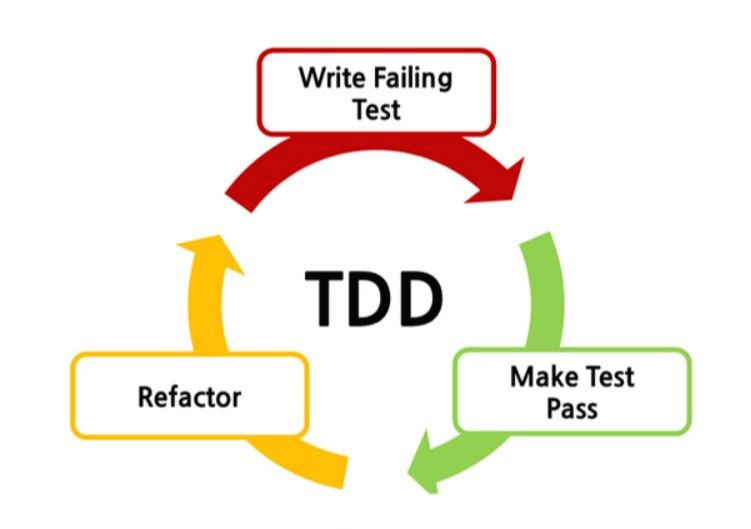
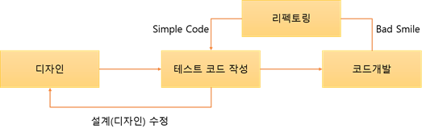

# TDD

## TDD란 무엇인가?
> 테스트 주도 개발

**Test Driven Development**의 약자로 **테스트 코드를 먼저 만들고, 실제 프로덕션 코드를 나중에 만드는 개발 방법**을 말한다. 

반복 테스트를 이용한 소프트웨어 방법론으로, **작은 단위의 테스트 케이스**를 작성하고 이를 통과하는 코드를 추가하는 단계를 반복하여 구현한다. 

짧은 개발 주기의 반복에 의존하는 개발 프로세스이며 애자일 방법론 중 하나인 `eXtream Programming(XP)의 Test-First`개념에 기반을 둔 단순한 설계를 중요시한다. 

> eXtream Programming(XP)
> 미래에 대한 예측을 최대한 하지 않고, 지속적으로 프로토타입을 완성하는 애자일 방법론 중 하나이다. 이 방법론은 추가 요구사항이 생기더라도 실시간으로 반영할 수 있다.


## TDD를 사용하는 이유?

**먼저 test code를 사용했을 때의 장점**
- 변화에 대한 두려움을 줄여준다.(리팩토링이 편하다.)
- 디버깅 시간을 줄여준다.
- 동작하는 문서 역할을 한다.

## TDD 개발 주기



위 그림은 TDD의 개발 주기를 표현한 것이다.

- **Red**
    - `실패하는 테스트 코드`를 먼저 작성한다. 
- **Green**
    - `테스트 코드를 성공시키기 위한 실제 코드`를 작성한다. 
- **Yellow**
    - 중복 코드 제거, 일반화 등의 `리팩토링을 수행`한다. 


> 중요한 것은!
> 실패하는 테스트 코드를 작성할 때까지 실제코드를 작성하지 않는다.
> 실패하는 테스트를 통과할 정도의 최소 실제 코드를 작성해야 한다. 
> 이를 통해 실제 코드에 대해 기대되는 바를 명확하게 정의함으로써 불필요한 설계를 피할 수 있고, 정확한 요구 사항에 집중할 수 있다.

## 일반 개발 방식 vs TDD 개발 방식

🚩 **일반 개발 방식**


보통의 개발 방식은 **요구사항 분석 -> 설계 -> 개발 -> 테스트 -> 배포**의 개발 주기를 갖는다.
이러한 방식은 소프트웨어 개발을 느리게 하는 잠재적 위험이 존자한다. 

이유)
- 소비자의 요구사항이 처음부터 명확하지 않을 수 있다.
- 따라서 처음부터 완벽한 설계는 어렵다.
- 자체 버그 검출 능력 저하 또는 소스코드의 품질이 저하될 수 있다.
- 자체 테스트 비용이 증가할 수 있다. 

이러한 문제점들이 발생되는 이유는 간단히 어느 프로젝트는 초기 설계가 완벽하다고 말할 수 없기 때문이다. 

작은 부분의 기능 수정에도 모든 부분을 테스트해야 하므로 전체적인 버그를 검출하기 어려워진다.


🚩 **TDD 개발 방식**



TDD와 일반적인 개발 방식의 가장 큰 차이점은 **테스트 코드를 작성한 뒤에 실제 코드를 작성**한다는 점이다.

디자인(설계)단계에서 프로그래밍 목적을 미리 정의해야하고, 또 무엇을 테스트해야 할지 미리 정해야만 한다.

테스트 코드를 작성하는 도중에 발생하는 예외 사항(버그, 수정사항)들은 테스트 케이스에 추가하고 설계를 개선한다. 이후 테스트가 통과된 코드만을 개발 단계에서 실제 코드로 작성한다.

## TDD의 대표적인 Tool `JUnit`

### Junit
현재 세계적으로 가장 널리 사용되는 `Java 단위 테스트 프레임 워크`이다. 
JUnit을 시작으로 CUnit(C언어), CppUnit(C++), PyUnit(Python) 등 xUnit 프레임워크가 탄생하게 되었다. 


### TDD 개발 방식의 장점
-  보다 튼튼한 객체 지향적인 코드 생산
    - TDD는 코드의 재사용 보장을 명시하므로 TDD를 통한 소프트웨어 개발 시 기능 별 철저한 모듈화가 이뤄진다. 이는 종속성과 의존성이 낮은 모듈로 조합된 소프트웨어 개발을 가능하게 하며 필요에 따라 모듈을 추가하거나 제거해도 소프트웨어 전체 구조에 영향을 미치지 않게 된다.
- 오베엔지니어링 방지
    - TDD를 하면 요구사항에 맞춰 개발 코드를 구현하니 필요한 만큼만 코딩을 할 수 있다.
    - 미래에 필요할 것 같은 코드 구현 (X)
-   재설계 시간의 단축 
    - 테스트 코드를 먼저 작성하기 때문에 개발자가 지금 무엇을 해야하는지 분명히 정의하고 개발을 시작하게 된다. 또한 테스트 시나리오를 작성하면서 다양한 예외사항에 대해 생각해볼 수 있다. 이는 개발 진행 중 소프트웨어의 전반적인 설계가 변경되는 일을 방지할 수 있다.
- 디버깅 시간의 단축
    - 이는 유닛 테스팅을 하는 이점이기도 하다. 예를 들면 사용자의 데이터가 잘못 나온다면 DB의 문제인지, 비즈니스 레이어의 문제인지 UI의 문제인지 실제 모든 레이러들을 전부 디버깅 해야하지만, TDD의 경우 자동화 된 유닛테스팅을 전재하므로 특정 버그를 손 쉽게 찾아낼 수 있다. 
- 설계에 대한 피드백이 빠르다.
    - 설계를 잘못했을 때 보통 변경이 일어나거나 사용하기 어려울 때 깨닫게 된다. 
    - 테스트 코드를 작성하는데 복잡하고 잘못된 설계를 가지고 있을 경우 점점 더 테스트 코드를 작성하기 어려워진다. 
- 추가 구현의 용이함
    - 개발이 완료된 소프트웨어에 어떤 기능을 추가할 때 가장 우려되는 점은 해당 기능이 기존 코드에 어떤 영향을 미칠지 알지 못한다는 것이다. 하지만 TDD의 경우 자동화된 유닛 테스팅을 전제하므로 테스트 기간을 획기적으로 단축시킬 수 있다.

### 이러한 장점들이 있는데 모두가 이 프로세스를 사용하지 않는 걸까??

## TDD 개발 방식의 단점 
- 가장 큰 단점은 바로 생산성의 저하이다. 

    - 개발 속도가 느려진다고 생각하는 사람이 많기 때문에 TDD에 대해 반신반의 한다.
    - 왜냐하면 처음부터 2개의 코드를 짜야하고, 중간중간 테스트를 하면서 고쳐나가야 하기 때문이다.
    - TDD 방식의 개발 시간은 일반적인 개발 방식에 비해 대략 10~30% 정도로 늘어난다. 
    - SI 프로젝트에서는 소프트웨어의 품질보다 납기일 준수가 훨씬 중요하기 때문에 TDD 방식을 잘 사용하지 않는다.


### TDD는 설계 방법론이다?
**이규원님의 말**
- TDD는 높은 응집을 유도하지 않는다.
- TDD는 단일 책임 원칙과 인터페이스 분리 우너칙 위배에 어떤 신호도 주지 않는다.
- TDD는 인터페이스 일관성을 도출하지 않는다.
- TDD의 리팩토링 단계는 좋은 구조를 안내하거나 좋은 구조를 갖도록 강제하지 않는다.

-> TDD가 설계에 영향을 미치지 않지는 않지만 설계 방법론은 아니다.

> 전적으로 TDD에만 의존하게 된다면 테스트만 하기 좋은 안좋은 설계가 만들어질 수 있다. 

## TDD로 구현한 예제
덧셈 기능을 TDD로 구현해보자!

```java
public class CalculatorTest {

  @Test
  void plus() {
    int result = Calculator.plus(1, 2);
    Assertions.assertEquals(3, result);
  }
}
```
작성 흐름은 다음과 같습니다.

1. 덧셈 기능을 제공할 클래스, 메서드, 파라미터, 반환 타입에 대해 고민하고 int result = Calculator.plus(1,2) 코드를 작성합니다.

2. assertEquals 메서드를 사용해 예상 값과 실제값을 비교합니다.

3. 구현한 코드가 없으니 당연하게도 코드에 컴파일 에러가 발생합니다.

4. 다음과 같이 Calculator 클래스와 plus 메서드를 작성합니다

```java
public class Calculator {

  public static int plus(int a, int b) {
    return 0;
  }
}
```
5. 테스트를 실행합니다. 예상값과 실제값이 다르니 테스트는 실패합니다.

6. 테스트를 통과할 수 있도록 구현 코드를 고칩니다.

```java
public class Calculator {

  public static int plus(int a, int b) {
    return 3;
  }
}
```
7. 테스트가 통과합니다. 그럼 새로운 테스트를 작성합니다.

```java
public class CalculatorTest {

  @Test
  void plus() {
    int result = Calculator.plus(1, 2);
    Assertions.assertEquals(3, result);
    Assertions.assertEquals(5, Calculator.plus(2, 3));
  }
}
```

8. 테스트는 실패하게 되며, 통과할 수 있게 구현 코드를 변경합니다.

```java
public class Calculator {

  public static int plus(int a, int b) {
    return a + b;
  }
}
```
모든 예외 사항과 기능을 한 번에 구현하기 어렵고, 완성된다고 해도 테스트에 실패할 확률이 높습니다. 그러면 디버깅을 통해 문제점을 파악해야 하는데, 이러한 과정 속에서 개발자는 시간을 낭비하게 되고 코드의 품질도 떨어질 수밖에 없습니다.

따라서 위와 같이 TDD 방식을 사용해 테스트를 먼저 작성하고 테스트에 실패하면 테스트를 통과시킬 만큼 코드를 추가하는 과정을 반복하면 낭비되는 시간도 줄일 수 있고, 코드의 품질도 향상될 수 있습니다.

## 단위 테스트
> unit test: 하나의 모듈을 기준으로 독립적으로 진행되는 가장 작은 단위의 테스트

- 가장 작은 단위의 테스트
- 일반적으로 메서드 레벨
- 검증이 필요한 코드에 대해 테스트 케이스를 작성하는 절차 또는 프로세스
- Unit Testing은 테스트 코드가 목적 코드의 완전성을 입증 해주기 때문에, 테스트 코드 그자체만으로 주요한 가치가 있음

### 통합 테스트
통합 테스트(Integration Test)는 모듈을 통합하는 과정에서 모듈 간의 호환성을 확인하기 위해 수행되는 테스트이다.

일반적으로 애플리케이션은 여러 개의 모듈들로 구성이 되고, 모듈들끼리 메세지를 주고 받으면서(함수 호출) 기능을 수행한다. 그렇기에 통합된 모듈들이 올바르게 연계되어 동작하는지 검증이 필요한데, 이러한 목적으로 진행되는 테스트가 통합 테스트이다. 

그렇기에 통합 테스트는 독립적인 기능에 대한 테스트가 아니라 웹 페이지로부터 API를 호출하여 올바르게 동작하는 지를 확인하는 것이다.

### 단위 테스트(Unit Test) 작성의 필요성
> 단위 테스트는 해당 부분만 독립적으로 테스트하기 때문에 어떤 코드를 리팩토링하여도 빠르게 문제 여부를 확인할 수 있다.

- 테스팅에 대한 시간과 비용을 절감할 수 있다.
- 새로운 기능 추가 시에 수시로 빠르게 테스트 할 수 있다.
- 리팩토링 시에 안정성을 확보할 수 있다.
- 코드에 대한 문서가 될 수 있다.

TDD(Test-Driven Development, 테스트 주도 개발) 에서 얘기하는 테스트도 단위 테스트를 의미한다.

### FIRST 법칙
- F: Fast (빠르게)
    - 테스트는 빠르게 동작하여 자주 돌릴 수 있어야 한다.
- I: Independent (독립적으로)
    - 각각의 테스트는 독립적이며 서로 의존해서는 안된다.
    - 하나가 실패할 경우 다른 테스트도 실패하게 되어 원인을 찾기 어려워진다. 
- R: Repeatable (반복 가능하게)
    - 어느 환경에서도 반복 가능해야 한다. 
- S: Self-Validating (자가 검증하는)
    - 테스트는 Boolean 값으로 (성공/실패) 결과를 내어 자체적으로 검증되어야 한다. 
    - 그렇지않다면 판단을 보는 사람이 주관적으로 해야한다. 
- T: Timely (적시에)
    - 테스트는 적시에 즉, 테스트하려는 실제 코드를 구현하기 직전에 구현해야 한다.

# 참고

[TDD 정리](https://wooaoe.tistory.com/33)

[10분 테코톡: TDD와 단위테스트](https://www.youtube.com/watch?v=3LMmPXoGI9Q)

[TDD 구현 예제](https://github.com/alstjgg/cs-study/blob/main/%EA%B0%9C%EB%B0%9C%20%EC%83%81%EC%8B%9D/TDD%20%EB%9E%80%20%EB%AC%B4%EC%97%87%EC%9D%B4%EB%A9%B0%20%EC%96%B4%EB%96%A0%ED%95%9C%20%EC%9E%A5%EC%A0%90%EC%9D%B4%20%EC%9E%88%EB%8A%94%EA%B0%80.md)

[단위 테스트](https://mangkyu.tistory.com/143)

## 면접 질문

> 1. TDD가 무엇인가요?

> 2. TDD를 사용하면 장점이 무엇인가요?

> 3. 단위 테스트의 법칙은 무엇이 있을까요?