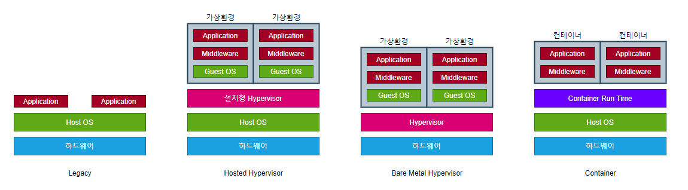
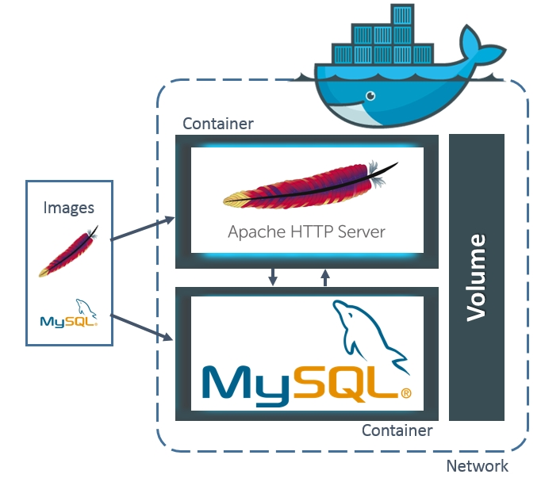

# Docker & Kubernetes

### 📚 Table of Content
> Docker

> Kubernetes

  

## 🐳 Docker
> 컨테이너 기반의 오픈소스 가상화 플랫폼
Docker란 Go 언어로 작성된 리눅스 컨테이너 기반으로하는 오픈소스 가상화 플랫폼이다. 
아래와 같은 플랫폼들에서 작동 가능하다.
- Linux
    - Ubuntu
    - CentOS
    - Debian
- Cloud
    - Azure
    - AWS
- Windows10
- MacOS
등등

 

> 

#### Legacy
- 하나의 물리 서버에 애플리케이션 배포
- 애플리케이션간 라이브러리나 미들웨어 버전의 충돌이 발생할 수 있음
 

#### Hosted Hypervisor(가상화 소프트웨어)
- Virtual Box, VMWare, Parallels와 같은 소프트웨어
- 호스트 OS웨어 가상화 소프트웨어를 설치해서 가상환경 구축
 

#### Bare Metal Hypervisor
- Hyper-v, XenServer, ESXI Server 등이 있다.
- Host OS 없이 하드웨어에 직접 하이퍼바이저를 설치
    - 하드웨어가 제어
    - 오버헤드가 비교적 적다
- 가상 머신들을 관리하기 위한 콘솔이 필요
 

#### Container
- Docker, containerd, CRI-O 등이 컨테이너 런타임으로 있음
- Guest OS가 없고 Host OS의 커널을 공유하여 오버헤드가 적고 가벼워 빠르다
    - 이식성과 확장성이 높다.

가상화 기술과 컨테이너 기술은 비슷하면서도 다르고 어느 하나가 더 좋다는 것은 없고 각각의 목적에 맞게 서로 다른 영역에서 사용되고 있다.
 

### 가상화를 사용하는 이유
컴퓨터의 성능을 더욱 효율적으로 사용하기 위해 가상화 기술이 많이 등장하였다. 서버 관리자 입장에서 CPU 사용률이 10%대 밖에 되지 않는 활용도가 낮은 서버들은 리소스 낭비일 수밖에 없다. 그래서 안정성을 높이며 리소스도 최대환 활용할 수 있는 방법으로 나타난게 서버 가상화이다. 대표적인 가상화 플랫폼으로는 VM이 있다. VM은 OS 가상화인데 그러면 컨테이너를 통해서 가상화하는 docker의 컨테이너는 무엇인지 알아보자.

### 컨테이너
컨테이너는 가상화 기술 중 하나로 대표적으로 LXC(Linux Container)가 있다. 기존 OS를 가상화 시키던 것과 달리 컨테이너는 OS레벨의 가상화로 프로세스를 격리시켜 동작하는 방식으로 이루어진다. 즉 컨테이너는 HOST OS 상에서 리소스를 논리적으로 구분하여 마치 별도의 서버인 것 처럼 사용할 수 있게하는 기술이다.
한 서버의 여러 OS를 가상화하여 사용하는 것과 컨테이너 방식으로 프로세스를 격리시켜 동작하는 방법은 어떠한 차이점이 있을까?

컨테이너를 사용하는 이유
- 여러 애플리케이션에서 사용하고 있는 라이브러리나 미들웨어의 버전에 대한 충돌을 회피
- 이식성과 확장성이 좋다.
    - 컨테이너 이미지 그대로 의존성 없이 다른 환경에서 실행 가능
    - 컨테이너를 여러 개 실행해서 이중화 가능
- 다양한 운영 환경을 지원할 수 있다.
    - Windows 환경에서 linux를 실행하거나 그 반대도 가능
 

### 이미지
> 컨테이너 실행에 필요한 파일과 설정값 등을 포함하고 있는 것으로 상태값을 가지지 않고 변하지 않는다.(Immutable)
> 

컨테이너는 이미지를 실행한 상태라고 볼 수 있고 추가되거나 변한는 값은 컨테이너에 저장된다. 같은 이미지에서 여러개의 컨테이너를 생성할 수 있고 컨테이너의 상태가 바뀌거나 컨테이너가 삭제되더라도 이미지는 변하지 않고 그대로 남아있다.
이미지는 컨테이너를 실행하기 위한 모든 정보를 가지고 있기 때문에 더 이상 의존성 파일을 컴파일하고 이것저것 설치할 필요가 없다. 이제 새로운 서버가 추가되면 미리 만들어 놓은 이미질르 다운 받고 컨테이너를 생성만 하면 된다.
하나의 서버에 여러 대의 컨테이너를 실행할 수 있고, 수십, 수백, 수천대 서버도 문제없다.
이렇게 만든 docker image를 docker hub에 docker registry를 직접 만들어 관리할 수 있다.

### Container Orchestration
- 여러 대의 서버와 여러 개의 서비스를 관리해주는 서비스
- 스케줄링
    - 적당한 서버에 배포
- 클러스터링
    - 여러 대의 서버를 하나의 서버처럼 사용
- 서비스 디스커버리
    - key value에 저장할 필요없이 바로 가져올 수 있음
- 로깅, 모니터링으로 중앙에서 관리 가능
=> __Docker swarm__
#### Docker swarm
- docker에서 만든 컨테이너 오케스트레이션 도구
- 업데이트가 잘 안되고 있음
=> __Kubernetes__ -> 대규모 서버 오케스트레이션에 적합하고 다양한 생태계에 이용 가능

   

## ⚙️ Kubernetes(K8s)
> Platform for automating deployment, scaling, and operations of application containers across clusters of hosts from wikipedia
> Kubernetes는 컨테이너를 쉽고 빠르게 배포 및 확장하고 관리를 자동화해주는 오픈소스 플랫폼이다.
쿠버네티스는 다른 컨테이너 오케스트레이션 도구보다 비교적 늦게 등장했다. 컨테이너 오케스트레이션이 하는 일은 여러 개의 서버에 컨테이너를 배포하고 운영하면서 서비스 디스커버리같은 기능을 이용하여 서비스 간 연결을 쉽게 해주는 것이다. 

### Kubernetes 특징
- eco system
    - 거대한 커뮤니티와 생태계가 있어 잘 안 되는 것은 찾아보면 된다.
    - 클라우드 네이티브 애플리케이션 대부분이 큐버네티스와 잘 호환된다.
- 다양한 배포 방식
    - deployment :새로운 버전의 애플리케이션을 다양한 전략으로 무중단 배포할 수 있다.
    - StatefulSets :실행 순서를 보장하고 호스트 이름과 볼륨을 일정하게 사용할 수 있어 순서나 데이터가 중요한 경우에 사용한다.
    - Daemon Set :로그나 모니터링 등 모든 노드에 설치가 필요할 때 사용한다.ㄴ
    - Job, CronJob :배치성 작업에 사용한다.
- 클라우드 지원
    - 부하에 따라 자동으로 서버를 늘리는 autoscaling 기능이 있다.
    - Ip를 할당 받아 Load Balancer로 사용

### Ingress
> [Ingress](img/dockerAndKubernetes/Ingress.png)
- 다양한 웹 애플리케이션을 하나의 로드 밸런서로 서비스
- 애플리케이션을 내부망에 설치하여 웹 애플리케이션을 배포하는 과정을 보면 외부에서 직접 접근할 수 없고, 외부에서 접근이 가능한 ALB, Nginx, Apache를 프록시 서버로 활용
- 서버 ip 변경 시 설정 자동화
    - 프록시 서버는 도메인과 path 조건에 따라 등록된 서버로 요청을 전달하는데 서버가 바뀌거나 Ip 변경 시 매번 재설정해야한다. 
- 하나의 클러스터에 여러 개의 ingress 설정 가능(일반접속, 관리자 접속 분리)

   

## 📚 참고
[docker&kubernetes](https://zzsza.github.io/development/2018/04/17/docker-kubernetes/)

[docker1](https://myjamong.tistory.com/297)

[docker2](https://subicura.com/2017/01/19/docker-guide-for-beginners-1.html)

[kubernetes1](https://subicura.com/2019/05/19/kubernetes-basic-1.html)

## ⁉️ 면접 예상 질문
