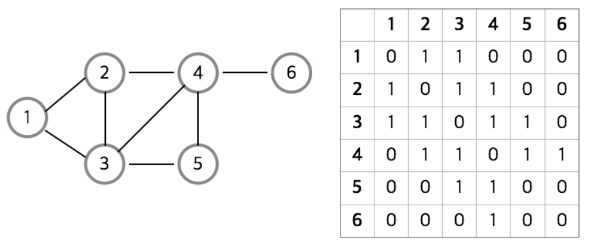
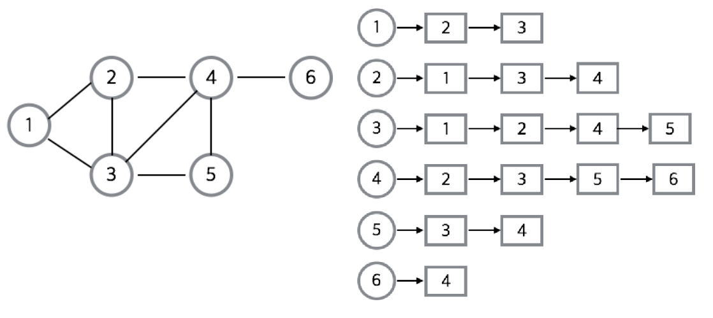
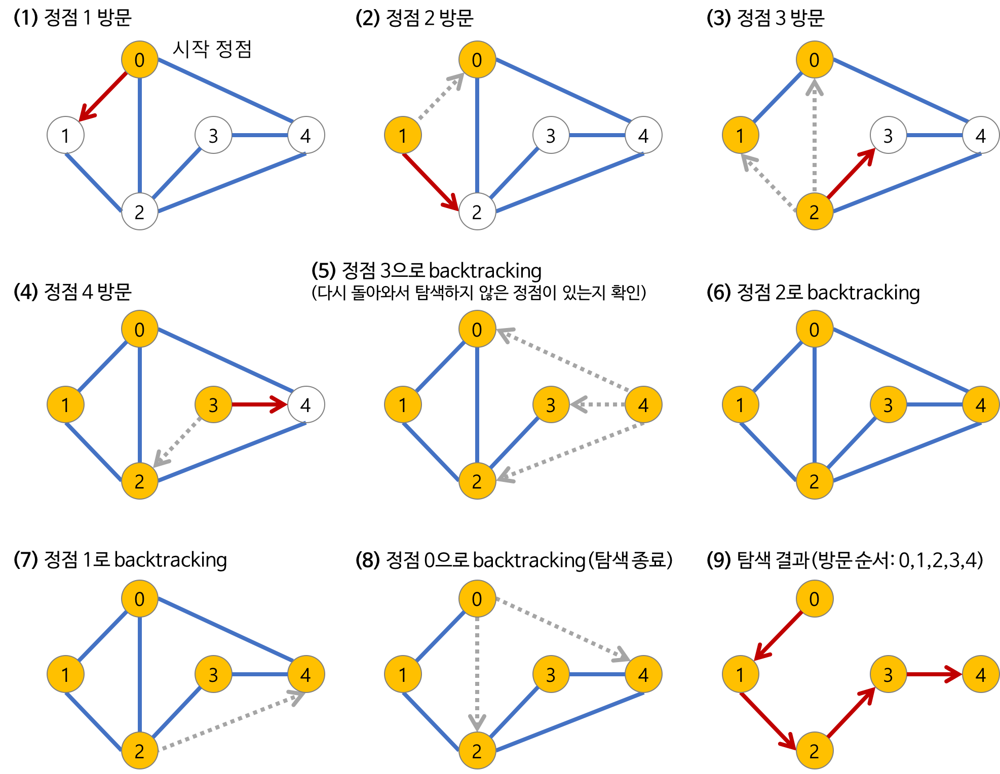
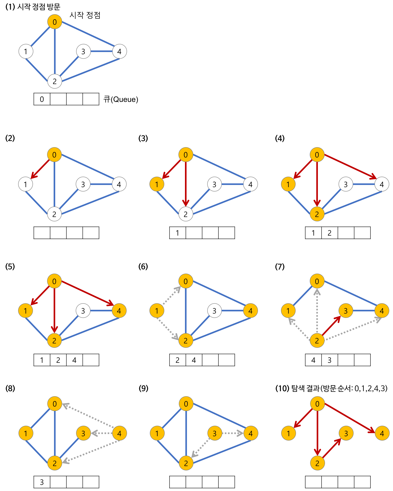

# Graph

## 그래프

노드(N)와 그 노드를 연결하는 간선(E)을 하나로 모아 놓은 자료구조

- 지도, 노선도, 도로처럼 연결되어 있는 객체간의 관계를 표현할 수 있는 자료구조
- 그래프는 여러 개의 고립된 부분 그래프(Isolated Subgraph)들로 구성될 수 있다

## 그래프와 트리의 차이

## 그래프 관련 용어

- 인접 정점(adjacent vertex) : 간선에 의해 직접 연결된 정점
- 인접(adjacent) & 부속(incident) : 임의의 두 정점이 하나의 간선으로 연결되어 있을 경우, 이 정점들은 서로 `인접`해 있다고 한다. 해당 간선은 두 노드에 `부속`해 있다고 한다
- 부분 그래프(subgraph) : 그래프에 포함된 일부 정점과 간선으로만 이루어진 그래프
    - 부분 신장 그래프(sapnning subgraph) : 부분 그래프 중 원본 그래프의 모든 정점을 포함한 그래프 (부분 신장 그래프의 간선의 수 < 원본 그래프의 간선의 수)
- 정점의 차수(degree) : 정점에 연결된 간선의 수 혹은 가중치의 합을 의미한다
    - 진입 차수(in-degree) : 방향 그래프에서 외부에서 해당 노드로 오는 간선의 수
    - 진출 차수(out-degree) : 방향 그래프에서 해당 노드에서 외부로 향하는 간선의 수
- 루프(loop) : 같은 정점을 연결하는 간선(두 정점이 같은 정점)
- 고립 정점(isolated vertex) : 연결된 간선이 없는 정점
- 경로(path) : 간선을 따라 이어갈 수 있는 길 (정점을 나열하여 경로를 표현한다)
    - 경로의 길이(length) : 경로를 이루는 간선의 수
    - simple path : 반복되는 간선이 없는 경로
    - elementary path : 반복되는 정점이 없는 경로
- 사이클(cycle) : 시작 정점과 종료 정점이 동일한 경로
- 연결(connected) : 두 정점 사이의 경로가 존재할 때 두 정점은 `연결`되었다고 한다
    - 강한 연결(strongly connected) : 정점 a → b, b → a의 경로가 존재할 경우, 해당 방향 그래프는 강한 연결되었다고 한다
    - 약한 연결(weakly connected) : a → b 또는 b → a 경로 중 하나만 존재할 경우, 해당 방향 그래프는 약한 연결되었다고 한다

## 그래프의 종류

- 무방향 그래프(undirected graph)
    - 간선을 통해 양방향으로 이동할 수 있음 (a,b 정점을 연결하는 간선을 `(a, b)` 로 표현)
- 방향 그래프(directed graph)
    - 간선에 방향이 존재함 (a → b로만 갈 수 있는 간선을 `<a, b>` 로 표현)
- 가중치 그래프(weighted graph)
    - 간선에 비용이나 가중치가 할당된 그래프
- 연결 그래프(conntected graph)
    - 무방향 그래프에서 있는 모든 정점 쌍에 경로가 항상 존재하는 경우
- 비연결 그래프(disconnected graph)
    - 무방향 그래프에서 특정 점정쌍 사이에 경로가 존재하지 않는 경우
- 순환 그래프(cycle graph)
    - 사이클(시작 정점과 종료 정점이 동일한 경로)을 가진 그래프
- 비순환 그래프(acyclic graph)
    - 사이클이 없는 그래프
- 완전 그래프(complete graph)
    - 그래프에 속한 모든 정점이 서로 연결되어 있는 그래프
    - 무방향 완전 그래프 : 정점의 수가 `n`이면 간선의 수는 `n * (n - 1) / 2`
    - 방향 완전 그래프 : 정점의 수가 `n`이면 간선의 수는 `n * (n - 1)`

## 그래프의 표현

인접행렬 방식 & 인접리스트 방식으로 그래프를 표현할 수 있음

- 인접 행렬(adjacency matrix) : 2차원 배열로 그래프의 연결 관계를 표현하는 방식
    - 정점 a,b가 서로 인접하다면(하나의 간선으로 연결되어 있다면) → `행렬[a][b] = 1` , 인접하지 않다면 → `행렬[a][b] = 0`
    - 간선에 가중치가 있다면 1 대신 가중치의 값을 직접 넣는다.
    - 장점
        - 두 정점에 대한 연결 정보 조회 → `O(1)`
        - 구현이 쉬움
    - 단점
        - 간선의 수와 무관하게 `n^2` 의 메모리 공간이 필요 → 메모리 공간 낭비가 큼
        - 특정 정점과 인접한 정점들을 찾기 위해 인접 행렬 전체를 순회해야 함 → `O(N^2)`

- 인접 리스트(adjacency list) : 리스트로 그래프의 연결 관계를 표현하는 방식
    - 장점
        - 특정 정점과 인접한 정점들을 찾을 때 해당 정점의 인접 리스트만 순회 → `O(N)`
        - 정점의 수 + 간선의 수(`n+e`) 만큼의 메모리 공간이 필요 → 메모리 공간 낭비가 적음
    - 단점
        - 두 정점에 대한 연결 정보를 조회하기 위해 인접 리스트 전체를 탐색해야 함 → 최악 `O(N)`
        - 구현이 어려움

## 그래프 탐색

깊이 우선 탐색(dfs)와 너비 우선 탐색(bfs)가 있음

- dfs는 스택으로 구현할 수 있음
    
    

 
  
- bfs는 queue로 구현할 수 있음
    