# Red-Black Tree
> BST에서 한쪽에만 노드들이 치우친 경우가 생길 수 있다. -> 탐색을 위한 시간이 늘어난다. -> 이를 보완하여 균형잡힌 트리를 만들고자 만들어진 자료구조

Red-Black Tree는 균형 잡힌 이진 탐색 트리( __balanced binary search tree__ )


<br>

# Red-Black Tree가 되기 위한 조건

1. Root property: 루트 노드의 색깔은 검정이다.

2. External property: 모든 external(leaf) node들은 검정이다.

3. Internal property: 빨강노드의 자식은 반드시 검정이다. 

    -> No Double Red: 빨간색 노드가 연속으로 나올 수 없다.

4. Depth property: 모든 리프노드에서 black depth는 같다.

     -> 리프노드에서 루트노드까지 가는 경로에서 만나는 블랙노드의 개수는 같다.(그냥 노드의 수는 다를 수 있다.)

위의 조건들이 Red-Black Tree의 높이를 logn에 바운드되도록 해준다.

<br>
<br>

<!-- 
<details>
<summary></summary>

</details> -->

# Red-Black Tree 구성 예시
[4,2,8,3]

1. Root property의 조건에 따라 루트 노드의 색깔은 검정을 줍니다.


2. 루트 노드 외에 삽입되는 노드의 색깔은 Red라고 가정하고 시작합니다.

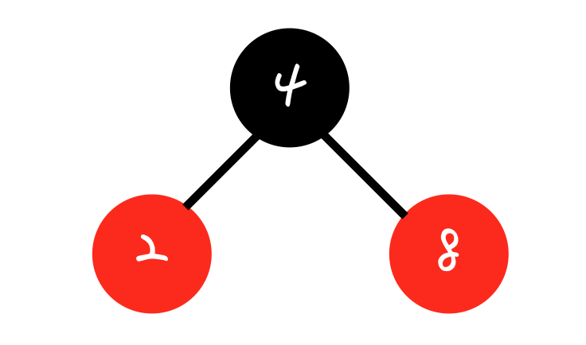

3. 노드 3을 삽입하면 BST의 특징에 따라 노드 2의 오른쪽 자식으로 붙게 됩니다.

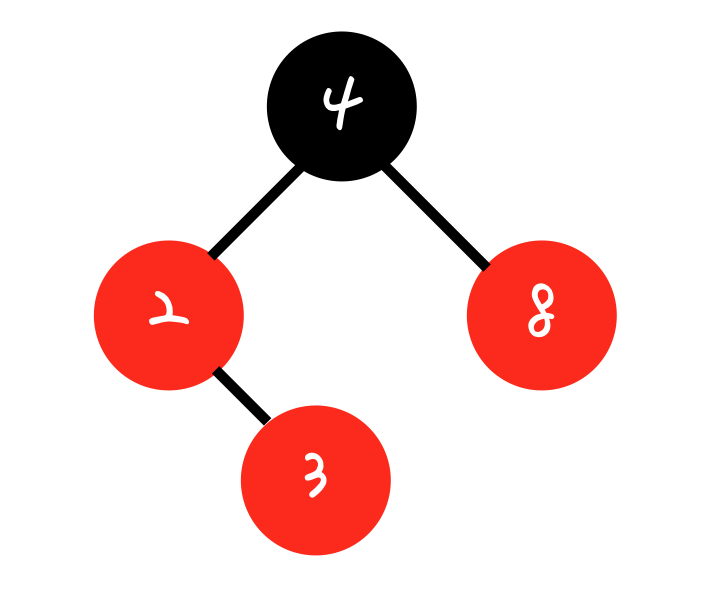

이렇게 되면 Internal property 조건을 위반하게 됩니다. 이를 해결하기 위해 2가지 메커니즘이 존재합니다.

- Restructuring

- Recoloring

<br>

<br>

# Restructuring & Recoloring
> 현재 insert 노드의 부모의 형제 노드의 색깔에 따라 매커니즘이 결정됩니다.

- Restructuring: 부모의 형제 노드가 Black일 때

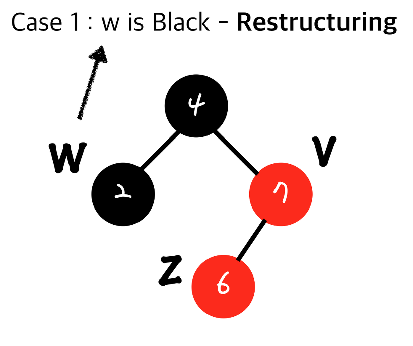

```
1. 나(z)와 내 부모(v), 내 부모의 부모를 오름차순으로 정렬
2. 무조건 가운데 있는 값을 부모로 만들고 나머지 둘을 자식으로 만든다.
3. 가운데 있는 값(부모가 된 값)을 검정으로 만들고 그 두 자식들을 빨강으로 만든다.
```
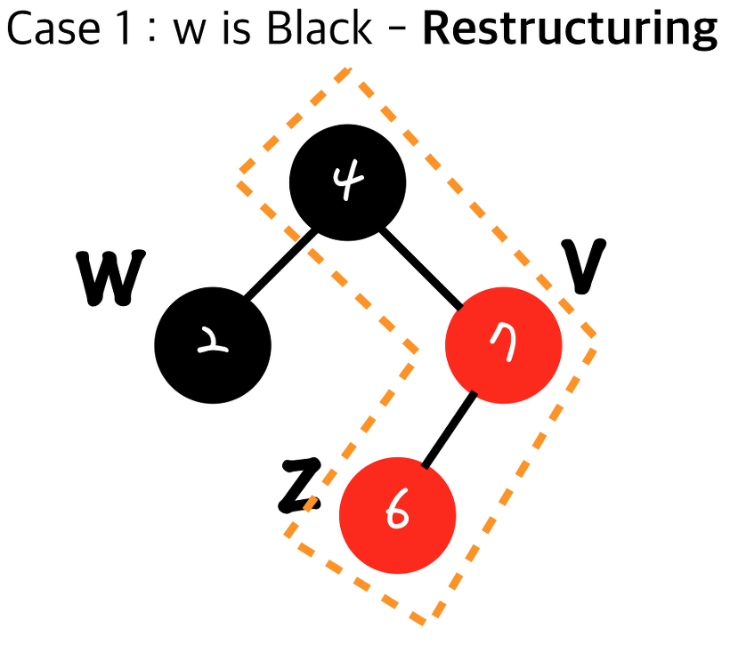 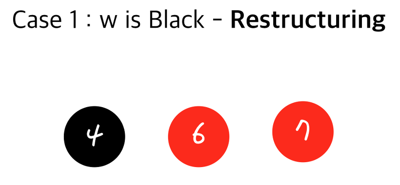 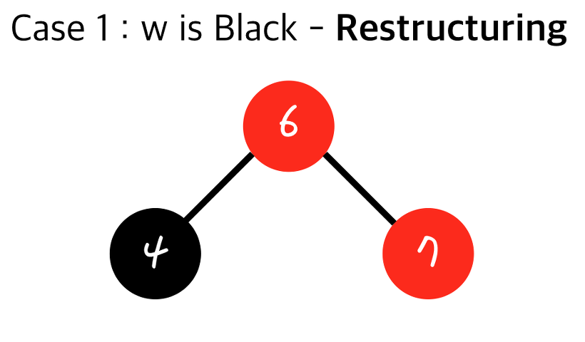 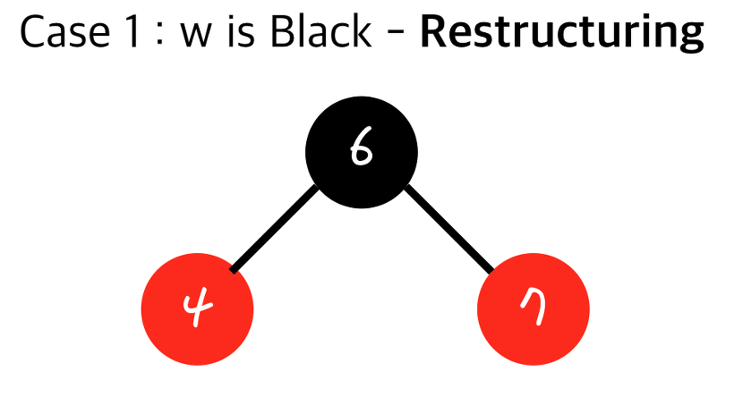 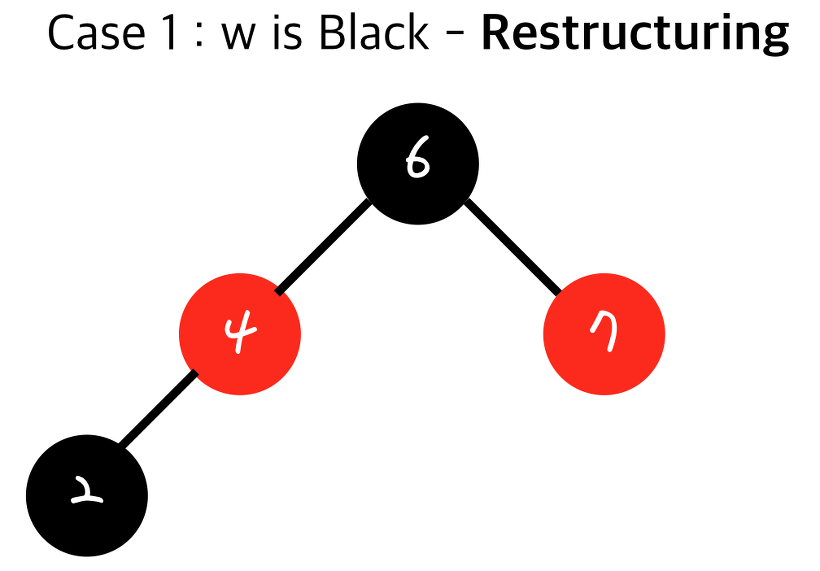

- 다른 서브트리에 영향을 미치지 않기 때문에 double red를 해결하기 전과 후의 black node의 개수에 변화가 없다. -> Double Red 조건이 발생하지 않는다. -> restructuring은 원큐에 끝난다.

<br>

- Recoloring: 부모의 형제 노드가 Red일 때

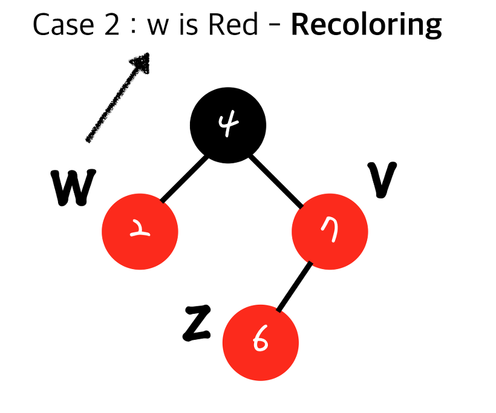

```
1. 현재 insert된 노드(z)의 부모(v)와 부모의 형제(w)를 검정으로 하고 내 부모의 부모를 빨강으로 한다.
2. 부모의 부모가 root node가 아니었을 때 double red(3번 조건)가 다시 발생 할 수 있다. -> 최악의 경우에 root node까지 쭉 올라가서 계속 연산해야할 수 있다.
```


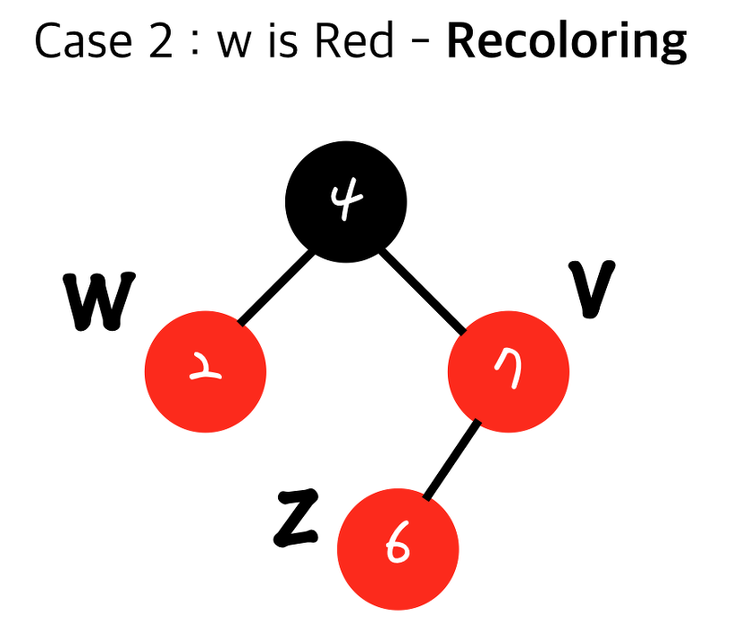 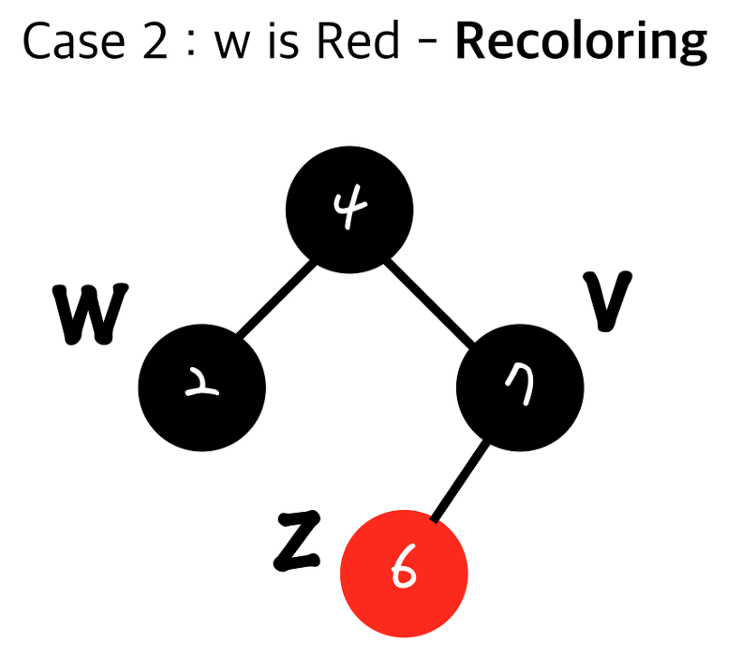 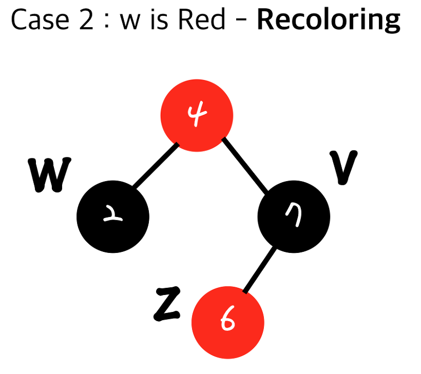

- 부모와 부모의 형제를 검정으로 바꾸면 Depth Property 조건을 만족하나요? -> Black Depth는 일제히 1 증가하기 때문에 만족합니다.

<br>
<br>

# 시간복잡도

- 검색의 시간복잡도: O(logn) -> balanced binary search tree이기 때문입니다.

- 삽입의 시간복잡도: O(logn) -> 
    - Restructuring: 순서 결정, 트리로 만드는 시간, 원래 노드의 구조로 바꿔주는 시간 모두 상수 시간이기 때문에 restructuring 자체 시간 복잡도는 O(1)이지만 어떤 노드를 insert한 뒤 일어나므로 총 수행 시간은 O(logn)입니다. 
    - Recoloring: insert해줄 위치를 찾는데 O(logn)에 recoloring을 해주는데 색깔만 바꿔주기 때문에 O(1)의 시간이 걸리고 root node까지 퍼져 나가면 O(logn)시간이 걸리게 됩니다

- 삭제의 시간복잡도: O(logn) 


<br>
<br>

<details>
<summary>AVL Tree와 Red-Black Tree 차이</summary>

- AVL Tree가 Red Black Tree보다 빠른 Search를 제공합니다.
    - AVL Tree가 더 엄격한 Balanced를 유지하고 있기 때문입니다.

- Red Black Tree은 AVL Tree보다 빠른 삽입과 제거를 제공합니다.
    - AVL Tree보다 Balanced를 느슨하게 유지하고 있기 때문입니다.

- Red Black Tree는 AVL Tree보다 색깔을 저장하기 위해 더 많은 Space Complexity가 필요합니다.

- Red Black Trees는 대부분의 언어의 map, multimap, multiset에서 사용하고 있습니다.

- AVL tree는 조회에 속도가 중요한 Database에서 사용하고 있습니다.

</details>


