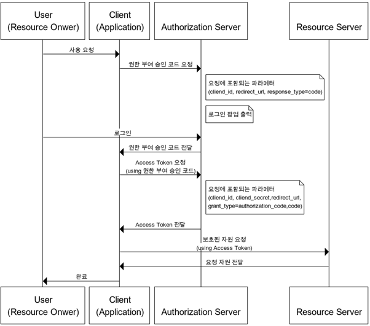

# OAuth


<br>

## OAuth란?
> 인터넷 사용자들이 비밀번호를 제공하지 않고 다른 웹사이트 상의 자신들의 정보에 대해 웹사이트나 애플리케이션의 **접근 권한**을 부여할 수 있는 공통적인 수단으로서 사용되는 **접근 위임**을 위한 개방형 표준이다.

- 개인정보를 여러 곳에 입력하면서 보안이 불안해지고, Application이 안전하다는 보장이 없었다.  이러한 문제를 보완하기위해서 Twitter는 2007년에 OAuth 1.0을 만들게 된다.

## 일반적인 로그인과 OAuth를 이용한 로그인의 차이점
- 일반 로그인은 회원가입을 할 때 사용했던 아이디와 비밀번호를 통한 인증(Authentication)이라면 OAuth를 통한 로그인은 타사 서비스(네이버, 카카오, 구글 등)의 계정 정보에 우리가 만든 서비스의 접근을 허가(Authorization)을 줘서 사용자를 인증하는 것입니다.
- 인증(Authentication): 유저가 누구인지 확인하는 절차 - Who you are
- 인가(Authorization): 유저에 대한 정보 권한을 허락하는 것 - What you can do

<br><br>

## OAuth 1.0과 2.0 차이점
|항목|OAuth 1.0|OAuth 2.0|
|---|----------|---------|
|역할|User<br>Consumer<br>Service Provider|Resource Owner<br>Client<br>Resource Server<br>Authorization Server|
|토큰|Request Token<br>Access Token|Access Token<br>Refresh Token|
|open API 호출 및 보안|서명<br>HMAC을 통해 암호화|HTTPS 기본(HMAC 사용 x)<br>서명:Resource Server가 별도로 서명을 요구하는 경우|
|유효기간|Access Token 유효기간 없음|Access Token 유효기간 부여. Refresh Token|

- HMAC: 해싱 기법을 적용하여 메시지의 위변조를 방지하는 기법
<br><br>

## OAuth 1.0
### OAuth1.0 대표 용어
|용어|설명|
|---|---|
|User|Service Provider에 계정을 가지고 있으면서, Consumer를 이용하려는 사용자(~로 로그인하기를 이용하는 나)|
|Service Provider|OAuth를 사용하는 Open API를 제공하는 서비스(네이버, 카카오, 구글)|
|Consumer|OAuth 인증을 사용해 Service Provider의 기능을 사용하려는 애플리케이션이나 웹 서비스(구글로 로그인하기를 쓰려는 사이트나 앱)|
|Request Token|Consumer가 Service Provider에게 접근 권한을 인증받기 위해 사용하는 값. 인증이 완료된 후에는 Access Token으로 교환한다.|
|Access Token|인증 후 Consumer가 Service Provider의 자원에 접근하기 위한 키를 포함한 값|

## OAuth 1.0 진행 과정

1. Consumer가 Servcie Provider에게 Request Token을 요청한다.
2. Service Provider는 Request Token을 넘겨 준다.
3. Consumer는 User를 redirect 시켜서 Service Provider에서 인증을하게 한다. (로그인을 하는 과정)
4. Consumer는 Service Provider로 부터 Access Token을 요청한다.
5. Service Provider는 Access Token을 발급한다.
6. Consumer는 이제 User의 제 3자 사이트에 권한을 가지고 인증을 진행 할 수 있다.


<br><br>

## OAuth 2.0
- OAuth의2는 OAuth의1의 유저의 인증플로우, 전반적인 목적만 공유하고 OAuth의1.0을 새로 작성한것이다. OAuth의1.0과 OAuth의2.0의 차이는 앱 애플리케이션, 웹 애플리케이션, 데스크탑 애플리케이션등의 인증방식을 강화하고 Consumer에 개발 간소화를 중심으로 개발 되었다. 

- 인증 절차가 간소화 됨으로써 개발자들이 구현하기 더쉬워졌고, 기존에 사용하던 용어도 바뀌면서 Authorizaiton server와 Resource서버의 분리가 명시적으로 되었다. 또한 다양한 인증 방식을 지원하게 됐다. 

### OAuth 2.0 대표 용어
|용어|설명|
|----|---|
|Resource Server|OAuth2.0 서비스를 제공하고 자원을 관리하는 서버(구글,카카오, 네이버 등등)|
|Authorization Server|Client가 Resource Server의 서비스를 사용할 수 있게 인증하고 토큰을 발급해주는 서버(구글, 카카오, 네이버 등)|
|Resource Owner|Resource Server의 계정을 소유하고 있는 사용자|
|Client|Resource Server의 API를 사용하여 데이터를 가져오려고 하는 사이트|
|Access Token|Resource Server에 자원을 요청할 수 있는 토큰|
|Refresh Token|Authorization Server에 Access Token을 요청할 수 있는 토큰|
```
Resource Server : 카카오 서버, 자원을 담당하는 서버
Authorization Server : 카카오 서버, 권한을 담당하는 서버
Resource Owner : 사용자(나)
Client : 모르는 사람이 만든 사이트
```

### OAuth 2.0 인증 방식의 종류

|종류|설명|
|----|---|
|Authorization Code Grant|- Client가 다른 사용자 대신 특정 리소스에 접근을 요청할 때 사용<br>- resource 접근을 위해, Authorization Server에서 받은 권한 코드로 리소스에 대한 액세스 토큰을 받는 방식<br>- 다른 인증 절차에 비해 보안성이 높기에 주로 사용된다.|
|Implicit Grant|- Authorization Code Grant와 다르게 권한 코드 교한 단계가 있다. <br>- Access Token을 즉시 반환 받아 이를 인증에 이용하는 방식|
|Resource Owner Password Credentials Grant|- Client가 암호를 사용하여 액세스 토큰에 대한 사용자의 자격 증명을 교환하는 방식<br>- Resource Owner에서 id, pwd를 전달받아 Resource Server에 인증하는 방식으로 신뢰할 수 있는 client에서 가능|
|Client Credentials Grant|- Client가 컨텍스트 외부에서 Access Token을 얻어 특정 리소스에 접근을 요청할 때 사용하는 방식|

### Authorization Code Grant

권한 부여 승인을 위해 자체 생성한 authorization code를 전달하는 방식으로 많이 쓰이고 기본이 되는 방식이다. 간편 로그인 기능에서 사용되는 방식으로 클라이언트가 사용자를 대신하여 특정 자원에 접근을 요청할 때 사용되는 방식이다. 보통 타사의 클라이언트에게 보호된 자원을 제공하기 위한 인증에 사용된다. refresh token의 사용이 가능한 방식이다.

> 

```
1. client에서 Authorization server로 권한 부여 요청을 보낸다.
2. 로그인 팝업창이 전달되면 사용자는 로그인을 한다.
3. 로그인 정보가 맞다면 권한 부여 승인 코드를 client에 전달한다.
4. client는 authorization code를 통해 access token 발급을 요청한다.
5. authorization server는 자기가 가지고 있는 client id, client secret, authorization code를 전달받은 정보와 비교하여 동일할 때 access token을 전달한다.
6. client는 resoruce server에게 인증을 위한 access token을 전달하면서 필요한 자원을 요청한다.
7. resource server는 access token이 유효하면 해당 자원을 제공한다.
```
- redirect_uri :인증 승인 이후 redirect될 url
- response_type :사용을 원하는 grant type 설정
    - code :authorization code
    -  token :implicit

### Implicit Code Grant

자격증명을 안전하게 저장하기 힘든 클라이언트(javascript등)에게 최적화된 방식이다. 암시적 승인 방식에서는 권한 부여 승인 코드 없이 바로 access token이 발급된다. Access token이 바로 전달되므로 만료기간을 짧게 설정하여 누출의 위험을 줄일 필요가 있다. Refresh token의 사용이 불가능한 방식이며, 권한 서버는 client secret을 사용해 클라이언트를 인증하지 않는다.

> 

```
1. Client가 인증서버에게 사용자 로그인 및 권한 동의 웹 페이지를 요청한다.
2. 로그인 팝업창이 전달되면 사용자는 로그인을 합니다.
3. 로그인 정보가 맞다면 Redirect URL로 Authorization Code가 아니라 Access token을 전달한다.
4. 획득한 Access token으로 Resource Server에 API 요청을 보낸다.
```

### Resource Owner Password Credentials Grant

간단하게 username, pwd와 access token을 받는 방식이다. refresh token 사용 가능하다. 중요한 점은 서버, 리소스 서버, 클라이언트가 모두 같은 시스템에 속해 있을 때 사용되어야 하는 방식이다.
> 

```
1. Resource Owner는 인증정보를 client에게 직접 전달한다.
2. Client는 앞서 받은 인증 정보를 Authorization Server로 전송하여 Access token을 발급받는다.
3. 획득한 Access token으로 Resource Server에 API 요청을 보낸다. 
```

이방식은 Resource Owner의 id, pwd가 client에게 그대로 노출되므로 client와 service provider가 같은 도메인, 솔류션 내에 존재하여 서로 신뢰할 수 있는 경우 사용한다.


### Client Credentials Grant

Oauth 2.0의 권한 부여 방식 중 가장 간단한 방식으로 클라이언트의 자격증명만으로 access token을 획득하는 방식이다. 이 방식은 자신이 관리하는 리소스 혹은 권한 서버에 해당 클라이언트를 위한 제한된 리소스 접근 권한이 설정되어 있는 경우 사용된다. 이 방식은 자격 증명을 안전하게 보관할 수 있는 클라이언트에서만 사용되어야 하고, refresh token은 사용할 수 없다.

> 


