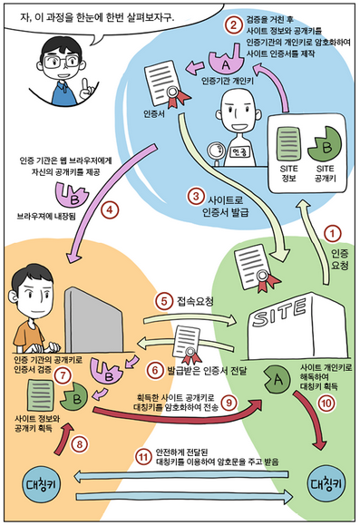

# SSL
SSL(Secure Sockets Layer)과 TLS(Transport Layer Security)는 같은 것이라고 할 수 있다. SSL은 TCP/IP 암호화 통신에서 사용되는 규약이고 SSL 3.0 버전 이후에는 TLS 1.0으로 규정했다.

 

### 공개키 암호화(비대칭키 암호화)
`암호화 할 때와 복호화할 때 이용하는 키가 다른 키, 비대칭인 암호화 방식 => 공개키 암호화(공개키-암호화 비밀키-복호화)`

전자서명의 비밀키는 `평문을 사용하여 서명`하기 위한 것이고, 공개키는 `서명이 올바른지 검증`하는 것이다. 즉 __공개키 암호화__ 에서의 비밀키와 공개키의 역할은 전혀 다르다.

 

### 대칭키 암호화(비밀키 암호화)
`암호화 할 때나 복호화할 때 이용하는 키가 동일 => 대칭키 암호화(비밀키-암호화, 복호화)`

대칭키 암호화는 서버와 클라이언트가 같은 키를 사용해야 하므로 키를 공유하는데 문제가 있고, 비대칭키 암호화는 공개키를 배포함으로써 키 공유 문제는 해결했지만 처리속도가 느린 문제가 있다. HTTPS 통신에서 실제 전송되는 데이터의 암호화에는 대칭키 암호화 방식을 사용하고, 키 교환에는 비대칭키 암호화를 사용하여 이러한 문제를 해결한다.

 

### TLS Handshake

> 

1. 웹 사이트 인증 기관에게 인증 요청
2. 웹 사이트의 공개키와 사이트 정보를 인증기관의 개인키로 암호화하여 사이트 인증서를 만든다.
3. 인증서를 웹 사이트로 발급해준다.
4. 인증기관은 웹 브라우저로 인증기관의 공개키를 제공 (브라우저에 내장됨)
5. 웹 브라우저는 웹사이트에게 접속을 요청한다.
6. 웹 사이트는 웹 브라우저에게 인증서로 부터 발급받은 인증서를 전달한다.
7. 인증서를 브라우저에 내장된 인증기관의 공개키로 검증한다. 
8. 웹 사이트 정보와 공개키를 획득한다. 획득한 사이트 공개키로 대칭키를 암호화하여 웹사이트로 전송한다. 
9. 웹 사이트의 개인키로 해독하여 대칭키를 획득
10. 획득한 대칭키를 통하여 서로 통신한다.