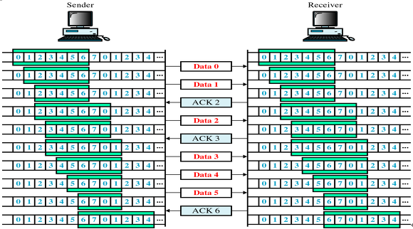

# TCP & UDP + QUIC

 

## TCP와 UDP는 왜 나오게 되었나?

- IP의 역할은 Host to Host만을 지원한다. 장치에서 장치로 이동은 IP로 해결되지만, 하나의 장비안에서 수많은 프로그램들이 통신을 할 경우에는 IP만으로는 한계가 있다.

- 또한 IP에서 오류가 발생한다면 ICMP에서 알려준다. 하지만 ICMP는 알려주기만 할 뿐 대처를 못하기 때문에 IP보다 위에서 처리를 해줘야 한다.

1번을 해결하기 위해 Port번호가 나오게 되었고, 2번을 해결하기 위해 상위 프로토콜인 TCP와 UDP가 나오게 되었다.

> ICMP: 인터넷 제어 메세지 프로토콜로 네트워크 컴퓨터 위에서 돌아가는 운영체제에서 오류 메세지를 전송받는데 주로 쓰인다.

### 그렇다면 TCP와 UDP가 어떻게 오류를 해결하는가?

TCP 
- 데이터의 분실, 중복, 순서가 뒤바뀜 등을 자동으로 보정해줘서 송수신 데이터의 정확한 전달을 할 수 있도록 해준다.

UDP 
- IP가 제공하는 정도의 수준만을 제공하는 간단한 IP 상위 계층 프로토콜이다. TCP와는 다르게 에러가 날수도 있고 재전송이나 순서가 뒤바뀔수도 있어서 이경우 어플리케이션에서 처리하는 번거로움이 존재한다.

  

# TCP(Transmission Control Protocol)

> 전송 제어 프로토콜 TCP는 전송 계층에서 사용하는 프로토콜로서, 장치들 사이에 논리적인 접속을 성립하기 위하여 연결을 설정하여 __신뢰성을 보장하는 연결형 서비스__ 이다.

> **relialble network를 보장한다는 것은 4가지 문제점 존재**
> 1. 손실: 패킷이 손실될 수 있는 문제
> 2. 순서 바뀜: 패킷의 순서가 바뀌는 문제
> 3. congestion: 네트워크가 혼잡한 문제
> 4. overload: 수신자가 overload되는 문제

## 특징

- 연결형 서비스로 가상 회선 방식을 제공한다.
- 흐름 제어
- 혼잡 제어
- 신뢰성이 높은 전송
- 점이중(Full-Duplex), 점대점 방식(Point to Point)

## 장점
- 데이터를 정확하고 안정적으로 전달할 수 있다.
- 호스트 간 신뢰성 있는 데이터 전달과 흐름제어를 한다.

## 단점
- 데이터로 보내기 전에 반드시 연결이 형성 되어야 한다.
- 1:1 통신만 가능하다.
- 고정된 통신 선로가 최단선로(네트워크 길이)가 아닐경우 상대적으로 UDP보다 데이터 전송속도가 느리다.

  

# 흐름제어(Flow Contorl)

> 흐름제어는 송신측과 수신측의 TCP 버퍼 크기 차이로 인해 생기는 데이터 처리 속도 차이를 해결하기 위한 기법이다.

> TCP 버퍼 송신측은 버퍼에 TCP 세그먼트를 보관한 후 순차적으로 전송하고, 수신측은 도착한 TCP 세그먼트를 애플리케이션이 읽을 때까지 버퍼에 보관한다.

 

## 배경

- 수신측이 송신측보다 데이터 처리 속도가 빠르면 문제없지만, 송신측의 속도가 빠를 경우 문제가 생긴다.
- 수신측에서 제한된 저장 용량을 초과한 이후에 도착하는 데이터는 손실될 수 있으며, 만약 손실된다면 불필요하게 응답과 데이터 전송이 송/수신 측 간에 빈번하게 발생한다.
- 이러한 위험을 줄이기 위해 송신 측의 데이터 전송량을 수신측에 따라 조절해야한다.

 

## 해결 방법

### 1. Stop and Wait

매번 전송한 패킷에 대해 확인 응답을 받아야만 그 다음 패킷을 전송하는 방법
- 패킷을 하나씩 보내기 때문에 비효율적인 방법이다.

### 2. Sliding Window(Go-Back N)

수신측에서 설정한 윈도우 크기만큼 송신측에서 확인응답없이 세그먼트를 전송할 수 있게 하여 데이터 흐름을 동적으로 조절하는 제어 기법

- 윈도우에 포함된 패킷을 계속 전송하고 수신 측으로부터 확인 응답(ACK)이 오면 윈도우를 옆으로 옮겨 다음 패킷들을 전송한다.
- 송신측은 일정 시간 동안 수신측으로부터 확인 응답을 받지 못하면, 패킷을 재전송한다.

  

# 오류제어

ARQ 기법을 사용해 프레임이 손상되었거나 손실되었을 경우 재전송을 통해 오류를 복구한다.

ARQ(Automatic Repeat Request): 신뢰성 있는 데이터 전달을 위해 재전송을 기반으로 한 에러 제어 방식

 

## 해결 방법

### 1. Stop and Wait ARQ

데이터나 ACK가 분실되었을 경우 일정 간격의 시간을 두고 타임아웃이 되면 송신측은 데이터를 재전송한다.

### 2. Go Back N ARQ

전송된 프레임이 손상되거나 분실된 경우, 확인된 마지막 프레임 이후로 모두 재전송하는 기법이다.

  

# 혼잡제어

송신측의 데이터 전달과 네트워크 데이터 처리 속도를 해결하기 위한 기법이다.

## 배경

데이터의 양이 라우터가 처리할 수 있는 양을 초과하면 초과된 데이터는 라우터가 처리하지 못한다. 이때 송신 측에서는 라우터가 처리하지 못한 데이터를 손실 데이터로 간주하고 계속 재전송하여 네트워크를 혼잡하게 한다.

### 해결 방법

1. AIMD(Additive Increase Multicative Decrease)

    - AIMD 방식은 처음에 패킷을 하나씩 보내고 문제 없이 도착하면 윈도우의 크기를 1씩 증가시켜가며 전송한다. 만약 전송에 실패하면 윈도우 크기를 반으로 줄인다.

    - 윈도우 크기를 너무 조금씩 늘리기 때문에 네트워크의 모든 대역을 활용하여 제대로 된 속도로 통신하기까지 시간이 오래 걸린다는 단점이 있다.

2. 

    1. Slow Start

        - 윈도우의 크기를 1,2,4,8...과 같이 지수적으로 증가시키다가 혼잡이 감지되면 윈도우 크기를 1로 줄이는 방식이다

        - 보낸 데이터의 ACK가 도착할때마다 윈도우 크기를 증가시키기 때문에 처음에는 윈도우 크기가 조금 느리게 증가할지라도, 시간이 가면 윈도우 크기가 점점 빠르게 증가한다는 장점이 있다.

        - 혼잡 윈도우의 크기가 임계치에 도달하기 전까지 적용되며, 임계 값에 도달하면 혼잡회피 단계를 수행한다.
    
    2. 혼잡 회피(Congestion Avoidance)

        - 윈도우의 크기가 임계 값에 도달한 이후에는 데이터 지연, 손실이 발생할 확률이 높아진다. 따라서 전송 데이터의 크기가 임계점에 도달하면 선형적으로 1씩 윈도우를 증가시킨다.

        - 만약 타임 아웃 문제가 생긴다면 윈도우 크기는 1로 돌아가며 임계점은 손실 이벤트가 발생할 때의 혼잡 윈도우 사이즈의 1/2로 변경된다. 이후 빠른 회복 상태로 들어간다.

    3. 빠른 재전송(Fast Retransmit)

        - 패킷을 받는 수신자 입장에서는 세그먼트로 분할된 내용들이 순서대로 도착하지 않는 경우가 생길 수 있다. 이런 상황이 발생했을 때 수신 측에서는 순서대로 잘 도착한 마지막 패킷의 다음 순번을 ACK 패킷에 실어서 보낸다.

        - 그리고 이런 중복 ACK를 3개 받으면 재전송이 이루어진다. 송신 측은 자신이 설정한 타임 아웃 시간이 지나지 않았어도 바로 해당 패킷을 재전송할 수 있기 때문에 보다 빠른 재전송률을 유지할 수 있다.

        - 또한 혼잡한 상황이라 판단하고 혼잡 윈도우 사이즈는 1로 돌아가며 임계점은 손실 이벤트가 발생할 때의 혼잡 윈도우의 사이즈의 1/2로 변경된다.
    
    4. 빠른 회복(Fast Recovery)

        - 혼잡한 상태가 되면 Window Size를 1로 줄이지 않고 절반으로 줄이고 선형 증가시키는 방법이다.

        - 만약 타임아웃이 발생하면 혼잡 윈도우 사이즈는 1로 하고, 임계점은 손실 이벤트가 발생할 때의 혼잡 윈도우 사이즈의 1/2로 변경된다.
    

  

# UDP(User Datagram protocol)

> UDP는 전송 계층에서 사용하는 __비 연결 지향적 프로토콜__ 로서, 데이터를 __데이터그램__ 단위로 처리한다.

## UDP를 사용하는 이유

- TCP는 신뢰성을 보장하지만 연결을 통해 시간 손실을 발생할 수 있다.
- TCP는 패킷이 누락되면 재전송을 해야한다.
- 사진 또는 영상은 데이터의 일부가 누락돼도 문제가 발생하지 않기 때문에, TCP는 합리적인 방법이 되지 못한다.

위와 같은 경우 전송 속도가 빠른 UDP를 사용한다.

## 특징
- UDP는 전송계층의 __비 연결 지향적 프로토콜__ 이다.
> 비 연결 지향적: 데이터를 주고 받을때 연결 절차를 거치지 않고 발신자가 일방적으로 데이터를 발신하는 방식

- 데이터를 __데이터그램__ 단위로 처리하는 프로토콜

> 데이터그램 : 독립적인 관계를 지니는 패킷

- 정보를 주고 받을 때, 정보를 보내거나 받는다는 신호 절차를 거치지 않는다.

- UDP 헤더의 Check Sum 필드를 통해 최소한의 오류만 검출한다.

- 패킷 관리가 필요하다.

- 패킷 오버헤드가 적어 네트워크 부하가 감소되는 장점이 있다.

- UDP는 흐름제어, 오류제어 또는 손상된 세그먼트의 수신에 대한 재전송을 하지 않는다. 이 모두가 사용자 프로세스의 몫이다. UDP가 행하는 것은 포트들을 사용하여 IP 프로토콜에 인터페이스를 제공하는 것이다.

## 장점
- 상대적으로 TCP보다 전송속도가 빠르다

## 단점
- 데이터의 신뢰성이 떨어진다.
- 패킷의 분실 확인이나 전달 순서를 보장해주지 않는다.
- TCP와는 다르게 데이터를 쪼개주지 않아 애플리케이션 단에서 패킷을 쪼개야 한다.

  

# TCP vs UDP

- TCP는 연속성보다 신뢰성 있는 전송이 중요할 때 사용하고
- UDP는 TCP보다 속도가 빠르고 네트워크 부하가 적지만 신뢰성있는 데이터 전송을 보장하지 않는다. 그렇기 때문에 신뢰성보다 연속성이 중요한 실시간 서비스에 주로 사용된다.

  

# QUIC(Quick UDP Internet Connections)

> 최종 사용자에게 웹과 데이터를 더 빨리 전달하려는 바람이 초기 이 새로운 전송 프로토콜을 만들게 된 가장 큰 이유이자 원동력이다.

> QUIC는 UDP 위에 구현한 전송 프로토콜이다. UDP에 기반을 둔 QUIC는 UDP 포트 번호를 사용해서 주어진 IP 주소의 특정 네트워크 서비스를 식별한다.

## 특징

1. 신뢰성

UDP가 데이터 전송의 신뢰성을 보장하지 않지만, QUIC은 UDP 위에 새로운 계층을 추가함으로써 신뢰성을 제공한다. 추가된 계층은 TCP에 존재하는 패킷 재전송, 혼잡 제어, 속도 조정 및 다른 기능들을 제공한다.

한 엔드포인트로부터 QUIC을 통해 전송된 데이터는 연결이 유지되는 한 다른 엔드포인트에서 수신할 수 있다.

2. 다중 통신 경로(스트림)

하나의 연결로 다수의 병렬 스트림으로 다른 스트림에 영향을 주지 않고 데이터를 동시에 전송할 수 있다.

QUIC 연결은 UDP 포트와 IP 주소로 이루어져 있지만 일단 연결을 만들고 나면 "connection ID"로 연결된다. 만들어진 연결을 통해 양쪽에서 스트림을 만들어 다른 쪽으로 데이터를 보낼 수 있다. 스트림은 순서대로 전달되고 신뢰할 수 있지만 서로 다른 스트림은 순서 없이 전달될 수 있다.

QUIC은 연결과 스트림 모두에서 흐름 제어를 제공한다.

> head of line blocking: 하나의 요청에서만 손실이 일어나도 모두 영향을 받는 이러한 상황

3. 빠른 핸드쉐이크

QUIC는 0-RTT, 1-RTT 핸드쉐이크 둘다 제공하는데 이는 새로운 연결을 협상하고 설정하는데 걸리는 시간을 줄여준다. TCP의 3-way handshake와 비교해보면 된다.

둘 중 가장 빠른 0-RTT 핸드쉐이크는 호스트에 이미 이전 연결이 구성되어 있고 해당 연결의 시크릿이 캐시 되어 있을 때만 동작한다.

4. TLS 1.3

QUIC에서 사용하는 전송 보안은 TLS 1.3(RFC 8446)이며 암호화하지 않은 QUIC 연결은 절대로 존재하지 않는다.

QUIC이 TLS 1.3을 사용한 주된 이유는 핸드쉐이크에 더 적은 라운드 트립이 필요하도록 바뀌었기 때문이다. 이는 프로토콜 지연을 줄여준다.

