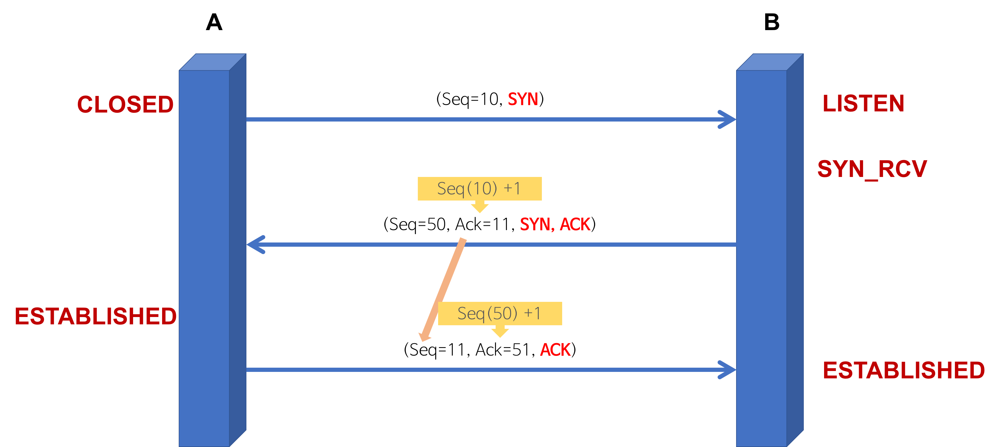
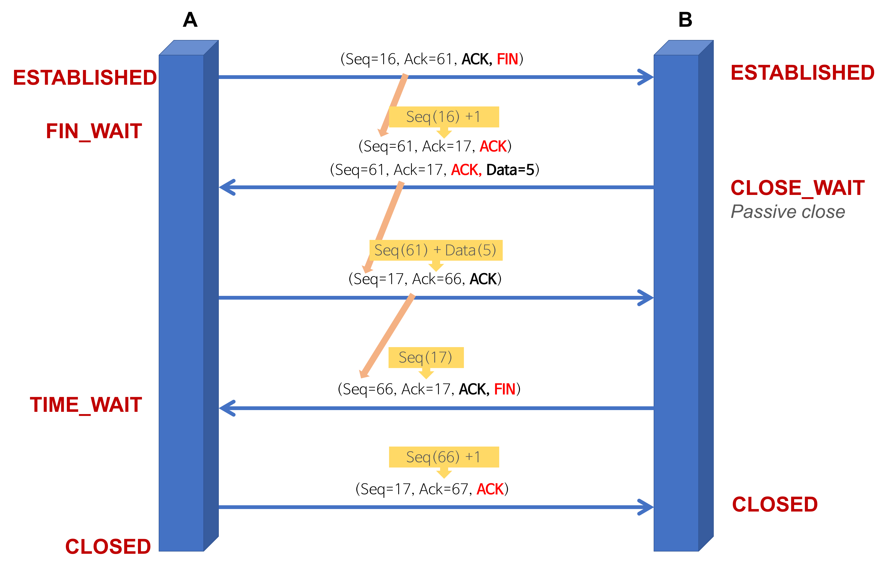

# 🤝TCP 3way handsake

<br>

## TCP 3-way handshake
TCP는 통신하기에 앞서 논리적인 접속을 성립하기 위해 3-way handshake 과정을 진행한다. (신뢰성을 보장하는 연결형 서비스)

- TCP 통신을 이용하여 데이터를 전송하기 위해 네트워크 연결을 설정하는 과정
- 양쪽 모두 데이터를 전송할 준비가 되었다는 것을 보장하고, 실제로 데이터 전달이 시작하기 전에 한 쪽이 다른 쪽이 준비되었다는 것을 알 수 있도록 한다.
- TCP/IP 프로토콜을 이용해서 통신을 하는 응용 프로그램이 데이터를 전송하기 전에 먼저 정확한 전송을 보장하기 위해 상대방 컴퓨터와 사전에 세션을 수립하는 과정
    > 

___A 프로세스(클라이언트)가 B프로세스(서버)에 연결을 요청___

```
1. A -> B :SYN
2. B -> A :SYN + ACK
3. A -> B :ACK
```

1. A -> B :SYN
    - 접속 요청 프로세스가 연결 요청 메시지 전송(SYN)
    - 송신자가 최초로 데이터를 전송할 때 Seq Number를 임의의 랜덤 숫자로 지정하고, SYN 플래그 비트를 1로 설정한 세그먼트를 전송한다.
    - A :Closed, B :Listen
2. B -> A :SYN + ACK
    - 접속 요청을 받은 프로세스 B가 요청 수락, 접속 요청 프로세스 A에게 포트를 열어달라는 메시지 전송(SYN+ACK)
    - 수신자는 Ack Number 필드를 Seq Number + 1로 지정, SYN과 ACK 플래그 비트를 1로 설정한 세그먼트를 전송
    - A :Closed, B :Syn_Rcv
3. A -> B :ACK
    - 마지막으로 접속 요청 프로세스 A가 수락 확인을 보내 연결을 맺음
    - 이때 전송할 데이터가 있으면 이 단계에서 데이터를 전송할 수 있다.
    - 초기 => A :Established, B :Syn_Rcv
    - 후기 => A :Established, B :Established

<br><br>

## 4-way handshake
TCP 연결을 해제하는 과정이다.
> 

___A 프로세스(클라이언트)가 B프로세스(서버)에 연결 해제를 요청___
```
1. A -> B :FIN
2. B -> A :ACK
3. B -> A :FIN
4. A -> B :ACK
```

1. A -> B :FIN
    - 프로세스 A가 연결을 종료하겠다는 FIN 플래그 전송
    - 프로세스 B가 Fin 플래그로 응답하기 전까지 연결을 계속 유지한다.
    - A :Established, B :Established
    - A :FIN_WAIT, B :Established
2. B -> A :ACK
    - 서버B는 FIN 플래그를 받고 일단 확인 메시지를 보내고 자신의 통신이 끝날 때까지 기다린다.
    - A는 Ack Number 필드는 Seq Num + 1로 지정하고, Ack 플래그 비트를 1로 설정한 세그먼트를 전송한다.
    - 그리고 전송할 데이터가 남아있다면 이어서 계속 전송한다.
    - A :FIN_WAIT, B :CLOSE_WAIT
3. B -> A :FIN
    - B는 통신이 끝났으면 연결 종료 요청에 합의에 응하여 FIN 플래그를 전송한다.
    - A: TIME_WAIT, B :CLOSE_WAIT
4. A -> B :ACK
    - A는 해지 준비가 되었다는 ACK를 확인했다는 메시지 B에게 보낸다.
    - 클라이언트는 아직 서버로부터 받지 못한 데이터가 있을 것을 대비해 일정 시간동안 세션을 남겨놓고 잉여 패킷을 기다리는 과정을 거친다.
    - A :TIME_WAIT, B :CLOSED
    - A :CLOSED, B :CLOSED (완전히 모든 패킷을 다 받으면 ACK를 보낸뒤 바뀜)