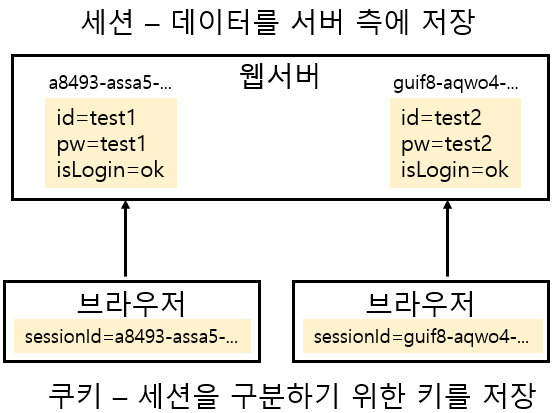

# 쿠키, 세션, 토큰

 

# 인증이 왜 필요한가?

- HTTP 프로토콜은 비연결성(Connectionless), 무상태성(Stateless) 프로토콜이다.

    -> 서버가 클라이언트를 식별하기 위해서는 인증 절차가 필요하다.

    -> 하지만 클라이언트가 로그인을 하더라도 다음 요청시 해당 클라이언트의 인증 정보를 기억하지 못한다면 인증 절차가 중복되는 문제가 발생한다.

    -> 쿠키, 세션, 토큰으로 사용자 인증 정보를 유지하여 해결할 수 있다.

  

# 인증 방식

1. HTTP 기본 인증
- 가장 잘 알려진 HTTP 인증 규약으로, 사용자의 이름과 비밀번호를 Base64 인코딩하여 Header에 담아 전송하는 인증 방식이다. 이 방식은 request를 보낼 때마다 사용자의 계정 정보를 Header에 담아 전송하므로 보안에 취약하다.

2. 서버 기반 인증
- 서버의 세션과 클라이언트의 쿠키를 기반으로 하는 인증 방식이다.

3. 토큰 기반 인증
- 클라이언트의 세션 상태를 저장하지 않고, 필요한 정보가 담겨있는 토큰을 활용하는 인증 방식이다.
- 토큰은 클라이언트가 가지고 있다가 서버로 reqeust를 보낼 때, 인증 헤더에 담아 보낸다. 서버는 토큰을 검증하고 요청을 처리한다. 이와 같은 방식으로 인증 처리가 이뤄진다.

  

# 서버 기반 인증(쿠키 & 세션)

## 쿠키
> 클라이언트가 어떠한 웹사이트를 방문할 경우, 그 사이트가 사용하고 있는 서버를 통해 클라이언트의 브라우저에 설치되는 key-value 형태의 문자열이다.

 

## 동작 방식

1. 웹 브라우저가 서버에게 request를 보낸다.
2. 서버는 상태 유지를 하려는 값을 쿠키로 생성하고, 이를 response의 HTTP 헤더(Set-Cookie)에 포함하여 전송한다.
3. 웹 브라우저는 전달받은 쿠키를 받아 저장하고, 다음 request를 전송할 때 HTTP 헤더(Cookie)에 담아서 전송한다.

 

## 쿠키의 문제점

1. 쿠키에 대한 정보를 매 헤더에 추가하여 보내기 때문에 상당한 트래픽을 발생시킨다.
2. 클라이언트의 request 헤더에 쿠키 값을 그대로 담아 전송하고 개발자 도구에서 위변조가 가능하기 때문에 보안에 취약하다.
3. 쿠키의 개수, 크기가 한정되어있다.
4. 웹 브라우저마다 쿠키에 대한 지원 형태가 다르기 때문에 웹브라우저를 변경할 경우 다른 웹브라우저에서 저장한 쿠키값을 사용할 수 없다.

 

## 세션
> 쿠키의 문제점으로 인한 보안 문제를 해결하기 위해 등장한 기술로, 일정 시간동안 같은 웹 브라우저로부터 들어오는 일련의 요구를 하나의 상태로 보고 그 상태를 일정하게 유지시킨다.

- 하나의 상태 = 사용자에 대한 고유한 식별값 = SessionId

  

# 쿠키와 세션

## 활용 방식

 

1. 서버에 저장된 세션을 구분하기 위한 SessionId값을 저장하는 용도로 쿠키가 사용된다.
2. 유튜브, 구글에서 로그인하지 않아도 사용자가 접근한 동영상이나 검색 기록을 쿠키에 저장해두고, 해당 쿠키를 바탕으로 검색 최적화에 사용하기도 한다.
3. 쇼핑묠 사이트에서는 사용자의 쇼핑 동향을 쿠키에 저장하여, 이를 기반으로 제품을 추천한다.

## 쿠키 vs 세션

|  | Cookie | Session |
| --- | --- | --- |
| 저장위치 | 클라이언트의 웹 브라우저가 지정하는 메모리 또는 하드디스크에 저장 | 서버의 메모리에 저장 |
| 저장형식 | Text | Object |
| 만료시점 | 쿠키 저장시 expires 속성으로 설정(설정 없으면 브라우저 종료 시) | 클라이언트가 로그아웃하거나, 설정 시간동안 반응이 없으면 무효화 되기 때문에 정확한 시점 알 수 없음 |
| 리소스 | 클라이언트에 저장되고 클라이언트의 메모리를 사용하기 때문에 서버 자원 사용하지 않음 | 세션은 서버에 저장되고, 서버 메모리로 로딩 되기 때문에 세션이 생길 때마다 리소스를 차지함 |
| 용량제한 | 클라이언트도 모르게 접속되는 사이트에 의하여 설정될 수 있기 때문에 쿠키로 인해 문제가 발생하는 걸 막고자 한 도메인당 20개, 하나의 쿠키 당 4KB로 제한해 둠 | 클라이언트가 접속하면 서버에 의해 생성되므로 개수나 용량 제한 없음 |

  

# 서버 기반 인증 과정

 

1. 클라이언트는 로그인 정보를 서버에게 전달한다.
2. 서버는 DB를 통해 로그인 정보를 검증하고, 정확하다면 사용자를 식별할 고유 SessionID를 생성한다. 이후 HTTP response 헤더의 Set-Cookie 필드에 SessionID를 담아 클라이언트에게 전달한다.
3. 클라이언트는 전달받은 SessionID를 쿠키에 저장하고, 요청시 HTTP request 헤더의 Cookie 필드에 쿠키를 담아 서버에 전달한다.
4. 서버는 쿠키를 받아 세션 저장소를 통해 SessionID의 유효성을 확인한 이후, 요청을 처리한다.(세션저장소는 WAS의 세션, RDB, In-memory DB가 될 수 있다.)

 

## 서버 기반 인증 시스템의 문제점
1. 서버 부하 문제
- 만약 사용자 수가 많아지면 메모리 또는 데이터베이스에 저장할 세션 정보가 많아진다. 이는 메모리나 디스크 부하를 일으킨다.
2. 확장성 문제
- 더 많은 트래픽을 처리하기 위해 웹 서버를 증설할 경우, 새로운 웹 서버에 기존의 세션 정보를 옮겨야 하기 때문에 Scaling Out이 어려워진다.
3. CORS 방식
- 웹 브라우저에서 세션 관리 용도로 사용되는 쿠키는 단일 도메인/서브 도메인에서만 사용 가능하기 때문에 Cross-Origin 에서 쿠키를 사용할 수 없다. 이처럼 쿠키를 여러 도메인에서 사용하기 번거롭다는 점에서 쿠키, 세션을 이용한 서버 기반 인증 처리가 어렵다.

  

# 토큰 기반 인증(JWT 토큰)
> 토큰 기반 인증 시스템은 인증 받은 사용자들에게 토큰을 발급하고, 서버에 요청할 때마다 헤더에 토큰을 담아 보내도록하여 유효성 검사를 한다.
- 사용자의 인증 정보를 서버에 저장하지 않고, 클라이언트 측에서 들어오는 요청만으로 인증처리한다. (stateless한 구조)

 

# 토큰 기반 인증 과정

 

1. 클라이언트가 로그인 정보를 서버에게 전달한다.
2. 서버는 로그인 정보를 검증하고, 정확하다면 사용자 식별 정보를 기반으로 Token을 발급한다. 그리고 이를 클라이언트에게 전달한다
3. 클라이언트는 전달받은 Token을 쿠키나 localStorage, sessionStorage 등에 저장하고, 이후 요청시에 Token을 담아 전달한다.
4. 서버는 클라이언트로부터 받은 Token을 검증하고 요청을 처리한다.

 

## 토큰 기반 인증 시스템의 이점
1. Stateless & 확장성
- 토큰은 서버가 아닌 클라이언트 측에서 저장되기 때문에 서버는 Stateless하며, 서버 확장시 세션 정보로 인한 Scaling Out에 제약이 없다.
2. 여러 플랫폼 및 도메인에서 사용 가능 -> CORS 문제 해결
- 디바이스의 종류 및 도메인과 상관없이 토큰 기반의 인증을 할 수 있다. (주로 JWT 토큰을 사용)

 

## JWT(JSON Web Token)
> JSON 포맷을 이용하여 사용자에 대한 정보를 저장하는 Claim(key-value 형식으로 이루어진 한 쌍의 정보) 기반의 Web Token으로 모바일이나 웹의 사용자 인증을 위해 사용하는 암호화 토큰이다.

 

## JWT의 장단점

| 장점 | 단점 |
| --- | --- |
| 1. Header와 Payload를 가지고 Signature를 생성하므로 데이터 위변조를 막을 수 있다. | 1. 쿠키/세션과 다르게 JWT는 토큰의 길이가 길어, 인증 요청이 많아질수록 네트워크 부하가 심해진다. |
| 2. 인증 정보에 대한 별도의 저장소가 필요없다. | 2. Payload 자체는 암호화 되지 않기 때문에 유저의 중요한 정보는 담을 수 없다. |
| 3. JWT는 토큰에 대한 기본정보와 전달할 정보 및 토큰이 검증됬음을 증명하는 서명 등 필요한 모든 정보를 자체적으로 지니고 있다. | 3. 토큰은 한번 발급 되면 유효기간이 만료될 때 계속 사용되어 탈취 당하게 되면 대처하기 힘들다. |

 

## JWT의 보안 전략
1. 짧은 만료기한 설정
- 토큰의 만료시간을 짧게 설정하여 탈취되더라도 피해를 최소화할 수 있다. -> 하지만 이 방법은 사용자가 로그인을 자주 해야한다는 불편함이 존재한다.

2. Refresh Token

 

- 클라이언트가 로그인 요청을 보내면, 서버는 Access Token과 함께 긴 만료 기간을 가진 Refresh Token을 발급하는 전략을 취한다.
  - 이후 Access Token이 만료되었을 때, Refresh Token을 사용하여 Access Token의 재발급을 요청한다.
    - 서버는 DB에 저장된 Refresh Token과 클라이언트가 보낸 Refresh Token을 비교하여 유효한 경우 새로운 Access Token을 발급해준다.
    
Refresh Token을 활용하면 Access Token의 만료 기한을 짧게 설정하면서, 사용자가 자주 로그인 할 필요가 없다. 또한 서버가 강제로 Refresh Token을 만료시킬 수 있다.

그러나 서버의 Stateless함을 갖게 한다는 점에서 이점이 있는 JWT의 장점을 완벽하게 누릴 수 없다는 단점이 있다.

  

